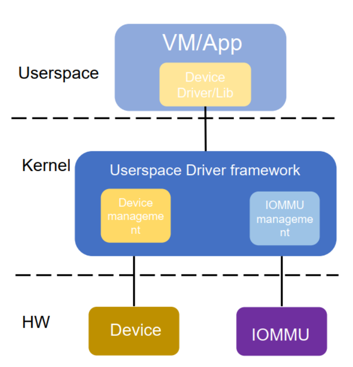

# 背景

## IOMMU Recap

IOMMU: (I/O Memory Management Unit)

IOMMU 用来将支持 DMA 的 I/O 总线连接到系统内存, [参考](https://en.wikipedia.org/wiki/Input%E2%80%93output_memory_management_unit)

IOVA(I/O Virtual Address) 用于 DMA

I/O 页表用于 IOVA 到 PA 的转换

DMA isolation:

IOMMU Advancements:

## Userspace Driver Recap

用户态驱动框架:

* 设备管理

  * 处理对设备 PCI configuration space 的 r/w, BAR 空间的 mmap, 中断等等

* IOMMU 管理

  * map/unmap 用户空间 memory

  * 举例: vfio iommu type1 驱动

* 当前用户态驱动框架

  * VFIO(Virtual Function I/O), vDPA(Virtual data path acceleration)

## Changes for software

# reference

https://lkml.org/lkml/2021/9/19/17

IOMMUFD: 一种选择: 将 IOMMU 的改进(IOMMU Advancements)应用于用户空间驱动程序: 附件

