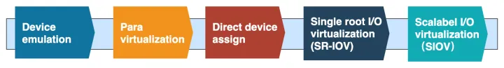
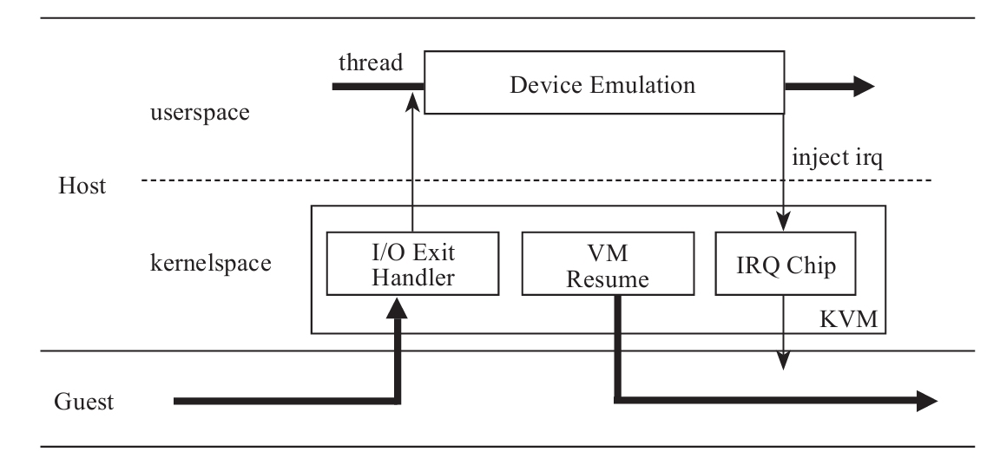
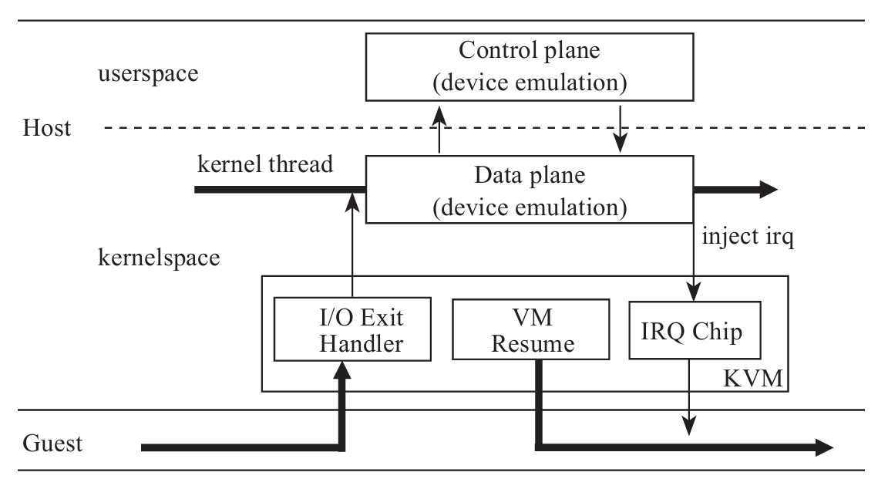
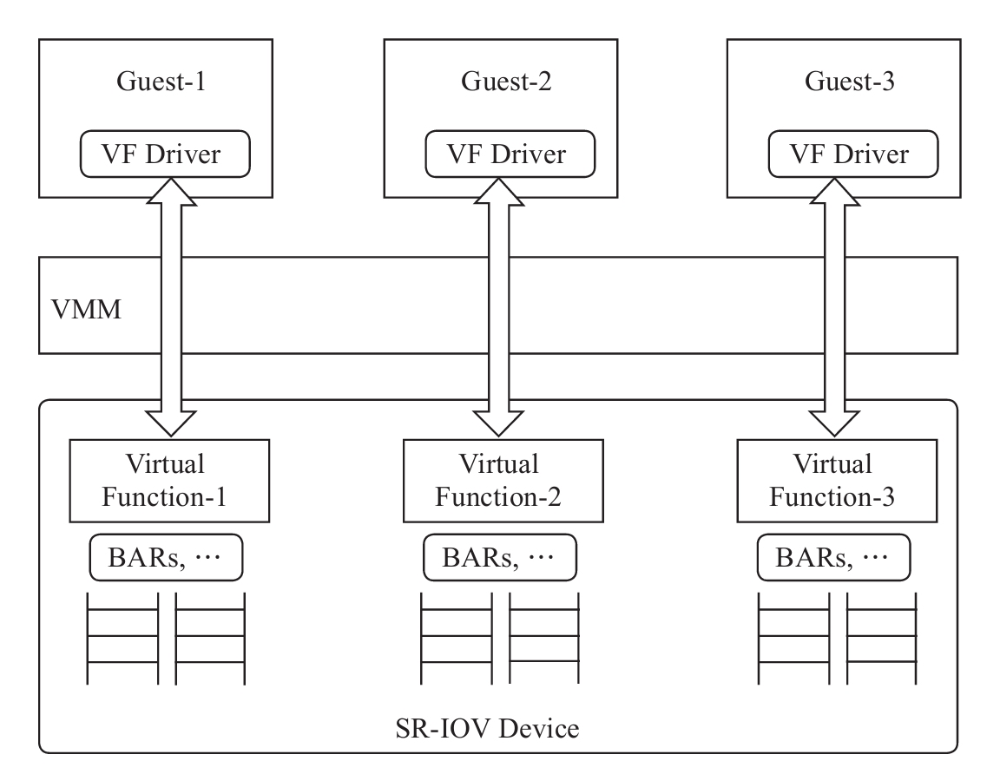

<!-- @import "[TOC]" {cmd="toc" depthFrom=1 depthTo=6 orderedList=false} -->

<!-- code_chunk_output -->

- [1. 整体](#1-整体)
- [2. 完全虚拟化](#2-完全虚拟化)
- [3. 半虚拟化](#3-半虚拟化)
- [4. VT-d](#4-vt-d)
- [5. SIOV](#5-siov)

<!-- /code_chunk_output -->

# 1. 整体

**设备虚拟化**就是系统虚拟化软件使用软件的方式呈现给 Guest 操作系统硬件设备的逻辑.

这些年依赖 I/O Virtualization 的发展路线:

# 2. 完全虚拟化

最先出现的设备虚拟化方案是**完全虚拟化**, VMM **按照硬件设备的规范**, 完完整整地模拟硬件设备的逻辑.

完全虚拟化的优势是 VMM 对于 Guest 是完全透明的, **Guest** 可以**不加任何修改**地运行在任何 VMM 上.

起初, 完全虚拟化的逻辑完全在**用户空间**实现, 因为 Guest 的 I/O 操作触发 CPU 从 Guest 陷入 Host 内核中的 KVM 模块后, CPU 还需要从内核空间切换到用户空间进行 I/O 模拟操作, 其过程基本如图 4-1 所示.

既然 Guest 因为 I/O 触发 CPU 切换到 Host 模式后首先进入的是内核中的 KVM 模块, 为什么**不在内核**中完成设备的**模拟**动作, 而是要**切换到用户空间**中模拟呢? 因此, 在有些场景下, 设备虚拟更适合在内核空间进行, 比如典型的**中断虚拟化芯片的模拟**. 但是, 有的设备模拟过程非常复杂, 如果**完全在内核中**实现, 除了会给**内核**中**增加复杂度**, 也容易带来**安全问题**.

于是, 开发人员提出了一个折中的 **Vhost** 方案, 将模拟设备的**数据处理相关部分**(`dataplane`)搬到了**内核空间**, **控制部分**还保留在**用户空间**中, 如图4-2所示.

# 3. 半虚拟化

事实上, 对于软件方式模拟的设备虚拟化来讲, 完全没有必要生搬硬套硬件的逻辑, 而是可以制定一个更高效、简洁地适用于驱动和模拟设备交互的方式, 于是**半虚拟化**诞生了, **Virtio 协议**是半虚拟化的典型方案之一.

与完全虚拟化相比, 使用 Virtio 标准的驱动和模拟设备交互不再使用**寄存器等传统的 I/O 方式**, 而是采用了 **Virtqueue** 的方式来传输数据. 这种设计降低了设备模拟实现的复杂度, 去掉了很多 CPU 和 I/O 设备之间不必要的通信, 减少了 CPU 在 Guest 模式和 Host 模式之间的切换, I/O 也不再受数据总线宽度、寄存器宽度等因素的影响, 提高了虚拟化的性能.

# 4. VT-d

除了软件开发人员在软件虚拟方案上不断地更新迭代以外, **芯片厂商**在**硬件层面**也在提供支持, 比如 Intel 提出了 **VT-d** 方式.

Intel® Virtualization Technology for Directed I/O(Intel VT-d)是英特尔发布的 IO 虚拟化技术. 通过 Intel VT-d, 可以把物理设备直通(pass-through)给虚拟机, 使虚拟机直接访问物理设备, 其性能近似无虚拟机环境下的 IO 性能.

VT-d 最初支持将**设备整个透传**给虚拟机, 但是这种方案不支持在**多虚拟机之间共享设备**, 不具备可扩展性, 于是又演生出了 `SR-IOV` 方案, 如图4-3所示.

**SR-IOV**(`Single Root I/O Virtualization and Sharing`)是 **PCI 标准组织**制定的在 PCI 设备级对虚拟化进行的支持. 基于 PCI SR-IOV 技术, 同一个 PCIe 设备可以实现逻辑上隔离的多个轻量级 "PF(physical function)" —— VF(`virtual function`) . 同一个 PF 创建的多个 VF 可以独立隔离地分配给不同的虚拟机或者容器, 极大地提高了性能和资源使用效率. 高性能 IO 设备如网卡、存储、GPU 等都支持 SR-IOV.

事实上, 相对于**硬件虚拟化**方式, 设备采用软件虚拟有一些明显的优势, 比如在可信计算方面, **虚拟设备**的**绝大部分复杂代码**都在**用户空间**实现, 而**特权操作**则需要通过 VMM 完成. 因此, 为了提高硬件虚拟化方案的安全性, Intel 花了很大力气加强 VT-d 方案的安全性, 典型的方案包括 DMA 重映射、中断重映射.

# 5. SIOV

随着**容器**的广泛使用, 实例的密度增加, 使用 VF 存在以下限制:

1) 可扩展性差: 由于 VF 是通过 BDF 号进行隔离的, 所以**每个 VF** 都需要**各自的配置空间**, 由此产生的**额外开销较大**; 且硬件资源上的 **VF 数量有限**, 比如英特尔 E810 的网卡可以创建的最大 VF 数量为 256 个.

2) 灵活性不好: VF 资源需要在**使用前一次性创建**和销毁所有的实例.

3) 设备快照不容易创建: 因为**设备是直通给虚拟机**的, **hypervisor** 对于**设备状态是无感知的**, 因此难以记录设备状态.

Intel® Scalable I/O Virtualization(Intel 可扩展 IO 虚拟化, SIOV)是针对下一代 CPU 服务器平台的虚拟化解决方案, 是一种硬件辅助的 I/O 设备直通技术. 它采用了现有的 PCI Express 功能结构, 实现了高性能和更灵活的 I/O 设备共享的架构.
