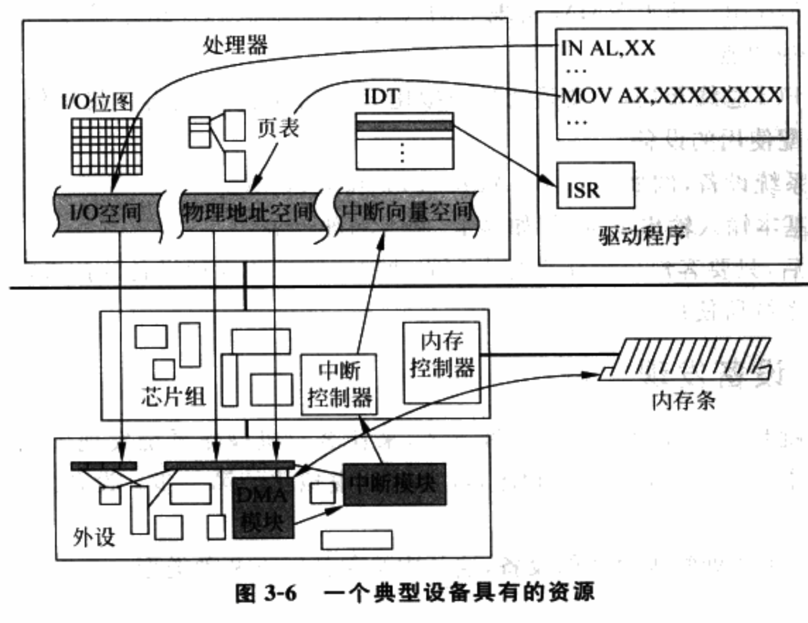
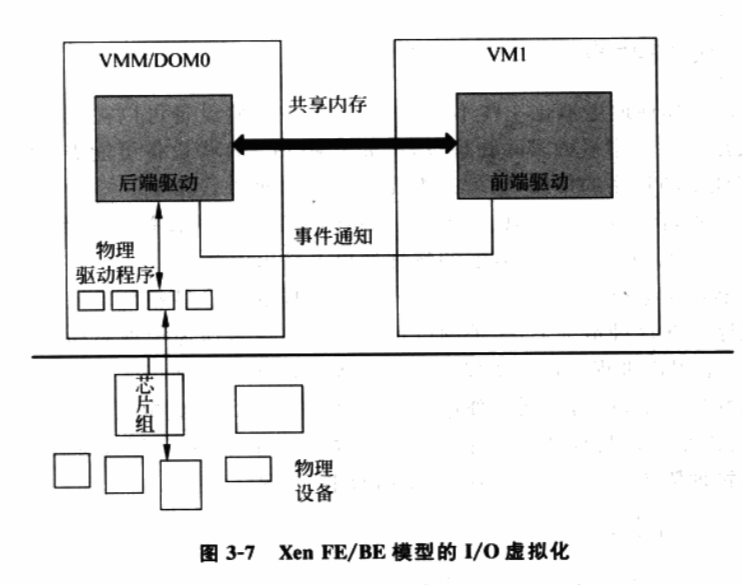
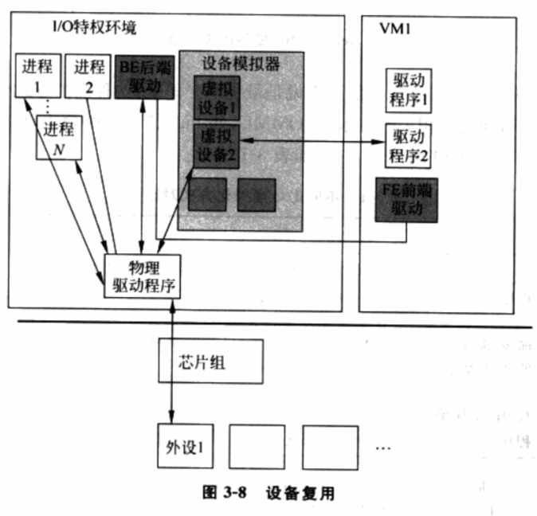
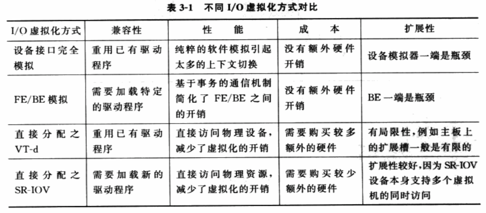
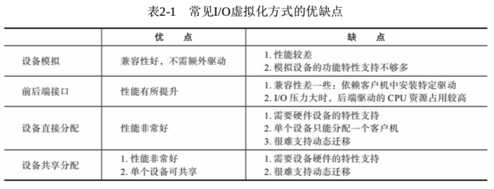

<!-- @import "[TOC]" {cmd="toc" depthFrom=1 depthTo=6 orderedList=false} -->

<!-- code_chunk_output -->

- [1. 概述](#1-概述)
  - [1.1. IO 的基本描述](#11-io-的基本描述)
  - [1.2. IO 设备的资源](#12-io-设备的资源)
  - [1.3. IO 虚拟化](#13-io-虚拟化)
- [2. 设备发现](#2-设备发现)
- [3. 访问截获](#3-访问截获)
  - [3.1. Port I/O](#31-port-io)
    - [3.1.1. 非直接分配](#311-非直接分配)
    - [3.1.2. 直接分配](#312-直接分配)
  - [3.2. MMIO](#32-mmio)
    - [3.2.1. 非直接分配](#321-非直接分配)
    - [3.2.2. 直接分配](#322-直接分配)
  - [3.3. 中断](#33-中断)
    - [3.3.1. 非直接分配](#331-非直接分配)
    - [3.3.2. 直接分配](#332-直接分配)
  - [3.4. DMA 或类似的共享内存机制](#34-dma-或类似的共享内存机制)
- [4. 设备模拟](#4-设备模拟)
  - [4.1. 基于软件的全虚拟化](#41-基于软件的全虚拟化)
  - [4.2. 半虚拟化](#42-半虚拟化)
  - [4.3. 基于硬件的直接分配(实际上已经不是设备模拟了)](#43-基于硬件的直接分配实际上已经不是设备模拟了)
- [5. 设备共享](#5-设备共享)
- [6. 小结](#6-小结)

<!-- /code_chunk_output -->

# 1. 概述

## 1.1. IO 的基本描述

先讨论没有虚拟化情形下的 IO.

1. 外设接口. 给定一个**外设**, 定义有自己的一套供**软件访问的接口**, 这些接口的属性可能是**单向的**, 也可能是**双向的**.

2. OS 驱动. OS 有**外设的驱动**, 它们接收来自**其他模块(如用户进程)的请求**, 然后按照**外设规定好的方式**驱动外设完成特定任务. 驱动**不关心**外设的逻辑电路, 只要按照**定义好的接口**使用外设, **外设**总会通过其**内部逻辑电路**完成动作.

3. 地址空间或其他资源: 由于**处理器的核心地位**, 因此**外设的访问接口**最终也会被**映射**为**处理器**所能认识的**地址空间或其他资源**.

这样, 当**驱动**通过**指令方式**访问外设, 处理器才能**正确识别目标对象**, 然后将**相关请求**发送到**系统总线**上, 最终由**芯片组**转发给目标外设.

## 1.2. IO 设备的资源

下图是典型设备可能有的资源.



1) **I/O 端口寄存器**. 它被映射到**I/O 地址空间**中, 由**特殊指令 IN/OUT 访问**.
* 若指令流处于**最高特权级**, **整个 64KB 的 I/O 地址空间**都可自由访问, 驱动程序就是;
* 当指令流运行在**其它特权级**, 只有**I/O 位图**允许的端口才能访问.

2) **MMIO 寄存器**. 被映射到**物理地址空间**, 通过**页表方式**控制访问权限.

3) **中断**. 由于外设的物理构造, 速度远低于处理器, 往往通过一步时间通知的方式来完成延后的操作, 这个通知机制通常是**中断模块**实现. 每个**允许发生中断的外设**会在处理器的**中断向量空间**分配一个**序号**.

**I/O 端口**、**MMIO**和**中断模块**组成了一个**典型外设提供给软件(！！！这些都是外设的！！！**)的**基本资源**. 图中还有一个外设中的特殊模块 --- DMA 模块.

4) **DMA 模块**. DMA 提供给**设备不经处理器**而**直接访问内存**的方式, 从而特别适合**大批量数据**的批量传输. 从**访问方式**来说, **DMA 模块！！！**被映射在**I/O 端口或 MMIO 中！！！**.

## 1.3. IO 虚拟化

从**处理器**角度看, **外设**是通过**一组 I/O 资源(端口 I/O 或 MMIO**)来进行**访问**的, 所以**设备相关的虚拟化**又被称为**I/O 虚拟化**. 在虚拟环境中, I/O 面临的问题是: **外设资源有限**, 为满足**多个客户机 OS**需求, VMM 必须通过 I/O 虚拟化方式**复用有限的外设资源**. VMM 截获客户 OS 对设备的访问请求, 然后通过软件方式模拟真实设备.

I/O 虚拟化**不需要完整虚拟化**出**所有外设的所有接口**. 怎么做取决于设备与 VMM 的策略以及客户机 OS 的需求. 一个完整的**系统虚拟化方案在 I/O 虚拟化**方面需要处理以下几块

1) **虚拟芯片组**. 基于 VMM 实现上考虑, 这个虚拟芯片组还可承担**ACPI 电源管理**相关的一些功能.

2) **虚拟 PCI 总线布局**, 主要是通过**虚拟化 PCI 配置空间**, 为**客户机操作系统**呈现**虚拟的**或是**直接分配使用的设备**.

3) **虚拟系统设备**, 例如 PIC、IO\-APIC、PIT 和 RTC 等.

4) **虚拟基本输入输出设备**, 例如显卡、网卡和硬盘等.

**I/O 虚拟化**主要包含以下几个方面的虚拟化

- I/O 端口寄存器(Port I/O)
- MMIO 寄存器
- 中断
- DMA

虚拟完毕, 只要客户机 OS 有驱动按照该虚拟设备的接口定义, 就可以被客户机 OS 所使用.

# 2. 设备发现

设备发现就是要让**VMM 提供一种方式**, 来让**客户机操作系统**发现**虚拟设备**, 这样**客户机操作系统**才能加载**相关的驱动程序**, 这是 IO 虚拟化的第一步. **设备发现**取决于**被虚拟的设备类型**.

(1) 模拟一个**所处物理总线**的设备, 这其中又包括以下两种类型.

1) 模拟一个所处**总线类型**是**不可枚举的物理设备**, 而且该设备本身所属的**资源是硬编码固定**下来的. 比如**ISA 设备**、**PS/2 键盘**、**鼠标**、**RTC**及**传统 IDE 控制器**. 对于这类设备, **驱动程序**会通过**设备特定的方式！！！**来**检测设备是否存在**, 例如读取**特定端口的状态信息**. 对于这类设备的发现, **VMM**在**给定端口**进行**正确的模拟**就可以了, 即**截获客户机对该端口的访问**, **模拟出结果交给客户机**.

2) 模拟一个所处总线类型是**可枚举的物理设备**, 而且相关设备**资源是软件可配置**的, 比如**PCI 设备**. 由于**PCI 总线**是通过**PCI 配置空间**定义一套完备的**设备发现方式**, 并且允许**系统软件(BIOS 或操作系统**)通过**PCI 配置空间**的**一些字段**对**给定 PCI 设备进行资源的配置**, 例如**允许或禁止 I/O 端口和 MMIO**, 设置**I/O 和 MMIO 的起始地址**等. 所以**VMM**仅模拟**自身的逻辑**是不够的, 必须进一步**模拟 PCI 总线**的行为, 包括**拓扑关系**和**设备特定的配置空间内容**, 以便让客户机操作系统发现这类虚拟设备.

(2) 模拟一个**完全虚拟的设备**

这种情况下, 没有一个现实中的规范与之对应, **这种虚拟设备**所处的**总线类型**完全由**VMM 自行决定**, VMM 可以选择将虚拟设备挂在 PCI 总线上, 也可以完全**自定义一套新的虚拟总线协议**, 这样的话**客户机操作系统**必须加装**新的总线驱动**.

# 3. 访问截获

**虚拟设备**被客户机操作系统**发现**后, **客户机操作系统**中的**驱动**会按照**接口定义**访问这个虚拟设备. 此时**VMM**必须**截获驱动对虚拟设备的访问**, 并**进行模拟**.

可以毫不犹豫的说, 关键点在于处理器虚拟化.

## 3.1. Port I/O

对于**端口 I/O**, **处理器对于端口 I/O 资源的控制**在于**指令流所处的特权级别**和**相关 I/O 位图**.

### 3.1.1. 非直接分配

对于一个**非直接分配**给客户机 OS 使用的设备, **客户 OS**运行在一个**非特权环境**中, 所以**客户 OS**能否访问**给定 I/O 端口**就完全由**I/O 位图**决定.

自然地, **VMM**完全可以将设备的**所有端口 I/O 从 I/O 位图中关闭**, 这样, 当客户指令流在访问该 I/O 端口时, 物理处理器就会及时**抛出一个保护异常**, 然后 VMM 就能**获取异常原因**, 然后将请求发送给设备模拟器进行模拟.

### 3.1.2. 直接分配

相反, 对于一个**直接分配**给客户机 OS 的设备, **VMM**可以将该**设备所属端口 I/O**从**I/O 位图**中**打开**, 这样处理器就把访问发送到系统总线, 最终到达目标物理设备而**不被模拟**.

```assembly
IN 累加器, {端口号│DX}
OUT {端口号│DX},累加器
```

## 3.2. MMIO

对于**MMIO**, MMIO 本身也是**物理地址空间的一部分**, 而物理地址空间的访问控制是通过**页表来控制**的.

### 3.2.1. 非直接分配

对于**非直接分配**给客户机 OS 使用的设备, 在物理处理器遍历的**真实页表**里, **VMM**只要把**映射到该 MMIO 的页表项**设为**无效**, 当**客户机指令流试图再访问目标地址**时, 物理处理器就会抛出**缺页异常**, 从而**陷入到 VMM**中, VMM 遍历客户页表, 就能发现设备所属的 MMIO 资源, 然后将请求交给**设备模拟器进行模拟**.

### 3.2.2. 直接分配

相反, 对于**直接分配**给客户 OS 使用的设备, VMM 只需要按照客户页表的设置**打开真实页表映射**即可, 这样客户机 OS 对该设备的访问也**不再被模拟**.

## 3.3. 中断

### 3.3.1. 非直接分配

对于**非直接分配**, 假设该设备可以产生中断, 那么 VMM 只要提供一种机制, 供**设备模拟器**在接收到**物理中断**并需要**触发中断时**, 可以通知到**虚拟中断逻辑**, 然后由**虚拟中断逻辑模拟一个虚拟中断的注入**.

### 3.3.2. 直接分配

相反, 对于直接分配的, **VMM 物理中断处理函数**在**接收到物理中断**后, 辨认出**中断源属于某个客户机**, 然后通知该客户机的虚拟中断逻辑.

## 3.4. DMA 或类似的共享内存机制

如果设备可以提供**DMA 或类似的共享内存机制**, DMA 允许**设备绕过处理器直接访问目标内存**, 而**若客户机 OS 驱动程序是未经修改**的, 则**设备模拟器**接收到的 **DMA 目标地址** 是 **客户机物理地址！！！**.

因此, VMM 只要提供**一种机制**, 让**设备模拟器**了解各种**地址之间转换关系！！！	**, 从而可以把**客户机物理地址**映射成**自己的虚拟地址**, 就能真正做到 DMA 目标地址的访问.

# 4. 设备模拟

上一步中我们已经多次提到, 下面分类介绍下设备模拟.

## 4.1. 基于软件的全虚拟化

**虚拟设备**与**现实设备**具有**完全一样的接口定义**. 这种情况下, **VMM 的设备模拟器**需要仔细研究现实设备的接口定义和内部设计规范, 然后以**软件的方式**模拟真实逻辑电路来满足每个接口的定义和效果, 例如 PS/2 键盘、鼠标等. 现实设备具有哪些资源, 设备模拟器就需要呈现出同样的资源. 这种情况下, **客户机操作系统原有的驱动程序无需修改**就能驱动虚拟设备. **设备访问过程**中, **VMM**通过**截获驱动程序对设备的访问进行模拟**.

举例: qemu, VMware Workstation

## 4.2. 半虚拟化

给**客户机操作系统**提供一个**特定的驱动程序(称为前端, Front\-end, FE**), **VMM**中的**模拟程序称为后端(Back\-End, BE**)设备驱动, **前端**将来自于其他模块的请求通过**VMM 提供的特殊通信机制**直接发送给**后端**, **后端处理完**请求后再**发回通知给前者**.

与传统设备驱动程序流程(前一种方式)比较, **传统设备程序**为了完成一次操作要**涉及到多个寄存器的操作**, 使得**VMM**要**截获每个寄存器访问！！！**并进行**相应的模拟**, 就会导致**多次上下文切换**. 这种方式能很大程度的**减少上下文切换的频率**, 提供更大的优化空间.

举例: xen virtio(virtio, 主要包括 virtio 框架、virtio 前端驱动、后端实现方式及原理、前端后端共享内存的方式)



## 4.3. 基于硬件的直接分配(实际上已经不是设备模拟了)

直接将**物理设备**分配给**客户机操作系统**, 由**客户机操作系统直接访问目标设备！！！**. 这种情况下**实际上不存在设备模拟**, **客户机**直接通过**原有的驱动无缝**操作**真实硬件**. 这种方式从**性能上说是最优**的, 但这种方式需要比**较多的硬件资源**.

基于硬件的直接分配还有一种方式, **硬件本身支持虚拟化**, 本身可以向**不同的虚拟机**提供**独立的硬件支持**, 设备本身支持多个虚拟机同时访问. 比如 SR-IOV.

举例: intel 的 vt\-d 和 PCI\-SIG 的 SR\-IOV

# 5. 设备共享

有些认为 SR\-IOV 也是设备共享的一种, 比如上襦

**设备虚拟化**中,

- **有些设备**可以被软件模拟器完全用**软件的方式模拟**而不用接触实际物理设备, 比如**CMOS**,
- 而有些设备需要设备模拟进一步**请求物理硬件**的帮助, 也就是需要利用到物理外设资源.

**一般输入输出类设备**属于后一类设备, 如鼠标、键盘、显卡、硬盘、网卡. 这些设备都涉及到**从真实设备上获取输入或者输出到真实设备**上.

**设备模拟器**通常运行在一个 **I/O 特权环境！！！** 中, 这样的 I/O 特权环境中有驱动物理外设的**物理驱动程序**.

这种情况下, **相关的设备模拟器**本身是作为**物理驱动程序**的**一个客户**而存在, 例如一个用户进程. I/O 特权环境中的**多数物理驱动程序**都是可以同时**接收多个客户或进程的请求**, 达到**物理资源的复用**.

同样, **每个虚拟机**都有自己**专属的设备模拟逻辑**, 也就是在 I/O 特权环境中存在一个**相对应的用户进程！！！**. 通过这种方式, I/O 虚拟化就有效地将物理资源在多个虚拟环境中复用起来, 如图.



# 6. 小结

一个 VMM 中, 常常是多种虚拟化方式并存.

不同的 IO 虚拟化方式对比




