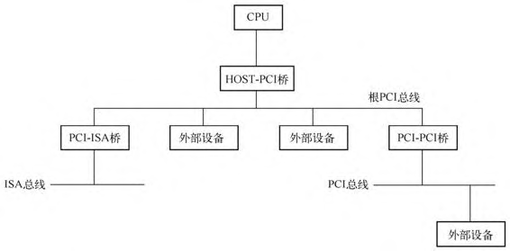
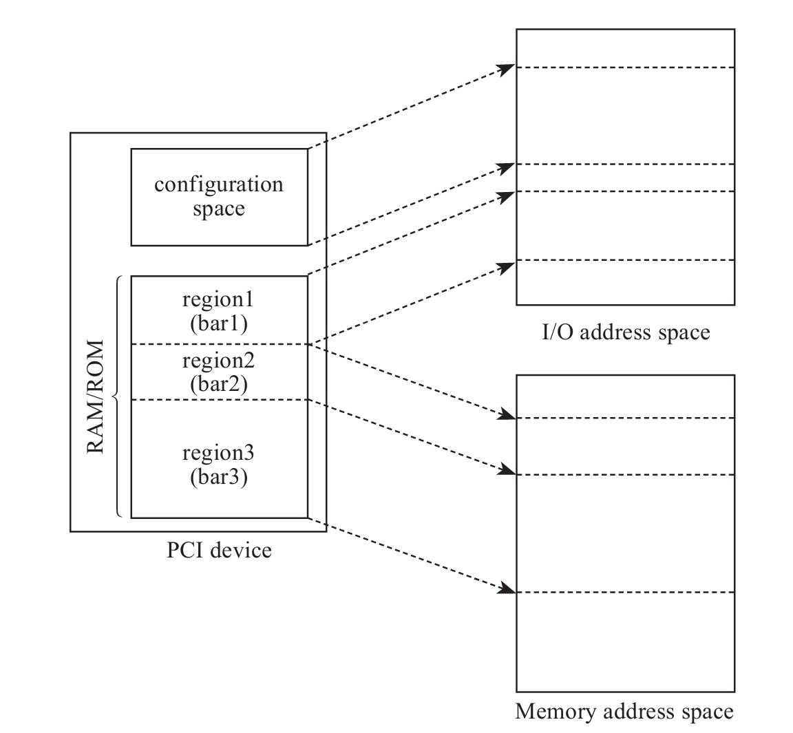
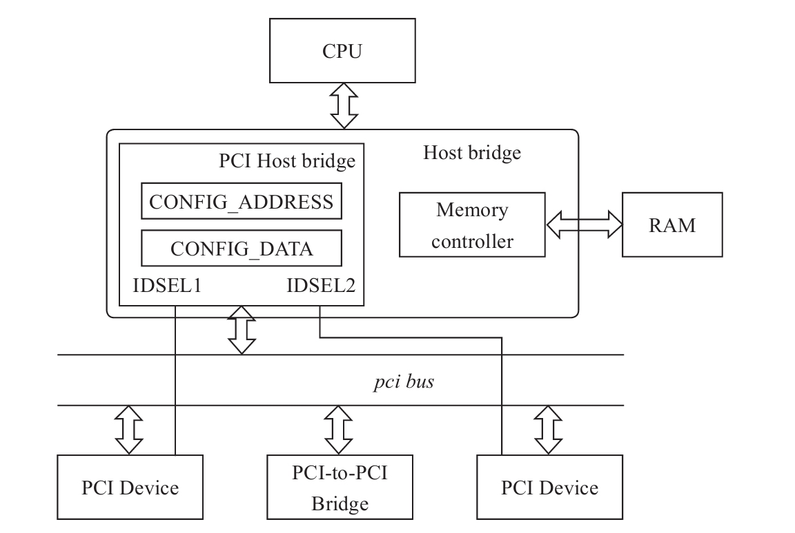
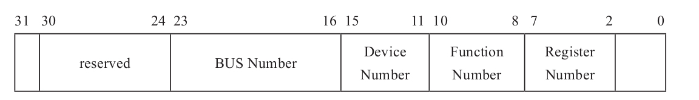
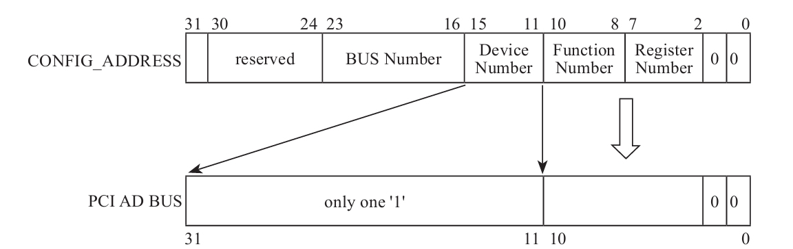

<!-- @import "[TOC]" {cmd="toc" depthFrom=1 depthTo=6 orderedList=false} -->

<!-- code_chunk_output -->

- [1. PCI 结构](#1-pci-结构)
- [2. 配置空间](#2-配置空间)
- [3. CPU 访问 配置空间](#3-cpu-访问-配置空间)

<!-- /code_chunk_output -->

# 1. PCI 结构

PCI 是用来连接外设的一种局部总线, 其主要功能是**连接外部设备**.

每一个 PCI 设备在系统中的位置由总线号(`Bus Number`), 设备号(`Device Number`)以及功能号(`Function Number`)唯一确定.

有的设备可能有**多个功能**, 从逻辑上来说**每个功能**都是**单独的设备**. 可以在 PCI 总线上挂一个**桥设备**, 之后在**该桥**上再挂一个 **PCI 总线**或者**其他总线**.

PCI 设备结构如下图所示.

**PCI 设备**有自己**独立的地址空间**, 叫作 **PCI 地址空间**, 也就是说从**设备角度**看到的地址跟 **CPU 角度**看到的**地址**本质上**不在一个地址空间**, 这种隔离就是由图中的 `HOST-PCI` 主桥完成的. **CPU** 需要通过**主桥**才能访问 PCI 设备, 而 PCI 设备也需要通过主桥才能访问**主存储器**. 主桥的一个重要作用就是将处理器访问的**存储器地址**转换为 **PCI 总线地址**. x86 架构对于**存储器地址空间**和 **PCI 地址空间**不是很清晰, 因为**本质上**是**两个不同的地址空间**, 但是**其地址是相同且一一对应**的.

# 2. 配置空间

PCI 标准约定, **每个 PCI 设备**都需要实现一个称为**配置空间**(`Configuration Space`)的结构, 该结构就是**若干寄存器的集合**, 其大小为 256 字节, 包括**预定义头部**(`predefined header region`)和**设备相关部分**(`device dependent region`), 预定义头部占据 64 字节, 其余 192 字节为设备相关部分.

位于配置空间中的偏移 **0x0E** 处的寄存器 `Header Type` 定义了 PCI **设备的类型**:

* 00h 为普通 PCI 设备;

* 01h 为 PCI 桥;

* 02h 为 CardBus 桥.

下图为普通 PCI 设备的**预定义头部**.

详细介绍见 `Architecture\6. PCI\0. Learning\1. PCI express体系结构导读\第1篇 PCI体系结构概述\第2章 PCI总线的桥与配置\3. PCI桥与PCI设备的配置空间.md`

重点关注:

* 6 个 BAR

* ROM BAR

* 中断相关: IRQ Pin 和 IRQ  Line

除了预定义头部外, 从偏移 64 字节开始到 255 字节, 共 192 字节为**设备相关**部分, 比如存储设备的能力(`Capabilities`). 比如 PCI 设备支持的 `MSI(X)` 中断机制, 就是利用 PCI 设备配置空间中设备相关部分来**存储中断信息**的, 包括**中断目的地址**(即**目的 CPU**), 以及**中断向量**. **操作系统**初始化中断时将为 PCI 设备分配的**中断信息**写入 PCI **配置空间**中的设备相关部分.

系统初始化时, **BIOS**(或者 **UEFI**)将把 PCI 设备的**配置空间映射到处理器**的 **I/O 地址空间**, **操作系统**通过 I/O 端口访问配置空间中的寄存器. 后来的 PCI Exepress 标准约定配置空间从 256 字节扩展到了 4096 字节, 处理器需要通过 **MMIO** 方式访问配置空间, 当然**前 256 字节**仍然可以通过 **I/O 端口方式**访问.

除了配置空间中的这些寄存器外, PCI 设备还有**板上存储空间**. 比如 PCI 显卡中的 `frame buffer`, 用来存储显示的图像, 板上内存可以划分为多个区域, 这个 frame buffer 就属于其中一个区域; 再比如网卡可能使用板上内存作为发送和接收队列. **处理器**需要将这些**板上内存**区域**映射**到**地址空间**进行访问, 但是与同标准中**预先约定好的配置空间**相比, 不同设备的板上内存大小不同, 不同机器上的 PCI 设备也不同, 这些都是**变化的**, 处理器**不可能预先**为所有 PCI 设备制定一个地址空间映射方案. 因此, PCI 标准提出了一个聪明的办法, 即**各 PCI 设备**自己提出需要占据的地址空间的**大小**, 以及**板上内存**是映射到**内存地址空间**, 还是 **I/O 地址空间**, 然后将这些诉求**记录**在配置空间的寄存器 **BAR** 中, 每个 PCI 最多可以请求映射 **6** 个区域. 至于映射到**地址空间**的**什么位置**, 由 **BIOS**(或者 **UEFI**)在**系统初始化**时, 访问寄存器 BAR, 查询各 PCI 设备的诉求, **统一**为 PCI 设备**划分**地址空间.

**PCI** 设备**配置空间**和**板上存储空间**到**处理器地址空间**的映射关系如下图所示.

# 3. CPU 访问 配置空间

了解了 PCI 设备的配置空间的基本结构后, 在探讨 VMM 如何虚拟 PCI 设备的配置空间前, 我们还需要知晓处理器是如何访问 PCI 设备的配置空间的.

**PCI 总线**通过 `PCI Host Bridge` 和 **CPU** 总线相连, PCI Host Bridge 和 PCI 设备之间通过 **PCI 总线**通信. **PCI Host Bridge** 内部有**两个寄存器**用于**系统软件**访问 **PCI 设备**的**配置空间**:

* 一个是位于 **CF8h** 的 `CONFIG_ADDRESS`;

* 另一个是位于 **CFCh** 的 `CONFIG_DATA`.

当**系统软件**访问 PCI 设备**配置空间**中的**寄存器**时:

* 首先将**目标地址**写入寄存器 `CONFIG_ADDRESS` 中;

* 然后向寄存器 `CONFIG_DATA` 发起访问操作, 比如向寄存器 `CONFIG_DATA` 写入一个**值**.

当 **PCI Host Bridge** 感知到 CPU 访问 `CONFIG_DATA` 时, 其**根据地址寄存器** `CONFIG_ADDRESS` 中的值, 片选**目标 PCI 设备**, 即有效连接目标 PCI 设备的管脚 **IDSEL**(`Initialization Device Select`), 然后将寄存器 `CONFIG_ADDRESS` 中的**功能号**和**寄存器号**发送到 **PCI 总线**上. 目标 PCI 设备在收到**地址信息**后, 在接下来的时钟周期内与 PCI Host Bridge 完成数据传输操作. 这个过程如图 4-6 所示. 对于 PCIe 总线, 图 4-6 中的 **PCI Host Bridge** 对应为 **Root Complex**.

图 4-6 中特别画出了**内存控制器**, 目的是协助读者理解**系统**是如何**区分**映射到内存地址空间的**设备内存**和**真实物理内存**, 对于**设备内存映射**的**内存地址**, **内存控制器**会将其**忽略**, 而 **PCI Host Bridge** 则会**认领**. 在 **BIOS**(或者 **UEFI**)为 **PCI 设备**分配**内存地址空间**后, 会将其告知 PCI Host Bridge, 所以 PCI Host Bridge 知晓哪些地址应该发往 PCI 设备.

根据 PCI 的体系结构可见, **寻址一个 PCI 配置空间**的**寄存器**, 显然需要**总线号**(`Bus Number`)、**设备号**(`Device Number`)、**功能号**(`Function Number`)以及**最后的寄存器地址**, 也就是我们通常简称的 **BDF** 加上**偏移地址**. 如果是 **PCIe 设备**, 还需要在**总线号前面**加上一个 **RC**(`Root Complex`)**号**. 因此, **PCI Host Bridge** 中的**寄存器** `CONFIG_ADDRESS` 的格式如图 4-7 所示.

访问具体的 PCI 设备时, 作为 **CPU** 与 **PCI 设备**之间的**中间人** `PCI Host Bridge`, 还需要将**系统软件**发送过来的**地址格式**转换为 **PCI 总线地址格式**, 转换方式如图 4-8 所示.

由于 `PCI Host Bridge` 使用**管脚** **IDSEL** 已经片选了**目标 PCI 设备**, 因此 PCI 总线地址**不**再需要**设备号**了, 只需要将**功能号**和**寄存器号**翻译到 **PCI 总线地址**即可.
