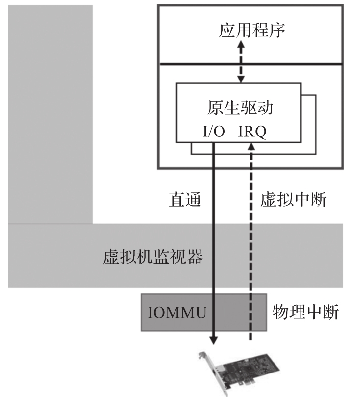
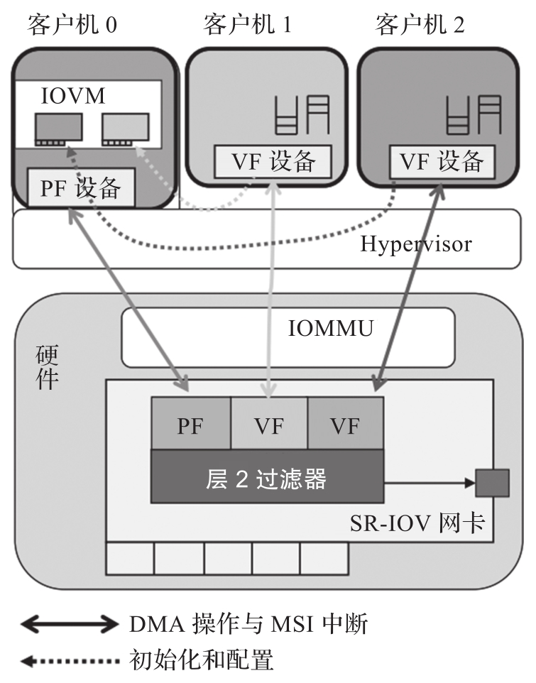
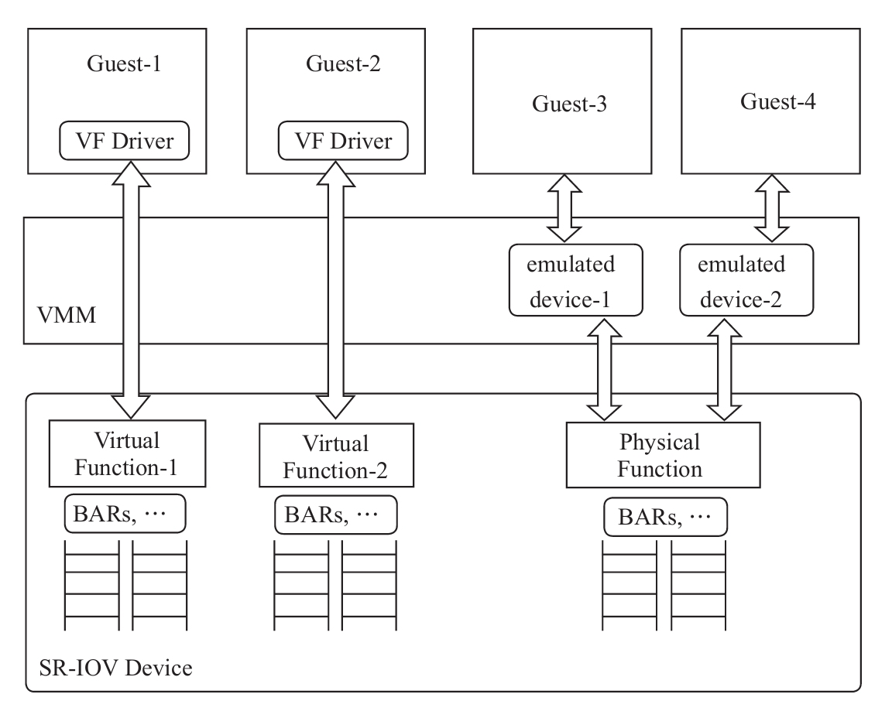
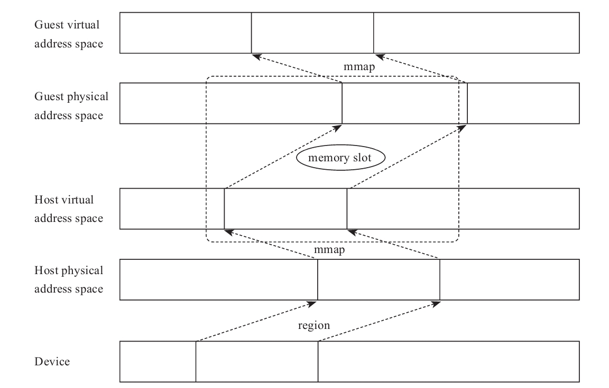
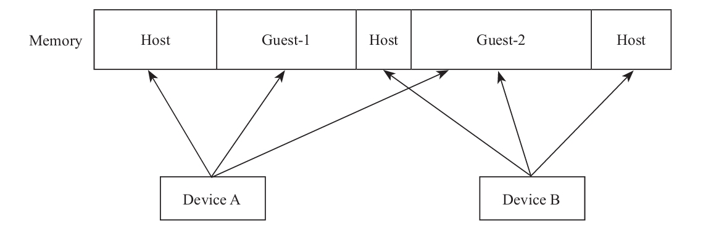
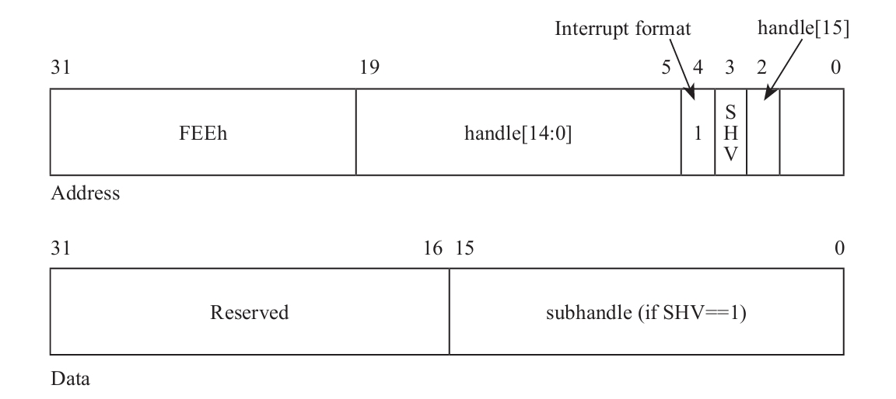
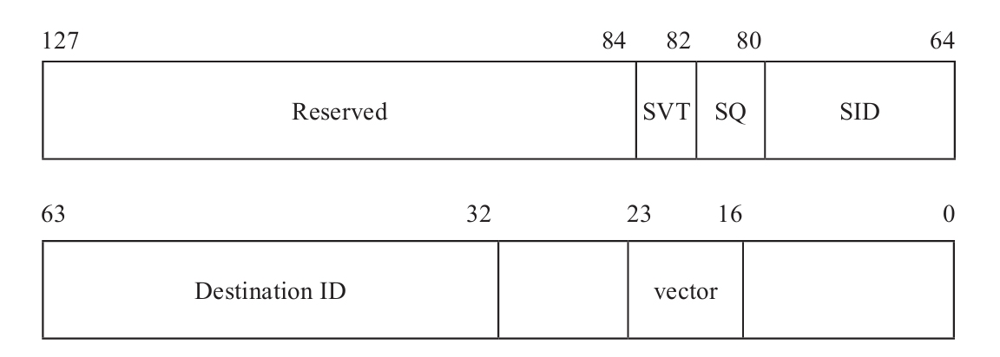
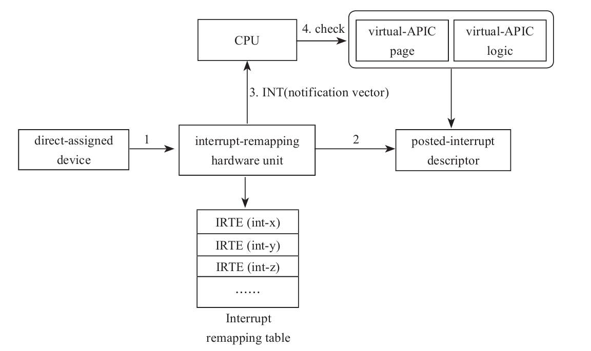
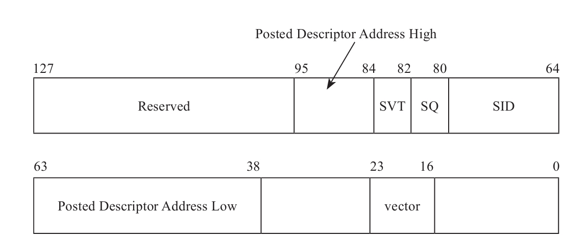

<!-- @import "[TOC]" {cmd="toc" depthFrom=1 depthTo=6 orderedList=false} -->

<!-- code_chunk_output -->

- [1. 两种模式](#1-两种模式)
  - [1.1. 直接分配](#11-直接分配)
  - [1.2. SR-IOV](#12-sr-iov)
- [2. 虚拟配置空间](#2-虚拟配置空间)
  - [2.1. kvmtool 实现](#21-kvmtool-实现)
- [3. DMA 重映射](#3-dma-重映射)
  - [3.1. 外设恶意访问内存](#31-外设恶意访问内存)
  - [3.2. DMA 重映射硬件](#32-dma-重映射硬件)
  - [3.3. 外设访存](#33-外设访存)
  - [3.4. kvmtool 实现](#34-kvmtool-实现)
  - [3.5. Linux 实现](#35-linux-实现)
- [4. 中断重映射](#4-中断重映射)
  - [4.1. 外设发起恶意中断](#41-外设发起恶意中断)
  - [4.2. 中断重映射硬件](#42-中断重映射硬件)
  - [4.3. 外设中断的 VM-exit](#43-外设中断的-vm-exit)
  - [4.4. 中断消息格式升级](#44-中断消息格式升级)
  - [4.5. 整体流程](#45-整体流程)
    - [4.5.1. VMM 设置 IRTA_REG](#451-vmm-设置-irta_reg)
    - [4.5.2. 中断重映射](#452-中断重映射)
    - [4.5.3. VT-d Posted-interrupt](#453-vt-d-posted-interrupt)
    - [4.5.4. 设置中断重映射表的时机](#454-设置中断重映射表的时机)

<!-- /code_chunk_output -->

# 1. 两种模式

虽然半虚拟化设备模型在很大程度上提高了虚拟 I/O 的性能, 降低了客户机和 VMM 之间在 I/O 命令传递上的开销, 但是在数据传输环节, 仍需要从真实硬件接收数据并将数据复制到客户机内存中, 即模拟虚拟 DMA 的过程. 在数据流量大的情况下, 虚拟 DMA 的模拟过程会成为整个系统的瓶颈, 极大地阻碍虚拟机性能的进一步提高. **直通设备**和 **SRIOV**  (Single Root I/O Virtualization, SR-IOV) 由此产生.

## 1.1. 直接分配

> Direct Assignment

设备虚拟化如果采用软件模拟的方式, 则需要 VMM 参与进来. 为了避免这个开销, Intel 尝试从 **硬件层面** 对 I/O 虚拟化进行支持, 即将 **设备直接透传** 给 **Guest**, Guest **绕过 VMM 直接访问物理设备**, 无须 VMM 参与 I/O 过程, 这种方式提供了最佳的 I/O 虚拟化性能.

Intel 最初采用的方式是 Direct Assignment, 即将整个设备透传给某一台虚拟机, 不支持多台 VM 共享同一设备.



直通设备模型完全消除了客户机设备驱动程序运行时对 DMA 和设备 I/O 访问的模拟导致的虚拟化开销, 因此具有最好的性能. 直通设备模型利用 IOMMU 在硬件层面实现对客户机编程的 DMA 地址到真实 DMA 地址(或者称为主机地址)的转换. 在直通设备模型中, 该硬件设备只能被一个客户机使用. 客户机驱动程序运行时对 I/O 的访问(主要是 MMIO)可以直接传递到硬件设备, 而不需要 VMM 的介入. 这是因为该设备已经被客户机专用, 同时客户机驱动程序编程的 DMA 地址可以被 IOMMU 重新影射到主机地址. 直通设备模型具有最高的设备虚拟化性能, 但是它牺牲了设备的共享特性.

## 1.2. SR-IOV

对于一台多核的物理机, 其上可以运行若干台虚拟机, 如果外设只能分配给一台虚拟机使用, 那么这种方案显然**不具备扩展性**.

于是**设备制造商**们试图在**硬件层面**将**一个物理设备**虚拟出**多个设备**, 每个设备可以透传给一台虚拟机, 这样从硬件设备层面实现共享, 而无须由 VMM 通过软件的方式支持多台虚拟机共享同一物理外设.

为了使不同设备制造商的设备可以互相兼容, `PCI-SIG` 制定了一个标准: `Single Root I/O Virtualization and Sharing`, 简称 SR-IOV.

SRIOV 在继承直通设备模型高性能的基础上, 同时实现了设备共享. 在 SRIOV 中, 设备硬件需要能够提供多个 PCIe 实例 (PCIe Function), 而每一个 PCIe 实例具有自己的 PCIe 标识地址即 BDF. 这些 PCIe 实例共享大部分的设备硬件资源, 由硬件实现内部各个 PCIe 实例之间的资源调度.  SRIOV 在客户机上运行一个虚拟功能 (Virtual Function, VF) 实例驱动程序, 控制 VF 设备, 而在主机特权虚拟机上运行物理功能 (Physical Function, PF) 实例驱动程序, 控制 PF 设备. PF 设备通常具有对 VF 设备的控制, 配置等权限, 从而在实现高性能共享的同时实现安全, 隔离和管理性. 显示了 SRIOV 的原理.



SR-IOV 引入了两个新的 Function 类型:

* 一个是 Physical Function, 简称 PF;

* 另一个是 Virtual Function, 简称 VF.

一个 SR-IOV 可以支持多个 VF, 每一个 VF 可以分别透传给 Guest, 如此, 就从硬件角度实现了多个 Guest 分享同一物理设备, 如图 4-9 所示.



每个 **VF** 都有自己**独立**的用于数据传输的**存储空间**, **队列**, **中断**及**命令处理单元**等, 但是这些 VF 的管理仍然在 VMM 的控制下, VMM 通过 PF 管理这些 VF. 虚拟机可以直接访问这些 VF, 而无须再通过 VMM 中的模拟设备访问物理设备. PF 除了提供管理 VF 的途径外, Host 以及其上的应用仍然可以通过 PF 无差别地访问物理设备. 对于那些没有 VF 驱动的 Guest, 虚拟机依然可以通过 SR-IOV 设备的 PF 接口共享物理设备.

# 2. 虚拟配置空间

通过将 VF 透传给 Guest 的方式, **VF 的数据访问**不再需要通过 VMM, 大大提高了 Guest 的 I/O 性能.

但是, 如果 **Guest** 恶意**修改配置空间**中的信息, 比如**中断信息**(**MSI**), 则可能导致 VF 发出中断攻击. 因此, 出于安全方面的考虑, **VF 配置空间**仍然需要 VMM 介入, 而且后面我们会看到, 有些信息, 比如寄存器 **BAR** 中的地址, 必须依照虚拟化场景进行虚拟.

Guest 不能直接修改设备的配置, 当 Guest 访问 VF 的配置空间时, 将会触发 **VM exit** 陷入 VMM, VMM 将过滤 Guest 对 VF 配置空间的访问并作为 Guest 的代理完成对 VF 设备的配置空间的操作. 这个过程**不会卷入数据传输**中, 因此**不影响数据传输的效率**.

## 2.1. kvmtool 实现

前面在讨论 PCI 配置空间及其模拟时, 我们看到 kvmtool 定义了一个数组 `pci_devices`, 用来**记录虚拟机所有的 PCI 设备**, 后来 kvmtool 将这个数组优化为**一棵红黑树**.

当 Guest 枚举 PCI 设备时, kvmtool 将以**设备号**为**索引**在这个数据结构中查找设备.

因此, 为了能够让 Guest 枚举到 VF, kvmtool 需要将 VF 注册到这个数据结构中, 用户可以通过 kvmtool 的命令行参数 "`vfio-pci`" 指定将哪些 VF 透传给虚拟机:

```
# ./lkvm run -h
VFIO options:
        --vfio-pci <[domain:]bus:dev.fn>
                          Assign a PCI device to the virtual machine
```

```cpp
commit 6078a4548cfdca42c766c67947986c90310a8546
Add PCI device passthrough using VFIO
kvmtool.git/vfio/pci.c
int vfio_pci_setup_device(…)
{
    …
    ret = device__register(&vdev->dev_hdr);
    …
}
```

对于 VF 来说, 在系统启动时, 虽然 **Host** 的 **BIOS**(或者 UEFI)已经为 **VF** 划分好了**内存地址空间**并存储在了寄存器 **BAR** 中, 而且 Guest 也可以直接读取这个信息. 但是, 因为 Guest 不能直接访问 Host 的物理地址, 所以 **Guest** 并**不能直接使用**寄存器 BAR 中记录的 **HPA**.

所以, kvmtool 需要对 VF 配置空间中寄存器 BAR 的内容进行虚拟, 结合内存虚拟化原理, 设备板上内存到 Guest 空间的映射关系如图 4-10 所示.



结合图 4-10, kvmtool 需要完成两件事:

* 一是将 VF 配置空间的 **BAR** 寄存器中的地址信息修改为 **GPA**, 而**不是 HPA**;

* 二是保护模式下的 CPU 是采用虚拟地址寻址的, 所以 PA 还需要映射为 VA, 操作系统自身提供了 mmap 功能完成 PA 到 VA 的映射, 因此, kvmtool 只需要**建立 GPA 到 HVA 的映射关系**.

相关代码如下:

```cpp
commit 6078a4548cfdca42c766c67947986c90310a8546
Add PCI device passthrough using VFIO
kvmtool.git/vfio/pci.c
01 int vfio_pci_setup_device(struct kvm *kvm, …)
02 {
03   …
04   ret = vfio_pci_configure_dev_regions(kvm, vdev);
05   …
06 }
07 static int vfio_pci_configure_dev_regions(struct kvm *kvm,
08             struct vfio_device *vdev)
09 {
10   …
11   ret = vfio_pci_parse_cfg_space(vdev);
12   …
13   for (i = VFIO_PCI_BAR0_REGION_INDEX;
14         i <= VFIO_PCI_BAR5_REGION_INDEX; ++i) {
15     …
16     ret = vfio_pci_configure_bar(kvm, vdev, i);
17     …
18   }
19   …
20   return vfio_pci_fixup_cfg_space(vdev);
21 }
```

普通的虚拟设备没有真实的配置空间, 所以 kvmtool 需要从 0 开始组织虚拟设备的配置空间. 而 VF 是有真实的配置空间的, kvmtool 需要做的是加工, 所以 kvmtool 首先需要读取 VF 的配置空间, 然后在这个原始数据的基础上进行加工, 第 11 行代码就是读取 VF 的配置空间并进行解析. 然后, **kvmtool** 从 **Guest 地址空间**中为 VF 板上内存**分配地址空间**, 并使用 **GPA** 更新寄存器 BAR, 第 13~18 行代码就是循环处理所有的寄存器 BAR. 最后, kvmtool 将加工好的配置空间更新回 VF 真实的配置空间, 见第 20 行代码.

函数 `vfio_pci_parse_cfg_space` **读取 VF 配置空间**, 具体代码如下.

VF 中将配置空间分成很多区域, 比如每 256 字节的配置空间是一个区域, 每个 BAR 定义对应一个区域. 代码中 `VFIO_PCI_CONFIG_REGION_INDEX` 对应的就是 256 字节的配置空间, 对于 PCIe 设备, 配置空间大小是 4096 字节.

函数 `vfio_pci_parse_cfg_space` 首先通过 ioctl 获取**配置空间**在 VF 中的**偏移**, 然后调用函数 pread 从这个偏移处读取配置空间:

```cpp
commit 6078a4548cfdca42c766c67947986c90310a8546
Add PCI device passthrough using VFIO
kvmtool.git/vfio/pci.c
static int vfio_pci_parse_cfg_space(struct vfio_device *vdev)
{
  …
  info = &vdev->regions[VFIO_PCI_CONFIG_REGION_INDEX].info;
  *info = (struct vfio_region_info) {
      .argsz = sizeof(*info),
      .index = VFIO_PCI_CONFIG_REGION_INDEX,
  };

  ioctl(vdev->fd, VFIO_DEVICE_GET_REGION_INFO, info);
  …
  if (pread(vdev->fd, &pdev->hdr, sz, info->offset) != sz) {
  …
}
```

接下来, kvmtool 需要从 Guest 地址空间中为 VF 板上内存**分配地址空间**, 并使用 GPA **更新**配置空间中的寄存器 **BAR**, 这个逻辑在函数 `vfio_pci_configure_bar` 中.

函数 `vfio_pci_configure_bar` 首先通过 ioctl 从 VF 中读取 BAR 对应的区域的信息, 然后根据获取的区域的大小 (代码中的 `map_size`) 调用函数 `pci_get_io_space_block` 从 Guest 的地址空间中分配地址区间. 函数 `pci_get_io_space_block` 从变量 `io_space_blocks` 指定的地址空间处, 依次为 PCI 设备在 Guest 的地址空间中分配地址. 分配好了 Guest 的地址区间后, 还需要将这个地址区间和 Host 的 BIOS(或者 UEFI)为 VF 分配的真实的物理地址区间一一映射起来, 这就是 `vfio_pci_configure_bar` 调用 `vfio_map_region` 的目的:

```cpp
commit 6078a4548cfdca42c766c67947986c90310a8546
Add PCI device passthrough using VFIO
kvmtool.git/vfio/pci.c
static int vfio_pci_configure_bar(struct kvm *kvm,
struct vfio_device *vdev, size_t nr)
{
  …
  region->info = (struct vfio_region_info) {
    .argsz = sizeof(region->info),
    .index = nr,
  };

  ret = ioctl(vdev->fd, VFIO_DEVICE_GET_REGION_INFO,
&region->info);
  …
  region->guest_phys_addr = pci_get_io_space_block(map_size);
…
  ret = vfio_map_region(kvm, vdev, region);
  …
}
```

函数 `vfio_map_region` 为 **GPA 和 HVA 建立起映射关系**. 从内存虚拟化角度, 其实就是 Host 为 Guest 准备一个内存条:

```cpp
commit 8a7ae055f3533b520401c170ac55e30628b34df5
KVM: MMU: Partial swapping of guest memory
linux.git/include/linux/kvm.h
struct kvm_userspace_memory_region {
    …
    __u64 guest_phys_addr;
    …
    __u64 userspace_addr; /* start of the userspace …*/
};
```

显然, 对应我们现在的情况, 变量 guest_phys_addr 就是 kvmtool 为 BAR 对应的区间在 Guest 地址空间中分配的地址. 变量 userspace_addr 就是 Host 的 BIOS(或者 UEFI)为 VF 在 Host 的地址空间分配的地址 PA 对应的 VA, 函数 vfio_map_region 中调用 mmap 函数就是为了得出 VA. 确定了变量 guest_phys_addr 和 userspace_addr 后, vfio_map_region 调用 kvm__register_dev_mem 请求 KVM 模块为 Guest 注册虚拟内存条. 当 CPU 发出对 BAR 对应的内存地址空间的访问时, EPT 或者影子页表会将 GPA 翻译为 VF 在 Host 地址空间中的相应 HPA, 当这个 HPA 到达 Host bridge 时, 内存控制器将忽略这个地址, PCI bost bridge 或者 Root Complex 将认领这个地址. 函数 vfio_map_region 的代码如下:

```cpp
commit 6078a4548cfdca42c766c67947986c90310a8546
Add PCI device passthrough using VFIO
kvmtool.git/vfio/pci.c
int vfio_map_region(struct kvm *kvm, struct vfio_device *vdev,
        struct vfio_region *region)
{
  …
  base = mmap(NULL, region->info.size, prot, MAP_SHARED, vdev->fd,
        region->info.offset);
  …
  region->host_addr = base;

  ret = kvm__register_dev_mem(kvm, region->guest_phys_addr,
           map_size, region->host_addr);
  …
}
```

完成了 BAR 等寄存器的加工后, kvmtool 将调用 vfio_pci_fixup_cfg_space 将加工好的配置空间更新到 VF 的配置空间中. 比如下面的代码中, 我们可以看到, 寄存器 BAR 的信息是 kvmtool 加工后的信息:

```cpp
commit 6078a4548cfdca42c766c67947986c90310a8546
Add PCI device passthrough using VFIO
kvmtool.git/vfio/pci.c
static int vfio_pci_fixup_cfg_space(struct vfio_device *vdev)
{
  …
  for (i = VFIO_PCI_BAR0_REGION_INDEX;
i <= VFIO_PCI_BAR5_REGION_INDEX; ++i) {
    struct vfio_region *region = &vdev->regions[i];
    u64 base = region->guest_phys_addr;
    …
    pdev->hdr.bar[i] = (base & PCI_BASE_ADDRESS_MEM_MASK) |
          PCI_BASE_ADDRESS_SPACE_MEMORY |
          PCI_BASE_ADDRESS_MEM_TYPE_32;
  }
  …
  info = &vdev->regions[VFIO_PCI_CONFIG_REGION_INDEX].info;
  hdr_sz = PCI_DEV_CFG_SIZE;
  if (pwrite(vdev->fd, &pdev->hdr, hdr_sz, info->offset) != hdr_sz)
…
}
```

除了寄存器 BAR 的虚拟外, 还有其他的一些虚拟, 比如为了支持 MSI-X, 需要虚拟配置空间中设备相关的 Capability 部分. 这些逻辑都比较直接, 我们不再一一讨论了.

# 3. DMA 重映射

## 3.1. 外设恶意访问内存

将设备直接透传给 Guest 后, 为了提高数据传输效率, 透传设备可以直接访问内存, 但是如果 Guest 可以直接控制设备, 那就需要防范恶意的 **Guest 借助透传的设备**访问**其他 Guest 或者 Host 的内存**.

比如, Device A 透传给了 Guest-1, 但是其有可能访问 Guest-2 和 Host 的内存; Device B 透传给了 Guest-2, 但是其也有可能访问 Guest-1 和 Host 的内存, 如图 4-11 所示.



## 3.2. DMA 重映射硬件

为此, 芯片厂商设计了 DMA 重映射 (DMA Remmaping) 机制, 在**外设**和**内存**之间增加了 **DMA 硬件重映射单元**, 一个 DMA 重映射硬件可以为所有设备提供地址重映射服务, 也可以有多个 DMA 重映射硬件, 分别为一些外设提供服务.

当 VMM 处理透传给 Guest 的外设时, VMM 将请求内核为 **Guest** 建立一个**页表**, 并将这个页表告知负责这个外设地址翻译的 **DMA 重映射硬件单元**, 这个页表限制了外设只能访问这个页面覆盖的内存, 从而限制外设只能访问其属于的虚拟机的内存.

## 3.3. 外设访存

当**外设访问内存**时, **内存地址**首先到达 **DMA 重映射硬件**, DMA 重映射硬件根据这个外设的**总线号, 设备号以及功能号**, 确定其对应的**页表**, 查表得出**物理内存地址**, 然后将地址送上总线.

在虚拟化场景下, 如果**多个设备**可以透传给**同一个虚拟机**, 那么它们共享一个页表, 如图 4-12 所示.


## 3.4. kvmtool 实现

如同一台真实的物理计算机有多段用于不同用途的内存段一样, **kvmtool** 将为 **Guest** 准备**多段内存段**, kvmtool 将内存段称为 **memory bank**.

在为 Guest 准备好内存段之后, **kvmtool** 将为**每个内存段**通过 ioctl 向内核发送 `VFIO_IOMMU_MAP_DMA` 命令, **请求内核**在 **DMA 重映射单元页表**中为其**建立好映射关系**.

相对于为 CPU 进行地址翻译的 MMU, DMA 重映射硬件是为外设进行 **I/O 地址翻译**的, 所以也称为 IOMMU.

> **IOMMU** 将 **GPA** 翻译为 **HPA**.

kvmtool 中代码如下:

```cpp
commit c9888d9571ca6fa0093318c06e71220df5c3d8ec
vfio-pci: add MSI-X support
kvmtool.git/vfio/core.c
static int vfio_map_mem_bank(…, struct kvm_mem_bank *bank, …)
{
  int ret = 0;
  struct vfio_iommu_type1_dma_map dma_map = {
    …
    // hva, kernel 会将其转换成 hpa
    .vaddr  = (unsigned long)bank->host_addr,
    // iova 是 gpa
    .iova = (u64)bank->guest_phys_addr,
    .size = bank->size,
  };
  …
  // 让 内核 建立 IOMMU 映射
  if (ioctl(vfio_container, VFIO_IOMMU_MAP_DMA, &dma_map)) {
  …
}
```

当为外设建立页表时, 如果外设透传给的**虚拟机尚未建立页表**, 则内核将创建根页表. 在虚拟化的场景下, 代码中的 domain 指代的就是**一个虚拟机**:

```cpp
commit ba39592764ed20cee09aae5352e603a27bf56b0d
Intel IOMMU: Intel IOMMU driver
linux.git/drivers/pci/intel-iommu.c
static int domain_init(struct dmar_domain *domain, …)
{
  …
  domain->pgd = (struct dma_pte *)alloc_pgtable_page();
  …
}
```

**内核**在**通知外设进行 DMA 前**, 需要将 **DMA 地址**告知**外设**. **虚拟地址**是 **CPU** 使用的, 设备并不知道这个概念, 所以, **内核的设备驱动**需要将**虚拟地址**转换为**物理地址**.

在**设备透传**场景下, 设备和 Guest 之间不再有 VMM 的干预, **外设**接收的是 **GPA**.

留意上面代码中函数 `vfio_map_mem_bank` 中请求内核建立映射关系的参数 `dma_map`, 其中这句代码是设置 IOMMU 的**输入地址**:

```cpp
.iova = (u64)bank->guest_phys_addr,
```

我们看到, 代码中将 IOMMU 的输入地址命名为 iova, 其他多处也使用了这个名字, 那么为什么称其为 iova 呢? 我们比照 CPU 的虚拟内存就很容易理解了, **外设**用**这个地址**发起 **DMA**, 就类似于 CPU 使用虚拟地址 (VA) 访存, 然后给到 MMU, 所以, 这里从设备发出的给到 IOMMU 的, 也被称为 **VA**, 因为是用于 I/O 的, 所以命名为 **iova**.

函数 `vfio_map_mem_bank` 中设置 **IOMMU** 翻译的**目的地址**的代码如下:

```cpp
.vaddr  = (unsigned long)bank->host_addr,
```

显然, 这里的 vaddr 是 virtual address 的缩写. 但是事实上, 需要 **IOMMU** 将 **GPA** 翻译为 **HPA**, 所以理论上 `dma_map` 中应该使用**物理地址** paddr, 而不是 vaddr, 那么, 为什么使用虚拟地址呢? 我们知道, kvmtool 在**用户空间**中申请区间作为 **Guest 的物理内存段**, 自然使用的是**虚拟地址**记录区间. 但这不是问题, 因为**内核**会在**建立 IOMMU 的页表前**, 将**虚拟地址**转换为**物理地址**, 最后 IOMMU 页表中记录的是 **GPA** 到 **HPA** 的映射.

## 3.5. Linux 实现

内核中处理 kvmtool 发来的命令 `VFIO_IOMMU_MAP_DMA` 的核心函数是 `domain_page_mapping`, 该函数**完成 IOMMU 页表的建立**.

注意该函数的第 3 个参数, 可见**内核**已经将 kvmtool 传入的 **HVA** 转换为 **HPA** 了. `domain_page_mapping` 通过一个循环完成了一个内存段的地址映射, 其根据 **GPA**, 即 **iova**, 从页表中找到具体的表项, 然后**将 HPA 写入表项**中. 具体代码如下:

```cpp
commit ba39592764ed20cee09aae5352e603a27bf56b0d
Intel IOMMU: Intel IOMMU driver
linux.git/drivers/pci/intel-iommu.c
static int domain_page_mapping(struct dmar_domain *domain,
dma_addr_t iova, u64 hpa, size_t size, int prot)
{
  u64 start_pfn, end_pfn;
  struct dma_pte *pte;
  …
  start_pfn = ((u64)hpa) >> PAGE_SHIFT_4K;
  end_pfn = (PAGE_ALIGN_4K(((u64)hpa) + size)) >> PAGE_SHIFT_4K;
  index = 0;
  while (start_pfn < end_pfn) {
    pte = addr_to_dma_pte(domain, iova + PAGE_SIZE_4K * index);
    …
    dma_set_pte_addr(*pte, start_pfn << PAGE_SHIFT_4K);
    dma_set_pte_prot(*pte, prot);
    __iommu_flush_cache(domain->iommu, pte, sizeof(*pte));
    start_pfn++;
    index++;
  }
  return 0;
}
```

# 4. 中断重映射

## 4.1. 外设发起恶意中断

当将 **设备直接透传** 给虚拟机时, 有一个问题就不得不面对, 那就是如何避免 **虚拟机** 对 **外设编程** 发送一些 **恶意的中断**, 对 **主机** 或 **其他虚拟机** 进行 **攻击**.

## 4.2. 中断重映射硬件

因此, 硬件厂商引入了 **中断重映射**(`interrupt remapping`)机制, 在 **外设** 和 **CPU** 之间加了一个 **硬件中断重映射单元**.

当接收到 **来自外设的中断** 时, **硬件中断重映射单元** 会对中断请求的来源进行 **有效性验证**, 然后以 **中断号** 为索引查询 **中断重映射表**, **代替外设** 向目标 CPU **发送中断**.

**中断重映射表**由 VMM 而不是虚拟机进行设置, 因此从这个层面确保了透传设备不会因虚拟机恶意篡改而向 Host 或者其他 Guest 发送具有攻击性目的的中断. **中断重映射硬件** 提取接收到的中断请求的**来源**(PCI 设备的 Bus, Device 和 Function 号等信息), 然后根据**不同设备所属的 domain**, 将该**中断请求**转发到**相应的虚拟机**.

## 4.3. 外设中断的 VM-exit

为了使 VMM 能够控制系统重要的资源, 当 CPU 处于 Guest 模式, 并探测到有**外部设备中断**到达时, 将首先从 Guest 模式退出到 Host 模式, 由 VMM 处理中断, 然后**注入中断**给目标 Guest.

另外, 在 "中断虚拟化" 一章中, 我们看到, 为了去掉中断注入时需要的 VM exit, Intel 设计了 `posted-interrupt` 机制, CPU 可以在 Guest 模式直接处理中断. 因此, 当设备透传给 Guest 时, 在有中断重映射提供安全保护作用的情况下, Intel 将**中断重映射**和 `posted-interrupt` 结合起来实现了 **VT\-d posted\-interrupt**, 使外设中断直达虚拟机, 避免了 VM exit, 不再需要 VMM 的介入.

## 4.4. 中断消息格式升级

为了支持中断重映射, 还需要对 **中断源** 进行 **升级**, 包括 **I/O APIC** 以及支持 `MSI/MSI-X` 的 **外设**, 使 **中断重映射硬件** 能从 **中断消息** 中提出中断重映射表的 **索引**.

为了向后兼容, 对于那些只能发送经典的中断消息格式的外设, 中断重映射单元就像不存在一样, 不做任何干预, 原封不动地将中断消息送上总线.

**可重映射** 的 **中断消息格式** 如图所示.



在 Address 消息中, 第 5~19 位和第 2 位共同组成了 16 位的 handle, 并且在第 3 位 SHV 为 1 的情况下, Data 消息的第 0~15 位包含了 subhandle.

**中断重映射硬件** 将根据 **handle** 和 **subandle** 计算该 **中断** 在 **中断重映射表** 中的 **索引值**, 计算方法如下:

```cpp
if (address.SHV == 0) {
    interrupt_index = address.handle;
} else {
    interrupt_index = (address.handle + data.subhandle);
}
```

## 4.5. 整体流程

### 4.5.1. VMM 设置 IRTA_REG

**VMM** 需要在 **初始化** 时在内存中为中断重映射表分配 **一块区域**, 并将该区域告知 **中断重映射硬件单元**, 即将 **该表的地址** 写到 **中断重映射表地址寄存器**(`Interrupt Remap Table Address Register`, `IRTA_REG`):

```cpp
commit 2ae21010694e56461a63bfc80e960090ce0a5ed9
x64, x2apic/intr-remap: Interrupt remapping infrastructure
linux.git/drivers/pci/intr_remapping.c

static int setup_intr_remapping(struct intel_iommu *iommu, int mode)
{
    struct ir_table *ir_table;
    struct page *pages;

    ir_table = iommu->ir_table = kzalloc(sizeof(struct ir_table),
                         GFP_KERNEL);
    ...
    // 分配内存
    pages = alloc_pages(GFP_KERNEL | __GFP_ZERO, INTR_REMAP_PAGE_ORDER);
    ...
    ir_table->base = page_address(pages);

    iommu_set_intr_remapping(iommu, mode);
    return 0;
}

static void iommu_set_intr_remapping(struct intel_iommu *iommu, int mode)
{
    u64 addr;
    u32 cmd, sts;
    unsigned long flags;
    // 物理地址
    addr = virt_to_phys((void *)iommu->ir_table->base);
    ...
    // 将重映射表的地址告知硬件
    dmar_writeq(iommu->reg + DMAR_IRTA_REG,
            (addr) | IR_X2APIC_MODE(mode) | INTR_REMAP_TABLE_REG_SIZE);

    /* Set interrupt-remapping table pointer */
    cmd = iommu->gcmd | DMA_GCMD_SIRTP;
    writel(cmd, iommu->reg + DMAR_GCMD_REG);

    IOMMU_WAIT_OP(iommu, DMAR_GSTS_REG,
              readl, (sts & DMA_GSTS_IRTPS), sts);

    ...

    /* Enable interrupt-remapping */
    cmd = iommu->gcmd | DMA_GCMD_IRE;
    iommu->gcmd |= DMA_GCMD_IRE;
    writel(cmd, iommu->reg + DMAR_GCMD_REG);

    IOMMU_WAIT_OP(iommu, DMAR_GSTS_REG,
              readl, (sts & DMA_GSTS_IRES), sts);

    ...
}
```

### 4.5.2. 中断重映射

当中断重映射硬件单元工作在重映射中断 (`Remapped Interrupt`) 方式下, 中断重映射单元根据 **中断请求** 中的 **信息** 计算出一个索引, 然后从 **中断重映射表** 中索引到具体的 **表项 IRTE**, 从 IRTE 中取出 **目的 CPU**, **中断 vector** 等, 创建一个 **中断消息**, 发送到 **总线** 上, 此时的**中断重映射单元**相当于一个**代理**.

在这种方式下, 除了**外设或中断芯片**和 **CPU** 之间多了一层**中断重映射硬件单元**外, 在其他方面没有任何差异, 从 **LAPIC** 看到的和来自**外设**或者 `I/O APIC` 的**中断消息**别无二致. 这种方式的 IRTE 格式如图 4-14 所示.



### 4.5.3. VT-d Posted-interrupt

在 "中断虚拟化" 一章中, 我们讨论了 Intel 设计的 posted-interrupt processing 机制, 在该机制下, 假设 **虚拟设备** 运行在一颗 **CPU** 上, 而 **VCPU** 运行在 **另外** 一颗 **CPU** 上, 那么虚拟设备发出中断请求时, 虚拟中断芯片将中断的信息更新到 **VCPU** 对应的 `posted-interrupt descriptor` 中, 然后向 VCPU 发送一个通知 `posted-interrupt notification`, 即一个 **指定向量值** 的 **核间中断**, 处于 Guest 模式的 CPU 收到这个中断后, 将不再触发 VM exit, 而是在 Guest 模式直接处理中断.

那么对于设备透传模式, 是否可以和 Posted-interrupt 结合起来, 避免掉这些 VM exit 以及 VMM 的介入呢? 于是, 芯片厂商设计了 `Vtd Posted-interrupt`, 在这种机制下, 由**中断重映射硬件单元**完成 `posted-interrupt descriptor` 的填写, 以及向**目标 CPU** 发送通知 `posted-interrupt notification`, 如图 4-15 所示.



当**中断重映射硬件单元**工作在 `Post-interrupt` 的方式下时, 其**中断重映射表项** IRTE 的格式如图 4-16 所示. 与 Remapped Interrupt 方式不同的是, IRTE 中**没有**了**目标 CPU 字段**, 取而代之的是 `posted-interrupt descriptor` 的**地址**.



### 4.5.4. 设置中断重映射表的时机

那么在 **什么时机设置中断重映射表** 呢? 我们以支持 `MSI(X)` 的设备为例, 其 **中断相关的信息** 保存在 **配置空间** 的 Capabilities list 中, 这些信息由 **操作系统内核设置**. 在虚拟化场景下, 当 **Guest** 的内核设置 VF 配置空间中的 `MSI(X)` 信息时, 将触发 `VM exit`, CPU 将陷入 VMM 中. 此时, VMM 除了代理 Guest 完成对 VF 配置空间的访问外, 就可以通过 **Host 内核**中的 **VFIO** 驱动, 为透传设备分配, 更新相应的中断重映射表项. kvmtool 中截获 Guest 设置配置空间中 `MSI(X)` 相关寄存器的处理函数是 `vfio_pci_msix_table_access`, 代码如下:

```cpp
commit c9888d9571ca6fa0093318c06e71220df5c3d8ec
vfio-pci: add MSI-X support
kvmtool.git/vfio/pci.c
static int vfio_pci_create_msix_table(struct kvm *kvm,
                      struct vfio_pci_device *pdev)
{
    ...
    ret = kvm__register_mmio(kvm, table->guest_phys_addr, table->size,
                 false, vfio_pci_msix_table_access, pdev);
    ...
}

static void vfio_pci_msix_table_access(struct kvm_cpu *vcpu, u64 addr, u8 *data,
                       u32 len, u8 is_write, void *ptr)
{
    ...
    /* Update the physical capability if necessary */
    if (vfio_pci_enable_msis(kvm, vdev))
    ...
}
```

`vfio_pci_msix_table_access` 截获到 Guest 配置 VF 配置空间的 `MSI(X)` 的操作后, 调用 `vfio_pci_enable_msis` 向 **Host 内核**中的 **VFIO** 模块发起配置 MSI(X) 以及中断重映射相关的请求. 内核收到用户空间的请求后, 将初始化设备配置空间中的 MSI(X) 相关的 capability, 这个过程是由函数 `msi_capability_init` 来完成的, `msi_capability_init`  在做了一些通用的初始化后, 将调用体系结构相关的函数 `arch_setup_msi_irqs` 完成体系结构相关的部分:

```cpp
commit 75c46fa61bc5b4ccd20a168ff325c58771248fcd
x64, x2apic/intr-remap: MSI and MSI-X support for interrupt remapping infrastructure
linux.git/drivers/pci/msi.c
static int msi_capability_init(struct pci_dev *dev)
{
    ...
    /* Configure MSI capability structure */
    ret = arch_setup_msi_irqs(dev, 1, PCI_CAP_ID_MSI);
    ...
}
```

对于 x86 架构, 起初这个函数实现在 I/O APIC 相关的文件中, 但是事实上这个函数是处理 MSI 中断的, 只是开发者将其暂时实现在这个文件中, 因此后来开发者将其独立到一个单独文件 `msi.c` 中.

`arch_setup_msi_irqs` 最终会调用到函数 `msi_compose_msg` 设置中断消息的目的地(MSI 的地址), 中断消息的内容(MSI 的 data). 注意 `msi_compose_msg` 这个函数的实现, 可以清楚地看到在这个函数中为中断准备了中断重定向表项, 并将其更新到中断重定向表中, 相关代码如下:

```cpp
commit 75c46fa61bc5b4ccd20a168ff325c58771248fcd
x64, x2apic/intr-remap: MSI and MSI-X support for interrupt remapping infrastructure
linux.git/arch/x86/kernel/io_apic_64.c
static int msi_compose_msg(struct pci_dev *pdev, unsigned int irq, struct msi_msg *msg)
{
    ...
#ifdef CONFIG_INTR_REMAP
    if (irq_remapped(irq)) {
        struct irte irte;
        ...
        irte.vector = cfg->vector;
        irte.dest_id = IRTE_DEST(dest);
        // 更新到中断重定向表
        modify_irte(irq, &irte);
        ...
    }
    ...
}

linux.git/drivers/pci/intr_remapping.c
int modify_irte(int irq, struct irte *irte_modified)
{
    ...
    index = irq_2_iommu[irq].irte_index + irq_2_iommu[irq].sub_handle;
    irte = &iommu->ir_table->base[index];

    set_64bit((unsigned long *)irte, irte_modified->low | (1 << 1));
    ...
}
```

对于 Post-interrupt 方式的中断, 需要在 IRTE 中记录 `posted-interrupt descriptor` 的地址, 这样中断重映射单元才可以更新 `posted-interrupt descriptor`. 更新 `posted-interrupt descriptor` 相关的代码如下, 其中 `pda_h` 指的是 Posted Descriptor 高地址, `pda_l` 指的是 Posted Descriptor 低地址:

```cpp
commit 87276880065246ce49ec571130d3d1e4a22e5604
KVM: x86: select IRQ_BYPASS_MANAGER
linux.git/arch/x86/kvm/vmx.c
/*
 * vmx_update_pi_irte - set IRTE for Posted-Interrupts
 */
static int vmx_update_pi_irte(struct kvm *kvm, unsigned int host_irq,
                  uint32_t guest_irq, bool set)
{
    ...
            ret = irq_set_vcpu_affinity(host_irq, &vcpu_info);
    ...
}

linux.git/drivers/iommu/intel_irq_remapping.c
static struct irq_chip intel_ir_chip = {
    ...
    .irq_set_vcpu_affinity = intel_ir_set_vcpu_affinity,
};
static int intel_ir_set_vcpu_affinity(struct irq_data *data, void *info)
{
    ...
        struct irte irte_pi;
    ...
        irte_pi.p_vector = vcpu_pi_info->vector;
        irte_pi.pda_l = (vcpu_pi_info->pi_desc_addr >>
                (32 - PDA_LOW_BIT)) & ~(-1UL << PDA_LOW_BIT);
        irte_pi.pda_h = (vcpu_pi_info->pi_desc_addr >> 32) &
                ~(-1UL << PDA_HIGH_BIT);

        modify_irte(&ir_data->irq_2_iommu, &irte_pi);
    ...
}
```

