<!-- @import "[TOC]" {cmd="toc" depthFrom=1 depthTo=6 orderedList=false} -->

<!-- code_chunk_output -->

- [1. DMA](#1-dma)
  - [1.1. DMA 的定义](#11-dma-的定义)
    - [1.1.1. 内核态 DMA 驱动和 DMA API](#111-内核态-dma-驱动和-dma-api)
    - [1.1.2. 用户态 DMA 驱动](#112-用户态-dma-驱动)
  - [1.2. 直通设备的 DMA](#12-直通设备的-dma)
  - [1.3. DMA Remapping 的引入](#13-dma-remapping-的引入)
- [2. DMA Remapping 功能简介](#2-dma-remapping-功能简介)
  - [2.1. 基本思想](#21-基本思想)
  - [2.2. 没有 IOMMU](#22-没有-iommu)
  - [2.3. 有 IOMMU](#23-有-iommu)
  - [2.4. 对比](#24-对比)
  - [2.5. 作用总结](#25-作用总结)
- [3. 工作原理](#3-工作原理)
  - [3.1. 两种 DMA request](#31-两种-dma-request)
  - [3.2. DMA Domain 和 Address Space](#32-dma-domain-和-address-space)
  - [3.3. DMA Translation](#33-dma-translation)
    - [3.3.1. Source Identifier](#331-source-identifier)
    - [3.3.2. 三个表](#332-三个表)
      - [3.3.2.1. root table](#3321-root-table)
      - [3.3.2.2. context table](#3322-context-table)
      - [3.3.2.3. IO 页表](#3323-io-页表)
  - [3.4. 直通设备的隔离](#34-直通设备的隔离)
  - [3.5. 直通设备的地址翻译](#35-直通设备的地址翻译)
- [4. reference](#4-reference)

<!-- /code_chunk_output -->

# 1. DMA

## 1.1. DMA 的定义

DMA 是指在**不经过 CPU 干预**的情况下**外设直接访问** (Read/Write) **主存** (System Memroy) 的能力.

DMA 全称 Direct Memory Access, CPU 访问外设很慢, 如果由 CPU 给外设大量搬运数据, **CPU** 会**大量空转**等待搬运数据完成, 所以发明出 DMA engine. 把**搬运数据**的任务由 **DMA engine** 来完成, **CPU 只要**告诉 DMA engine 从**什么地方开始搬运多大数据**就行了, 然后就可能干其它有意义的工作, **DMA engine 搬运完**数据就**打断 CPU**说搬运完了, 接着搬运哪的数据手动多大.

DMA 内存分配和回收, **CPU 分配内存**, **设备做 DMA**操作, 然后**CPU 回收内存**, 这些内存是等下次 DMA 继续用还是一次就回收用到的 api 也不一样.

cache 一致性, 由体系保证, 如果体系不能保证则只能禁止 CPU 对做 DMA 的内存缓存了.

cache aligned, 由提供内存者保证, 不 aligned 一些外设可能搞不定.

DMA 带来的最大好处是: CPU 不再需要干预外设对内存的访问过程, 而是可以去做其他的事情, 这样就大大**提高**了 **CPU 的利用率**.

### 1.1.1. 内核态 DMA 驱动和 DMA API

一般**外设都自带 DMA 功能**, DMA 只是外设的**数据传输通道**, **外设的功能各不一样**, 但 **DMA 传输数据通道功能都一样**, 所以内核就有了 DMA API, 其它**外设驱动**只要**调用内核 DMA API** 就可以搞定 DMA 相关的功能了, 内存映射/数据对齐/缓存一致性等都由内核 DMA API 搞定.

```cpp
dma_ops = &nommu_dma_ops;
i40e_alloc_mapped_page
  └─dma_map_page
      └─nommu_map_page
```

### 1.1.2. 用户态 DMA 驱动

**外设**通过 **DMA** 把**数据**放到**内核**, **用户态**再**系统调用**把**数据**手动到**用户态**, 开销很大, 所以想着**外设直接**把数据手动到**用户态**, 可**用户态**用的都是**虚拟地址**.

**第一个问题**就是得**把虚拟地址转换成物理地址**, 用 `/proc/self/pagemap` 正好可以**获取虚拟地址对应的物理地址**.

**第二个问题**是怎么**保证虚拟地址对应的物理地址一定存在于内存中并且固定在内存中的同一个物理地址**. 虚拟地址一定有对应的物理地址好说, 可以直接把 page 的 ref 加 1, 并且强行给 page 写个 0 数据, 但虚拟地址固定对应到一个物理地址就难说了, 假如进程给一个虚拟地址找了一个 page 让设备给这个 page DMA 写数据, 同时 kernel 开始了 page migration 或者 same page merge, 把**进程的虚拟地址**对应的**物理 page** 设置成**其它 page**, 但**设备 DMA 写的 page** 还是**原来的 page**, 这样导致**进程访问的数据**就不是设备定到内存中的数据, 但这种概率很小啊. 总之 hugepage 能满足大部分特性.

## 1.2. 直通设备的 DMA

在**设备直通** (Device Passthough) 的虚拟化场景下, **直通设备**在工作的时候同样要使用 **DMA** 技术来**访问虚拟机的主存**以提升 IO 性能.

我们**必须要保证直通设备 DMA 的安全性**, 为什么直通设备会存在 DMA 访问的安全性问题呢?

原因也很简单: 由于**直通设备**进行 **DMA 操作**的时候 **guest 驱动**直接使用 **gpa** 来**访问内存**的, 这就导致如果不加以隔离和地址翻译必然会访问到**其他 VM 的物理内存**或者**破坏 Host 内存**, 因此必须有一套机制能够将 **gpa** 转换为**对应的 hpa**, 这样直通设备的 DMA 操作才能够顺利完成.

因此, 必须对直通设备进行 "**DMA 隔离**" 和 "**DMA 地址翻译**":

* **隔离**将直通设备的 DMA 访问限制在其**所在 VM 的物理地址空间**内保证不发生访问越界;

* **地址翻译**则保证了直通设备的 DMA 能够被正确重定向到**虚拟机的物理地址空间**内.

## 1.3. DMA Remapping 的引入

VT-d DMA Remapping 的引入就是为了**解决直通设备 DMA 隔离和 DMA 地址翻译**的问题.

如果设备的 DMA 访问没有隔离, 该设备就能够访问物理机上的所有地址空间, 如下图左所示. 为了保证安全性, IOMMU 会对设备的 DMA 地址再进行一层转换, 使得设备的 DMA 能够访问的地址仅限于宿主机分配的一定内存中, 如下图右所示, 这里的 Domain 可以理解为一个虚拟机.

**图 DMA Remapping 原理**:

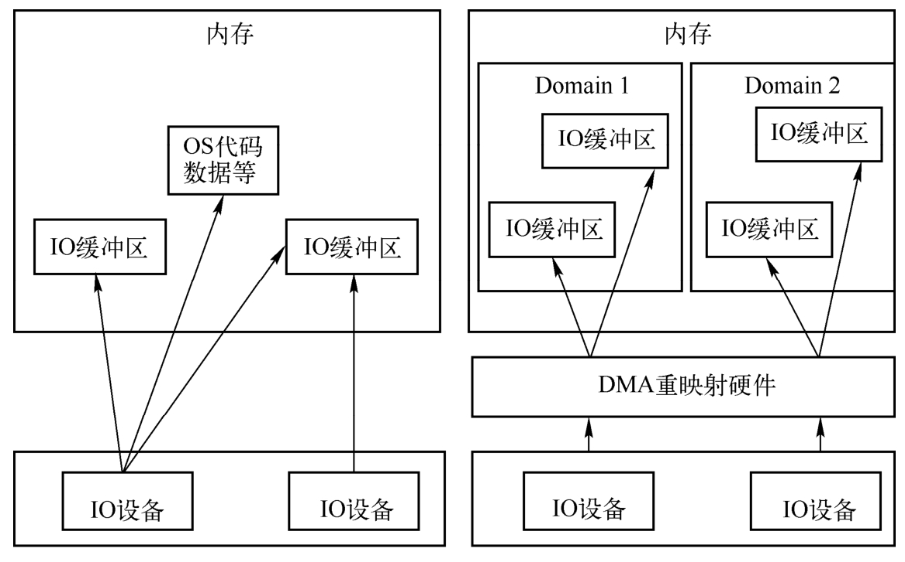

# 2. DMA Remapping 功能简介

VT-d DMA Remapping 的硬件能力主要是由 **IOMMU** 来提供, 对于 DMA Remapping, IOMMU 与 MMU 类似. IOMMU 可以将一个**设备访问地址**转换为**存储器地址**(内存地址).

## 2.1. 基本思想

DMA Remapping 的基本思想如图所示, 当虚拟机让**设备进行 DMA** 时, 指定的是 **GPA** 地址, 在经过 **DMA Remapping** 之后, 该 **GPA** 地址会被**转换**成 `QEMU/KVM` 为其分配的**物理地址**(**HPA**). 这一点与右边 CPU 进行访问时 EPT 的作用是一样的.

**IO 和 CPU 虚拟化**:

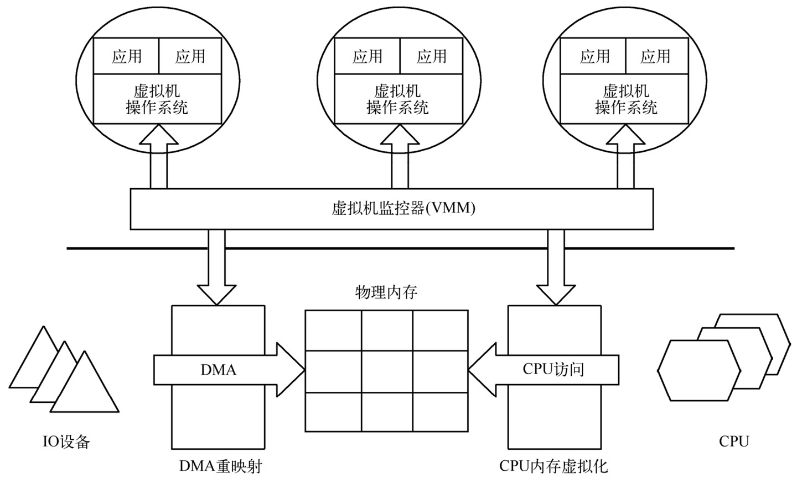

## 2.2. 没有 IOMMU

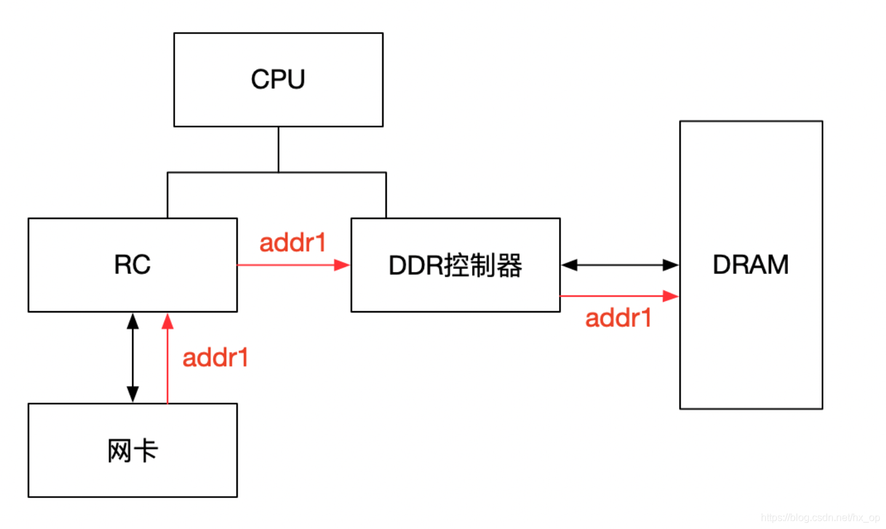

在没有 IOMMU 的情况下, 网卡接收数据时地址转换流程, **RC** 会将**网卡请求写入地址 addr1** 直接发送到 **DDR 控制器**, 然后访问 DRAM 上的 addr1 地址, 这里的 **RC** 对网卡请求**地址不做任何转换**, 网卡访问的地址必须是**物理地址**.

## 2.3. 有 IOMMU

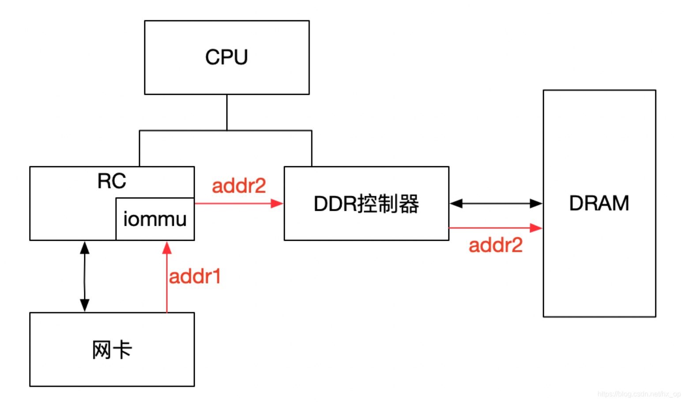

对于有 IOMMU 的情况, 网卡**请求写入地址 addr1** 会**被 IOMMU 转换为 addr2**, 然后发送到 DDR 控制器, 最终访问的是 DRAM 上 addr2 地址, 网卡访问的地址 addr1 会被 IOMMU 转换成**真正的物理地址 addr2**, 这里可以将 addr1 理解为虚机地址.

## 2.4. 对比

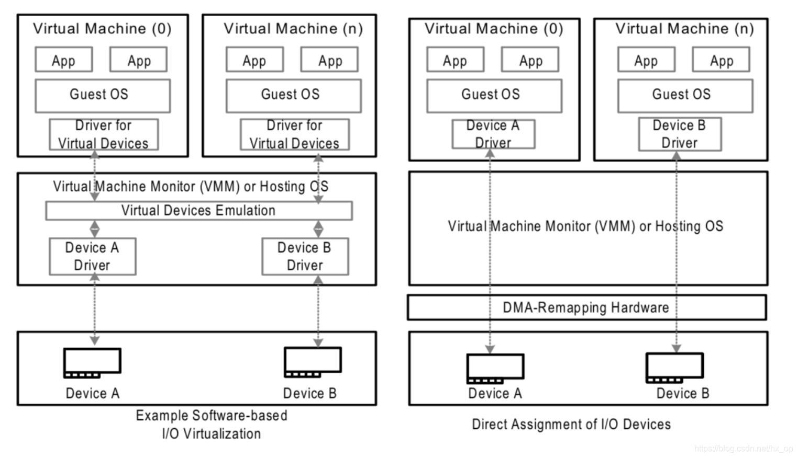

左图是**没有 IOMMU** 的情况, 对于**虚机无法实现设备的透传！！！**, 原因主要有两个:

* 一是因为在**没有 IOMMU** 的情况下, **设备必须访问真实的物理地址 HPA**, 而**虚机可见的是 GPA**;

* 二是如果**让虚机填入真正的 HPA**, 那样的话相当于**虚机可以直接访问物理地址**, 会有安全隐患.

所以针对**没有 IOMMU** 的情况, **不能用透传的方式**, 对于**设备的直接访问**都会有 **VMM 接管**, 这样就不会对虚机暴露 HPA.

右图是**有 IOMMU** 的情况, **虚机**可以将 **GPA** 直接写入到**设备**, 当设备进行 DMA 传输时, **设备请求地址 GPA** 由 IOMMU 转换为 **HPA**(**硬件自动完成**), 进而 DMA 操作真实的物理空间. **IOMMU 的映射关系**是由 **VMM 维护**的, **HPA 对虚机不可见**, 保障了安全问题, **利用 IOMMU 可实现设备的透传**. 这里先留一个问题, 既然 IOMMU 可以将设备访问地址映射成真实的物理地址, 那么对于右图中的 Device A 和 Device B, IOMMU 必须保证**两个设备映射后的物理空间不能存在交集**, 否则**两个虚机可以相互干扰**, 这和 IOMMU 的映射原理有关, 后面会详细介绍.

## 2.5. 作用总结

总结 IOMMU 主要作用如下:

* **屏蔽物理地址**, 起到保护作用. **典型应用**包括两个:

  * 一是**实现用户态驱动**, 由于 IOMMU 的映射功能, **使 HPA 对用户空间不可见！！！**, 在 vfio 部分还会举例.

  * 二是将**设备透传给虚机**, 使 HPA 对虚机不可见, 并将 GPA 映射为 HPA

* IOMMU 可以将**连续的虚拟地址**映射到**不连续的多个物理内存**片段. 这部分功能于 MMU 类似, 对于**没有 IOMMU** 的情况, **设备访问的物理空间必须是连续的**, IOMMU 可有效的解决这个问题.

# 3. 工作原理

与 MMU 类似, DMA Remapping 也是通过建立类似页表这样的结构来**完成 DMA 的地址转换**.

通过引入 **Root Context Entry** 和 **IOMMU Domain Page Table** 等机制来实现**直通设备隔离**和 **DMA 地址转换**的目的.

## 3.1. 两种 DMA request

根据 **DMA Request** 是否包含**地址空间标志** (`address-space-identifier`) 我们将 DMA Request 分为 2 类:

* `Requests without address-space-identifier`: **不含地址空间描述标志**的 DMA Request. 这是 endpoint devices 的**普通请求**, 请求内容仅包含**请求的类型** (`read`/`write`/`atomics`), DMA 请求的目标 **address/size** 以及请求**设备的标志符**(BDF)等.

* `Requests with address-space-identifier`: **包含地址空间描述标志的 DMA Request**. 除了通用属性, 还需要包含**额外信息**以提供**目标进程**的**地址空间标志符** (`PASID`), 以及一些可选属性, 比如 `Execute-Requested`(ER, 表明是指令提取) flag 和 `Privileged-mode-Requested` 等细节信息. 更多细节可以看 PCIe Spec 的 Process Address Space ID (PASID) Capability

为了简单, 通常称上面两类 DMA 请求简称为: `Requests-without-PASID` 和 `Requests-with-PASID`.

本节我们只讨论 `Requests-without-PASID`, 后面我们会在讨论 Shared Virtual Memory(SVM) 的文中单独讨论 Requests-with-PASID.

## 3.2. DMA Domain 和 Address Space

> 这两个意思相等?

首先要明确的是 **DMA Isolation** 是**以 Domain 为单位**进行隔离的, 在**虚拟化环境**下可以认为**每个 VM 的地址空间**为**一个 Domain**, 直通给这个 VM 的设备只能访问这个 VM 的地址空间这就称之为 "**隔离**".

根据**软件的使用模型**不同, **直通设备**的 **DMA Address Space** 可能是:

* **某个 VM** 的 **Guest Physical Address Space**;

* **某个进程的虚拟地址空间** (由分配给进程的 **PASID** 定义);

* 由软件定义的一段抽象的 **IO Virtual Address space** (`IOVA space`).

## 3.3. DMA Translation

DMA Remapping 就是要能够将**设备发起**的 **DMA Request** 地址进行 DMA Translation **重映射**到对应的 **HPA** 上.

下面的图描述了 DMA Translation 的原理, 这和 MMU 将虚拟地址翻译成物理地址的过程非常的类似.

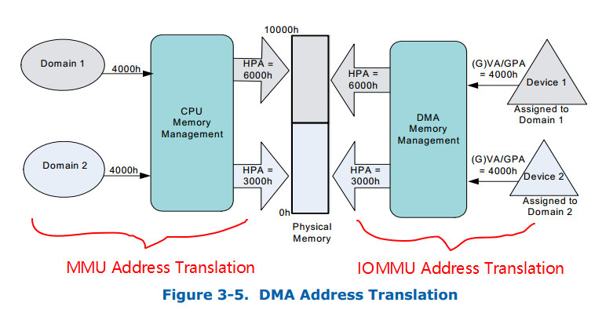

值得一提的是, **Host 平台**上可能会存在一个或者**多个 DMA Remapping 硬件单元**, 而**每个硬件单元**支持在它管理的**设备范围内**的**所有设备**的 DMA Remapping. 例如, 你的台式机 CPU Core i7 7700k 在 MCH 中只集成一个 DMA Remapping 硬件单元 (IOMMU), 但在**多路服务器**上可能集成有**多个 DMA Remapping 硬件单元**.

**每个**硬件单元**负责管理**挂载到它**所在**的 **PCIe Root Port** 下所有设备的 DMA 请求. **BIOS** 会将平台上的 DMA Remapping **硬件信息**通过 **ACPI** 协议报告给操作系统, 再由**操作系统**来初始化和管理这些硬件设备.

### 3.3.1. Source Identifier

为了实现 DMA 隔离, 我们需要**对直通设备进行标志**, 而这是通过 PCIe 的 **Request ID** 来完成的. 根据 PCIe 的 SPEC, **每个 PCIe 设备的请求**都包含了 `PCI Bus/Device/Function` 信息, 通过 BDF 号我们可以**唯一确定一个 PCIe 设备**.

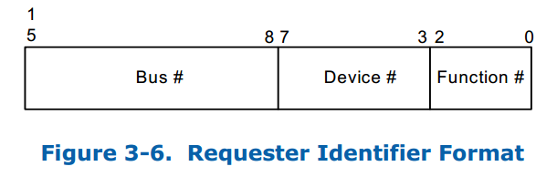

特殊情况:

* 对于由 **PCIe switch** 扩展出的 **PCI 桥及桥下设备**, 在发送 DMA 请求时, Source Identifier 是 PCIe switch 的, 这样的话该 PCI 桥及桥下所有设备都会**使用 PCIe switch 的 Source Identifier** 去定位 Context Entry, 找到的**页表也是同一个**, 如果将这个 PCI 桥下的不同设备分给不同虚机, 由于会使用同一份页表, 这样会产生问题, 针对这种情况, **当前 PCI 桥及桥下的所有设备必须!!!分配给同一个虚机**, 这就是 VFIO 中 group 的概念, 下面会再讲到.

### 3.3.2. 三个表

同时为了能够**记录直通设备和每个 Domain 的关系**, VT-d 引入了 `root-entry/context-entry` 的概念, 通过查询 **root-entry/context-entry 表**就可以获得直通设备和 Domain 之间的**映射关系**. 当然, Root Table,Context Table 等都需要 host 通过 iommu 驱动的编程接口去构造.

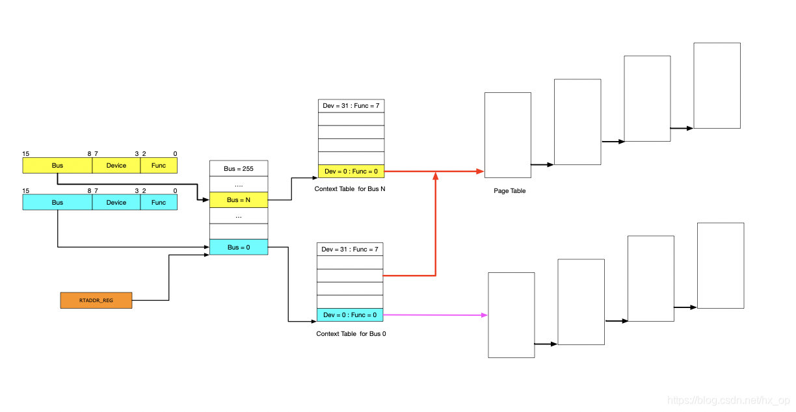

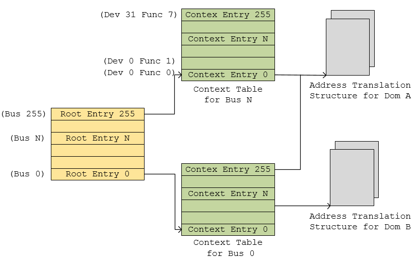

**图 7-53 Device 到 Domain 的映射表**:

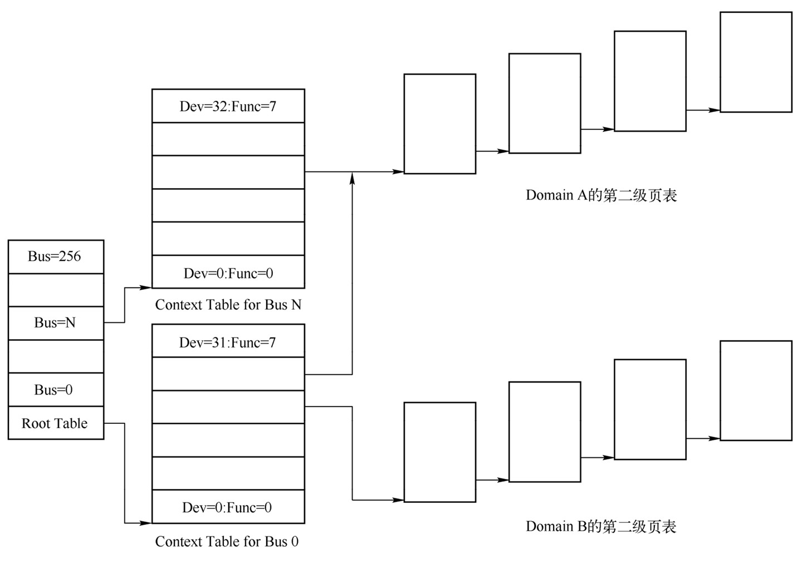

#### 3.3.2.1. root table

`Root-table` 是一个 **4K 页**, 共包含了 **256** 项 `root-entry`, 每一项表示一条总线, 分别覆盖了 PCI 的 `Bus 0-255`.

Root-table 的**基地址**存放在 `Root Table Address Register`(`RTADDR_REG`) 当中.

**每个 root-entry** 占 `16-Byte`, 记录了当前 PCI Bus 上的**设备映射关系**, 通过 **PCI Bus Number** 进行**索引**.

Root-entry 中记录的关键信息有:

* **Present Flag**: 代表着该 Bus 号对应的 Root-Entry 是否呈现, CTP 域是否初始化;
* **Context-table pointer**(CTP): CTP 记录了**当前 Bus 号**对应的 Context Table 的**地址**.

#### 3.3.2.2. context table

> 一个 context table 仅仅是一个 device 的

**每个** `context-table` 也是一个 **4K 页**, **每一项**都记录有该设备对应的 Domain 信息, 记录**一个特定的 PCI 设备**和它**被分配的 Domain** 的映射关系, 即**对应 Domain** 的 DMA 地址翻译结构信息的地址.

每个 root-entry 包含了该 Bus 号对应的 context-table 指针, 指向一个 context-table, 而每张 context-table 包又含 256 个 `context-entry`, 其中每个 entry 对应了一个 **Device Function 号**所确认的**设备的信息**. 通过 2 级表项的查询我们就能够获得指定 PCI 被分配的 Domain 的地址翻译结构信息.

Context-entry 中记录的信息有:

* **Present Flag**: 表示该设备对应的 context-entry 是否被初始化, 如果当前平台上没有该设备 Preset 域为 0, 索引到该设备的请求也会被 block 掉.
* **Translation Type**: 表示哪种请求将被允许;
* **Address Width**: 表示该设备被分配的 Domain 的地址宽度;
* **Second-level Page-table Pointer**: 二级页表指针, 提供了 **DMA 地址翻译结构(IO 页表**)的 **HPA 地址** (这里仅针对 `Requests-without-PASID` 而言);
* **Domain Identifier**: Domain 标志符, 表示当前设备的**被分配到的 Domain** 的标志, 硬件会利用此域来标记 context-entry cache, 这里有点**类似 VPID** 的意思;
* **Fault Processing Disable Flag**: 此域表示是否需要选择性的 disable 此 entry 相关的 remapping faults reporting.

因为**多个设备**有可能被分配到**同一个 Domain**, 这时只需要将其中**每个设备 context-entry 项**的 `Second-level Page-table Pointer` 设置为**对同一个 Domain 的引用**, 并将 `Domain ID` 赋值为**同一个 Domian** 的就行了.

#### 3.3.2.3. IO 页表

见下面的 "直通设备的地址翻译"

## 3.4. 直通设备的隔离

VT-d 中引入 root-table 和 context-table 的目的比较明显, 这些额外的 table 的存在就是为了记录**每个直通设备和其被分配的 Domain 之间的映射关系**.

有了这个映射关系后, DMA 隔离的实现就变得非常简单.

**IOMMU 硬件**会**截获直通设备发出的请求**, 然后根据其 **Request ID** 查表找到对应的 Address Translation Structure 即**该 Domain 的 IOMMU 页表基地址**, 这样一来该设备的 DMA 地址翻译就只会按这个 Domain 的 IOMMU 页表的方式进行翻译, 翻译后的 HPA 必然落在此 Domain 的地址空间内 (这个过程**由 IOMMU 硬件中自动完成**), 而不会访问到其他 Domain 的地址空间, 这样就达到了 DMA 隔离的目的.

## 3.5. 直通设备的地址翻译

DMA 地址翻译的过程和虚拟地址翻译的过程是完全一致的, 唯一不同的地方在于 **MMU 地址翻译**是将**进程的虚拟地址** (HVA) 翻译成**物理地址** (HPA), 而 **IOMMU 地址翻译**则是将**虚拟机物理地址空间**内的 **GPA** 翻译成 **HPA**.

IOMMU 页表和 MMU 页表一样, 都采用了多级页表的方式来进行翻译. 例如, 对于一个 48bit 的 GPA 地址空间的 Domain 而言, 其 IOMMU Page Table 共分 4 级, 每一级都是一个 4KB 页含有 512 个 8-Byte 的目录项. 和 MMU 页表一样, IOMMU 页表页支持 2M/1G 大页内存, 同时硬件上还提供了 IO-TLB 来缓存最近翻译过的地址来提升地址翻译的速度.


在设备发起 DMA 请求时, 会将自己的 **Source Identifier**(包含 Bus,Device,Func)包含在请求中, IOMMU 根据这个标识, 以 `RTADDR_REG` 指向空间为**基地址**, 然后利用 `Bus, Device, Func` 在 Context Table 中**找到对应的 Context Entry**, 即**页表首地址**, 然后利用页表即可将设备请求的虚拟地址翻译成物理地址. 这里做以下说明:

* 图中**红线**的部分, 是**两个 Context Entry 指向了同一个页表**. 这种情况在**虚拟化场景**中的**典型用法**就是这两个 Context Entry 对应的**不同 PCIe 设备属于同一个虚机**, 那样 IOMMU 在将 GPA->HPA 过程中要遵循同一规则

* 由图中可知, **每个**具有 Source Identifier(包含`Bus,Device,Func`)的**设备**都会**具有一个 Context Entry**. 如果不这样做, 所有设备共用同一个页表, 隶属于不同虚机的不同 GPA 就会翻译成相同 HPA, 会产生问题,

有了页表之后, 就可以按照 MMU 那样进行地址映射工作了, 这里也支持不同页大小的映射, 包括 4KB, 2MB, 1GB, 不同页大小对应的级数也不同, 下图以 4KB 页大小为例说明, 映射过程和 MMU 类似, 不再详细阐述.

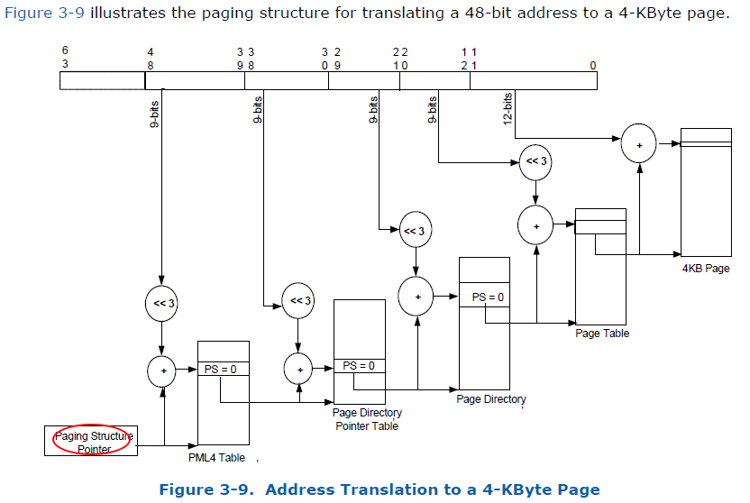

# 4. reference

https://luohao-brian.gitbooks.io/interrupt-virtualization/content/vt-d-dma-remapping-fen-xi.html (done)

http://element-ui.cn/news/show-44900.html (done)

https://www.owalle.com/2021/11/01/iommu-code/ (done)