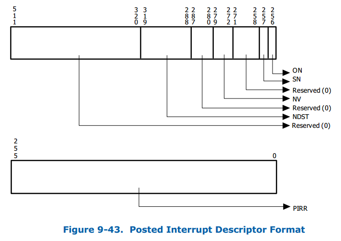
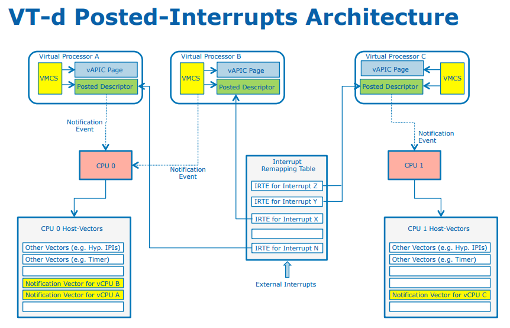
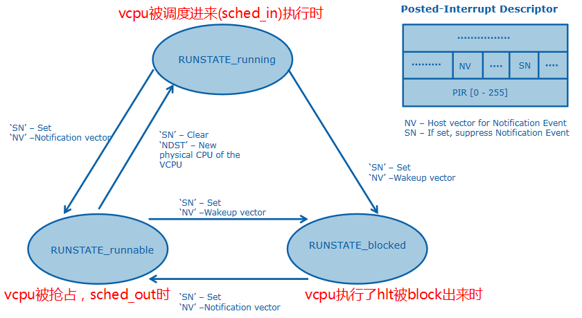
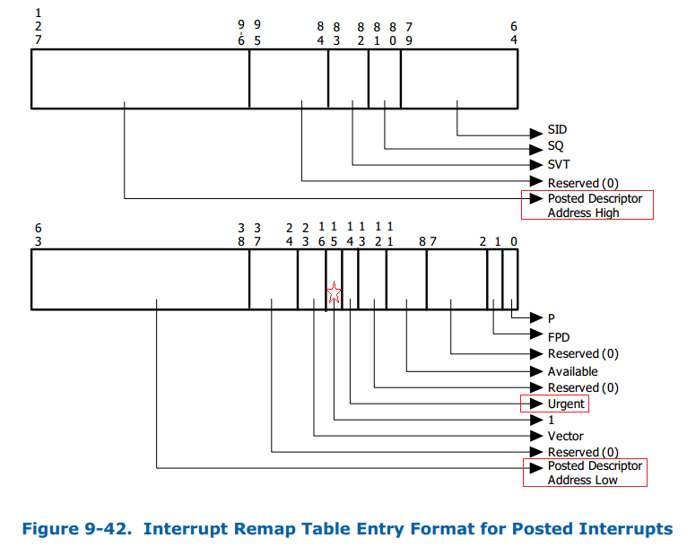

<!-- @import "[TOC]" {cmd="toc" depthFrom=1 depthTo=6 orderedList=false} -->

<!-- code_chunk_output -->

- [1. Interrupt Posting 简介](#1-interrupt-posting-简介)
- [2. Interrupt Posting 的硬件处理步骤](#2-interrupt-posting-的硬件处理步骤)
- [3. Interrupt Posting 的软件处理步骤](#3-interrupt-posting-的软件处理步骤)
- [4. 附: Posting 格式中断重映射表项的格式](#4-附-posting-格式中断重映射表项的格式)
- [5. reference](#5-reference)

<!-- /code_chunk_output -->

VT-d Interrupt Remapping 的引入**改变**了以往**设备中断的投递方式**, Remapping 格式的中断请求**不再**包含目标 CPU 的 `APIC-ID`, **中断 vector 号**, **投递方式**等重要信息, 而是仅仅提供了一个 `16 bit` 的 **interrupt_index** 用来索引**中断重定向表项** (`IRTE`), 这个改变带来的最大好处是提升了**中断处理的灵活性**.

在虚拟化的环境下, 为了提升虚拟机的**中断实时性**, Intel 在 Interrupt Remapping 的基础上加以改进 引入了 **Interrupt Posting** 机制, 从**硬件**层面实现了**中断隔离**和**中断自动迁移**等重要特性.

# 1. Interrupt Posting 简介

VT-d Interrupt Posting 是**基于 Interrupt Remapping 的一种扩展的中断处理方式**, 其主要用途是在虚拟化场景下, 可以**大幅提升 VMM 处理直通设备中断的效率**.

硬件通过 **Capability Register** (`CAP_REG`) 的 **PI** 位来报告 **interrupt posting capability**.

根据前面介绍 Interrupt Remapping 的文章可以知道, **所有的 Remapping 格式中断请求**都需要通过**中断重映射表**来投递, **IRTE** 中的 **Mode 域** (IM) 用来指定这个 remappable 中断请求是 `interrupt-remapping` 方式还是 `interrupt-posting` 方式.

* IRTE 的 IM 位为 0 表示中断按照 **remappable** 方式处理;
* IRTE 的 IM 位为 1 表示中断按照 **posted** 方式来处理.

在 Interrupt Posting 模式下, 新增了一个与 **VCPU 相关**的**内存数据结构**叫做 "**Posted Interrupt Descriptor**"(`PD`), 这是一个 `64-Byte` 对齐的数据结构并且**直接被硬件用来记录**将要 post 的**中断请求**.

PD 结构包含以下的域:

* Posted Interrupt Request (`PIR`) 域, 提供**记录需要 post 的中断**, 占 256 bit, **每个 bit 代表一个中断号**.
* Outstanding Notification (`ON`) 域, 由**硬件来自动更新**, 用来表示**是否有中断请求 pending**. 当此位为 0 时, 硬件通过修改其为 1 来产生一个通知事件告知中断请求到来. 接收这个通知事件的实体 (处理器或者软件) 在处理这个 posted interrupt 时后必须将其清零.
* Suppress Notification (`SN`) 域, 表示 non-urgent 中断请求的通知事件是否要被 supressed (抑制).
* Notification Vector (`NV`) 域, 用来指定产生 posted-interrupt "**通知事件**"(notification event) 的 **vector 号**.
* Notification Destination (NDST) 域, 用来指定此中断要投递的 VCPU 所运行物理 CPU 的 `APIC-ID`.

在 **Interrupt Posting** 模式下 **IRTE** 格式相对于 Remapping 模式有很大不同(参考附录), IRTE 的格式相对于 Remapping 模式新增了以下几个域:

* 中断请求对应的 Posted Interrupt Descriptor 数据结构**地址**, 包含高地址和低地址 2 个域;
* Urgent (URG) 标志来指定中断请求是否需要**实时处理**;
* 一个用来指定要 post 的 **vector 号**的 Vector 域. 与 Remapping 格式不同的是, posted-format 的 IRTEs 的 Vector 域是用来决定 **Posted Interrupt Descriptor** 里的 PIR 域的**哪个 bit 要置位**.

# 2. Interrupt Posting 的硬件处理步骤

当一个 Remapping 格式(RTE)的中断请求 IM 位为 1 时, 意味着**这个中断请求要按照 Interrupt Posting 方式进行处理**.

整个过程中断**硬件处理流程**如下:

* 如果中断请求索引到的 **IRTE** 的 IM 位被置位 (1b):

  1. 硬件按照 **posted format** 解读 IRTE, 如果 IRTE 的格式检查不通过, 那么该请求被 blocked.如果检查通过从 IRTE 中提取 **Posted Interrupt Descriptor** 的**地址** (PDA-L/PDA-H), 中断请求的 vector 号以及中断请求是否为 URG 等信息.

  2. 硬件会对 **Posted Interrupt Descriptor 内存数据结构**执行一个 `read-modify-write` 原子操作:

  * 首先读取 PD 的内容并对其进行检测, 如果发现格式不对(例如 reserved 域不为 0)那么将该请求 block 掉. 如果检测通过那么获取当前的 PIR, ON, NV, NDST 域信息后, 按照下面的规则对 PD 进行原子更新:

    * 根据 IRTE 的 Vecotr 域设置 PIR 对应的 bit
    * 计算出 `X = ((ON == 0) & (URG | (SN == 0)))`, 如果 `X==1` 那么把 ON 置位.

  * 如果 X==1, 那么产生一个 "**通知事件中断**", 并且这个中断的属性为:

    * NSDT 表示 VCPU 所在的 CPU 的 physical APIC-ID (注意: xAPIC 和 x2APIC 模式下的不同)
    * NV 域指定了被用来通知目的 CPU 有个 posted-interrupt 已在 pending 的 "通知事件" 的中断向量. (注意不是要 post 的中断请求 vector 号, 这个仅仅用做通知用)
    * Delivery mode 域被强制设定为 Fixed (000b)
    * Re-direction Hint 域强制清零 (0b)
    * Triger Mode 域被设置为 Edge (0b)
    * Trigger Mode Level 域被设置为 Asserted (1b)

# 3. Interrupt Posting 的软件处理步骤

当**一个设备被直通给虚拟机**后, 虚拟机**初始化**的过程中 **VMM** 会设置好此设备的 `MSI/MSI-X` 中断对应的 **IRTE** 并标志 **IM** 位为 **1b**, 标志这是一个 Posted Interrupt. 当**直通设备投递一个中断**后, 硬件首先会去查询 irq 对应的 **IRTE** 并从 IRTE 中提取记录的 `Posted Interrupt Descriptor` **地址**和 **vector** 信息, 然后更新 PIR 域和 ON 域并且将 vector 信息**写入到 VCPU 的 vAPIC Page** 中, 直接给处于 **None Root** 模式的 **VCPU** 注入一个中断, 整个过程不需要 VMM 的介入从而十分高效.

Intel 的虚拟化专家 FengWu 使用下面的图很好的描述了 Interrupt Posting 的处理过程:

从上面的描述来看, Interrupt Posting 是不是看起来很简单? 然而, 实际实现上却还是要复杂多. 从软件层面来说, VMM 需要参与进来做以下一些额外的工作来使能 Interrupt Posting 机制:

1. 为虚拟机的**每个 VCPU** 分配一个 **PD** 用来存放此 VCPU 的 Posted Interrupt 信息;
2. VMM 需要在**每个 PCPU** 上安排 2 个中断 vector 用来接受通知事件:
   * 其中一个物理 vector 被称之为 'Active Notification Vector' (ANV), 它被用来 post 通知事件到处于 Running 状态的 VCPU 上(这个 IPI 中断是 guest 接收的).
   * 另一个物理 vector 被称之为 'Wake-up Notification Vector' (WNV), 它被用来 post 通知事件到处于 Blocked 状态的 VCPU 上(这个 IPI 中断是 host 接收的).
3. 对于直通到此虚拟机的直通设备, VMM 都会干预进来(因为虚拟机的 IOxAPIC, LAPIC 等都是 kvm 内核模块来模拟的), VMM 能够知道到每个 VCPU 上的 vector 号分配情况;
4. 对于每个直通设备的中断:
   * VMM 会为每个中断源分配一个 IRTE, 并且把对应的 guest 分配的 vecotr 号填入到 IRTE 的 vector 域.
   * VMM 会将每个 VCPU 对应的 PD 地址填入到此中断源的对用的 IRTE 地址域.
   * 如果此中断需要立即处理, 那么 VMM 会将对此中断源对应的 IRTE 中 URG 域置成 1.
5. 同时 VMM 还需要为 VCPU 使能 APICv 特性(包括了 'virtual-interrupt delivery' 和 'process posted interrupts'), 并且将此 VCPU 的 VMCS 域 POSTED_INTR_NV 配置为 ANV, 将申请的 PD 的地址配置到 VMCS 的 POSTED_INTR_DESC_ADDR 域来告诉 VCPU 它关联的 PD 在哪儿. (注: 这些操作在 VCPU 初始化流程中完成)
6. 在 VCPU 调度的过程中, VMM 需要按照下面的方式来管理 VCPU 的调度状态:
   * 当 VCPU 被 scheduler 选中调度进来运行的的时候, 此时 VCPU 的状态被标志为 'Active' 状态. 这个时候 VMM 需要将 PD 的 NV 域更新为 ANV 的值. 同时在这种场景下, 此 VCPU 上接受的 Posted Interrupt 中断会被直接复制到 vAPIC Page 中, guest 在非根模式下就能直接处理此中断, 而不需要 VMM 的参与.
   * 当一个 VCPU 被抢占(Preempted), 例如时间片到期了, 这时候需要将 PD 的 SN 域标志为 1, 即将 VCPU 更新为 'Preempted' 状态. 此时, 这个 VCPU 上的 non-urgent 中断都会被接受但不会产生通知事件. 但如果这个 VCPU 上有标志为 URG 类型的中断时, VMM 同时也会将 PD 的 NV 域修改为 WNV, 这样一来 VMM 就能够将 URG 中断请求投递给处于 not running 状态的 VCPU, 并进行适当的软件处理(例如, 抢占正在同一个物理 CPU 上运行状态的其他 VCPU, 并将自己调度进来).
   * 当一个 VCPU 执行了 hlt 指令或者触发了 ple, VMM 也会干预进来将 VCPU 给 block 出来, 并且将 VCPU 状态标识为 Hlted 状态. 在此状态下 VMM 需要将 VCPU 对应的 PD 的 NV 域设置为 WNV.这样一来, 当中断请求 post 到此 VCPU 时, VMM 能够接受到 Wake-up Notification Event 事件通知并做出适当的软件操作. (例如: 立即对此 VCPU 进行一次调度)
7. 当 VCPU 重新进入非根模式或者从 hlt 恢复执行时, VMM 对此 VCPU 上处于 pending 状态的 posted interrupt 进行处理:
   * 首先将 PD 的 NV 域设置为 ANV 以标志 VCPU 为 Active 状态;
   * 扫描 PD 的 PIR 域检测是否有处于 pending 状态的 posted interrupt 请求;
   * 如果有处于 pending 状态的 posted interrupt 请求, VMM 会在 LAPIC 上生成一个 vector 号为 ANV 的 self-IPI (注意: 在还未真正 enter guest 之前当前 CPU 处于关中断状态). 那么当 VCPU 刚刚进入到非根模式下, 就立刻接受到一个事件通知中断 (ANV), 那么处理器硬件就同样将它当做 posted-interrupt 通知事件来处理, 从 LAPIC 中读取 pending 的中断并进行处理. 这样的好处是将 guest 对于 posted interrupt 的处理完全 off load 到处理器硬件上.
8. VMM 同样能够将 posted interrupt processing 技术应用到模拟设备产生的虚拟设备中断处理上(不仅仅是直通设备额). 而这只需 VMM 执行原子操作 'post' 一个虚拟中断到 PD 上, 并给 PD 中 NDST 的逻辑 CPU 发送一个 IPI 作为通知事件告诉该 CPU 有 posted interrupt 到来.
9. 当 VCPU 在不同 PCPU 之间进行迁移时, VMM 会对 VCPU 对应的 PD 的 NDST 域进行更新, 将 NDST 改为 VCPU 要迁移的目的 PCPU 的 APIC-ID.这也就是说, 在 VCPU 迁移的过程中我们也顺便完成了中断迁移. 这样一来, 新的 posted interrupt 通知事件到来时就会被自动路由的新的 PCPU 上, 是不是很巧妙?

再次引用一下 FengWu 的图片来说明下 VCPU 在发生状态改变的时候, VMM 做了哪些操作来保证 posted interrupt 能够顺利完成, 请读者配合上面的描述自行进行梳理.

# 4. 附: Posting 格式中断重映射表项的格式

# 5. reference

https://luohao-brian.gitbooks.io/interrupt-virtualization/content/vt-d-posted-interrupt-fen-xi.html
