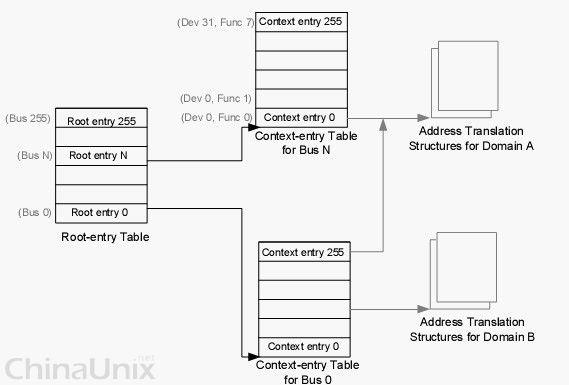

<!-- @import "[TOC]" {cmd="toc" depthFrom=1 depthTo=6 orderedList=false} -->

<!-- code_chunk_output -->

- [1 概述](#1-概述)
- [2 dma 地址空间映射](#2-dma-地址空间映射)
- [3 中断重映射](#3-中断重映射)
- [4 iommu cache 、intremap cache 和设备 tlb](#4-iommu-cache--intremap-cache-和设备-tlb)

<!-- /code_chunk_output -->

# 1 概述

IOMMU(i/o memory management unit). iommu 有两大功能: 控制设备 dma 地址映射到机器物理地址(dmar), 中断重映射(intremap)(可选)

# 2 dma 地址空间映射

在计算机领域, IOMMU(Input/Output Memory Management Unit)是一个内存管理单元(Memory Management Unit), 它的作用是**连接 DMA\-capable I/O 总线**(Direct Memory Access\-capable I/O Bus)和**主存(main memory**).

**传统的内存管理单元**会把**CPU 访问的虚拟地址**转化成**实际的物理地址**. 而**IOMMU**则是把**设备(device)访问的虚拟地址**转化成**物理地址**. 为了防止设备错误地访问内存, 有些 IOMMU 还提供了访问内存保护机制. 参考下图:

IOMMU 的一个重要用途是在虚拟化技术(virtualization): **虚拟机上运行的操作系统(guest OS**)通常**不知道它所访问的 host\-physical 内存地址**. 如果要**进行 DMA 操作**, 就有**可能破坏内存**, 因为**实际的硬件**(hardware)**不知道 guest\-physical**和**host\-physical 内存地址之间的映射关系**. IOMMU 根据 guest\-physical 和 host\-physical 内存地址之间的转换表(translation table), re\-mapping 硬件访问的地址, 就可以解决这个问题.

Iommu 的主要功能为设备 dma 时刻能够访问机器的物理内存区, 同时保证安全性.

在**没有 Iommu**的时候, 设备通过**dma**可以访问到机器的全部的地址空间.

1、这种机制下如果将**设备的驱动**放在**用户态**, 那么如何保护机器物理内存区对于用户态驱动框架设计带来挑战. 当出现了 iommu 以后, iommu 通过控制每个设备 dma 地址到实际物理地址的映射转换, 使得在一定的内核驱动框架下, 用户态驱动能能够完全操作某个设备 dma 和中断成为可能.

2、如果将这个物理设备通过透传的方式进入到虚拟化虚拟机里, 虚拟机的设备驱动配置设备的 dma 后, hypervisor 必须在透传设备 dma 访问时刻, 对 dma 访问进行截获, 将其中 dma 访问的虚拟机物理地址, 转换为 hypervisor 为虚拟机分配的物理地址, 也就是需要将虚拟机透传设备 dma 访问做 vpaddr(虚拟机物理地址)---->ppaddr(物理机物理地址). 这部分截获对虚拟机 dma 来说带来切换到 hypervisor 开销, hypervisor 转换地址开销. 当引入了 iommu 以后, 这部分开销由 iommu 硬件承担, 所有 hypervisor 工作就更加简单, 只需要将透传设备 Iommu dma 地址映射表使用 vpaddr--->ppaddr 地址转换表即可(这部分表在 hypervisor 里配置在 ept 中)

3、方便了老式 32 位 pci 硬件在 64 位机器上的使用. 只需要在 iommu 地址映射表上配置 32bitpci 设备 dma 地址-->64 位机器物理地址即可. 4、方便了主机 os 配置设备 dma 工作, 因为 dma 要求使用连续的地址空间进行读写, 有了 iommu 的存在 os 就可以为设备配置连续的 dma 地址而真正对应的非连续的物理地址

注意: 这里的 iommu 只管设备发起的 dma 的映射, 而软件发起的 mmio, 设备的 pci configuration 接入不受其管制！

# 3 中断重映射

在虚拟化透传设备使用中, 或者主机侧用户态驱动框架中还有一个问题就是 msi 中断的安全保护. msi 的特点就是只要发起特定的 pci write 消息, 机器(在 x86 上是 LAPIC)就能够将此 pci write 消息翻译为一次中断信号. 在 msi 中断信息里, 含有中断源信息, 中断 vector 信息以及中断发往哪里, 中断模式等等信息.

如果设备透传到虚拟机, 而虚拟机里有恶意驱动, 那么恶意驱动完全可以操作一个透传设备发起 dma write 访问, 带有 msi 中断信息, 导致 hypervisor 被攻击.

在用户态驱动层面也是相同的, 用户态驱动可以触发 dma 带有 msi 中断导致主机系统被攻击.

为了防止这种情况发生, Intel 的 iommu 技术(vt-d)里实现了中断重映射技术(intremap). 设备发起的 msi 中断先进入 iommu 的 intremap 模块进行映射得到真正的 msi 中断信息. 主机 os 会在这个中断重映射表里限定, 某个设备只能发起哪种中断向量, 同时会验证 msi 中的信息位(如此提升了恶意软件触发真实 msi 的难度).

这也是某款有硬件缺陷的主机支持 iommu 的 dmar 但是不支持 intremap, 开启 vfio 的时候 linux kernel 不会开启设备的 vfio, 提示只有开启 vfio 模块的 allow\_unsafe\_interrupts 配置后才能使用 vfio 的原因.

# 4 iommu cache 、intremap cache 和设备 tlb

前面的很多转换表, 这些转换表都位于物理内存中, 所以在 intel vt-d 中设计了大量主机侧 cache 机制来缓存这些表的表项, 提升访问效率. 设备 tlb 是 intel vt-d 中设计的设备测 tlb 寄存器, 在设备进行 dma 的时候在设备一侧缓存 dma 地址到物理地址映射项.

2、iommu 在各个厂商的分身

1)inte vt-d2)amd iommu 或者 gart

3) arm 的 Smmu

3、总结

iommu 中 dmar 出现为虚拟化软件 dma 访问带来的性能提升, intremap 出现为虚拟化软件透传带来了中断消息的安全保证.

4、参考

[iommu wiki](https://link.jianshu.com/?t=https%3A%2F%2Fen.m.wikipedia.org%2Fwiki%2FInput%25E2%2580%2593output_memory_management_unit)

[还是不太理解 mmu 和 io-map](https://link.jianshu.com/?t=http%3A%2F%2Fbbs.chinaunix.net%2Fthread-2072818-1-1.html)

《Vt-directed-io-spec.pdf》
