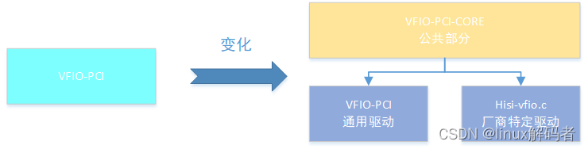
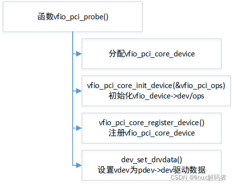
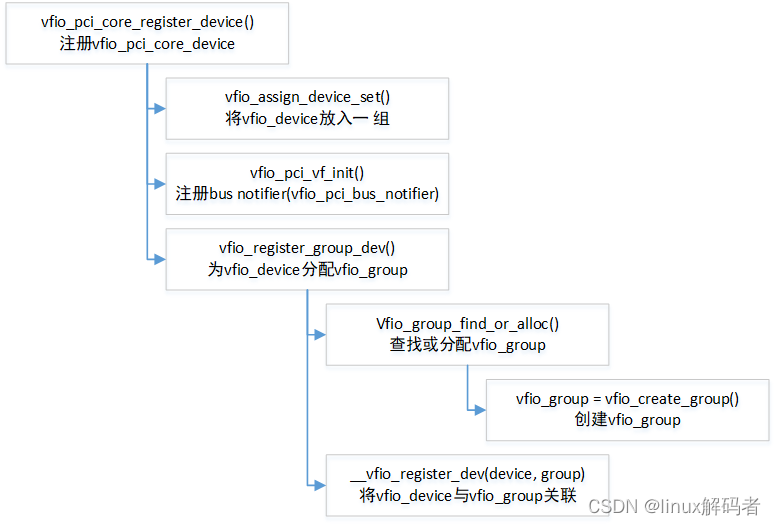
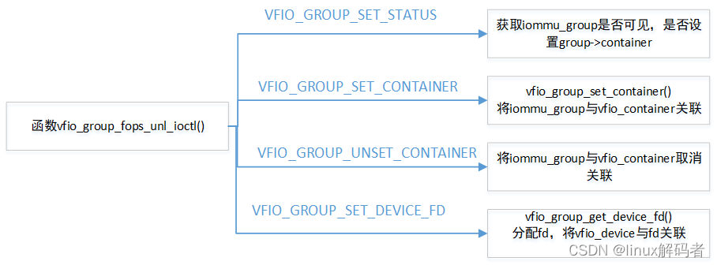

VFIO-PCI 驱动作为 PCIE 驱动, 在原来的 PCIE 驱动卸载后,加载 VFIO-PCI 驱动, 与内核之前扫描到的 PCIE 设备匹配,触发 vfio_pci_probe(),进行本驱动的初始化.该驱动提供了用户态访问 PCIE 设备的配置空间/BAR 空间/中断等资源接口,对应于上图中 Device API(代码主要在 `drivers/vfio/vfio-pci.c`).

之前 VFIO-PCI 驱动为公共驱动, 所有的设备(无论是网卡还是加速器)都是使用该驱动,但是前段时间 MLX 和 HISI 在上传热迁移时遇到一些问题,发现需要有部分实现不属于公共部分,因此 VFIO-PCI 驱动框架作修改, 将其拆成两部分, 公共部分 vfio-pci-core 和驱动部分 vfio-pci, 这个驱动部分仍属于公共驱动, 若某个模块需要实现自己的驱动, 仍基于公共部分设计自己的驱动.

1 VFIO-PCI probe 函数分析

根据设备驱动模型,VFIO-PCI 驱动与 VFIO 设备匹配触发 vfio_pci_probe()函数,调用关系如下:

上述为 VFIO-PCI 驱动的基本步骤,分别都是调用 VFIO-PCI-CORE 导出的公共函数,分别分配 vfio_pci_core_device 设备,初始化该设备,并最终注册设备.

其中函数 vfio_pci_core_register_device()注册该设备,对该设备分配 vfio_group,并与该设备关联.

根据不同情况,调用 vfio_assign_device_set()将 vfio_device 放到到一组中;

调用 vfio_pci_vf_init()设置 bus notifier 回调,回调函数为 vfio_pci_bus_notifier;
调用 vfio_register_group_dev()分配 vfio_group,并将 vfio_device 与 vfio_group 关联.
2 VFIO PCI Group 操作回调 vfio_group_ops
QEMU 通过 Group API 获取内核中 vfio_group 相关的信息并进行相关的设置.这里仅介绍 unlocked_ioctl 回调.

(1).unlocked_ioctl = vfio_group_fops_unl_ioctl

QEMU 对 Group API 的调用都是通过上述函数实现,对不同的 API 处理如下:

其中 `VFIO_GROUP_SET_STATUS` 用于获取 group 是否可见, 是否设置 `group->container`;

`VFIO_GROUP_SET_CONTAINER` 用于将 vfio_group 与 vfio_container 关联;

`VFIO_GROUP_UNSET_CONTAINER` 用于将 vfio_group 与 vfio_container 取消关联;

`VFIO_GROUP_SET_DEVICE_FD` 用于分配 fd,将 vfio_device 与 fd 关联.

# 1. reference

https://blog.csdn.net/flyingnosky/article/details/123648387