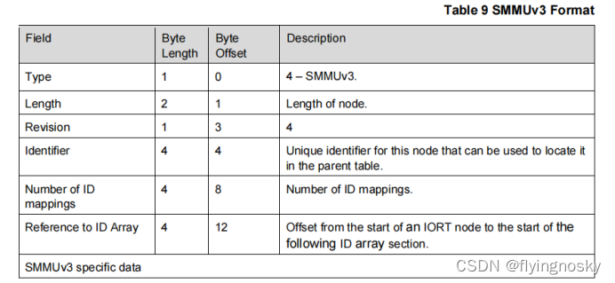
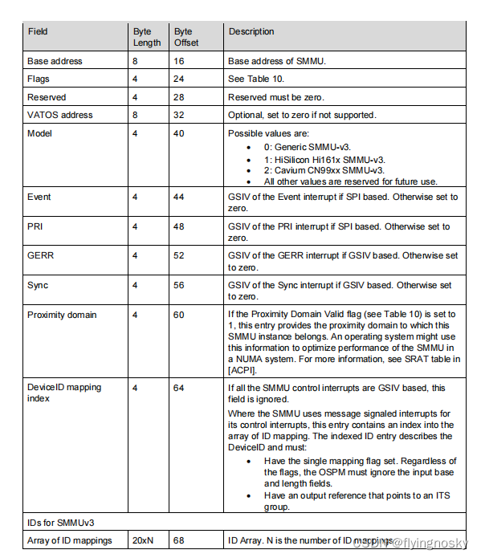
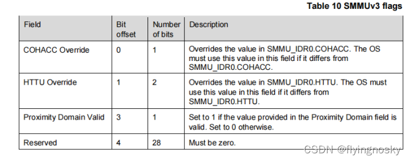
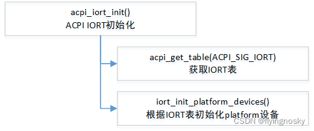
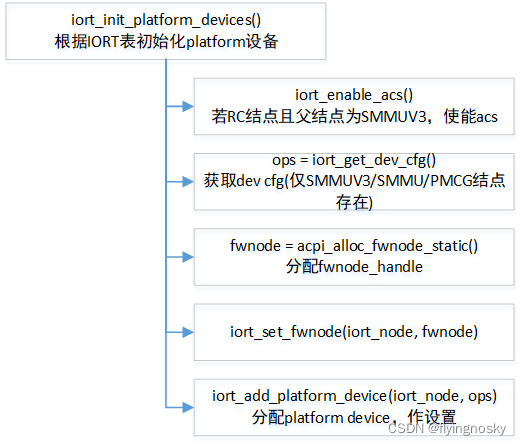
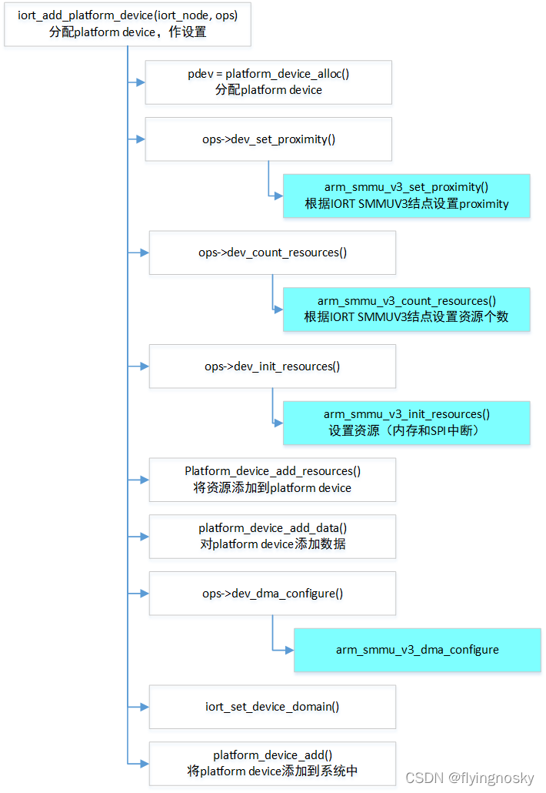

对于 SMMUV3 驱动,它以 platform device 驱动加载,而 SMMU 设备为 platform device,根据 platform 设备驱动模型,当两者匹配时,会触发 SMMUV3 驱动的 probe 函数.

本节将介绍 SMMU 如何作为 platform device 被分配以及识别.

# IORT 中 SMMUV3 结点

SMMU 设备在 IORT 表中被定义,它定义了 SMMU 设备的资源,特性以及 SPI 中断等.IORT 描述了用 ACPI 描述 IO 设备拓扑,其中 SMMUV3 结点定义如下所示:

上面表示 SMMUV3 结点格式,定义了 NODE 长度,ID 映射的数目等.SMMUV3 相关的内容如下所示:

其中:(1)Base Address 定义了 SMMU 在基地址;

(2)SMMU 相关的标志,定义如下:COHACC Override 可以覆盖掉 SMMU_IDR0.COHACC;HTTU Override 可以覆盖掉 SMMU_IDR0.HTTU;Proximity Domain Valid 设置为 1 时 Proximity Domain 有效.

(3)VATOS address: VATOS 基地址,若为 0 表示不支持;

(4)Model:目前定义的值为各厂商 workaround 用,保留部分作将来使用;

(5)Event/PRI/Gerr/Sync:分别为支持 SPI 时的 GSIV 中断号;

(6)Proximity Domain: SMMUV3 设备所在的 NUMA NODE;

(7)DeviceID Mapping index: 指向 ITS group;

# SMMU 设备的分配和识别

对于 SMMUV3 设备,在 ACPI 初始化时会遍历 IORT 结点,并将 SMMUV3 结点生成 platform 设备,对该 platform 设备作相关设置,并最终将其加入到系统中.

## 函数 acpi_iort_init()

函数 acpi_iort_init()获取 IORT 表,并根据 IORT 表初始化 SMMUV3 所对应的 platform device.

## 函数 iort_init_platform_devices()

其中函数 iort_init_platform_devices()执行如下:

1. 对每个 IORT 结点进行处理,若 IORT 结点为 RC 结点且父结点为 SMMUV3 时,使能 AC
2. 获取 dev cfg,当前仅 SMMUV3/SMMU/PMCG 结点存在设备配置,分别定义在 iort_arm_smmu_v3_cfg/iort_arm_smmu_cfg/iort_arm_pmcg_v3_cfg.
3. 分配 fwnode_handle,并设置;
4. 分配 platform device,作设置,并将加入到系统中;

## 函数 iort_add_platform_device()

对于函数 iort_add_platform_device(),作如下详细分析:

对于 SMMUV3 结点,其定义 iommu_arm_smmu_v3_cfg,其中:

(1)dev_set_proximity = arm_smmu_v3_set_proximity

根据 IORT 表 SMMUV3 结点中 proximity domain 域设置设备所对应的 node;

(2)dev_count_resources = arm_smmu_v3_count_resources

根据 IORT 表 SMMUV3 结点中的 event_gsiv/pri_gsiv/gerr_gsiv/sync_gsiv 域(SPI 中断)确定资源的数目.

(3)dev_init_resources = arm_smmu_v3_init_resources

添加 MEMORY 资源,同时根据定义 SPI 中断情况申请中断.

(4)dev_dma_configure = arm_smmu_v3_dma_configure

获取 DMA 范围和大小.

对于该函数用的其他的函数调用,为对 platform device 的操作:

(1)platform_device_alloc()分配 platform device;

(2)Platform_device_add_resources()为 platform device 增加资源(内存,以及可能 SPI 中断);

(3)Platform_device_add_data()为 platform device 添加数据;

(4)Platform_device_add()将 platform device 添加到系统中;

至此 SMMU 结点作为 platform device 被分配和识别,并添加到系统中.

https://blog.csdn.net/flyingnosky/article/details/122442735
