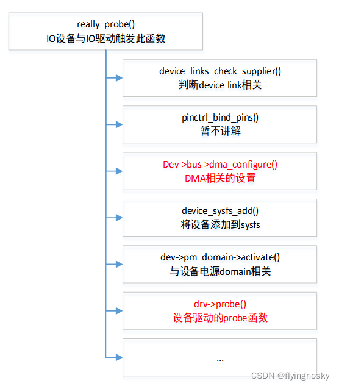
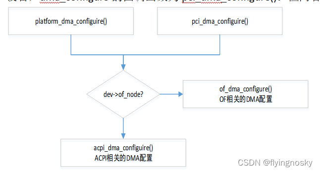
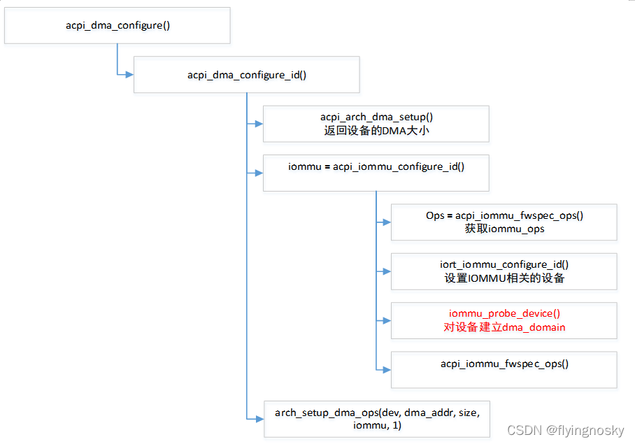
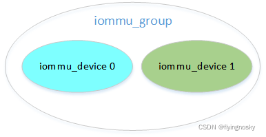
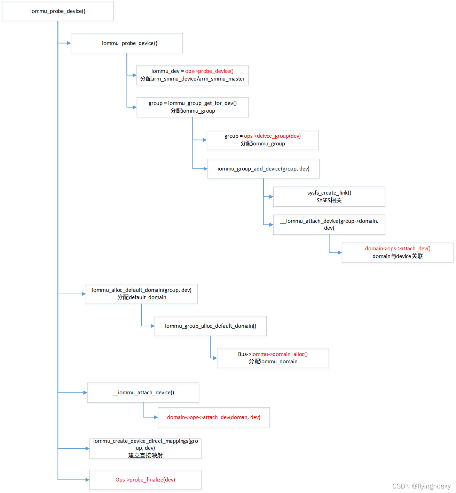
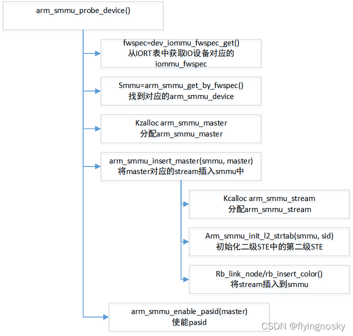
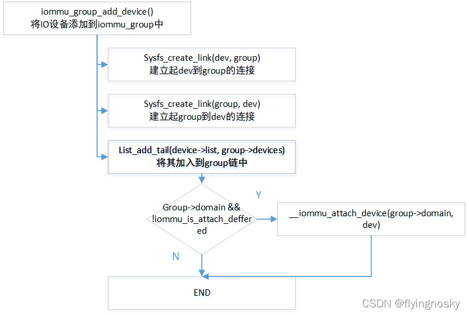
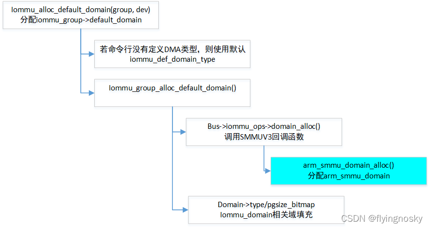
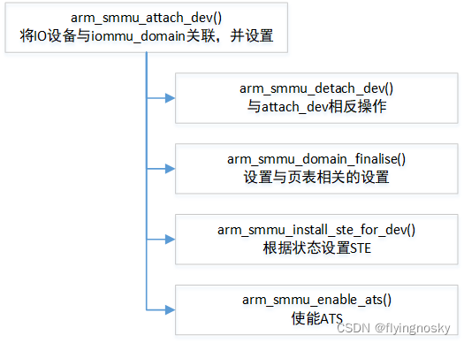
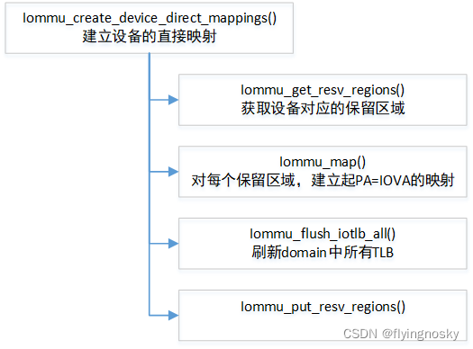

前面介绍了 SMMU 设备的生成和识别,但 IO 设备是如何与 SMMU 设备关联的呢?一个 SMMU 设备下面可能有多个 IO 设备,但每个 IO 设备只在一个 SMMU 设备下.

根据驱动设备模型,当 IO 设备与 IO 驱动匹配时,会触发 IO 驱动的 probe 函数,在其实在调用驱动 probe()之前,会调用与 IOMMU 相关的函数.其过程如下:

整个匹配的 probe 过程中执行的内容较多,这里仅介绍红色部分,即我们关心的 DMA 相关的设置和设备驱动的 probe()(对于 IO 设备来説,它为 IO 设备驱动的 probe()函数,注意并不是 SMMU 设备驱动的 probe()).

其中 dev->bus->dma_configure()则是本节的重点,它负责将 IO 设备与 SMMU 设备关联起来,可见该操作在 IO 设备的 probe()函数之前完成.

对于 platform device,dma_configure 的回调函数为 platform_dma_configure();对于 PCIE 设备,dma_configure 的回调函数为 pci_dma_configure().但两者最终都调用都一样.

暂只介绍 ACPI 方式的 DMA 配置 acpi_dma_confiugre().

这里主要作如下三个操作:

1. 函数 acpi_arch_dma_setup()返回设备支持 DMA 大小,对于 ARM64 上来説,默认为 48bit 大小;
2. 函数 acpi_iommu_configure_id()获取设备以及对应的 SMMU 相关的配置如 iommu_ops,并 probe 设备建立 dma_domain;后面重点讲解函数 iommu_probe_device();
3. 函数 arch_setup_dma_ops()主要对 dma_domain 分配并初始化 IOVA domain;

其中函数 `iommu_probe_device()` 是关联 IO 设备和 SMMU 设备的关键函数,它为 IO 设备分配 iommu_device,同时为 IO 设备分配 iommu_group,将 IO 设备对应在 iommu_device 加入到 iommu_group 中.

在介绍该函数前简单介绍下重要的结构体 iommu_ops 和几个概念.

# 1. 结构体 iommu_ops

结构体 iommu_ops 定义了底层硬件对应的回调函数,对于 SMMU 或 INTEL IOMMU 都会基于硬件定义自己的 iommu_ops. 结构体 iommu_ops 各成员函数定义和描述如下所示,这里仅作简单介绍:

<table border="1" cellspacing="0"><tbody><tr><td> 
成员函数
 </td><td> 
作用
 </td></tr><tr><td> 
capable
 </td><td> 
检查能力
 </td></tr><tr><td> 
domain_alloc
 </td><td> 
分配 iommu domain
 </td></tr><tr><td> 
domain_free
 </td><td> 
释放 iommu domain
 </td></tr><tr><td> 
attach_dev
 </td><td> 
将设备连接到 iommu domain
 </td></tr><tr><td> 
detach_dev
 </td><td> 
取消设备到 iommu domain 的连接
 </td></tr><tr><td> 
map
 </td><td> 
映射物理连续的内存区域到 iommu domain
 </td></tr><tr><td> 
map_pages
 </td><td> 
映射一组物理连续的内存区域到 iommu domain
 </td></tr><tr><td> 
unmap
 </td><td> 
取消物理连续的内存区域到 iommu domain 的映射
 </td></tr><tr><td> 
unmap_pages
 </td><td> 
取消一组物理连续的内存区域到 iommu domain 的映射
 </td></tr><tr><td> 
flush_iotlb_all
 </td><td> 
同步刷新某个 domain 的所有硬件 TLB
 </td></tr><tr><td> 
iotlb_sync_map
 </td><td> 
SMMUV3 没有定义
 </td></tr><tr><td> 
iotlb_sync
 </td><td> 
刷新某个 domain 的某个范围的 TLB
 </td></tr><tr><td> 
iova_to_phys
 </td><td> 
将 iova 转化为物理地址
 </td></tr><tr><td> 
probe_device
 </td><td> 
将设备放入到 iommu 驱动处理
 </td></tr><tr><td> 
release_device
 </td><td> 
将设备从 iommu 驱动处理中释放
 </td></tr><tr><td> 
Probe_finalize
 </td><td> 
在设备添加到 iommu group 并关联到 group domain 后的最后一步
 </td></tr><tr><td> 
Device_group
 </td><td> 
对某个设备找到或分配 iommu group
 </td></tr><tr><td> 
Enable_nesting
 </td><td> 
使能 2 个 stage
 </td></tr><tr><td> 
Set_pgtable_quirks
 </td><td> 
设置页表相关的 workaround
 </td></tr><tr><td> 
Get_resv_regions
 </td><td> 
获取一个设备保留的区域
 </td></tr><tr><td> 
Put_resv_regions
 </td><td> 
释放一个设备保留的区域
 </td></tr><tr><td> 
Apply_resv_regions
 </td><td> 
SMMUV3 没有定义
 </td></tr><tr><td> 
Of_xlate
 </td><td> 
增加 master ID 到 iommu group 转换
 </td></tr><tr><td> 
Is_attach_deferred
 </td><td> 
ARM 没有使用
 </td></tr><tr><td> 
dev_has/enable/disable_feat
 </td><td> 
检查/使能/禁用 iommu 某些特性
 </td></tr><tr><td> 
Dev_feat_enabled
 </td><td> 
判断是否使能特性
 </td></tr><tr><td> 
Aux_attach/detach_dev
 </td><td> 
Aux-domain 的链接或取消链接到设备
 </td></tr><tr><td> 
Aux_get_pasid
 </td><td> 
对给定的 aux-domain 获取 pasid
 </td></tr><tr><td> 
sva_bind
 </td><td> 
将进程地址空间绑定到设备
 </td></tr><tr><td> 
Sva_unbind
 </td><td> 
取消绑定进程地址空间到设备
 </td></tr><tr><td> 
Sva_get_pasid
 </td><td> 
获取共 SVA 相关的 PASID
 </td></tr><tr><td> 
Page_response
 </td><td> 
处理页请求回复
 </td></tr><tr><td> 
Cache_invalidate
 </td><td> 
无效化转换缓存
 </td></tr><tr><td> 
Sva_bind_gpasid
 </td><td> 
将 guest pasid 与 mm 绑定
 </td></tr><tr><td> 
sva_unbind_gpasid
 </td><td> 
将 guest pasid 与 mm 取消绑定
 </td></tr><tr><td> 
Def_domain_type
 </td><td> 
设备默认的 domain 类型(SMMUV3 没有定义)
 </td></tr><tr><td> 
Pgsize_bitmap
 </td><td> 
所有支持的页大小的 bitmap
 </td></tr></tbody></table>

# 2. IOMMU 相关的结构体关系

Iommu_device 对应一个 IO 设备(或 PCIE 概念中的 Function);

Iommu_group 为共享相同 IO 地址空间的设备的集合(可能一个或多个);

Iommu_domain 的范围和 iommu_group 一样,但它定义的是 group 范围内对应的操作的集合;

函数 Iommu_probe_device()是通过如下图所示建立起 IO 设备与 SMMU 的关联:

其中红色部分会调用 SMMUV3 驱动中定义的 iommu_ops,后面在被调用时再对涉及的回调作介绍.这里分成以下几个部分进行讲解:

# 3. 为 IO 设备分配 iommu_device

在上述函数中,通过 ops->probe_device()为 IO 设备分配对应 SMMU 的 iommu_device.对于 SMMUV3 驱动,ops->probe_device = arm_smmu_probe_device.

在 SMMUV3 驱动中先简单介绍涉及的几个结构体:

(1)结构体 arm_smmu_device 对应于 SMMU 设备;

(2)结构体 arm_smmu_master 对应于 IO 设备;

(3)结构体 arm_smmu_stream 对应于 IO 设备中的 FUNCTION(若仅一个 FUNCTION,也对应 IO 设备);

函数定义如下:

函数执行操作如下:

(1)根据 IO 设备找到所对应的 SMMU 设备(结构体 arm_smmu_device);

(2)根据 IO 设备分配所对应在结构体 arm_smmu_master;

(3)根据 IORT 表中定义的 IO 设备的 stream 情况分配 arm_smmu_stream,若支持二级 STE,对 STE 的第二级 STE 进行初始化(前面 SMMU 设备初始化已介绍),并将 arm_smmu_stream 插入到 arm_smmu_device 中;

(4)使能 PASID;

# 4. 分配 iommu_group 并添加 IO 设备

函数 iommu_group_get_for_dev()首先查找设备是否存在对应的 iommu_group,第一次时设备不存在对应的 iommu_group,调用 ops->device_group()分配或查找 iommu_group;调用函数 iommu_group_add_device()将 IO 设备添加到 iommu_group.

## 4.1. 分配 iommu_group

(1)判断当前设备是否为 PCI 设备,若为 PCI 设备,PCIE 设备存在 alias,尝试使用 alias 对应的 iommu_group;若 PCIE 设备到 root bus 之间存在没有使能 ACS 特性的设备,那么此部分为同一个 group,使用对应的 group(后续再讲解 ACS 特性);若 PCIE 设备对应的 function 存在 alias,尝试使用 alias 对应的 iommu_group;最后调用 iommu_group_alloc()分配 iommu_group,此函数生成 iommu_group,且生成 SYSFS 属性 reserved_regions 和 type.

(2)若为其他设备如 platform 设备,同样调用 iommu_group_alloc().

## 4.2. 将 IO 设备添加到 iommu_group

通过函数 iommu_group_add_device()将设备添加到 iommu_group.这里通过函数 sysfs_create_link()建立起 IO 设备的 device 与 iommu_group 的 device 相互 Link,即从 IO 设备的 device 目录可以到达 iommu_group 对应在 device 目录,也可从 iommu_group 的 device 目录到达 IO 设备的目录.

其中对于 group->domain 且!iommu_is_attach_deferred()情况,将设备与 group->domain 关联,在第一次时 group->domain 为空,这里暂且不分析.

# 5. 为 IO 设备分配 iommu_domain

对于 iommu_group,存在两个 iommu_domain: iommu_group->domain(作用?)和 iommu_group->default_domain.函数 iommu_alloc_default_domain()为 iommu_group 分配 default_domain.

(1)设置 DMA 类型.若命令行中定义 DMA 类型,使用命令行中 DMA 类型;否则使用默认类型;IOMMU_DOMAIN_DMA 表示进行 DMA 转换; IOMMU_DOMAIN_IDENTIFY 表示 PASSTHROUGH,不经过 SMMU;

(2)分配 iommu_group->default_domain,这是调用 SMMUV3 回调函数实现的;

(3)填充 iommu_domain 对应的成员域;

# 6. 将 IO 设备连接到 iommu_domain

通过函数 `__iommu_attach_device()` 将 IO 设备连接到 iommu_domain,最后调用 SMMUV3 驱动回调函数 arm_smmu_attach_dev(),它的执行流程如下:

(1)调用 arm_smmu_detach_dev(),作 attach_dev 相反的操作;

(2)调用 arm_smmu_domain_finalise()作与页表相关的设置,后面单独分析;

(3)调用 arm_smmu_install_ste_for_dev()设置 STE,后面单独介绍;

# 7. 建立直接映射

所谓直接映射为 IOVA=PA.在某些场景如驱动希望保留部分 IOVA 区域,或虚拟机中 MSI 的方案等,都会使用直接映射.调用如下:

(1)获取设备所对应的保留区域;

(2)对每个保留区域,使用 iommu_map()建立起 IOVA=PA 的映射,后面对 iommu_map()等 map/unmap API 操作讲解;

(3)刷新 domain 中所有 TLB 项;

# 8. 小结

函数 iommu_probe_device()实现 IO 设备与对应 SMMU 的关联.在此过程中为 IO 设备和 SMMU 设备分配 IOMMU 框架层和 SMMUV3 驱动对应的结构体.

<table border="1" cellspacing="0"><tbody><tr><td> 
IOMMU 框架的结构体
 </td><td> 
SMMUV3 驱动对应的结构
 </td><td> 
含义
 </td></tr><tr><td> 
Iommu_device
 </td><td> 
arm_smmu_device
 </td><td> 
SMMU 设备
 </td></tr><tr><td> 
group_device
 </td><td> 
arm_smmu_master
 </td><td> 
IO 设备
 </td></tr><tr><td> 
Iommu_group
 </td><td> 
arm_smmu_group
 </td><td> 
IO 设备所对应的 group
 </td></tr><tr><td> 
Iommu_domain
 </td><td> 
arm_smmu_domain
 </td><td> 
IO 设备所对应的 domain
 </td></tr></tbody></table>

https://blog.csdn.net/flyingnosky/article/details/122569224

https://blog.csdn.net/flyingnosky/article/details/122569919

