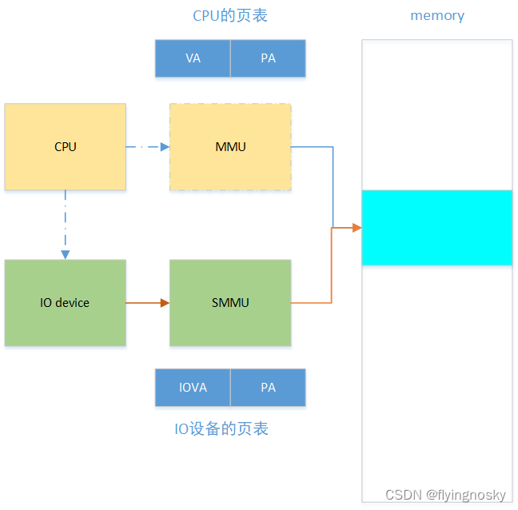

# 1. DMA MAP API 在驱动中的使用

DMA MAP 建立起物理地址 PA 和 IO 设备的虚拟地址 IOVA 之间的映射,当 IO 设备通过 SMMU 访 IOVA 实际会访问到对应的物理地址 PA.完成访问后 DMA UNMAP 取消映射.

在 IO 设备驱动中 DMA MAP/UNMAP 使用如下图所示:

数据如何在 CPU 和 IO device 之间的传递和处理?

(1)CPU 通过 MMU 建立起数据的物理地址 PA 到数据的虚拟地址之间的映射,CPU 通过访问 VA 从而访问到数据(比如 CPU 填充数据到内存中);

(2)IO 设备驱动得到数据的 PA,并通过 DMA MAP 将数据的物理地址 PA 和 IOVA 建立映射,然后 IO 设备驱动将 IOVA 传递给 SMMU 设备;

(3)SMMU 将 IOVA 转换为 PA,从而对 PA 处的数据的处理;

(4)完成数据处理后,通过 DMA UNMAP 取消 IOVA 到 PA 的映射;

# 2. DMA MAP/UNMAP API 分类

## 2.1. 一致性 DMA

之前介绍过 COHERENT 特性,对于一致性 DMA,可以保证 CPU 和 IO 设备看到的物理地址是一致,因为 CPU 侧存在 CACHE,一致性 DMA 可通过关 CACHE 或硬件来保证 CPU 和 IO 设备看到的物理地址是一致.函数 dma_alloc_coherent()为一致性 DMA.一致性 DMA 通常为静态的,建立起一致性映射后,一般在系统结束时取消映射.

## 2.2. 流式 DMA

流式 DMA 为动态的,每次都会建立映射,然后取消映射.由于 CPU 侧存在 CACHE,需要软件或硬件来维护一致性.流式 DMA 包括 dma_map_sg/dma_map_single()等.

目前很多现在 SOC 如 kunpeng920 都是硬件来保证 coherent 一致性.

## 2.3. DMA MAP API 简介

先简单介绍下面几个函数的作用,后述对每个函数的实现对较为详细的分析.

<table border="1" cellspacing="0"><tbody><tr><td> 
DMA MAP API
 </td><td> 
描述
 </td></tr><tr><td> 
dma_alloc_coherent(dev, size, dma_handle, gfp)
 </td><td> 
分配 size 大小的一致性映射,返回 IOVA 和 VA
 </td></tr><tr><td> 
dma_map_sg(d, s, n, r)
 </td><td> 
将 scatther gather 建立映射
 </td></tr><tr><td> 
dma_map_page(d, p, o, s, r)
 </td><td> 
将一个物理页建立映射
 </td></tr><tr><td> 
dma_map_single()
 </td><td> 
将一块连续物理区域建立映射
 </td></tr></tbody></table>

这些函数都会将物理区域与连续的 IOVA 建立起映射,差别在于物理区域的组织方式不一样,对于 `*_sg` 来説,是多个连续的物理区域,`*_page` 是一个物理页,`*_single` 是一块连续的物理区域,这三个函数的物理区域都是提前分配好的.但函数 dma_alloc_coherent()则是在分配物理区域的同时,建立物理区域与 IOVA 的映射,同时返回 VA.

https://blog.csdn.net/flyingnosky/article/details/122724089