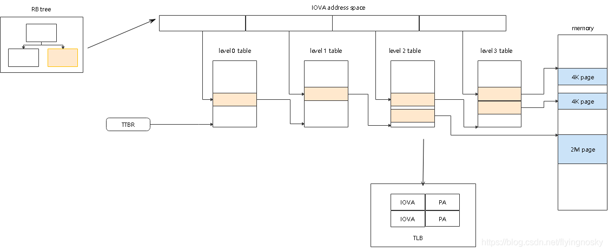
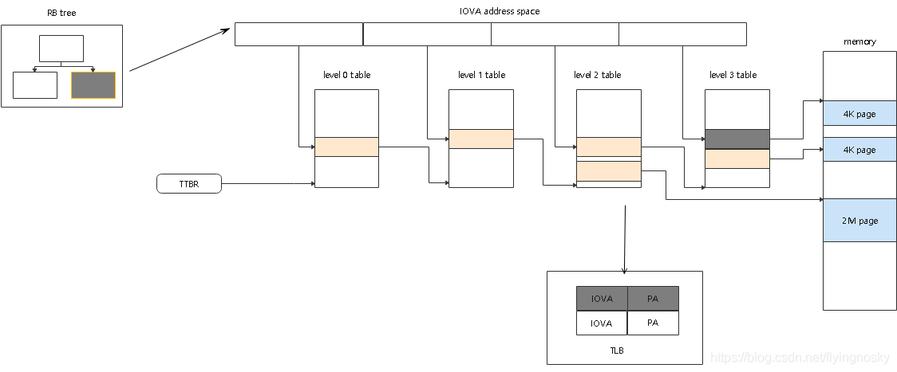

在**使能 SMMU** 情况下:

* 设备通过 SMMU 访问内存, 在访问之前, 须建立起**设备访问地址即 IOVA** 到**物理内存地址 PA** 之间的**映射**(**保存在内存中**), 此过程称为 DMA MAP 过程;

* 后续设备需要访问时, SMMU 自动将设备发送的 IOVA 转化为 PA, 当不需要再访问时, **取消之前建立的映射**, 此过程称为 DMA UNMAP 过程. 若在**没有建立映射**前对物理内存进行访问, 产生缺页中断.

# DMA MAP 过程

DMA MAP 过程基本上分为如下过程:

1. **分配**需要映射的**物理内存**;
2. 根据 **RCACE** 缓存机制**分配 IOVA**;
3. 根据 TTBR 及 IOVA, 建立页表项, 建立 IOVA 与 PA 之间的映射;
4. 默认在 **SMMU 硬件内部 TLB** 中会缓存 IOVA 到 PA 的映射, 设备访问对应 IOVA 时首先从 TLB 缓存中取, 若失败, 根据 IOVA 一级一级查找页表(内存), 若**没有找到**, 产生**缺页中断**;

对于不同的 DMA MAP 接口, 物理内存的组织方式不一样(PA 与 VA 之间映射不同), 但整体映射过程基本类似.

# DMA UNMAP 过程

DMA UNMAP 过程如下:

对于 DMA UNMAP 过程, 根据是否立即刷 TLB 和释放 IOVA, 分为 strict 模式和 non-strict 模式.

对于 **strict** 模式, DMA UNMAP 过程如下所示:

1. **销毁页表**;
2. 刷 TLB, 无效化 TLB 中缓存的映射;
3. 释放 IOVA;

对于 **non-strict** 模式, DMA UNMAP 过程如下所示:

1. 销毁页表;
2. 并不立即无效化 TLB 中缓存的映射和释放 IOVA, 在每个 CPU 上设置一个定时器, 每 10ms 发送一次 TLBI ALL 无效化所有的 TLB 缓存并释放 IOVA;

可以看出, non-strict 模式可以减少大大减少刷 TLB 时间(从当前测试测试数据来看, non-strict 模式发 TLB 的次数为 strict 模式的 1/1000), 可以提升性能, 但过时的 IOVA 和映射可能仍保留在内存中, 给系统安全性留下隐患.

https://blog.csdn.net/flyingnosky/article/details/116770780