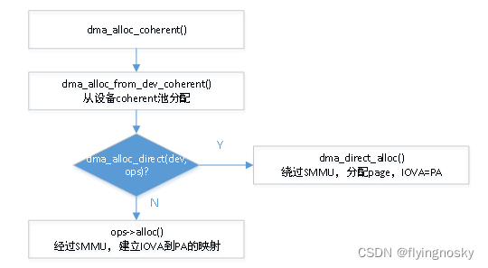
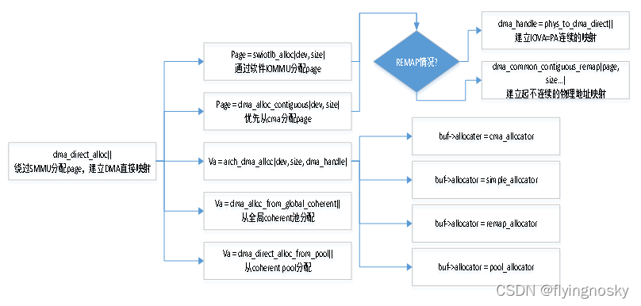
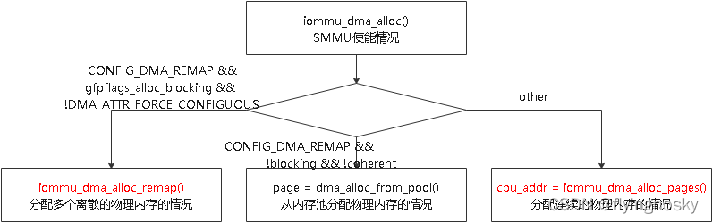
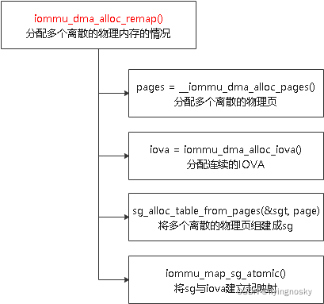
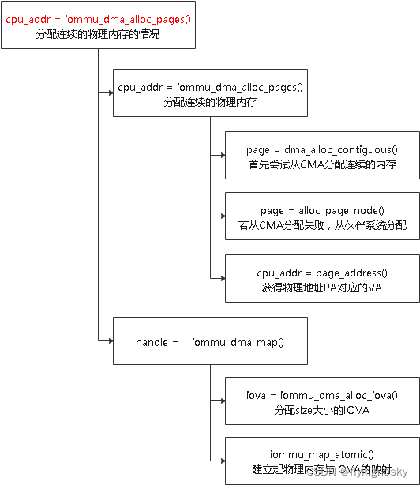
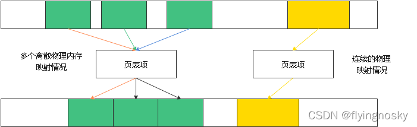

一致性映射也称为静态映射,它与 dma_map_*()相关函数另外一个差异为在调用函数 dma_map_*()之前已经提前分配好物理内存,只需要建立映射即可;但 dma_alloc_coherent()需要分配物理内存并建立映射.由于分配物理内存比较耗时,因此通常需要长期存在的一般用 dma_alloc_coherent(),对于需要不停的动态映射和取消映射,一般使用 dma_map_*().

与 dma_alloc_coherent()相对应的取消静态映射函数为 dma_free_coherent().

作用描述:分配 size 大小的一致性映射,且 dma_handle 为 IOVA 地址(IO 设备使用),返回地址为 VA(CPU 使用).

函数执行如下三个路径:

1. 从设备 coherent 池中分配 IOVA 和 PA,并建立映射;
2. 若没有定义 dma_map_ops 或 dev->dma_ops_bypass = 1,绕过 SMMU,分配 page,并建立直接映射;
3. 否则经过 SMMU,分配 page 或物理地址 PA,分配 IOVA,建立起 PA 和 IOVA 的映射;

这里暂不对设备 coherent 池分配 IOVA 和 PA 的过程作介绍,我们介绍两个常用的情况:绕过 SMMU 情况和使能 SMMU 的情况.

# DMA 直接分配的情况

当没有定义 dma_map_ops 或 dev->dma_ops_bypass=1 时,表明绕过 SMMU,而物理地址 PA 的分配根据不同的情况也分为如下几种情况:

1. 使能 SWIOTLB 即软件 IOMMU 时,分配 page, 若没有使能 REMAP 情况时,建立 IOVA=PA 的映射;否则调用 dma_common_contiguous_remap()对非连续的 page 分配连接的 VA;
2. 分配连续 page 情况,分配 page,若没有使能 REMAP 情况时,建立 IOVA=PA 的映射;否则调用 dma_common_contiguous_remap()对非连续的 page 分配连接的 VA;
3. 通过架构 DMA 分配情况,根据不同的分配器,进行不同的分配;
4. 通过函数 dma_alloc_from_global_coherent()从全局 coherent 池分配;
5. 通过函数 dma_alloc_from_pool()从 coherent pool 分配;

# 使能 SMMU 情况

对于使能 SMMU 情况时,dma_map_ops 被赋予 iommu_dma_ops,该结构体成员定义了绝大多数 DMA MAP/UNMAP API 所对应的回调.这里暂时不全部介绍,仅在使用时再介绍.

对于 dma_alloc_coherent()函数,在这种情况下最终调用 ops->alloc 即 iommu_dma_alloc().

整个过程如上所示:

(1)若在定义 CONFIG_DMA_REMAP 且允许 blocking 情况下,其实对应的是函数 iommu_dma_alloc_remap(),它可以分配多个离散的物理内存的情况,分配连续的 IOVA,将多个离散的物理内存与连续的 IOVA 建立映射;

其中 sg_alloc_table_from_pages()将多个离散的物理页组建成 sg;

(2)若在定义 CONFIG_DMA_REMAP 且不允许 blocking 及设备不 coherent 情况,其实对应的是函数 dma_alloc_from_pool(),从内存池分配物理内存的情况,这里暂不做分析;

(3)其他情况(默认情况),调用 iommu_dma_alloc_pages(),分配连续的物理内存,分配连续的 IOVA,将连续的物理内存和连续的 IOVA 建立映射;

这里分配连续物理内存方式有两种,一个是从 CMA 分配,若失败才从伙伴系统分配.

从上可知,使能 SMMU 情况基本过程为:分配物理内存(或离散或连续,对应不同的处理方式),分配连续 IOVA(在之前的章节中 IOVA 框架 中已经介绍),建立物理地址与 IOVA 之间的映射(后面章节再介绍).不要的差异在于物理内存的分配方式,如下图所示.

https://blog.csdn.net/flyingnosky/article/details/122736189

