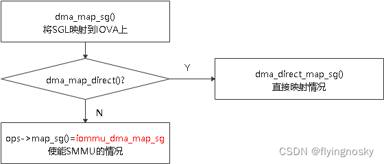
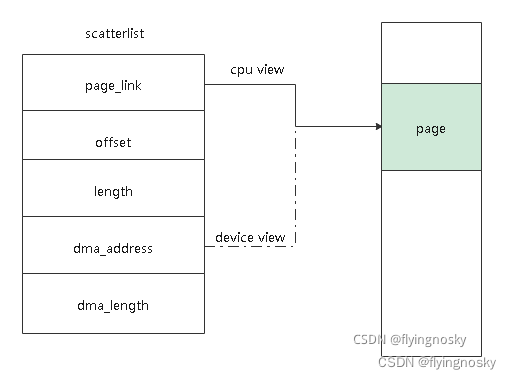
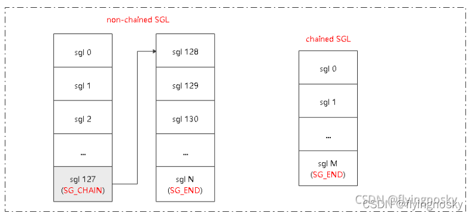
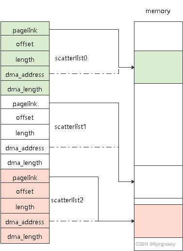
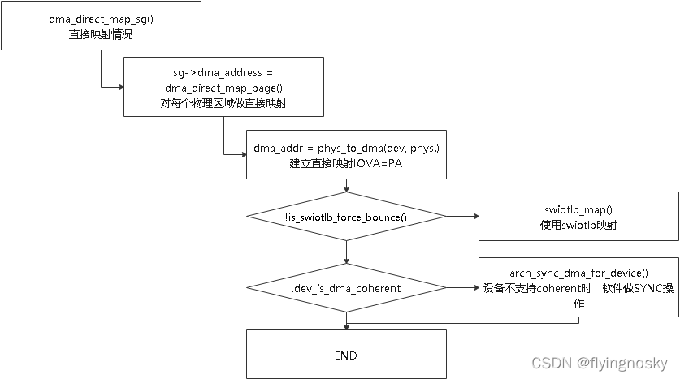
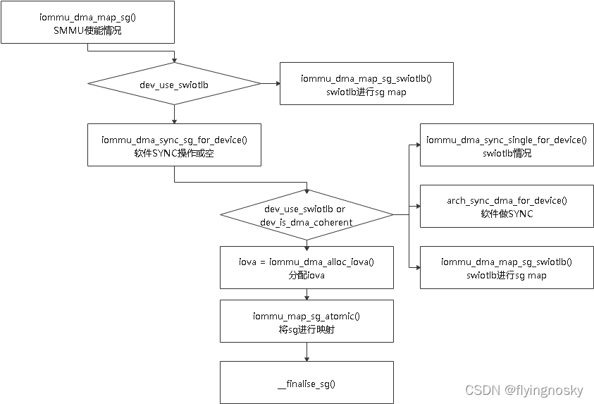
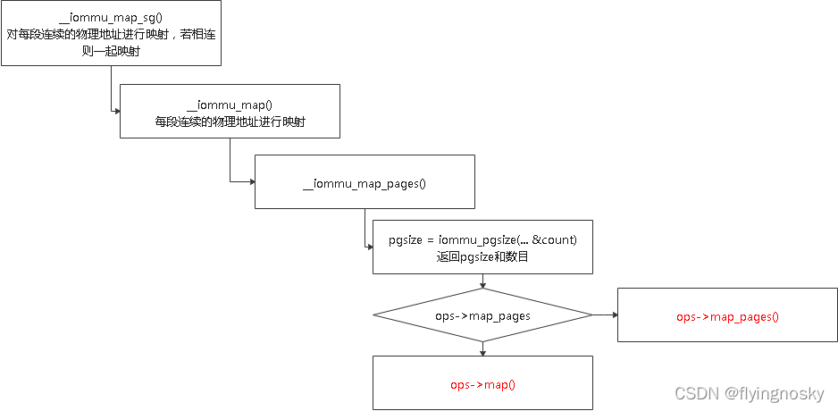

函数 dma_map_sg()为流式 DMA MAP 函数,它将包含多个物理内存区域的 SGL 映射到连续的 IOVA 上.与 dma_alloc_coherent()相比,它将要映射的物理内存已经分配好,不需要像 dma_alloc_coherent()那样在函数中分配,因此速度比 dma_alloc_coherent()快,适用于动态分配的场景;另外 dma_alloc_coherent()的设备一致性通常通过硬件保证(关 CACHE 或硬件自动回写/无效化来实现),而 dma_map_sg()的设备一致性可以通过硬件保证(硬件自动会写/无效化来实现),在设备不支持一致性时可以通过软件 SYNC 来保证(代码包含).

作用:将包含 nents 个物理内存区域的 sgl 进行映射,其中 dir 为方向.

与 dma_alloc_coherent()类似,它包含 DMA 直接映射情况和使能 SMMU 情况.

在介绍两种情况具体的实现前,对 SGL 结构体做介绍.

# SGL 聚散列表

之前在 BLOCK 层代码分析(6)IO 下发之 SGL 聚散列表中做过介绍,这里对 dma_map_sg()关心的部分再次做介绍.

结构体 scatterlist 包含从 CPU 和 IO 设备角度看到的一块连续的物理内存区域的地址和长度.其中 dma_addrss 为设备看到的虚拟地址即 IOVA,page_link 为 CPU 看到的虚拟地址即 VA,length 为数据长度,offset 为数据在页中的偏移.(当前单个 scattherlist 表示最多为一页)

而通常使用时会将多个 scatterlist 链接起来表示多个物理内存区域,分为 non-chained SGL 和 chained SGL,如下图(图中描述正好反了,暂时不改了).

这里以 non-chained SGL 来看其物理内存区域:

其实在 dma_alloc_coherent()使能 SMMU 时情况 1(定义 CONFIG_DMA_REMAP 且允许 blocking 情况)最终将分配 SGL 来讲多个物理内存区域链接,就是如上情况

# DMA 直接映射情况

linux 内存页表创建.docx

对每个 scattlerlist 所对应的区域(这里已分配物理内存)做直接映射:

1. 将物理内存区域的物理地址转化为 IOVA,其中 IOVA=PA;
2. 若强制支持 swiotlb,使用 swiotlb 进行映射;
3. 若设备不支持 coherent,软件通过 arch_sync_dma_for_device()做 SYNC 操作;

# 使能 SMMU 情况

当使能 SMMU 时,最终调用 iommu_dma_map_sg.流程如下:

操作过程如下:

1. 如果是使用 swiotlb 情况(后续专门分析该特性),使用函数 iommu_dma_map_sg_swiotlb()做映射;
2. 调用函数 iommu_dma_sync_sg_for_device()进行软件来 SYNC 操作,若硬件支持 cocherent,不做任何操作,否则调用 arch_sync_dma_for_device()进行软件 SYNC;
3. 调用函数 iommu_dma_alloc_iova()分配 IOVA;
4. 调用函数 iommu_map_sg_atomic()将 sg 进行映射,下面在进一步分析该函数;
5. 调用 __finialise_sg() 完成及调整 nents 数目;

函数 iommu_map_sg_atomic()做真正的 sg 的映射,流程如下:

它会将多个物理内存区域映射到一个连续的 IOVA 上,若多段物理内存地址相连,一起进行映射.在映射时首先通过 pgsize=iommu_pgsize(...&count)获取可以使用的页表大小以及数目,然后根据是否支持映射多页(ops->map_pages),是进行多页映射还是单页映射.

举个例子,假如 4K 系统,默认支持的页表为 4K/2M/1G 三种,当要映射 3M 大小连续物理地址,这时映射过程如下:第一次通过 iommu_pgsize()获得 pgsize=2M,count=1,传递给 ops->map_pages(假如支持)映射;第二次通过 iommu_pgsize()获得 pgsize=4K, count=256,传递给 ops->map_pages(假如支持)映射.

页表的 map 和 map_pages 操作后续专门提供章节介绍.

https://blog.csdn.net/flyingnosky/article/details/122744582