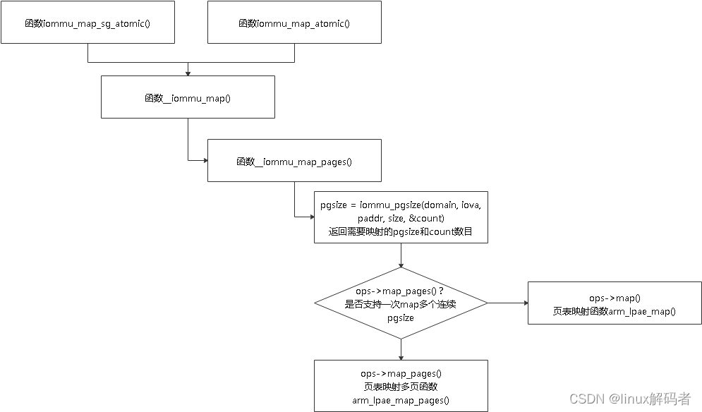
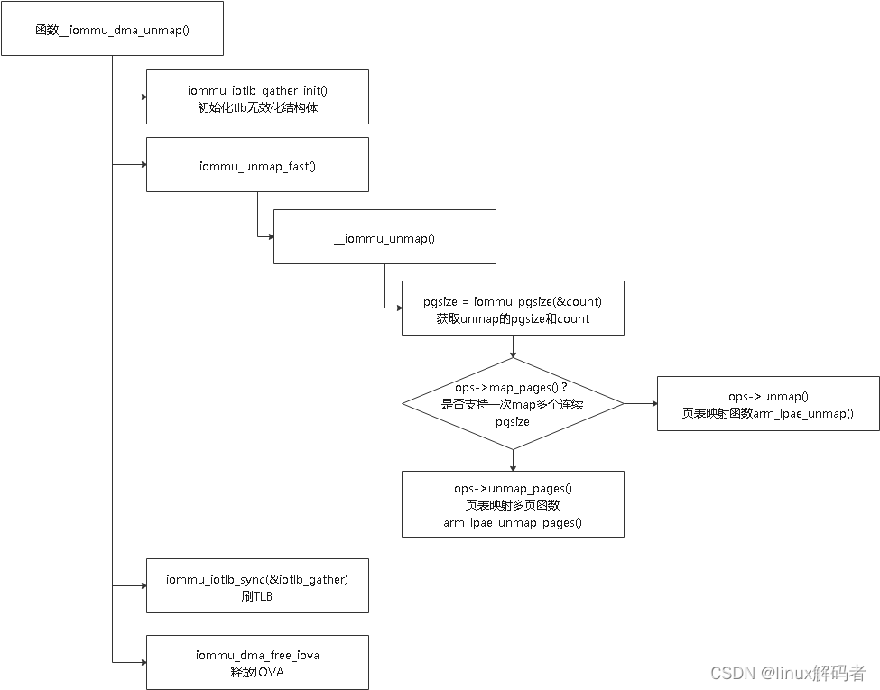
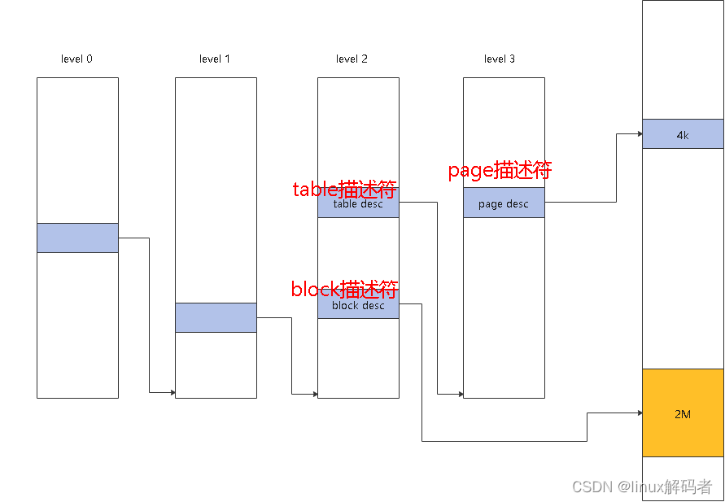
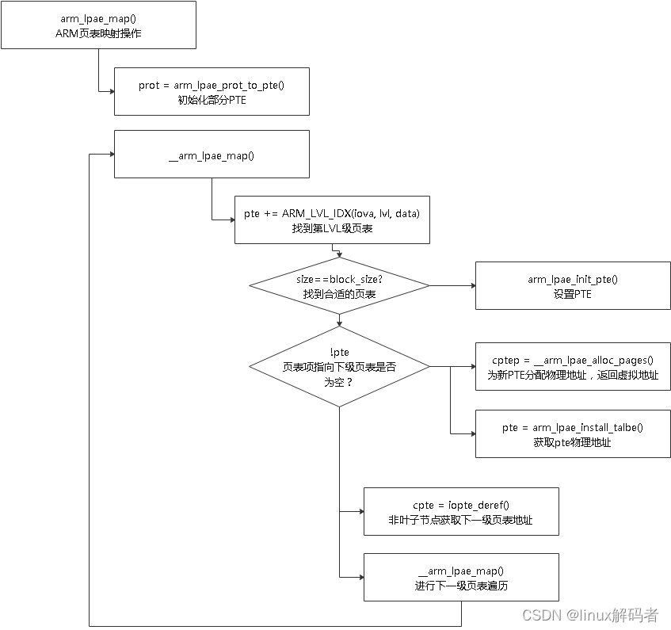
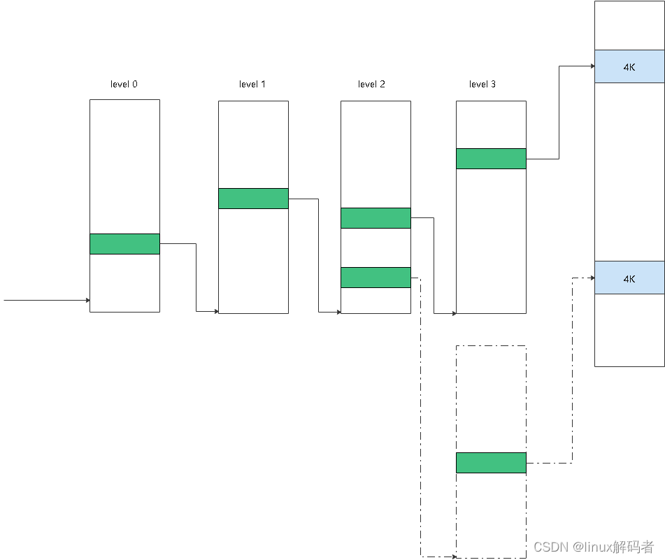
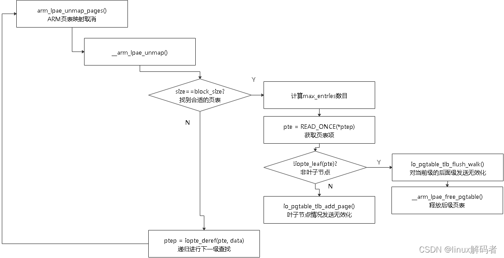
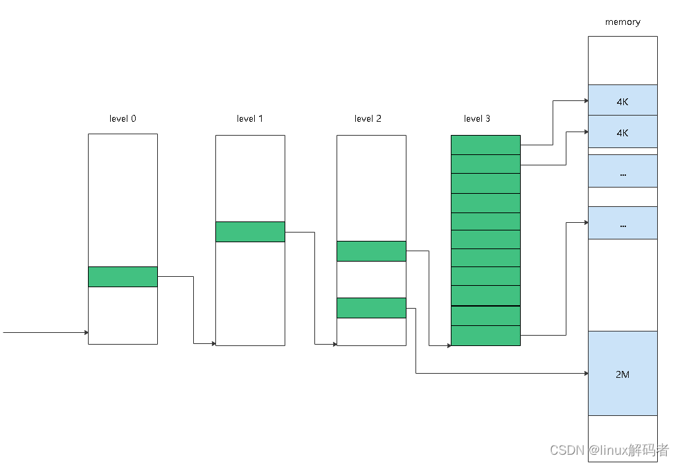
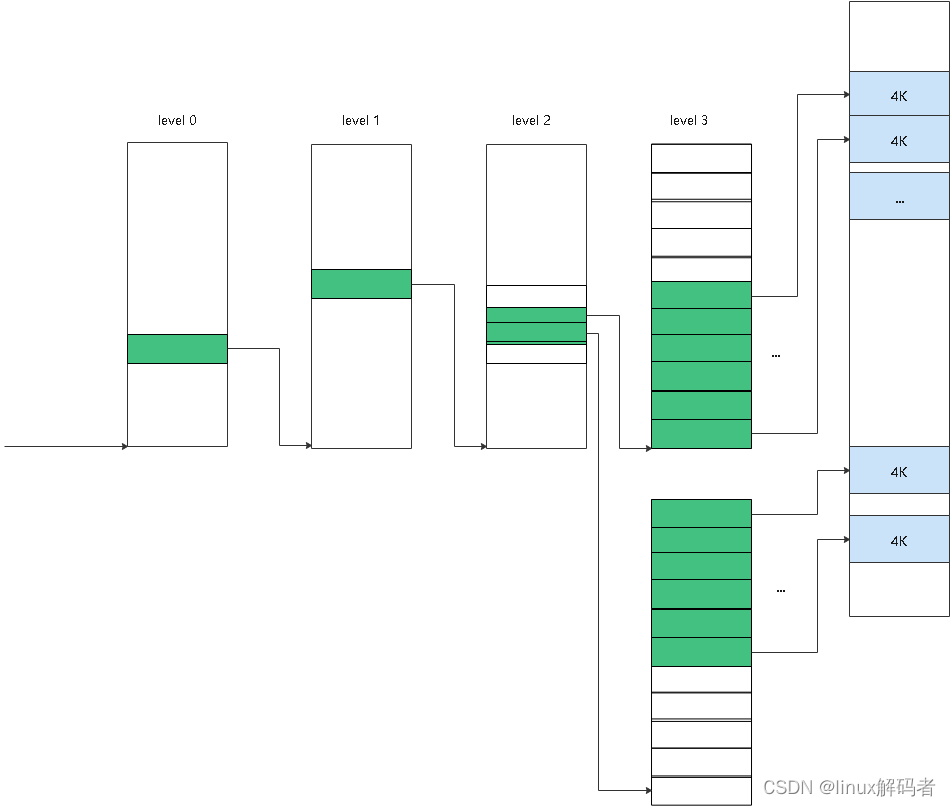

从前面 IOMMU DMA MAP/UNMAP API 调用可以知道,DMA MAP 时无论是 dma_alloc_coherent() 还是 dma_map_sg(),最终调用函数__iommu_map()函数.它会计算需要映射的 pgsize 页表大小和 count 个数.当支持 ops->map_pages 时,表示一次可映射多个连续的页,此时会调用 arm_lpae_map_pages(),SMMUv3 支持此方式.

对于 DMA UNMAP API,无论是 dma_free_coherent(),还是 dma_unmap_sg(),最终会调用函数__iommu_dma_unmap(),它首先同样也是获取 unmap 的 pgsize 页大小和 count 个数,然后根据是否支持多页 unamp,调用页表 unmap 函数,对于 SMMUv3,调用 arm_lpae_unamp_pages(),最后需要对 TLB 中的缓存进行无效化处理.

# 1. 页表的简单介绍

SMMU 的页表与 MMU 的页表两者是一样的,将在 ARMv8-A 编程指导中做详细介绍,这里仅介绍 ARM64 的几个基本概念,便于代码和映射和取消映射过程的理解.

这里以 4K 系统为例,在 4K 系统上支持的页表大小为 4K/2M/1G.其中 level3 页表项(成为 page 描述符)指向 4K 大小的内存页,level2 页表项通常指向 level3 页表项的基地址(此时页表项称为 table 描述符),但也可以直接指向 2M 大小的内存(页表项称为 block 描述符).下图对三者做简单的描述.

另外 SMMU 的页表属性与 CPU 的页表属性一样.

# 2. 页表的初始化

在 SMMU 与 IO 设备建立关联时会为每个 IO 设备建立 iommu_domain, 在最后阶段会与页表建立联系.通过函数 alloc_io_pgtable_ops()和 free_io_pgtable_ops()进行页表的分配和释放.

这里有多种页表格式,如 32 位的 LPAE,64 位的 LPAE,同时各自又分为 stage1 和 stage2 的格式.这里仅介绍 ARM_64_LPAE_S1 即 64 位的 LPAE 的 stage1 的页表操作.

页表 ARM_64_LPAE_S1 的分配函数 alloc_io_pgtable_ops()会调用回调 arm_64_lpae_alloc_pgtable_s1(),它分配用于表示页表操作的结构体 arm_lpae_io_pgtable,并填充其回调函数其中包括 map/map_pages/unmap/unmap_pages/iova_to_phys.这些回调函数做页表真正的映射和取消映射操作.后面重点介绍 map_pages 和 unmap_pages.另外就是设置页表的 TCR 和 TTBR 寄存器,并分配 PGD 页表(其他级的页表在动态添加和释放).

页表 ARM_64_LPAE_S1 的释放函数 free_io_pgtable_ops()会调用__arm_lpae_free_pgtable()逐级递归释放页表,并刷 TLB.

# 3. 页表的操作

## 3.1. 页表的映射过程

页表的映射首先通过函数 arm_lpae_prot_to_pte() 进行页表属性的转换和设置,然后通过函数 __arm_lpae_map() 递归进行每一级的查找,并将最终将物理地址填到最终找到的页表项中,即建立页表项并指向对应的物理内存.

这里有两种情况:

1. 在进行下级页表项查找时,下一级页表中还没有建立过映射,即当前页表项指向 NULL,此时需要分配下一级页表项,并将当前页表项指向分配的下一级页表项,进行下一级查找;
2. 在进行夏季页表项查找时,若下一级页表项已经存在,这时在下一级页表项中找到对应的页表项,进行下一级查找;

这里以下图例子来说明这两种情况:

分别建立两个 4K 页的映射,上面的情况是在 level2 时可以找到下一级页表(之前应该有其他映射建立),此时找到 level3 中对应的页表项,建立起映射即可;

下面的情况是 level2 指向的 level3 页表还没有建立,此时需要分配物理内存建立页表,并将 level2 的页表项指向 level3 的页表.

## 3.2. 页表的取消映射过程

页表的取消映射过程通过函数 arm_lpae_unmap_pages()实现,它需要找到对应的页表项,清除页表,并进行 TLB 无效化.

当前级的 block 大小与需要 unmap 的页大小相等时,表明找到对应需要映射的位置,但这里也有几种情况:

1. 当前页表项为非叶子节点,这种情况表示下一级全部属于当前映射,这时需要无效化下一级页表,并释放物理页;
2. 当前页表项为叶子节点,这种情况即 block/page 页表情况,这时无效化叶子节点页表项即可;

这里以下图来说明这两种情况:

如上图,需要 unmap 的大小为 2M 大小,因此该大小与 level2 的 block 相等,此时找到 level2 对应的页表项,在上面的情况中,页表项为非叶子节点,此时指向的下一级页表为需要取消的映射范围,这时需要对下一级页表所有的页表项清除,并进行 TLB 无效化.在下面一种情况时,页表项为叶子节点,直接指向一块 2M 大小的物理内存,此时对当前页表项清除,并进行 TLB 无效化即可.

实际上还有一种情况:虽然需要 unmap 的页大小与当前级的 block 大小相等,但是需要 unmap 的大小需要横跨两个页表,此时需要分别对两部分进行 unmap.

这里仍以图来说明:

本例中需要 unmap 的大小仍为 2M,但是并不是在 level2 中的一个页表项来表示,而是横跨两个页表项,且各占 1M,这时在 level3 上有两个页表与之对应,这时是先处理第一个页表的部分,在处理第二个页表的部分.

https://blog.csdn.net/flyingnosky/article/details/122951474