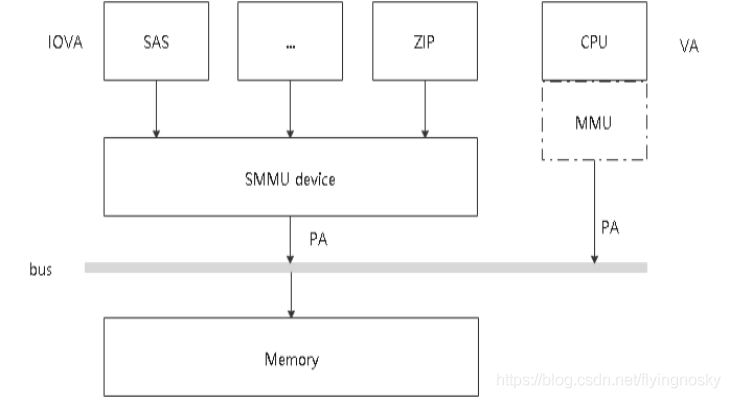
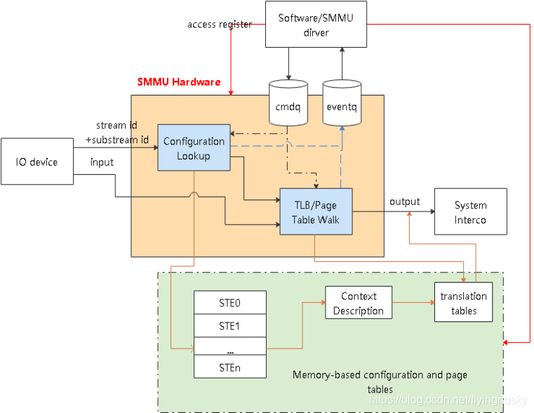

# SMMU 在系统中位置和作用

SMMU 功能与 MMU 功能类似,将 IO 设备的 DMA 地址请求(IOVA)转化为系统总线地址(PA),实现地址映射,属性转换,权限检查等功能,实现不同设备的 DMA 地址空间隔离.

# SMMU 软硬件交互过程

硬件结构如下图所示:

SMMU 处于 IO 设备和总线之间,负责将设备的输入 IOVA 转化为系统总线的物理地址 PA; SMMU 硬件包含 configuration lookup/TLB/Page Table Walk 以及 cmdq/eventq 等部分,其中 configuration lookup 部分查找 stream id 所对应的配置(ste/cd), 最终指向 page table 基地址等;

SMMU 通过 configuration lookup 找到设备的配置及页表基地址等,然后查询 TLB 中是否存在输入地址 input 的映射,如果 TLB 命中,直接返回输出 PA;若 TLB 没有命中,PTW 模块逐级查询页表,找到页表中的映射,输出 PA;

软件/SMMU 驱动通过 CMDQ/EVENTQ 进行交互,驱动通过 CMDQ 发送命令给 SMMU 硬件(如 TLBI/SYNC 等); SMMU 硬件通过 EVENTQ 通知驱动有事件需要处理(如设备缺页等) 软件/驱动建立和维护内存中的配置和页表;

https://blog.csdn.net/flyingnosky/article/details/119390849
