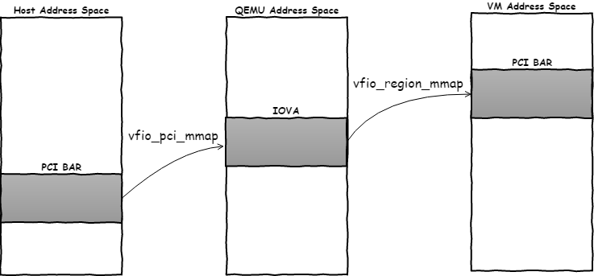

<!-- @import "[TOC]" {cmd="toc" depthFrom=1 depthTo=6 orderedList=false} -->

<!-- code_chunk_output -->

- [VFIO 中实现对直通设备的地址空间访问](#vfio-中实现对直通设备的地址空间访问)
  - [PCI Config Space 模拟](#pci-config-space-模拟)
  - [BAR 空间映射](#bar-空间映射)
- [VFIO 中如何实现 MSI/MSI-X, Interrupt Remapping, 以及 Posted Interrupt 的支持?](#vfio-中如何实现-msimsi-x-interrupt-remapping-以及-posted-interrupt-的支持)
- [irqfd 和 ioeventfd](#irqfd-和-ioeventfd)
- [VFIO 中是如何建立 DMA Remapping 映射关系?](#vfio-中是如何建立-dma-remapping-映射关系)
- [VFIO 中又是如何支持设备热插拔的?](#vfio-中又是如何支持设备热插拔的)
- [reference](#reference)

<!-- /code_chunk_output -->

前面我们对 VFIO 框架原理进行了简要的介绍, 本文则主要探讨一下 VFIO 实现中的几个技术关键点, 主要包括:

1. VFIO 中如何实现对直通设备的各种空间访问的? (PCI 配置空间和 PCI BAR 空间(PCIe 内部空间, 也称地址空间), 通过 I/O Port, MMIO 方式访问)
2. VFIO 中如何实现 MSI/MSI-X, Interrupt Remapping, 以及 Posted Interrupt 的支持?
3. VFIO 中是如何实现 DMA Remapping 的?
4. VFIO 中是如何支持设备热插拔的?

# VFIO 中实现对直通设备的地址空间访问

PCI 配置空间 和 PCI 内部空间(BAR)

CPU 只能直接访问 内存(Memory)地址空间或者 IO 地址空间, 所以 PCI 的两种配置空间都是要 map 到 内存地址空间或者 IO 地址空间的.

CPU 指定内存地址 或 Port, RC 来办事

* 访问 PCI 配置空间的某个位置: BDF + 配置空间偏移, ID 路由

* 访问 BAR: PCIe 设备内部空间在内存中的映射地址, 地址路由

## PCI Config Space 模拟

直通设备的**配置空间**并不是直接呈现给虚拟机的, VFIO 中会对设备的 PCI 配置空间进行模拟. 为什么 VFIO 不直接把直通 PCI 配置空间呈现给虚拟机呢?

* 主要原因是一部分 PCI Capability **不能直接**对 guest **呈现**, VFIO 需要**截获**部分 guest 驱动对某些 **PCI 配置空间**的**操作**,
* 另外像 **MSI/MSIx** 等特性需要 QEMU/KVM 的**特殊处理**, 所以也不能直接呈现给虚拟机.

**PCI 配置空间**是用来报告设备 I/O 信息的区域, 可以通过 **PIO** 或者 **MMIO** 方式进行访问. 设备直通场景的配置空间是由 **VFIO 内核模块配合 qemu** 进行模拟的.

在 VFIO 内核模块中 `vfio_config_init`(`drivers/vfio/pci/vfio_pci_config.c`, `open_device vfio_device_ops` 会调用) 函数中会为 **PCI 设备初始化**模拟的 **PCI 配置空间**.

```cpp
int vfio_config_init(struct vfio_pci_device *vdev)
{
    ......
    map = kmalloc(pdev->cfg_size, GFP_KERNEL);
    if (!map)
        return -ENOMEM;

    vconfig = kmalloc(pdev->cfg_size, GFP_KERNEL);
    if (!vconfig) {
        kfree(map);
        return -ENOMEM;
    }

    vdev->pci_config_map = map;
    vdev->vconfig = vconfig;

    memset(map, PCI_CAP_ID_BASIC, PCI_STD_HEADER_SIZEOF);
    memset(map + PCI_STD_HEADER_SIZEOF, PCI_CAP_ID_INVALID,
           pdev->cfg_size - PCI_STD_HEADER_SIZEOF);
    ......
    ret = vfio_cap_init(vdev);   /* 初始化 PCI Capability, 主要用来填充模拟的 vconfig */
    if (ret)
    	goto out;
    ret = vfio_ecap_init(vdev);  /* 初始化 PCI Extended Capability, 主要用来填充模拟的 vconfig */
    ......
```

对于**每个设备**而言, VFIO 内核模块为其分配了一个 `pci_config_map` 结构, **每个 PCI Capability** 都有一个与之对应的 `perm_bits`(`drivers/vfio/pci/vfio_pci_core.c`), 我们可以**重写其 hook 函数**来截获对这个 Capability 的访问 (读/写).

`vfio_pci_init_perm_bits` 函数中就已经对不同的 PCI Capability 访问权限做了设置, 例如 Power Management 这类 Capability 就做了特殊的权限控制.

```cpp
int __init vfio_pci_init_perm_bits(void)
{
    int ret;

    /* Basic config space */
    ret = init_pci_cap_basic_perm(&cap_perms[PCI_CAP_ID_BASIC]);

    /* Capabilities */
    ret |= init_pci_cap_pm_perm(&cap_perms[PCI_CAP_ID_PM]);         /* Power Management */
    ret |= init_pci_cap_vpd_perm(&cap_perms[PCI_CAP_ID_VPD]);       /* Vital Product Data */
    ret |= init_pci_cap_pcix_perm(&cap_perms[PCI_CAP_ID_PCIX]);     /* PCIX */
    cap_perms[PCI_CAP_ID_VNDR].writefn = vfio_raw_config_write;
    ret |= init_pci_cap_exp_perm(&cap_perms[PCI_CAP_ID_EXP]);       /* PCI Express */
    ret |= init_pci_cap_af_perm(&cap_perms[PCI_CAP_ID_AF]);         /* AF FLR: Advanced Feature Capability */

    /* Extended capabilities */
    ret |= init_pci_ext_cap_err_perm(&ecap_perms[PCI_EXT_CAP_ID_ERR]);
    ret |= init_pci_ext_cap_pwr_perm(&ecap_perms[PCI_EXT_CAP_ID_PWR]);
    ecap_perms[PCI_EXT_CAP_ID_VNDR].writefn = vfio_raw_config_write;

    if (ret)
        vfio_pci_uninit_perm_bits();

    return ret;
}
```

QEMU 的 `vfio_realize` 函数中, **QEMU** 会读取**物理设备的 PCI 配置空间**以此为基础然后对配置空间做些**改动**然后**呈现**给虚拟机.

> 内核态 vfio_pci 初始化了 PCI 配置空间和内部空间, QEMU 调用 vfio 接口, 进而调用 vfio_pci 获取到信息, 然后修改定制

```cpp
    /* Get a copy of config space */  // 读取设备的原始 PCI Config Space 信息
    ret = pread (vdev->vbasedev.fd, vdev->pdev.config,
                MIN (pci_config_size (&vdev->pdev), vdev->config_size),
                vdev->config_offset);   // 调用 vfio-pci 内核中的 vfio_pci_read 实现
    ......
    /* vfio emulates a lot for us, but some bits need extra love */
    vdev->emulated_config_bits = g_malloc0 (vdev->config_size);
    // 我们可以选择性的 Enable/Disable 一些 Capability
    /* QEMU can choose to expose the ROM or not */
    memset (vdev->emulated_config_bits + PCI_ROM_ADDRESS, 0xff, 4);
    /* QEMU can also add or extend BARs */
    memset (vdev->emulated_config_bits + PCI_BASE_ADDRESS_0, 0xff, 6 * 4);
    // 调用 vfio_add_emulated_word 修改模拟的 PCI 配置空间信息
    vfio_add_emulated_word(...);
    /*
     * Clear host resource mapping info.  If we choose not to register a
     * BAR, such as might be the case with the option ROM, we can get
     * confusing, unwritable, residual addresses from the host here.
     */
    memset (&vdev->pdev.config [PCI_BASE_ADDRESS_0], 0, 24);
    memset (&vdev->pdev.config [PCI_ROM_ADDRESS], 0, 4);
    vfio_bars_prepare (vdev);    // 重点分析
    vfio_bars_register (vdev);   // 重点分析
    vfio_add_capabilities (vdev, errp);
```

通常 `MSI/MSIX` 等信息都需要**被 QEMU 修改**, 因为这些都是 QEMU 使用 VFIO 去模拟的.

## BAR 空间映射

> legacy endpoint 既支持 Memory Map, 还支持 IO Map

PCI 设备的**I/O 地址空间**是通过**PCI BAR 空间**报告给操作系统的. 在**设备直通**的场景下 guest OS 到底该如何访问设备 I/O 空间? 有两种方法可选:

方法 A: **直接呈现**, 将设备在主机上的 PCI BAR 呈现给 guest, 并通过 VMCS 的 **I/O bitmap** 和 **EPT 页表**使 guest 访问设备的 `PIO` 和 `MMIO` 都**不引起 VM-Exit**, 这样 guest 驱动程序可以**直接访问**设备的 I/O 地址空间.

方法 B: 建立**转换表**, 呈现虚拟的 PCI BAR 给 guest, 当 guest 访问到虚拟机的 I/O 地址空间时 **VMM 截获操作**并通过转换表将 I/O 请求**转发到设备在主机上的 I/O 地址空间**上.

方法 A 看起来很高效, 因为直接呈现的方式下不引入 `VM-Exit`, 但实际上是有问题的! 原因是: 设备的 **PCI BAR** 空间在 host 上是由 host 的 **BIOS 分配**并**由 host 操作系统直接使用**的, guest 的 PCI BAR 空间是由 guest 的虚拟 BIOS (例如 Seabios) 配置的, 那么问题来了, 到底该由谁来配置设备的 PCI BAR 空间呢? 肯定不能两个都生效否则就打架了! 我们应该**阻止 guest 来修改真实设备的 PCI BAR 地址**以防止造成 host 上 PCI 设备的 BAR 空间冲突导致可能出现的严重后果.

所以我们要选择方案 B, 建立转换表, 明白这一点很重要!

* 对于**直通设备**的 **PIO** 访问而言, 通过设置 VMCS 的 **I/O bitmap** 控制 guest 访问退出到 VMM 中然后通过**转换表** (模拟的方式) 将 PIO 操作转发到真实物理设备上.
* 对于 **MMIO** 的访问, 可以通过 **EPT** 方式将虚拟的 MMIO 地址空间**映射**到物理设备的 MMIO 地址空间上, 这样 guest 访问 MMIO 时并**不需要 VM-Exit**.

我们知道 PCI 直通设备的 PIO 和 MMIO 访问方式是通过 BAR 空间给 guest 操作系统报告的(BIOS 分配的, 操作系统只是使用). 比如下面这个, BAR0 起始地址为 9b000000, 大小 16M, non-prefetchable 表明一般为设备 Register 区域; BAR5 地址是 3000, 大小 128 字节, 为设备的 PIO 区域.

```
# lspci -vvvs 01:00.0
......
        IOMMU group: 1
        Region 0: Memory at 9b000000 (32-bit, non-prefetchable) [size=16M]
        Region 1: Memory at 90000000 (64-bit, prefetchable) [size=128M]
        Region 3: Memory at 98000000 (64-bit, prefetchable) [size=32M]
        Region 5: I/O ports at 3000 [size=128]
......
```


从代码上对 VFIO 的 BAR 空间分析. **QEMU** 在初始化过程中, `vfio_realize` 函数中会对直通设备的 MMIO 空间进行映射, 大致包含以下几个步骤:

* 调用 `vfio_populate_device -> vfio_get_region_info` 从 VFIO 中**查询**出设备在 host 上呈现的 **BAR 空间信息**
* 调用 `vfio_region_mmap` 把设备的 BAR 空间重映射 (mmap) 到 **QEMU 进程的虚拟地址空间**, 这样 KVM 就会为 MMIO 建立**EPT 页表**, 虚拟机后续访问 BAR 空间就可以不用发生 VM-Exit 如此一来就变得很高效.
* 将该段虚拟机地址空间标记为 RAM 类型注册给虚拟机. 调用 `pci_register_bar` 来注册 BAR 空间信息, type 这里可以 PIO 或者 MMIO

查询: 通过调用设备 fd 上的 ioctl 传入 VFIO_DEVICE_GET_REGION_INFO 命令, 通过这个调用可以查询到对应 BAR 空间的 size 和 offset 信息.

`if (ioctl(vbasedev->fd, VFIO_DEVICE_GET_REGION_INFO, *info))`

PCI BAR 空间重映射: 在 vfio_region_mmap 函数中, 我们摘取最关键部分进行简单分析.  VFIO 内核中提供了一个名为 vfio_pci_mmap 的函数, 该函数中调用了 remap_pfn_range, 将物理设备的 PCI BAR 重新映射到了进程的虚拟地址空间.  这样进程中, 对该区域进行 mmap 后, 拿到虚拟地址后就可以直接通过读写该段地址来访问物理设备的 BAR 空间.  在该函数中, 将该段重映射虚拟地址空间作为 RAM Device 分配给 guest, 在 memory_region_init_ram_device_ptr 函数中会将该段内容标志为 RAM,  如此一来 KVM 会调用 kvm_set_user_memory_region 为该段内存区域建立 GPA 到 HPA 的 EPT 映射关系, 这样一来 Guest 内部通过 MMIO 访问设备 BAR 空间就不用发生 VM-Exit.  当 QEMU 讲该段虚拟地址空间分配给 guest 后, seabios 初始化时枚举 PCI 设备的时候, 会将该段内存区域映射到 guest 的物理地址空间, guest 驱动再将该段区域映射到 guest 内核虚拟地址空间通过访问该段区域来驱动设备.

```cpp
int vfio_region_mmap(VFIORegion *region)
{
    ......
    for (i = 0; i < region->nr_mmaps; i++) {
        /* 将物理设备的 PCI BAR 空间 mmap 到进程的虚拟地址空间内
         * region->vbasedev->fd 为设备的 fd
         */
        region->mmaps[i].mmap = mmap(NULL, region->mmaps[i].size, prot,
                                     MAP_SHARED, region->vbasedev->fd,
                                     region->fd_offset +
                                     region->mmaps[i].offset);
        ......
        name = g_strdup_printf("%s mmaps[%d]",
                               memory_region_name(region->mem), i);
        memory_region_init_ram_device_ptr(&region->mmaps[i].mem,
                                          memory_region_owner(region->mem),
                                          name, region->mmaps[i].size,
                                          region->mmaps[i].mmap);
        g_free(name);
        memory_region_add_subregion(region->mem, region->mmaps[i].offset,
                                    &region->mmaps[i].mem);
        ......
    }

    return 0;
}
```


映射以后, guest 访问 MMIO 地址空间时直接通过 EPT 翻译到 HPA 不需要 VM-Exit. 我们分析下具体流程:

```cpp
vfio_realize
    |-> vfio_populate_device
            |-> vfio_region_setup
                    |-> vfio_get_region_info   //call ioct VFIO_DEVICE_GET_REGION_INFO
                    |-> memory_region_init_io  //init region->mem MR as I/O
    |-> vfio_bars_prepare -> vfio_bar_prepare  //probe info of each pci bar from PCI cfg space
    |-> vfio_bars_register -> vfio_bar_register
            |-> memory_region_init_io //int bar->mr
            |-> memory_region_add_subregion //add bar->mr into region->mem MR
            |-> vfio_region_mmap
                |-> mmap //map device bar space into QEMU process address space -> iova
                |-> memory_region_init_ram_device_ptr //register iova into VM  physical AS
                |-> memory_region_add_subregion //add region->mmaps [i]. mem into region->mem MR
            |-> pci_register_bar
```

为了方便理解这个过程, 我画了一张示意图:



QEMU 首先调用 vfio_region_mmap, 通过 mmap region->vbasedev->fd 把设备 MMIO 映射到 QEMU 进程的虚拟地址空间, 这实际上通过调用 vfio-pci 内核驱动 vfio_pci_mmap -> remap_pfn_range, remap_pfn_range 是内核提供的 API, 可以将一段连续的物理地址空间映射到进程的虚拟地址空间, 这里用它将设备的 BAR 空间的 MMIO 先映射到 QEMU 进程的虚拟地址空间再注册给虚拟机.

```cpp
static int vfio_pci_mmap (void *device_data, struct vm_area_struct *vma)
{
    req_len = vma->vm_end - vma->vm_start;     // MMIO size
    vma->vm_pgoff = (pci_resource_start (pdev, index) >> PAGE_SHIFT) + pgoff;  // MMIO page address
    return remap_pfn_range (vma, vma->vm_start, vma->vm_pgoff,
            req_len, vma->vm_page_prot);

}
```

再来看下 QEMU 是如何注册这段虚拟地址 (IOVA) 到虚拟机的.

vfio_region_mmap 调用 memory_region_init_ram_device_ptr 把前面 mmap 过来的 这段 IOVA 作为 RAM 类型设备注册给虚拟机.

```cpp
int vfio_region_mmap (VFIORegion *region)
{
    name = g_strdup_printf ("% s mmaps [% d]",
                               memory_region_name (region->mem), i);
    memory_region_init_ram_device_ptr (&region->mmaps [i]. mem,
                                        memory_region_owner (region->mem),
                                        name, region->mmaps [i]. size,
                                        region->mmaps [i]. mmap);
    memory_region_add_subregion (region->mem, region->mmaps [i]. offset,
                                &region->mmaps [i]. mem);
}
```

memory_region_init_ram_device_ptr 中会标志 mr->ram = true, 那么 QEMU 就会通过 kvm_set_phys_mem 注册这段内存给虚拟机 (是 RAM 类型才会建立 EPT 映射关系), 这样 KVM 就会为这段地址空间建立 EPT 页表, 虚拟机访问设备的 MMIO 空间时通过 EPT 页表翻直接访问不需要 VM-Exit. 例如, 网卡的收发包场景, 虚拟机可以直接操作真实网卡的相关寄存器 (MMIO 映射) 而没有陷入先出开销, 大幅度提升了虚拟化场景下的 I/O 性能.

```cpp
static void kvm_set_phys_mem (KVMMemoryListener *kml,
                             MemoryRegionSection *section, bool add)
{
    if (! memory_region_is_ram (mr)) {  //mr->ram = true 会注册到 KVM
        if (writeable || !kvm_readonly_mem_allowed) {
            return;
        } else if (! mr->romd_mode) {
            /* If the memory device is not in romd_mode, then we actually want
             * to remove the kvm memory slot so all accesses will trap. */
            add = false;
        }
    }

    ram = memory_region_get_ram_ptr (mr) +   section->offset_within_region +
          (start_addr - section->offset_within_address_space);
    kvm_set_user_memory_region  // 作为 RAM 设备注册到 KVM 中
}
```

# VFIO 中如何实现 MSI/MSI-X, Interrupt Remapping, 以及 Posted Interrupt 的支持?

对于 VFIO 设备直通而言, 设备中断的处理方式共有 4 种:

* INTx 最传统的 PCI 设备引脚 Pin 方式
* MSI/MSI-X 方式
* Interrupt Remapping 方式
* VT-d Posted Interrupt 方式

那么它们分别是如何设计实现的呢? 这里我们来重点探索一下 MSI/MSI-X 的实现方式以及 VT-d Posted Interrupt 方式. 如果忘了 MSI 和 MSI-X 的知识点可以看下 < PCI Local Bus Specification Revision 3.0 > 的 Chapter 6 有比较详细的介绍.

先看下 QEMU 这边中断初始化和中断使能相关的函数调用关系图:

```cpp
vfio_realize
    |-> vfio_get_device       //get device info: num_irqs, num_regions, flags
    |-> vfio_msix_early_setup //get MSI-X info: table_bar, table_offset, pba_ -> pci_device_route_intx_to_irqbar, pba_offset, entries
        |-> vfio_pci_fixup_msix_region
        |-> vfio_pci_relocate_msix
    |-> vfio_add_capabilities
            |-> vfio_add_std_cap
                |-> vfio_msi_setup  -> msi_init
                |-> vfio_msix_setup -> msix_init
    |-> vfio_intx_enable    //enable intx
        |-> pci_device_route_intx_to_irq
        |-> event_notifier_init &vdev->intx.interrupt
        |-> ioctl VFIO_DEVICE_SET_IRQS

kvm_cpu_exec
   ...
    |-> vfio_pci_write_config
            |-> vfio_msi_enable
                    |-> event_notifier_init        //init eventfd as irqfd
                    |-> vfio_add_kvm_msi_virq  ... -> kvm_irqchip_assign_irqfd
                    |-> vfio_enable_vectors false
            |-> vfio_msix_enable
                |-> vfio_msix_vector_do_use -> msix_vector_use
                |-> vfio_msix_vector_release
                |-> msix_set_vector_notifiers
```

从图中可以看出, 直通设备初始化时候会从物理设备的 PCI 配置空间读取 INTx, MSI, MSI-X 的相关信息并且进行一些必要的初始化 (setup) 再进行中断使能 (enable) 的. 根据调试的结果来看, INTx 的 enable 是最早的, 而 MSI/MSI-X 初始化是在 guest 启动后进行 enable.

这里以 MSI-X 为例, 首先调用 vfio_msix_early_setup 函数从硬件设备的 PCI 配置空间查询 MSI-X 相关信息包括:

* MSI-X Table Size :MSI-X Table 大小
* MSI-X Table BAR Indicator :MSI-X Table 存放的 BAR 空间编号
* MSI-X Table Offset : 存放 MSI-X Table 在 Table BAR 空间中的偏移量
* MSI-X PBA BIR : 存放 MSI-X 的 Pending Bit Array 的 BAR 空间编号
* MSI-X PBA Offset : 存放 MSI-X Table 在 PBA BAR 空间中的偏移量

获取必要信息之后, 通过 vfio_msix_setup 来完成直通设备的 MSI-X 的初始化工作, 包括调用 pci_add_capability 为设备添加 PCI_CAP_ID_MSIX Capability, 并注册 MSI-X 的 BAR 空间到虚拟机的物理地址空间等.

```
Copy
static void vfio_msix_early_setup (VFIOPCIDevice *vdev, Error **errp)
{
    if (pread (fd, &ctrl, sizeof (ctrl),
              vdev->config_offset + pos + PCI_MSIX_FLAGS) != sizeof (ctrl)) {
        error_setg_errno (errp, errno, "failed to read PCI MSIX FLAGS");
        return;
    }

    if (pread (fd, &table, sizeof (table),
              vdev->config_offset + pos + PCI_MSIX_TABLE) != sizeof (table)) {
        error_setg_errno (errp, errno, "failed to read PCI MSIX TABLE");
        return;
    }

    if (pread (fd, &pba, sizeof (pba),
              vdev->config_offset + pos + PCI_MSIX_PBA) != sizeof (pba)) {
        error_setg_errno (errp, errno, "failed to read PCI MSIX PBA");
        return;
    }

    ctrl = le16_to_cpu (ctrl);
    table = le32_to_cpu (table);
    pba = le32_to_cpu (pba);

    msix = g_malloc0 (sizeof (*msix));
    msix->table_bar = table & PCI_MSIX_FLAGS_BIRMASK;
    msix->table_offset = table & ~PCI_MSIX_FLAGS_BIRMASK;
    msix->pba_bar = pba & PCI_MSIX_FLAGS_BIRMASK;
    msix->pba_offset = pba & ~PCI_MSIX_FLAGS_BIRMASK;
    msix->entries = (ctrl & PCI_MSIX_FLAGS_QSIZE) + 1;
}
static int vfio_msix_setup (VFIOPCIDevice *vdev, int pos, Error **errp)
{

    vdev->msix->pending = g_malloc0 (BITS_TO_LONGS (vdev->msix->entries) *
                                    sizeof (unsigned long));
    ret = msix_init (&vdev->pdev, vdev->msix->entries,
                    vdev->bars [vdev->msix->table_bar]. mr,
                    vdev->msix->table_bar, vdev->msix->table_offset,
                    vdev->bars [vdev->msix->pba_bar]. mr,
                    vdev->msix->pba_bar, vdev->msix->pba_offset, pos,
                    &err);
    memory_region_set_enabled (&vdev->pdev.msix_pba_mmio, false);
    if (object_property_get_bool (OBJECT (qdev_get_machine ()),
                                 "vfio-no-msix-emulation", NULL)) {
        memory_region_set_enabled (&vdev->pdev.msix_table_mmio, false);
    }
}
```

最后 guest 启动后调用 vfio_msix_enable 使能 MSI-X 中断.

# irqfd 和 ioeventfd

我们知道 QEMU 本身有一套完整的模拟 PCI 设备 INTx, MSI, MSI-X 中断机制, 其实现方式是 irqfd (QEMU 中断注入到 guest) 和 ioeventfd (guest 中断通知到 QEMU), 内部实现都是基于内核提供的 eventfd 机制.

看代码的时候一直没明白设备中断绑定的 irqfd 是在什么时候注册的, 从代码上看不是中断 enable 时候. 后来结合代码调试才明白, 原来中断 enable 时候将设备的 MSI/MSI-X BAR 空间映射用 MMIO 方式注册给了虚拟机 (参考 msix_init, msi_init 函数实现), 当虚拟机内部第一次访问 MSI-X Table BAR 空间的 MMIO 时会退出到用户态完成 irqfd 的注册, 调用堆栈为:

```cpp
#0  kvm_irqchip_assign_irqfd
#1   in kvm_irqchip_add_irqfd_notifier_gsi
#2   in vfio_add_kvm_msi_virq
#3   in vfio_msix_vector_do_use
#4   in vfio_msix_vector_use
#5   in msix_fire_vector_notifier
#6   in msix_handle_mask_update
#7   in msix_table_mmio_write
#8   in memory_region_write_accessor
#9   in access_with_adjusted_size
#10  in memory_region_dispatch_write
#11  in address_space_write_continue
#12  in address_space_write
#13  in address_space_rw
#14  in kvm_cpu_exec
```

关于 irqfd 的社区 patch 可以从这里获取 https://lwn.net/Articles/332924.

备注: Alex Williamson 在最新的 VFIO 模块中加入新特性, 支持直接使用物理设备的 MSIX BAR 空间, 这样一来可以直接将物理设备的 MSI-X BAR 空间直接 mmap 过来然后呈现给虚拟机, guest 直接使用而不用再进行模拟了.

```
Copy
commit ae0215b2bb56a9d5321a185dde133bfdd306a4c0
Author: Alexey Kardashevskiy <aik@ozlabs.ru>
Date:   Tue Mar 13 11: 17: 31 2018 -0600

    vfio-pci: Allow mmap of MSIX BAR

    At the moment we unconditionally avoid mapping MSIX data of a BAR and
    emulate MSIX table in QEMU. However it is 1) not always necessary as
    a platform may provide a paravirt interface for MSIX configuration;
    2) can affect the speed of MMIO access by emulating them in QEMU when
    frequently accessed registers share same system page with MSIX data,
    this is particularly a problem for systems with the page size bigger
    than 4KB.

    A new capability - VFIO_REGION_INFO_CAP_MSIX_MAPPABLE - has been added
    to the kernel [1] which tells the userspace that mapping of the MSIX data
    is possible now. This makes use of it so from now on QEMU tries mapping
    the entire BAR as a whole and emulate MSIX on top of that.

    [1] https://git.kernel.org/pub/scm/linux/kernel/git/torvalds/linux.git/commit/? id=a32295c612c57990d17fb0f41e7134394b2f35f6

    Signed-off-by: Alexey Kardashevskiy <aik@ozlabs.ru>
    Reviewed-by: David Gibson <david@gibson.dropbear.id.au>
    Signed-off-by: Alex Williamson <alex.williamson@redhat.com>
```

# VFIO 中是如何建立 DMA Remapping 映射关系?

前面的文章中我们反复提到 VT-d DMA Remapping 的原理和意义, 那么在 vfio 中这又是如何实现的呢?

实现的原理其实不难, 我们知道 QEMU 会维护虚拟机的物理地址空间映射关系, 而 VT-d DMA Remapping 需要建立 GPA->HVA 地址空间的映射关系, 那么当虚拟机的地址空间布局发生变化时我们都会尝试更新对应的 DMA Remapping 关系, 这是通过 vfio_memory_listener 来实现的.

```cpp
static const MemoryListener vfio_memory_listener = {
    .region_add = vfio_listener_region_add,
    .region_del = vfio_listener_region_del,
};
```

vfio_connect_container 函数中会将 vfio_memory_listener 注册给 QEMU 的物理地址空间 address_space_memory, 这样 vfio_memory_listener 会监听虚拟机的物理地址空间变化, 调用对应的回调函数更新 DMA Remapping 关系.

```cpp
memory_listener_register (&container->listener, container->space->as);
```

那么说了很久的 IOMMU 页表是如何创建和更新的呢? 看下 vfio_listener_region_add/vfio_listener_region_del 函数的实现就知道. 在该函数中先 check 对应的 section 是否是 RAM (只对 RAM 类型的区域进行 DMA Remapping), 再进行一些 Sanity Check 后调用 vfio_dma_map 将映射关系建立起来, 所以重点还是在于 vfio_dma_map 的函数实现.

```cpp
static void vfio_listener_region_add (MemoryListener *listener,
                                     MemoryRegionSection *section)
{
    VFIOContainer *container = container_of (listener, VFIOContainer, listener);
    hwaddr iova, end;
    Int128 llend, llsize;
    void *vaddr;
    int ret;
    VFIOHostDMAWindow *hostwin;
    bool hostwin_found;

    if (vfio_listener_skipped_section (section)) {   //do dma_map only if MRS is RAM type
        trace_vfio_listener_region_add_skip (
                section->offset_within_address_space,
                section->offset_within_address_space +
                int128_get64 (int128_sub (section->size, int128_one ())));
        return;
    }

    if (unlikely ((section->offset_within_address_space & ~TARGET_PAGE_MASK) !=
                 (section->offset_within_region & ~TARGET_PAGE_MASK))) {
        error_report ("% s received unaligned region", __func__);
        return;
    }

    iova = TARGET_PAGE_ALIGN (section->offset_within_address_space);
    llend = int128_make64 (section->offset_within_address_space);
    llend = int128_add (llend, section->size);
    llend = int128_and (llend, int128_exts64 (TARGET_PAGE_MASK));

    if (int128_ge (int128_make64 (iova), llend)) {
        return;
    }
    end = int128_get64 (int128_sub (llend, int128_one ()));

    if (container->iommu_type == VFIO_SPAPR_TCE_v2_IOMMU) {
        hwaddr pgsize = 0;

        /* For now intersections are not allowed, we may relax this later */
        QLIST_FOREACH (hostwin, &container->hostwin_list, hostwin_next) {
            if (ranges_overlap (hostwin->min_iova,
                               hostwin->max_iova - hostwin->min_iova + 1,
                               section->offset_within_address_space,
                               int128_get64 (section->size))) {
                ret = -1;
                goto fail;
            }
        }

        ret = vfio_spapr_create_window (container, section, &pgsize);
        if (ret) {
            goto fail;
        }

        vfio_host_win_add (container, section->offset_within_address_space,
                          section->offset_within_address_space +
                          int128_get64 (section->size) - 1, pgsize);
#ifdef CONFIG_KVM
        if (kvm_enabled ()) {
            VFIOGroup *group;
            IOMMUMemoryRegion *iommu_mr = IOMMU_MEMORY_REGION (section->mr);
            struct kvm_vfio_spapr_tce param;
            struct kvm_device_attr attr = {
                .group = KVM_DEV_VFIO_GROUP,
                .attr = KVM_DEV_VFIO_GROUP_SET_SPAPR_TCE,
                .addr = (uint64_t)(unsigned long)&param,
            };

            if (! memory_region_iommu_get_attr (iommu_mr, IOMMU_ATTR_SPAPR_TCE_FD,
                                              &param.tablefd)) {
                QLIST_FOREACH (group, &container->group_list, container_next) {
                    param.groupfd = group->fd;
                    if (ioctl (vfio_kvm_device_fd, KVM_SET_DEVICE_ATTR, &attr)) {
                        error_report ("vfio: failed to setup fd % d"
                                     "for a group with fd % d: % s",
                                     param.tablefd, param.groupfd,
                                     strerror (errno));
                        return;
                    }
                    trace_vfio_spapr_group_attach (param.groupfd, param.tablefd);
                }
            }
        }
#endif
    }

    hostwin_found = false;
    QLIST_FOREACH (hostwin, &container->hostwin_list, hostwin_next) {
        if (hostwin->min_iova <= iova && end <= hostwin->max_iova) {
            hostwin_found = true;
            break;
        }
    }

    if (! hostwin_found) {
        error_report ("vfio: IOMMU container % p can't map guest IOVA region"
                     "0x%"HWADDR_PRIx". .0x%"HWADDR_PRIx,
                     container, iova, end);
        ret = -EFAULT;
        goto fail;
    }

    memory_region_ref (section->mr);     //increase ref of MR by one

    if (memory_region_is_iommu (section->mr)) {      //guest IOMMU emulation
        VFIOGuestIOMMU *giommu;
        IOMMUMemoryRegion *iommu_mr = IOMMU_MEMORY_REGION (section->mr);

        trace_vfio_listener_region_add_iommu (iova, end);
        /*
         * FIXME: For VFIO iommu types which have KVM acceleration to
         * avoid bouncing all map/unmaps through qemu this way, this
         * would be the right place to wire that up (tell the KVM
         * device emulation the VFIO iommu handles to use).
         */
        giommu = g_malloc0 (sizeof (*giommu));
        giommu->iommu = iommu_mr;
        giommu->iommu_offset = section->offset_within_address_space -
                               section->offset_within_region;
        giommu->container = container;
        llend = int128_add (int128_make64 (section->offset_within_region),
                           section->size);
        llend = int128_sub (llend, int128_one ());
        iommu_notifier_init (&giommu->n, vfio_iommu_map_notify,
                            IOMMU_NOTIFIER_ALL,
                            section->offset_within_region,
                            int128_get64 (llend));
        QLIST_INSERT_HEAD (&container->giommu_list, giommu, giommu_next);

        memory_region_register_iommu_notifier (section->mr, &giommu->n);
        memory_region_iommu_replay (giommu->iommu, &giommu->n);

        return;
    }

    /* Here we assume that memory_region_is_ram (section->mr)==true */

    vaddr = memory_region_get_ram_ptr (section->mr) +        //get hva
            section->offset_within_region +
            (iova - section->offset_within_address_space);

    trace_vfio_listener_region_add_ram (iova, end, vaddr);

    llsize = int128_sub (llend, int128_make64 (iova));        //calc map size

    if (memory_region_is_ram_device (section->mr)) {
        hwaddr pgmask = (1ULL << ctz64 (hostwin->iova_pgsizes)) - 1;

        if ((iova & pgmask) || (int128_get64 (llsize) & pgmask)) {
            trace_vfio_listener_region_add_no_dma_map (
                memory_region_name (section->mr),
                section->offset_within_address_space,
                int128_getlo (section->size),
                pgmask + 1);
            return;
        }
    }

    ret = vfio_dma_map (container, iova, int128_get64 (llsize),   //do VFIO_IOMMU_MAP_DMA
                       vaddr, section->readonly);
    if (ret) {
        error_report ("vfio_dma_map (% p, 0x%"HWADDR_PRIx", "
                     "0x%"HWADDR_PRIx", % p) = % d (% m)",
                     container, iova, int128_get64 (llsize), vaddr, ret);
        if (memory_region_is_ram_device (section->mr)) {
            /* Allow unexpected mappings not to be fatal for RAM devices */
            return;
        }
        goto fail;
    }

    return;

fail:
    if (memory_region_is_ram_device (section->mr)) {
        error_report ("failed to vfio_dma_map. pci p2p may not work");
        return;
    }
    /*
     * On the initfn path, store the first error in the container so we
     * can gracefully fail.  Runtime, there's not much we can do other
     * than throw a hardware error.
     */
    if (! container->initialized) {
        if (! container->error) {
            container->error = ret;
        }
    } else {
        hw_error ("vfio: DMA mapping failed, unable to continue");
    }
}
```

vfio_dma_map 函数中会传入建立 DMA Remapping 的基本信息, 这里是用数据结构 vfio_iommu_type1_dma_map 来描述, 然后交给内核去做 DMA Remapping.

```cpp
    struct vfio_iommu_type1_dma_map map = {
        .argsz = sizeof (map),
        .flags = VFIO_DMA_MAP_FLAG_READ,    //flags
        .vaddr = (__u64)(uintptr_t) vaddr,   // HVA
        .iova = iova,                       //iova -> gpa
        .size = size,                       //map size
    };
```

该函数对应的内核调用栈见下面的图, 其主要流程包含 2 个步骤, 简称 pin 和 map:

* vfio_pin_pages_remote 把虚拟机的物理内存都 pin 住, 物理内存不能交换
* vfio_iommu_map 创建虚拟机 domain 的 IOMMU 页表, DMA Remapping 地址翻译时候使用

值得注意的是在 pin 步骤中, pin 虚拟机物理内存是调用 get_user_pages_fast 来实现的, 如果虚拟机的内存未申请那么会先将内存申请出来, 这个过程可能会非常耗时并且会持有进程的 mmap_sem 大锁.

```cpp
vfio_dma_do_map
--------------------------------------------------------------
vfio_pin_map_dma
    |-> vfio_pin_pages_remote   //pin pages in memory
        |-> vaddr_get_pfn
            |get_user_pages_fast
                |gup_pud_range
                    gup_pud_range
                        gup_pte_range
                            get_page   //pin page, without mm->mmap_sem held
                |get_user_pages_unlocked
                    __get_user_pages_locked
                        __get_user_pages
                            |handle_mm_fault
                                __handle_mm_fault //do_page_fault process
                                    alloc pud->pmd->pte
                                    handle_pte_fault
                                        do_anonymous_page
                                            alloc_zeroed_user_highpage_movable
                                            ... alloc page with __GFP_ZERO
                            |_get_page
                                atomic_inc (&page_count) //pin page
            |get_user_pages_remote
                __get_user_pages_locked

    |-> vfio_iommu_map  //create IOMMU domain page table
        |-> iommu_map
            |-> intel_iommu_map     //intel-iommu.c
                |-> domain_pfn_mapping
                    |-> pfn_to_dma_pte
```

同理, vfio_listener_region_add 回调函数实现了 DMA Remapping 关系的反注册.

# VFIO 中又是如何支持设备热插拔的?

vfio 热插拔仍然是走的 QEMU 设备热插拔流程, 大致流程如下:

```cpp
qdev_device_add
    |-> device_set_realized
        |-> hotplug_handler_plug
            |-> piix4_device_plug_cb
                |-> piix4_send_gpe //inject ACPI GPE to guest OS
        |-> pci_qdev_realize
                |-> vfio_realize
```

device_set_realized 函数负责将设备上线, piix4_send_gpe 函数中会注入一个 ACPI GPE 事件通知 GuestOS, vfio_realize 函数负责整个 vfio 的设备初始化流程. 那么 vfio_realize 中主要做了哪些事情呢? 可以用下面这一张图概括



vfio_realize 的具体流程这里就不再展开免得啰嗦! 感兴趣的请自己分析代码去, 所有的 vfio 实现细节都在这里面.


# reference

https://kernelgo.org/vfio-insight.html

https://luohao-brian.gitbooks.io/interrupt-virtualization/content/vfio-ji-zhu-shi-xian-zhong-de-guan-jian-dian-fen-679028-1.html