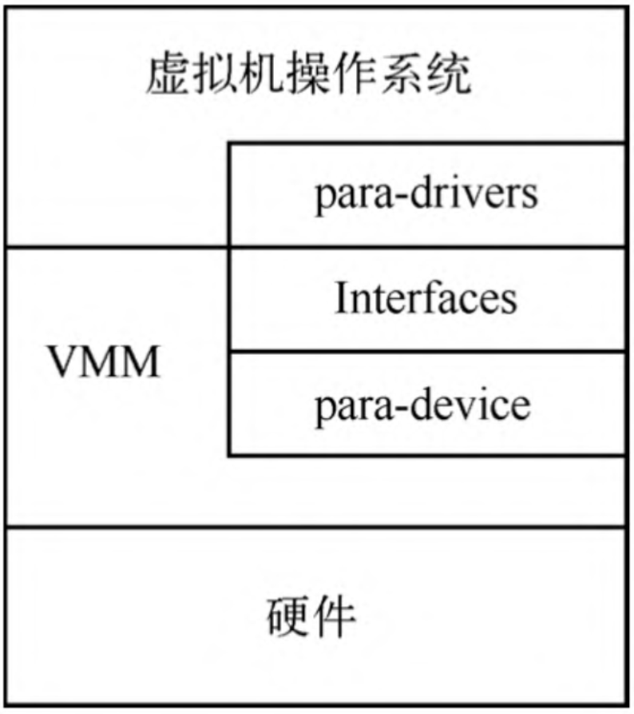
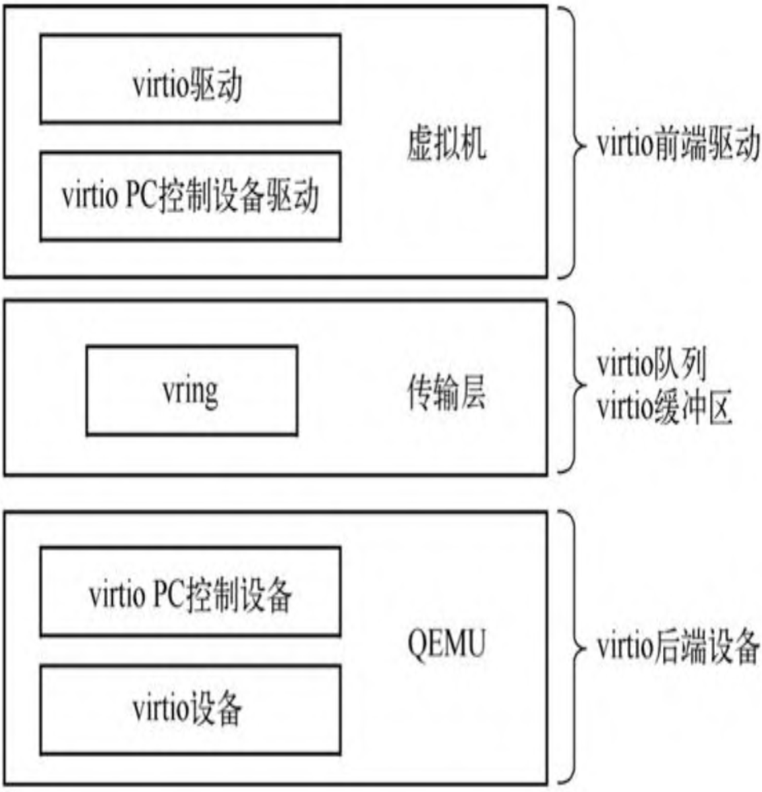
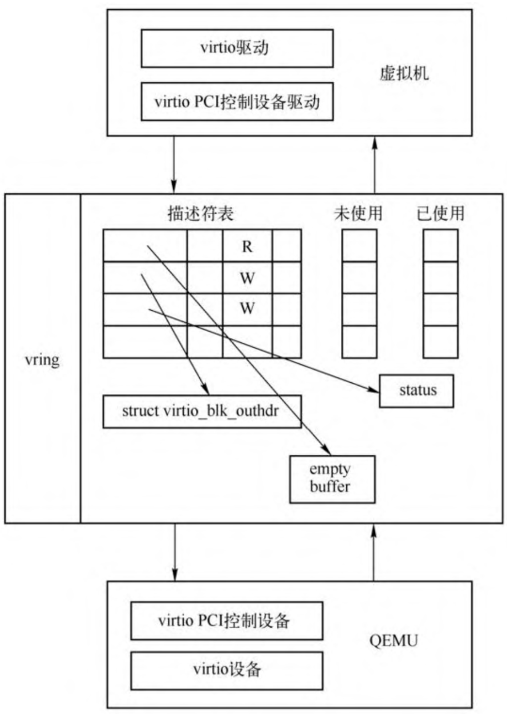

<!-- @import "[TOC]" {cmd="toc" depthFrom=1 depthTo=6 orderedList=false} -->

<!-- code_chunk_output -->

- [1. 背景](#1-背景)
- [2. virtio 优势](#2-virtio-优势)
- [3. 基本原理](#3-基本原理)
- [4. virtio 框架](#4-virtio-框架)
  - [4.1. 前端驱动](#41-前端驱动)
  - [4.2. 后端设备](#42-后端设备)
  - [4.3. virtqueue](#43-virtqueue)

<!-- /code_chunk_output -->

# 1. 背景

**完全虚拟化** 的优势是 VMM 对于 Guest 是完全透明的, **Guest** 可以**不加任何修改**地运行在**任何 VMM** 上.

对于**真实的物理设备**而言, 受限于物理设备的种种约束, **I/O 操作**需要严格**按照物理设备**的要求进行.

但是, 对于通过**软件方式模拟**的设备虚拟化来讲, 完全没有必要生搬硬套硬件的逻辑, 而是**可以制定**一种更高效, 简洁的适用于**驱动和模拟设备交互的方式**, 于是半虚拟化诞生了, Virtio 协议是半虚拟化的典型方案之一.

# 2. virtio 优势

与完全虚拟化相比, 使用 Virtio 协议的驱动和模拟设备的交互**不再使用寄存器**等**传统的 I/O 方式**, 而是采用了 **Virtqueue** 的方式来**传输数据**. 这种设计**降低**了**设备模拟实现**的复杂度, 去掉了很多 **CPU 和 I/O 设备**之间不必要的**通信**, 减少了 **CPU** 在 **Guest 模式**和 **Host 模式**之间的**切换**, I/O 也不再受**数据总线宽度**, **寄存器宽度**等因素的影响, 一次 I/O 传递的数据量不受限制, 提高了虚拟化的性能.

# 3. 基本原理

在该方案中, 虚拟机能够感知到自己处于虚拟化环境, 并且会加载相应的 **virtio 总线驱动**和 **virtio 设备驱动**.

基本原理如图所示, 主要包括两部分的内容, 一个是 **VMM** 创建出**模拟的设备**, 另一个是**操作系统内部**的**该模拟设备的驱动**, 这个驱动和设备之间使用对应的接口进行通信.

比如对于 e1000 网卡来说, 传统的全模拟下, 虚拟机内核中的网卡驱动还是跟具体硬件设备相同, 也就是说 QEMU 模拟的是 e1000 的网卡, 那虚拟机操作系统还是通过传统的方式进行收发包, 相关代码已经介绍过. e1000 以及其他模拟设备网卡的驱动在进行收发包的时候, 会有很多次的写网卡寄存器或者 IO 端口的操作, 这会导致大量的 VM Exit, 使得网卡的性能比较差. 在半虚拟化环境下, 设备和驱动都是新的、专门用来适应虚拟化环境的, 虚拟机中的设备驱动与 QEMU 中的虚拟网卡设备定义一套自己的协议进行数据传输, 通过自己约定的接口, 可以很方便地进行通信.

# 4. virtio 框架

virtio 即是这样一种利用半虚拟化技术提供 I/O 性能的框架. virtio 框架如图.

virtio 是一种**前后端架构**, 包括**前端驱动**(`Front-End Driver`)和**后端设备**(`Back-End Device`)以及**自身定义的传输协议**. 通过传输协议, virtio 不仅可以用于 QEMU/KVM 方案, 也可以用于其他的虚拟化方案. 如虚拟机可以不必是 QEMU, 也可以是其他类型的虚拟机, 后端不一定要在 QEMU 中实现, 也可以在**内核中**实现(这实际上就是 **vhost** 方案, 后面会详细介绍). 接下来对这 3 个组件做简单介绍.

## 4.1. 前端驱动

前端驱动为虚拟机内部的virtio模拟设备对应的驱动, 每一种前端设备都需要有对应的驱动才能正常运行. 前端驱动的主要作用是接收用户态的请求, 然后按照传输协议将这些请求进行封装, 再写I/O端口, 发送一个通知到QEMU的后端设备.

## 4.2. 后端设备

后端设备则是在QEMU中, 用来接收前端驱动发过来的I/O请求, 然后从接收的数据中按照传输协议的格式进行解析, 对于网卡等需要实际物理设备交互的请求, 后端驱动会对物理设备进行操作, 从而完成请求, 并且会通过中断机制通知前端驱动.

## 4.3. virtqueue

virtio前端和后端驱动的数据传输通过 virtio 队列(virtio queue, virtqueue)完成, 一个设备会注册若干个 virtio 队列, 每个队列负责处理不同的数据传输, 有的是控制层面的队列, 有的是数据层面的队列. virtqueue 是通过 vring 实现的. vring 是虚拟机和 QEMU 之间共享的一段环形缓冲区.

当虚拟机需要发送请求到 QEMU 的时候就准备好数据, 将数据描述放到 vring 中, 写一个 I/O 端口, 然后 QEMU 就能够从 vring 中读取数据信息, 进而从内存中读出数据. QEMU 完成请求之后, 也将数据结构存放在 vring 中, 前端驱动也就可以从 vring 中得到数据.

vring 的基本原理如图所示.

后面详细介绍 virtio 协议.

