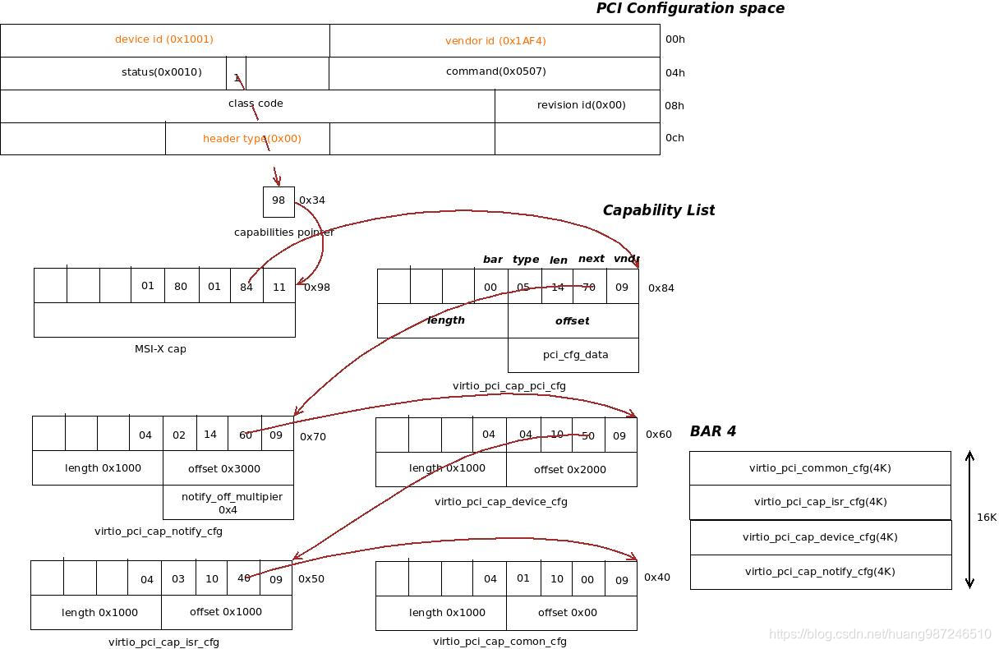
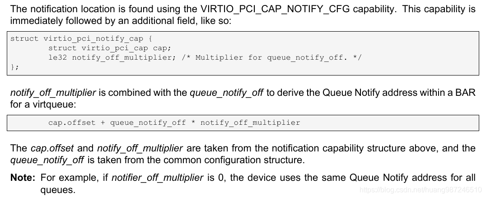
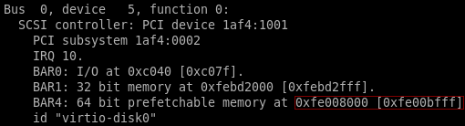
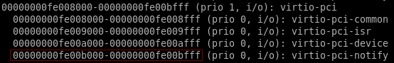
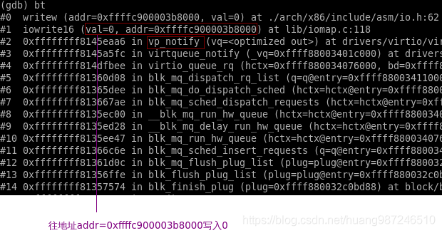
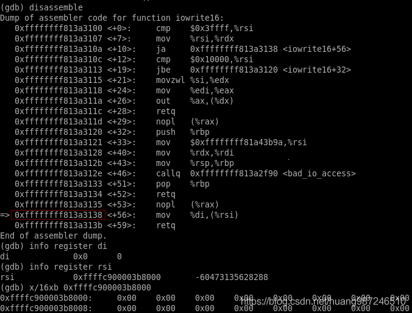
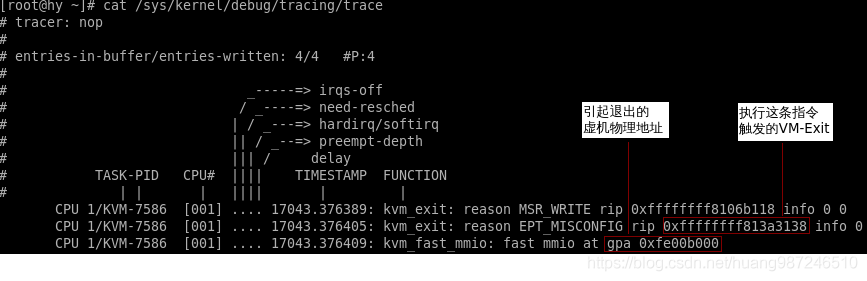

# 流程介绍

虚机向 virtio 磁盘写入数据后, 走到块设备层提交 bio, 最终会往 virtio-blk 队列的环上添加写入数据的物理地址, 整个流程如下:

```cpp
submit_bio()
generic_make_request()						/* 将 bio 提交到块设备的工作队列上去 */
blk_mq_dispatch_rq_list()					/* 工作队列处理函数 */
q->mq_ops->queue_rq()				/* 调用多队列入队请求的具体实现 */
virtio_queue_rq()					/* virtio 磁盘的入队请求实现 */
__virtblk_add_req()			/* 将 IO 数据地址添加到 virtio 的队列上 */
virtqueue_kick_prepare()	/* 判断是否要通知后端 */
virtqueue_notify()		/* 通知 */
vq->notify()		/* virtio 队列的通知实现 */
vp_notify()		/* 对于基于 pci 的 virtio 设备, 最终调用该函数实现通知 */
```

`vp_notify` 的具体实现如下:

```cpp
// drivers/virtio/virtio_pci_common.c
/* the notify function used when creating a virt queue */
bool vp_notify(struct virtqueue *vq)
{
    /* we write the queue's selector into the notification register to
     * signal the other end */
    iowrite16(vq->index, (void __iomem *)vq->priv);
    return true;
}
```

从这里看, notify 的动作就是往**队列**的一个 **priv 成员**中**写入队列**的 **idx**. 这个 priv 成员在哪儿初始化的?看下面:

```cpp
// drivers/virtio/virtio_pci_modern.c
static struct virtqueue *setup_vq(struct virtio_pci_device *vp_dev,
				  struct virtio_pci_vq_info *info,
				  unsigned index,
				  void (*callback)(struct virtqueue *vq),
				  const char *name,
				  bool ctx,
				  u16 msix_vec)
{
    ......
	/* create the vring */
	vq = vring_create_virtqueue(index, num, /* 1 */
				    SMP_CACHE_BYTES, &vp_dev->vdev,
				    true, true, ctx,
				    vp_notify, callback, name);
    vq->priv = (void __force *)vp_modern_map_vq_notify(mdev, index, NULL); /* 2 */
    ......
}
```

> 这里的 index 根据 vq 数目从 0 开始增加

`setup_vq` 主要动作:

1. `vring_create_virtqueue`: 创建 virtio 磁盘列队, 为 vring 分配空间, 并将其挂载到队列上. 函数传入了一个 `vp_notify` 回调函数, 这个函数就是在 Guest 添加 buffer 后要调用的通知后端的 notify 函数

2. `vp_modern_map_vq_notify`: 设置 notify 函数中要写入的 pci 地址, 这个地址的计算依据是 virtio 规范

# 硬件基础

virtio 设备的 PCI 空间中, `virtio_pci_cap_notify_cfg` 是专门用作**前端通知**的 cap, 通过**读取**这个配置空间的信息, 可以计算出通知后端时**前端要写的地址**, 整个 virtio-pci 的配置空间如下:



virtio 中关于 notify 写入地址的计算方法介绍如下:



从规范的介绍来看, notify 地址是 notify cap 在 **bar 空间内的偏移**, 加上 common cap 的 `queue_notify_off` 字段与 notify cap `的 notify_off_multiplier` 的乘积. 再看一次之前的地址计算公式, 就是规范里面介绍的计算方法

```
vq->priv = (void __force *)vp_dev->notify_base + off * vp_dev->notify_offset_multiplier
```

比如, `virtio-iommu` 设备

```
# lspci -vvv -s 00:01.0
00:01.0 Unclassified device [00ff]: Red Hat, Inc. Device 1057 (rev 01)
        Subsystem: Red Hat, Inc. Device 1057
        Control: I/O- Mem+ BusMaster+ SpecCycle- MemWINV- VGASnoop- ParErr- Stepping- SERR- FastB2B- DisINTx+
        Status: Cap+ 66MHz- UDF- FastB2B- ParErr- DEVSEL=fast >TAbort- <TAbort- <MAbort- >SERR- <PERR- INTx-
        Latency: 0
        Interrupt: pin A routed to IRQ 10
        Region 0: Memory at d0138000 (32-bit, non-prefetchable) [size=32K]
        Capabilities: [40] Vendor Specific Information: VirtIO: CommonCfg
                BAR=0 offset=00000000 size=00000038
        ...
        Capabilities: [70] Vendor Specific Information: VirtIO: Notify
                BAR=0 offset=00003000 size=00001000 multiplier=00000004
        ...
        Kernel driver in use: virtio-pci
```

notify 的 cap 位于 BAR0, offset=00003000, size=00001000, 而 `Region 0: Memory at d0138000`, 所以 notify cap 的物理区间应该是 `d013b000 ~ d013c000`(当然这是 GPA)

查看 dmesg, 确认 BAR0 的物理区间

```
[   17.568500] pci 0000:00:01.0: [1af4:1057] type 00 class 0x00ff00
[   17.570886] pci 0000:00:01.0: reg 0x10: [mem 0xd0138000-0xd013ffff]
```

iowrite16 接口: `index = 0`,  `vq->priv = 0x00000000de3ee671`

# VM-exit

**前端**往 **notify 地址**写入数据后, 由于这是**外设的空间**, 写操作被认为是敏感指令, 触发 VM-exit, 首先查看前端 notify virtio 磁盘时要写的地址区间.

1. **后端**查看 virtio 磁盘的 pci 配置空间物理地址, notify 的 cap 位于 BAR4, BAR4 的物理区间是 `0xfe008000~0xfe00bfff`(GPA)

```
virsh qemu-monitor-command vm --hmp info pci
```



2. **后端**查看 notify 配置空间在 BAR4 占用的物理区间 `0xfe00b000 ~ 0xfe00bfff`(GPA)

```
virsh qemu-monitor-command vm --hmp info mtree
```



3. **前端**如果在 virtio 磁盘上添加 buffer 之后, notify 要写入的地址区间是 `0xfe00b000 ~ 0xfe00bfff`.

4. 使用 gdb 跟踪 `vp_notify` 的流程, 可以看到最终 notify 会往地址为 `0xffffc900003b8000` 的内存空间写 0, 该地址就是 pci 总线域 notify 地址通过 `ioremap` 映射到**存储器域**的地址, 理论上, 访问这个地址就是访问 pci 的 notify 地址

> GVA??



5. 继续单指令调试, 下面这条 mov 指令是真正的写 io 空间的操作, 执行的时候触发 VM-Exit



6. 在执行 mov 指令之前, 打开主机上的 kvm 的两个 trace 点, 获取 VM-Exit 中 KVM 的日志打印

```
echo 1 > /sys/kernel/debug/tracing/events/kvm/kvm_exit/enable

echo 1 > /sys/kernel/debug/tracing/events/kvm/kvm_fast_mmio/enable
```



7. 两个 trace 点输出信息在内核的定义如下:

```cpp
/*
 * Tracepoint for kvm guest exit:
 */
TRACE_EVENT(kvm_exit,
    TP_PROTO(unsigned int exit_reason, struct kvm_vcpu *vcpu, u32 isa),
    TP_ARGS(exit_reason, vcpu, isa),
	......
    /* 1 */
    TP_printk("reason %s rip 0x%lx info %llx %llx",
         (__entry->isa == KVM_ISA_VMX) ?
         __print_symbolic(__entry->exit_reason, VMX_EXIT_REASONS) :
         __print_symbolic(__entry->exit_reason, SVM_EXIT_REASONS),
         __entry->guest_rip, __entry->info1, __entry->info2)
);

/*
 * Tracepoint for fast mmio.
 */
TRACE_EVENT(kvm_fast_mmio,
    TP_PROTO(u64 gpa),
    TP_ARGS(gpa),
	......
    /* 2 */
    TP_printk("fast mmio at gpa 0x%llx", __entry->gpa)
);
```

* 1. kvm_exit 的输出信息分别是: 退出原因, 引发退出的指令地址, VM-Exit 退出时 VMCS VM-Exit 相关信息, 如下:

  * info1: `EXIT_QUALIFICATION`, 记录触 发 VM-Exit 的指令或者异常

  * info2: `VM_EXIT_INTR_INFO`, 记录触发 VM-Exit 的中断信息

* 2. kvm_exit 如果是 EPT violation 或者 EPT misconfiguration 引起的, 会将引起退出的物理地址放到 VMCS VM-Exit 的 GUEST_PHYSICAL_ADDRESS
字段, 这里就是打印这个字段里面的值

8. 追踪 VM-Exit 流程, 可以知道 notify 引发的退出, 被归类为 EPT misconfiguration, 是由于访问内存异常产生的退出. 如果虚机 EPT 页不存在, 触发的是 EPT violation 异常, KVM 会进行缺页处理. 如果页存在但访问权限不对, 才触发 EPT misconfiguration, 这里是虚机没有这个地址的访问权限. 从而触发 VM-Exit.

# KVM 缺页处理

当客户机因为缺页异常而退出后, KVM 有两种处理方式.

第一种是常规的方式, 针对引起缺页的 GPA, 填充其对应的 EPT 页表并将信息同步给 qemu 进程的页表, 这时 KVM 处理客户机缺页的最常见流程.

另外一种, 就是本文讨论的情况, 虚机访问的物理地址不是普通的内存, 是一个 PCI 的配置空间, 这种类型的内存, 在 qemu 的分类中是 MMIO(Memory-map), 当虚机读写这类内存的时候, KVM 检查到之后通过 ioeventfd 通知 qemu, 具体原理参考 `Virtualization\3. KVM\1. 基本机制\ioeventfd`.

kvm 中:

```cpp
handle_ept_misconfig

kvm_io_bus_write

kvm_iodevice_write()

dev->ops->write(vcpu, dev, addr, l, v)
```

对应 `ioeventfd_write`, 调用 `eventfd_signal(p->eventfd, 1);`(计数器中加 1) in `virt/kvm/eventfd.c`

# reference

VirtIO 实现原理——前端通知机制: https://blog.csdn.net/huang987246510/article/details/105496843


