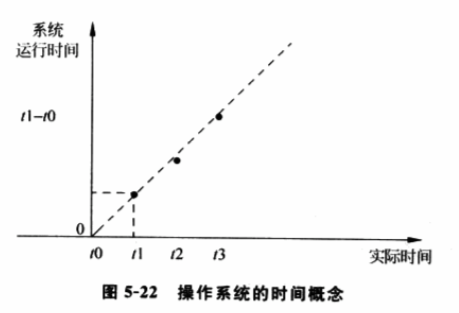
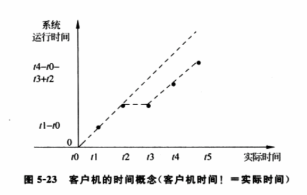
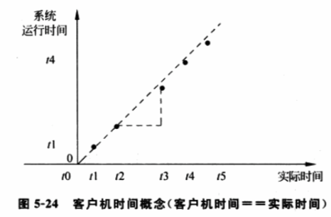
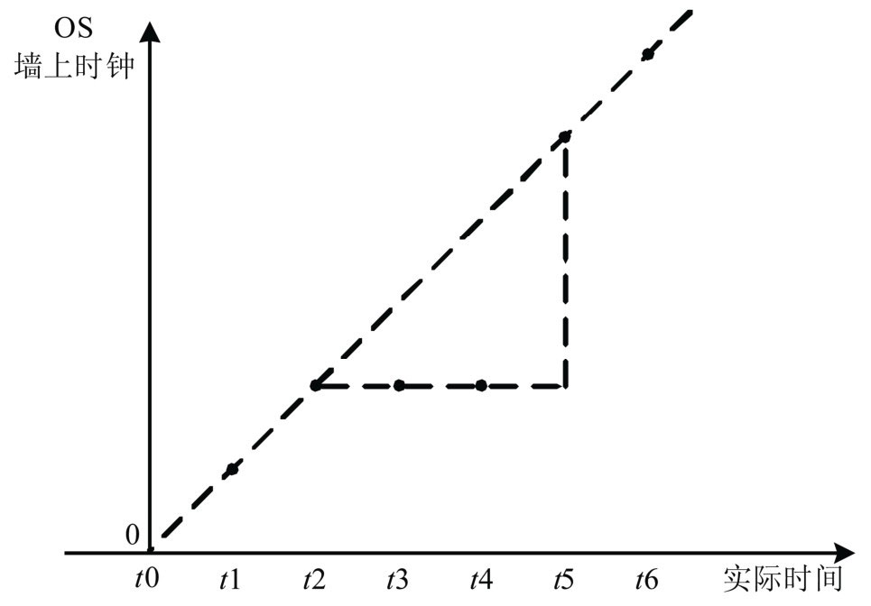
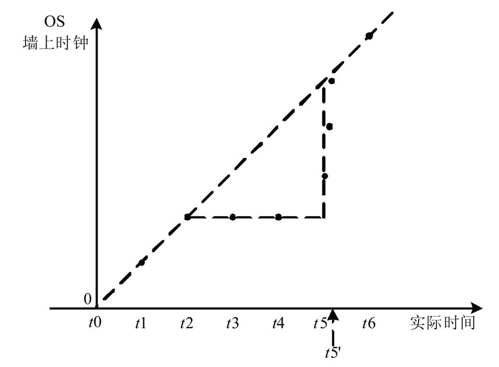
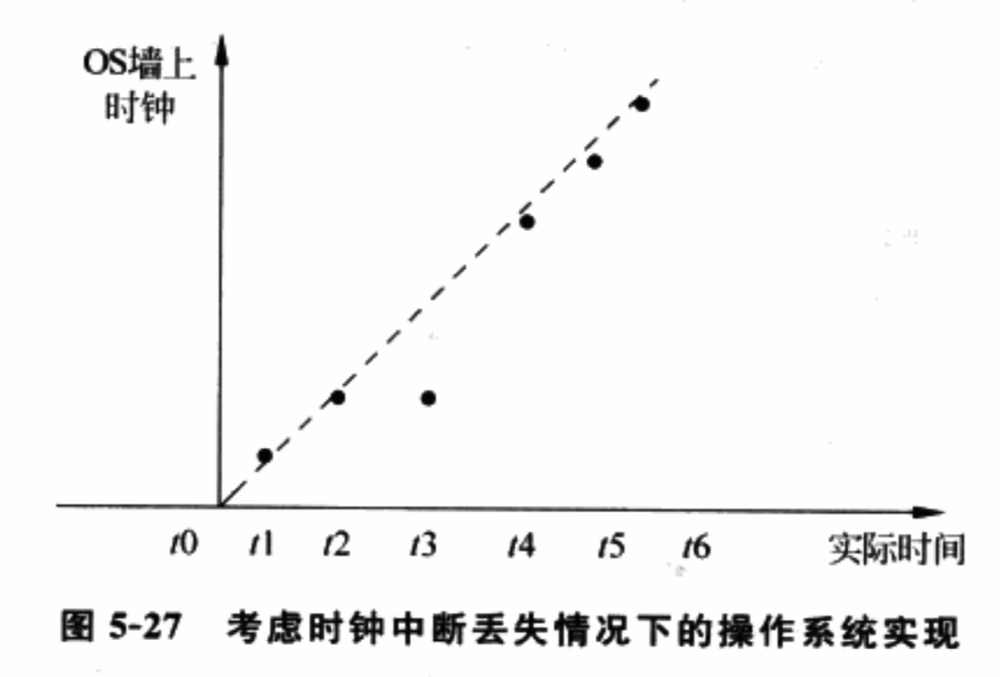

<!-- @import "[TOC]" {cmd="toc" depthFrom=1 depthTo=6 orderedList=false} -->

<!-- code_chunk_output -->

- [1. 操作系统的时间概念](#1-操作系统的时间概念)
- [2. 客户机的时间概念](#2-客户机的时间概念)
- [3. 时钟设备仿真](#3-时钟设备仿真)
  - [3.1. 客户机不会被调度出去的情况](#31-客户机不会被调度出去的情况)
    - [3.1.1. PIT 的时钟中断](#311-pit-的时钟中断)
    - [3.1.2. PIT 的时钟计数器](#312-pit-的时钟计数器)
  - [3.2. 客户机被调度出去的情况](#32-客户机被调度出去的情况)
    - [3.2.1. 实现客户机时间概念的一种方法 --- 丢失中断连续注入](#321-实现客户机时间概念的一种方法---丢失中断连续注入)
    - [3.2.2. 实现客户机时间概念的另一种方法](#322-实现客户机时间概念的另一种方法)
      - [3.2.2.1. 上面方法的缺陷](#3221-上面方法的缺陷)
      - [3.2.2.2. 另一种方法 --- 计数器修正](#3222-另一种方法---计数器修正)
- [4. 如何满足客户机时间不等于实际时间的需求](#4-如何满足客户机时间不等于实际时间的需求)

<!-- /code_chunk_output -->

# 1. 操作系统的时间概念

- 绝对时间(Wall Time): 又称墙上时间. 即 OS 启动后到目前为止的总运行时间, 它是一个单调递增的值

- 相对时间: 两个时间之间的间隔.

从前面知道, **硬件定时器如 RTC、PIT 或 HPET**等都能以**某种频率**触发**时钟中断**, 触发**频率**可以由**软件编程控制**. 通常, OS 会将**频率设定**为一个**给定的值**(例如 10ms), 从而可以知道**两次时钟中断之间的时间差**(本例中是 10ms). 同时, 硬件定时器也会提供**计数器(Counter**)的功能, OS 可知两次读取计数器之间的时间差, 从而得到相对时间概念.

OS 在启动时候**读取 CMOS**的**实时时钟**, 或通过**NPT 协议**, 得到系统启动时的**绝对时间**. 同时, **系统**通过维护**相对时间**, 可知系统总运行的事件, 从而 OS 可得到任意时刻点的绝对时间, 如下公式:

当前绝对时间 = 系统启动时的时间 + 系统启动后运行的时间

图 5-222 描述 OS 的时钟概念. 系统在时间 t0 时候启动, 当实际时间到达 t1 的时候, 系统内部维护的运行时间为 t1 - t0, 而系统内部的绝对时间为 t0+(t1-t0), 从而保证了内存时间与实际时间的一致性. 每次时钟中断发生时(t1、t2、t3 等), OS 都会更新内部的时间概念. 而在 t1 \~ t2 时间内, OS 可通过读时间设备的计数器得到相对时间.

# 2. 客户机的时间概念

在**硬件辅助的虚拟环境**下, 客户机 OS 仍然需要维护正确地时间概念, 包括**相对时间**和**绝对时间**. 这意味着**VMM**需要为客户机提供**系统硬件时钟设备的仿真**, 包括**PIT**、**HPET**和**TSC**等.

**虚拟环境**下, **不同客户机**和**VMM 共享物理平台**, 客户机只能得到部分处理器时间.

图 5-23 和图 5-24 给定不同的客户机时间概念的实现.

假定客户机在 t1 时刻处于运行状态, t2 的时候被调度进入睡眠状态, t3 时候重新被调度执行, 直到 t5 时候被再次调度出去. 如果客户机内的某一个程序(操作系统内核或应用程序)希望得到 t4 和 t1 之间的相对时间, 那么返回值应该是多少?

显然, **不同情况**, 返回值应该是不相同的, 考虑下面两种应用.

1) 进程记账: 主要用于统计某一个进程的执行时间. 就不能包含被调度出去的时间.

2) 网络速度检测程序: 网络速度检测程序通过计算发送数据包和收到应答包的时间.

实际需求中, 多数应用是网络速度检测这样的应用, 因此, 通常时间虚拟化的策略都是给客户机呈现与实际时间相同的事件概念. 后面讨论基于客户机时间与实际时间相等的情况, 不等的情况会在最后简单介绍.

OS 通过系统中**时钟设备**(包括 PIT、HPET 和 TSC 等)得到自己的**绝对时间**或**相对时间**, 因此首先介绍**时钟设备虚拟化的实现方法**, 然后再讨论**如何给客户机提供与实际时间相等的时间**.

# 3. 时钟设备仿真

x86 系统中**时间设备**包括**PIT**、**HPET**、**ACPI PM Timer**和**TSC**等.

这里以 PIT 为例, 先介绍客户机不会被调度出去的情况, PIT 设备如何虚拟化. 下节介绍客户机被调度出去的情况.

第 2 章说过, PIT 主要功能是为 OS 提供定时的**时钟中断！！！**和**时钟计数器！！！**. OS 对 PIT 设备的**I/O 端口读写**, 设定时钟中断的**触发频率**, 设置和读取**时钟计数器**.

为实现时间设备的虚拟化, **VMM**必须提供**软件定时器机制**, 使得程序可以在**设定的某个未来时间执行一段代码**, 同时还提供**接口**, 使得程序可以了解**当前的实际时间**.

## 3.1. 客户机不会被调度出去的情况

### 3.1.1. PIT 的时钟中断

假定**客户机 OS**设定 PIT 时钟**中断频率**为 10ms, VMM 截获这个设定(截获方法参考**I/O 虚拟化**), 并通知**PIT 设备模型**.

**PIT 设备模型**会**向 VMM！！！注册**一个间隔为 10ms 的**软件定时器！！！**, 并提供**回调函数**, 这个**函数功能**就是向**客户机注入一个时钟中断！！！**.

在**客户机不被调度出去！！！** 的情况下, 每隔 10ms, **VMM！！！**都会**调用这个回调函数！！！** 向客户机**注入一个时钟中断**.

具体中断注入参考中断虚拟化相关章节.

### 3.1.2. PIT 的时钟计数器

当客户机**读取 PIT**的**Counter 寄存器**时, **PIT 设备模型**通过 VMM 了解当前的**实际时间！！！**, 并**减去 PIT 的事件计数器**被初始化时的实际时间, 以得到**流逝时间**, 经过**PIT 频率转换**后返回给客户机.

**HPET**和**ACPI PM Timer**, 基本方法相同, 不同点在于, **客户机**读取**PIT**通过**IO 实现**, 而这两个是**MMIO 截获**实现. 同时, 各个时间设备的**中断号不同**.

由于 OS 可依赖**多个时钟设备**实现内部时间的维护, 因此, 当 VMM 提供**多个时钟设备的仿真**时, 需要保证**各个设备模型**之间的**时间一致性**.

## 3.2. 客户机被调度出去的情况

下面讨论当**客户机被调度出去**的情况下, 如何通过**设备仿真**实现**客户机的时间概念**, 以使**客户机时间等于实际的时间**.

图 2-25 客户机被调度出去情况下时间概念的实现:

如图 5-25, 假定客户机在 t2 时候被调度出去, 在 t5 被调度进来.

这个过程中, 根据客户机 OS 对**虚拟 PIT**的设置, 在**t3**和**t4**需要**插入时钟中断**, 以使得客户机 OS 能维持内部的时间计数. 然而, t3 和 t4 时候客户机并没有运行, 因此, **VMM 没有机会**将**中断注入给客户机**.

### 3.2.1. 实现客户机时间概念的一种方法 --- 丢失中断连续注入

通常做法是, 当客户机在**t5 时刻！！！** 被调度回来, **VMM**连续将**t3、t4 时刻丢掉**的两个**时钟中断连续！！！注入**客户机. "连续"指, 当客户机处理完**t3 的时钟中断！！！** 后, 立刻把 t4 时刻的时钟中断注入给客户机, 在客户 OS 看来就是在一个**时钟中断处理**完后另一个时钟中断**紧接着发生**了. 由于这个过程没有其他的程序被运行, 因此, 当应用程序会内核中需要时间服务的程序运行的时候, t3 和 t4 丢失的时钟中断都已补偿给客户机了. 这样, VMM 保证了**客户机内部的时间！！！**与**实际时间一致！！！**.

当然, 如果在**OS 的时钟中断函数**中, 有**需要时钟服务的代码**运行, 那么这些代码仍然会**得到不正确的时间**. 但, OS 为保证中断的快速反应, 通常并不会出现这种情况.

图 5-26 给出实现这一过程的示意. 当客户机在 t5 时刻被调度运行时, VMM 立刻注入 t3'时刻的时钟中断给客户机, 使得客户机的时钟概念跳变到 t3', 客户机在 t5'时候执行完 t3'中断的中断处理函数后, VMM 立刻注入 t4'时刻的时钟中断, 使得客户机时钟跳变到 t4'. 由于客户机处理函数执行速度很快, 因此(t5' - t5)远远小于(t6 - t5).

图 2-26 客户机被调度出去情况下中断注入的微观示意图:

设备模型中**计数器**的实现. 图 5-26 中, 在 t5'后, 由于所有中断都已经被注入到客户机内, **客户机的时钟**已经调整到和**实际时间一致**, 设备模型中计数器的值与实际时间也是一致的. 而在**t5 到 t5'**的过程中, 由于**客户机的时钟概念仍然停留在 t3 时刻**, 因此计数器的返回值也应该在 t3 和 t4 之间. 由于 t5 到 t5'的时间非常短, 因此, 具体在 t3 和 t4 之间的那个点依赖具体实现.

### 3.2.2. 实现客户机时间概念的另一种方法

#### 3.2.2.1. 上面方法的缺陷

上面方法存在一些问题.

例如,

- 由于把客户机调度出去时的时钟中断补偿给客户机, 因此它对系统性能会有影响, 特别是运行客户机比较多的时候, 时钟中断的补偿会消耗很多的时间.

- 其次, 在 SMP 情况下, **各个 VCPU**之间 tsc 的同步存在一些问题.

#### 3.2.2.2. 另一种方法 --- 计数器修正

前面说到, 时钟虚拟化的主要目的是保护客户机内部时间概念的正确性, 因此, 可以针对 OS 特定的时间概念维护机制, 修改 VMM 时间虚拟化的方法.

这里给另外一个方法.

在硬件平台上, 虽然时钟中断丢失的情况很少见, 但是还存在这种可能的, 通常情况下是因为操作系统关闭中断的时间过长. 然而, 有些 OS 已经考虑了时钟中断丢失的情况, 在**收到时钟中断**后, 会**读取时钟设备中的计数器**, 并根据计数器的值进行修正. 如图 5-27, 假定 OS 中没有收到 t3 时刻的时钟中断, 当 t4 时刻时钟中断注入的时候(注, 这是物理平台, 所以 t3 时刻的中断是没有机会补偿给操作系统), 中断处理函数会读取时钟设备中的计数器, 发现和上一次时钟中断的发生已经超过了 10ms, 因此, OS 会认为自己错过了时钟中断, 并**根据时钟设备中的计数器！！！来修正自己的时钟概念**.

针对**这种 OS**, **时钟虚拟化不再需要将错过的中断补偿给客户机！！！**.

以图 5-25 为例, 在 t5 时刻客户机被重新调度运行的时候, VMM 并不需要将 t3/t4 时刻的时钟中断注入客户机, 而只需要注入一次. 当客户机的时钟中断处理函数读取时钟设备的计数器时, 直接返回实际时间. 客户机 OS 通过检查计数器返回值, 就可以知道错过了 t3/t4 的时钟中断, 并将自己的时间概念更新到 t5.

# 4. 如何满足客户机时间不等于实际时间的需求

前面讨论了**如何通过设备仿真**, 使**客户机内部的时间概念**与**实际的时间相等**. 然而, 有些应用需要**客户机时间等于客户机实际运行的时间！！！**, 例如**进程记账软件**.

对于这种需求, 一种做法是在**客户机内部引入 PV 的时间模块**, 使得**客户机被调度出去的时间**(也就是图 5-25 中的 t2\~t5)被计算在**PV 的时间模块**, 而**不是当前进程**上.

详细资料参见 VMware 相关文献.