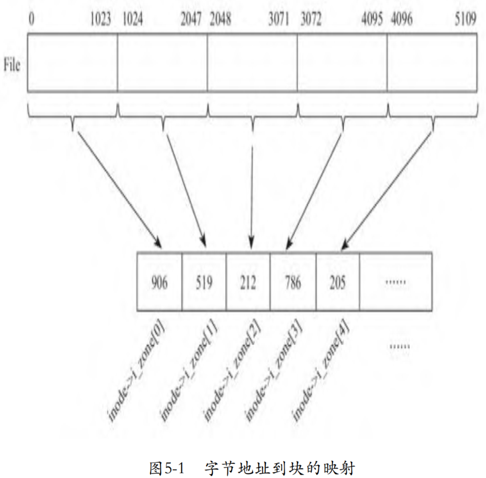
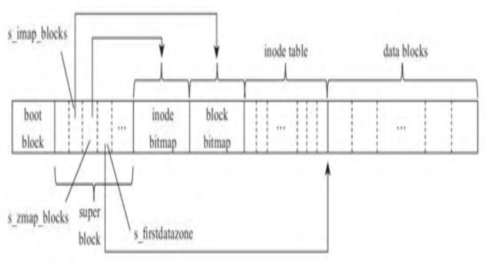
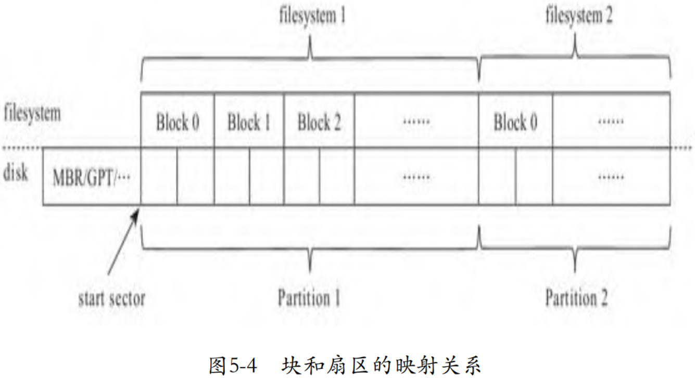
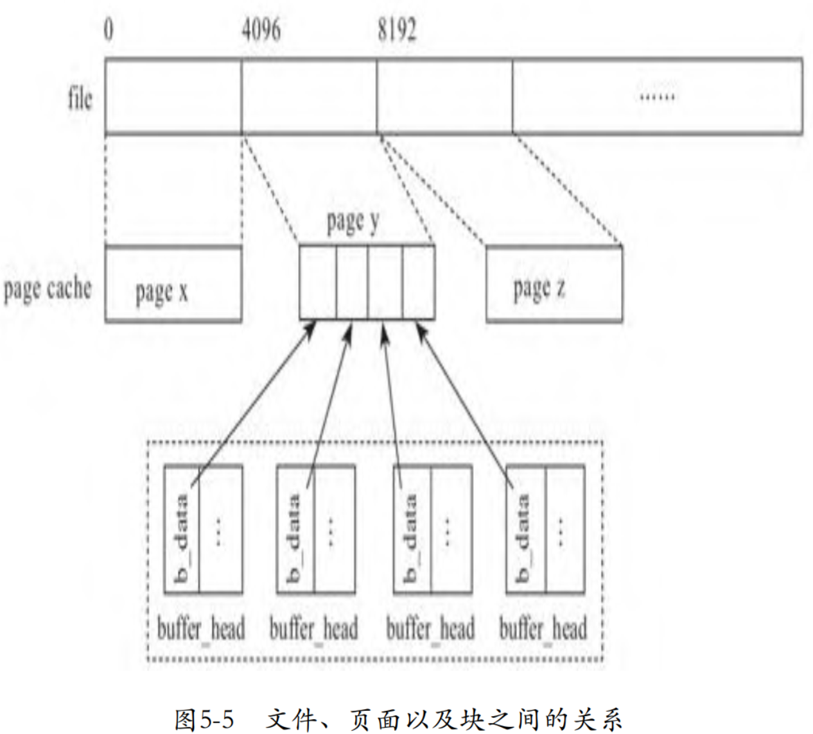

<!-- @import "[TOC]" {cmd="toc" depthFrom=1 depthTo=6 orderedList=false} -->

<!-- code_chunk_output -->

- [1. 说明](#1-说明)
- [2. 文件系统](#2-文件系统)
- [3. 通用块层](#3-通用块层)
- [4. 块设备驱动](#4-块设备驱动)
- [5. page cache](#5-page-cache)
- [6. bio](#6-bio)
- [7. I/O 调度器](#7-io-调度器)

<!-- /code_chunk_output -->

# 1. 说明

半虚拟化需要对 **Guest 中的驱动**和 **Host 中的模拟设备**进行改造, 需要将**基于物理设备的数据传输方式**按照 **Virtio 协议**进行组织.

因此, 我们只有非常了解 **I/O 数据**在 **I/O 栈**的各个层次中是**如何表示**的, 才能更好地理解 **Guest** 中的 **Virtio 驱动**是如何将**上层**传递给其的**数据**按照 **Virtio 协议**组织并**传递**给**模拟设备**的, 以及 **Host** 中的**模拟设备**是**如何解析**接收到的数据并**完成模拟**的. 因此, 这一节首先来讨论内核的 I/O 栈.

应用程序 -> 文件系统 -> 通用块层(会有I/O调度) -> 块设备驱动(具体设备) -> I/O 操作

# 2. 文件系统

I/O 栈的**第一层**是**文件系统**, 其**向上**需为**应用程序**提供**面向字节流**的访问**接口**, 向下需负责字节流和底层块设备之间的转换. 因为文件系统构建于块设备之上, 所以通常文件系统也使用块作为存储数据的基本结构, 这里的块指的是文件系统层面的数据结构, 不是指物理磁盘上的块, 在后面的"通用块层"一节中我们会具体讨论文件系统层面的块和物理磁盘扇区的关系. 一个文件的内容存储在多个块中, 为了可以动态调整文件大小, 并且避免文件系统中产生碎片, 一个文件内容所在的块并不是连续的.

Linux的ext系列文件系统使用inode代表一个文件, inode中存储了文件的元信息, 比如文件的类型、大小、访问权限、访问日期等, 记录了文件数据所在的数据块. 下面代码是Linux 0.10版本中结构体inode的定义, 其中数组i_zone记录文件内容所在的块, i_zone中的每一个元素存储一个块号:

```cpp
linux-0.10/include/linux/fs.h
struct d_inode {
    ...
    unsigned short i_zone[9];
};
```

应用程序访问文件时, 使用的是基于字节流的寻址方式, 比如, 读取文件从3272字节处起始的200个字节. 以Linux 0.10版本为例, 其文件系统的块大小为1024字节, 那么字节地址到块之间的映射关系如图5-1所示.



根据图5-1可见, 文件的0~1023字节所属的块号存储于inode的块数组i_zone的第0个元素中, 1024~2047字节所在的块号存储于inode 的块数组i_zone的第1个元素中, 以此类推. 以读取文件偏移3272字节处开始的200个字节为例:

1) 文件系统首先计算应用程序访问的位置属于数组i_zone的第几个元素. 对于偏移位置3272, 根据3272/1024=3可见, 偏移3272处的数据存储于i_zone[3]记录的数据块中. 根据图5-1可见, i_zone[3]记录的块号为786, 因此, 文件偏移3272处的内容记录在文件系统的第786个数据块中.

2) 其次, 文件系统需要计算出应用程序访问的位置在数据块内的偏移. 根据3272%1024=200可见, 偏移3272在第786块数据块内的偏移200字节处.

文件系统是由多个文件组成的, 而每个文件在文件系统中使用一个inode代表, 因此, 文件系统中需要有个区域存储这些inode, 一般称这个区域为inode table. 除此之外, 文件系统中的主要部分就是数据块集合(data block)了. 对于inode table和data block, 还需要分别有相应的数据结构记录其是被占用还是可用. ext系列文件系统使用位图(bitmap)的方式, 以inode bitmap为例, 如果位100为1, 那么就表示inode 100被占用了, 如果位100为0, 那么就表示inode 100是空闲的. 显然, 文件系统需要有个区域记录这些关键信息, 这个区域就是超级块(super block). Linux 0.10的超级块中记录的上述关键信息如下:

```cpp
linux-0.10/include/linux/fs.h
struct d_super_block {
    ...
    unsigned short s_imap_blocks;
    unsigned short s_zmap_blocks;
    unsigned short s_firstdatazone;
    ...
};
```

为了避免"先有蛋还是先有鸡"的问题, 显然, 文件系统的超级块应该在一个众所周知的位置, 这样内核中的文件系统模块才能知道从硬盘上的什么位置获取这些关键信息, 进而操作文件系统. 以经典的ext2文件系统为例, 其约定超级块位于其所在分区的第1024字节处, 大小为1024字节, 所以block 1是超级块. block 0用于存储引导相关的信息, 通常被称为引导块(boot block). Linux 0.10的文件系统的块大小设置为1024字节, 其布局如图所示.



紧邻在超级块之后的是记录inode使用情况的inode bitmap, 超级块中的变量s_imap_blocks记录了inode bitmap占用的块数. 在inode bitmap后, 是记录data block使用情况的datablock bitmap, 超级块中的变量s_zmap_blocks记录了datablock bitmap占用的块数. 超级块中的变量s_firstdatazone记录了数据块区域的起始位置. 在 datablock bitmap 和 s_firstdatazone 之间的区域, 就是存储inode的 inode table. 文件系统的格式化工具在格式化文件系统之后将这些关键信息记录到超级块中.

除了常规文件外, 文件系统中还有目录, 用来组织文件的层级关系. 目录也是一种文件, 只不过和常规意义上的文件比, 目录类型文件的内容是目录下包含的文件的信息, 其中每个文件使用一个结构体dir_entry来表示, 包括文件名称及其对应的inode号, 因此, 目录文件的内容是多个结构体dir_entry的实例:

```cpp
linux-0.10/include/linux/fs.h
    struct dir_entry {
    unsigned short inode;
    char name[NAME_LEN];
};
```

根据文件系统的组织结构可见, 访问一个文件需要从根目录的inode开始顺藤摸瓜, 所以如同超级块需要在一个众所周知的位置, 文件系统也需要预先约定好根目录inode的位置. 根目录是文件系统的根, 所以应该占据文件系统的第1个节点. 早期, 文件系统确实也使用第1个inode作为根目录的inode, 但从ext2文件系统开始, 第1个 inode 用来存储文件系统的坏块, 根目录使用第2个inode. Linux 0.10使用第 1 个 inode 作为根目录的inode:

```cpp
linux-0.10/include/linux/fs.h
#define ROOT_INO 1
```

但是仅仅知道根目录的inode号还不够, 还需要结合 inode table 的位置, 文件系统才能确定某个inode所在的文件块. 而计算inode table的位置需要用到超级块中的信息, 所以内核在挂载文件系统时, 文件系统模块将从硬盘上读入超级块, 并根据超级块中的信息, 确定 inode table的位置, 读入根目录的inode, 为后续文件访问打下基础. 相关代码如下:

```cpp
linux-0.10/fs/super.c
void mount_root(void)
{
    int i,free;
    struct super_block * p;
    struct m_inode * mi;
    ...
    if (!(p=read_super(ROOT_DEV)))
        panic("Unable to mount root");
    if (!(mi=iget(ROOT_DEV,ROOT_INO)))
        panic("Unable to read root i-node");
    ...
    current->root = mi;
    ...
}
```

函数mount_root调用read_super从硬盘上读取超级块:

```cpp
linux-0.10/fs/super.c
static struct super_block * read_super(int dev)
{
    struct super_block * s;
    struct buffer_head * bh;
    int i,block;

    if (!(bh = bread(dev,1))) {
    ...
    *((struct d_super_block *) s) =
        *((struct d_super_block *) bh->b_data);
    ...
}
```

函数read_super调用通用块层提供的接口bread读取数据块, 顾名思义, bread就是block read, 其第2个参数就是读取的块号. Linux 0.10的文件系统将前1024字节, 即块0留给了系统引导使用, 超级块占据文件系统的第1块, 所以函数read_super给bread传入的第2个参数是 1, 表示读取第1个块, 即超级块. 为了减少I/O等待, 内核并不是使用完一个文件块后就释放, 而是只要内存够用, 就会缓存在内存中. 所以, bread首先从块的缓存中(buffer cache)中寻找块是否已经存在, 如果存在则直接返回, 否则在内存中新分配一个块, 然后从硬盘读取数据到内存块中. 其中结构体buffer_head是内核中定义的代表文件块的数据结构, 该数据结构中的字段b_data指向存储数据的内存.

读取了超级块后, 函数mount_root调用iget读取根目录的inode:

```cpp
linux-0.10/fs/inode.c
struct m_inode inode_table[NR_INODE]={{0,},};
struct m_inode * iget(int dev,int nr)
{
    struct m_inode * inode, * empty;
    ...
    empty = get_empty_inode();
    ...
    inode=empty;
    inode->i_dev = dev;
    inode->i_num = nr;
    read_inode(inode);
    return inode;
}
```

Linux 0.10在内存中定义一个全局的数据结构inode_table用来存储inode, 函数iget首先从inode_table中获取一个空闲的inode, 然后调用read_inode从硬盘上读取数据到这个inode:

```cpp
linux-0.10/fs/inode.c
static void read_inode(struct m_inode * inode)
{
    struct super_block * sb;
    struct buffer_head * bh;
    int block;
    ...
    block = 2 + sb->s_imap_blocks + sb->s_zmap_blocks +
        (inode->i_num-1)/INODES_PER_BLOCK;
    if (!(bh=bread(inode->i_dev,block)))
        panic("unable to read i-node block");
    *(struct d_inode *)inode =
        ((struct d_inode *)bh->b_data)
            [(inode->i_num-1)%INODES_PER_BLOCK];
    ...
}
```

文件系统是以块为基本单元从硬盘读取数据的, 读取某个inode的本质其实是读取inode所属的文件块. 所以函数read_inode首先计算出inode所在的块, 调用bread从硬盘读入数据, 然后根据inode在文件块中的偏移及占据的内存大小, 从块中将其复制到代表inode实例的 m_inode中.

我们具体看一下函数read_inode如何计算inode所属的块. 数字2表示两个块, 分别是引导块和超级块. 根据图5-2可见, 在超级块之后是记录inode使用情况的inode bitmap, 超级块中的字段s_imap_blocks记录了inode bitmap占据的块数. 在inode bitmap之后, 是记录数据块使用情况的datablock bitmap, 超级块中的字段s_zmap_blocks记录了datablock bitmap占据的块数. 代码中(inode-＞i_num-1)/INODES_PER_BLOCK计算出指定inode在inode table中以块为单位的偏移. 所有这些加起来, 就得出了inode所在文件块的块号. 细心的读者可能会发现, inode的序号i_num减去了1, 前面我们提到过, 这是因为Linux 0.10的文件系统的根inode是从1开始计数的.

了解了文件系统的基本数据结构后, 我们再以寻找目标文件的inode和写文件的过程为例, 具体地了解一下文件系统. 首先来看打开文件的过程, 以访问文件/abc/test.txt为例, 文件系统从根目录的inode开始, 遍历根目录的inode的数组i_zone中记录的数据块, 从中找到目录abc对应的dir_entry, 读出dir_entry中记录的目录abc的inode号, 然后根据目录abc的inode号, 从inode table中读取目录abc的inode, 然后遍历目录abc的inode的数组i_zone中记录的数据块, 找到文件test.txt对应的dir_entry, 从中读出文件test.txt对应的inode号, 从磁盘读取文件test.txt的inode, 继而就可以通过inode中的数组i_zone访问文件test.txt的内容了. Linux 0.10打开文件的代码如下:


# 3. 通用块层

事实上, 无论是前面提到的文件块还是元数据, 都是逻辑上的抽象, 这些逻辑上的抽象最终都需要**块设备**的支持. 所以, 在文件系统之下, Linux设计了通用块层, 通用块层完成了文件系统到块设备的映射关系. 后续为了区分, 我们以块(block)或者文件块指代文件系统层面的块, 使用扇区(sector)指代物理硬盘层面的块. 块和物理硬盘的扇区可以一一对应, 也可以不一一对应, 即一个块可以对应多个扇区. 块没必要受物理设备扇区大小的限制, 使用更大的块可能会带来更好的I/O吞吐. 假设扇区大小为512字节, 文件系统采用的块大小为1024字节, 那么块和扇区的对应关系如图5-4所示.



磁盘分区工具在格式化磁盘时, 需要预留存放OS引导程序、磁盘分区表等的空间, 对于复杂的引导程序, 还需要更大的空间. 过去, DOS image要求不能跨柱面, 因为一个柱面最多包含64个扇区, 磁盘分区工具会在硬盘的起始位置为DOS预留一个柱面, 这就是为什么有的硬盘的第一个分区是从第64个扇区开始. 除了MBR外, OS引导程序也经常存储在这64个扇区里, 比如Grub就会将其Stage 1.5的image存储在此. 有些分区工具考虑磁盘的性能, 采取了一些对齐的策略, 比如从第2048个扇区开始. 后来随着GPT和EFI的出现, 这些预留的扇区又有了变化.

这些预留的扇区不属于文件系统, 因此, 将文件系统的块映射为物理磁盘的扇区时, 需要把这些预留的扇区加上. 假设第一个分区的起始扇区是start sector, 那么第1块分区的block 0的起始磁盘扇区就是start sector+0, block 1的起始磁盘扇区为start sector+2, 以此类推.

内核为文件系统的块设计了数据结构buffer_head, 下面代码是Linux 0.10版的结构体buffer_head的定义, 其中, b_data指向存储数据的内存块, b_blocknr为block的起始扇区号. 根据字段b_data后面的注释可见, Linux 0.10内核文件系统的块大小为1024字节:

# 4. 块设备驱动

上一节中我们看到通用块设备层已经将文件系统层的读写操作转换为request, 这一节来看一下块设备驱动是如何处理request的. 硬盘的request处理函数是do_hd_request:


# 5. page cache

为了加快I/O访问, 操作系统在文件系统和块设备之间使用内存缓存硬盘上的数据, 即之前我们提到的块缓存. 但是基于块的设计, 文件系统层和块设备耦合得比较紧密, 而且文件系统并不都是基于块设备的, 比如内存文件系统、网络文件系统等. 再加上内核使用页的方式管理内存, 因此如果使用物理页面(page)缓存数据, 支持上层文件系统, 就可以和内核中的内存管理系统很好地结合. 所以综合种种考虑, 后来Linux使用页代替块支持文件系统, 缓存硬盘数据. 相对于buffer cache, 这些页面的集合相应地称之为page cache, 使用page cache后, 文件、页面以及块之间的关系如图5-5所示.



# 6. bio

在之前的讨论中, 我们看到, 最初Linux使用数据结构buffer_head作为基本的 I/O 单元的, 但是随着raw I/O、direct I/O的出现, 尤其是后来又出现了复杂的LVM、MD、RAID, 甚至是基于网络的块设备, 这时 Linux 需要一个更灵活的 I/O 数据结构, 可以在这些复杂的块设备的不同层次之间传递、分割、合并I/O数据等. 所以, Linux 设计了更通用、更灵活的数据结构 bio 来作为基本的 I/O 单元:

```cpp
linux-2.5.1/include/linux/bio.h
struct bio_vec {
    struct page *bv_page;
    unsigned int bv_len;
    unsigned int bv_offset;
};

struct bio {
    sector_t bi_sector;
    ...
    struct bio_vec *bi_io_vec; /* the actual vec
    list */
    ...
};
```

每个 **bio** 表示**一段连续扇区**, 字段 sector 表示**起始扇区号**. 由于对应于**物理上连续扇区的数据**可能存在于**多个不连续的内存段**中, 因此结构体 bio 中使用一个数组 `bio_vec` 来支持这种需求, 数组 `bio_vec` 中的**每个元素**代表**一段连续的内存**, 数组 `bio_vec` 中存储**多个不连续的内存段**.

相应地, request 中存储 I/O 数据的字段也从 `buffer_head` 更新为bio:


# 7. I/O 调度器

假设硬盘某个磁头在86柱面, 接下来的I/O request依次在如下柱面: 160、52、122、10、135、68、178. 如果我们按照FCFS(先来先服务)的策略来调度, 则磁头移动的轨迹如图5-6所示.

我们看到磁头移动有很多迂回. 为了提高I/O效率, 通用块层引入了I/O调度, 对硬盘访问进行优化. 其中一种典型的I/O调度算法就是使用电梯调度算法对请求进行排队, 减少磁头寻道的距离. 采用电梯调度算法, 磁头移动的轨迹变化如图5-7所示, 可以看到, 磁头移动的距离减少了很多.

