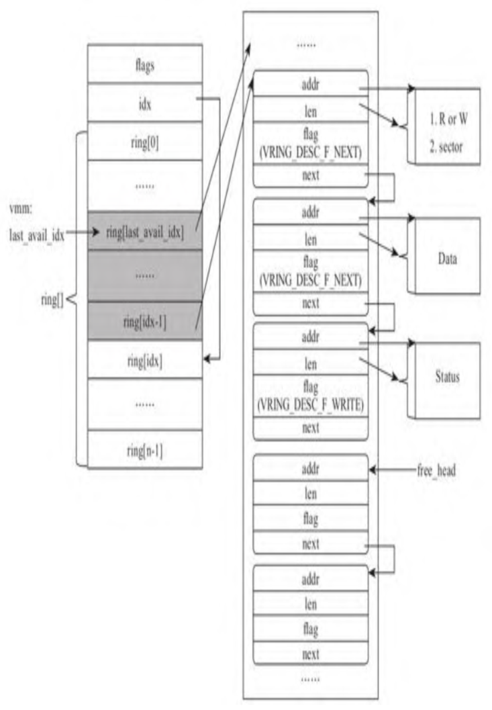
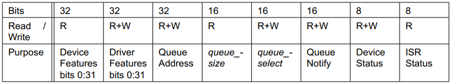
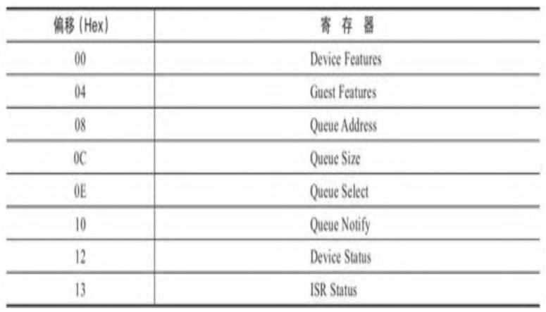

<!-- @import "[TOC]" {cmd="toc" depthFrom=1 depthTo=6 orderedList=false} -->

<!-- code_chunk_output -->

- [1. 摘要](#1-摘要)
  - [1.1. virtio offload](#11-virtio-offload)
  - [1.2. 技术关键点](#12-技术关键点)
- [2. legacy/transitional](#2-legacytransitional)
- [3. 协议](#3-协议)
- [4. virtio 设备的五要素](#4-virtio-设备的五要素)
  - [4.1. Device Status Field](#41-device-status-field)
    - [4.1.1. 驱动的要求](#411-驱动的要求)
    - [4.1.2. 设备的要求](#412-设备的要求)
  - [4.2. feature bits](#42-feature-bits)
      - [4.2.0.1. 驱动的要求](#4201-驱动的要求)
      - [4.2.0.2. 设备的要求](#4202-设备的要求)
      - [4.2.0.3. Legacy Interface](#4203-legacy-interface)
  - [4.3. Notifications](#43-notifications)
  - [4.4. Device Configuration space](#44-device-configuration-space)
    - [4.4.1. 驱动的要求](#441-驱动的要求)
    - [4.4.2. 设备的要求](#442-设备的要求)
    - [4.4.3. Legacy Interface 的字节序](#443-legacy-interface-的字节序)
    - [4.4.4. Legacy Interface 的配置空间](#444-legacy-interface-的配置空间)
- [5. virtqueue](#5-virtqueue)
  - [5.1. 设备 IO 工作机制](#51-设备-io-工作机制)
  - [5.2. vq 组成](#52-vq-组成)
  - [5.3. 描述符表](#53-描述符表)
  - [5.4. 可用描述符区域](#54-可用描述符区域)
  - [5.5. 已用描述符区域](#55-已用描述符区域)
- [6. 三种呈现模式](#6-三种呈现模式)
- [7. virtio-pci 呈现](#7-virtio-pci-呈现)
  - [7.1. 设备要求](#71-设备要求)
  - [7.2. PCI 设备发现](#72-pci-设备发现)
    - [7.2.1. 设备要求](#721-设备要求)
    - [7.2.2. 驱动要求](#722-驱动要求)
    - [7.2.3. Legacy Interfaces](#723-legacy-interfaces)
  - [7.3. 配置数据](#73-配置数据)
    - [7.3.1. virtio legacy](#731-virtio-legacy)
    - [7.3.2. virtio modern](#732-virtio-modern)
    - [7.3.3. Common configuration capability](#733-common-configuration-capability)
    - [7.3.4. Notification capability](#734-notification-capability)
      - [设备要求](#设备要求)
    - [7.3.5. ISR Status capability](#735-isr-status-capability)
    - [7.3.6. 设备特定配置的 capability](#736-设备特定配置的-capability)
    - [7.3.7. PCI 配置空间访问 capability](#737-pci-配置空间访问-capability)

<!-- /code_chunk_output -->

# 1. 摘要

v1.1: https://docs.oasis-open.org/virtio/virtio/v1.1/cs01/virtio-v1.1-cs01.html

v1.2: https://docs.oasis-open.org/virtio/virtio/v1.2/virtio-v1.2.html

此文基于 1.1 版本进行介绍. link [here](https://docs.oasis-open.org/virtio/virtio/v1.1/csprd01/virtio-v1.1-csprd01.html).

## 1.1. virtio offload

半虚拟化设备 (Virtio Device) 在当前云计算虚拟化场景下已经得到了非常广泛的应用, 并且现在也有越来越多的**物理设备**也开始**支持 Virtio 协议**, 即所谓的 Virtio Offload, 通过将 virtio 协议卸载到硬件上 (例如 virtio-net 网卡卸载, virtio-scsi 卸载) 让物理机和虚拟机都能够获得加速体验.

## 1.2. 技术关键点

在开始了解 virtio 之前, 我们先思考一下几个相关问题:

* virtio 设备有哪几种呈现方式?
* virtio-pci 设备的配置空间都有哪些内容?
* virtio 前端和后端基于共享内存机制进行通信, 它是凭什么可以做到无锁的?
* virtio 机制中有那几个关键的数据结构? virtio 配置接口存放在哪里? virtio 是如何工作的?
* virtio 前后端是如何进行通信的? irqfd 和 ioeventfd 是什么回事儿? 在 virtio 前后端通信中是怎么用到的?
* virtio 设备支持 MSIx, 在 qemu/kvm 中具体是怎么实现对 MSIx 的模拟呢?
* virtio modern 相对于 virtio legay 多了哪些新特性?

# 2. legacy/transitional

该规范的早期草案在驱动和设备之间定义了一个类似但不同的接口. 由于这些接口被广泛部署, 因此该规范包含可选功能, 以简化从这些早期草案接口的过渡.

具体而言, 设备和驱动可能支持:

* `Legacy Interface`(**旧版接口**): 是本规范的早期草案(**1.0 之前**, 比如 **0.95**)指定的接口

* `Legacy Device`(**旧版设备**): 是在此规范发布之前实现的设备, 并在**主机端**实现**旧版接口**

* `Legacy Driver`(**旧版驱动**): 是在此规范发布之前实现的驱动, 并在**客户机端**实现旧版接口

为了简化从这些早期接口的过渡, 设备可以实现:

* `Transitional Device`(**过渡设备**): **该设备**会支持**符合本规范**(v1.1)的**驱动**并**允许旧版驱动**.

同样, 驱动可以实现:

* `Transitional Driver`(**过渡驱动**): **该驱动**支持**符合本规范**(v1.1)的**设备**并**允许旧版设备**.

注意: 旧版接口不是必需的; 即, 除非需要向后兼容, 否则不要实现它们!

**不兼容旧版**的设备或驱动分别称为**非过渡**(`non-transitional`)设备和驱动.

# 3. 协议

virtio 协议标准最早由 IBM 提出, virtio 作为一套标准协议现在有专门的技术委员会进行管理, 具体的标准可以访问 [virtio 官网](https://docs.oasis-open.org/virtio/virtio/v1.1/virtio-v1.1.html), 开发者可以向技术委员会提供新的 virtio 设备提案 (RFC), 经过委员会通过后可以增加新的 virtio 设备类型.

# 4. virtio 设备的五要素

组成**一个 virtio 设备**的**四要素**包括:

* `Device Status Field`, **设备状态域**;

* `feature bits`, **功能位**;

* `Notifications`, **通知**;

* `Device Configuration space`, **设备配置空间**;

* 一个或者多个 **virtqueue**.

## 4.1. Device Status Field

> 设备状态域

其中**设备状态域**包含 6 种状态:

* `ACKNOWLEDGE` (1): 表明 **GuestOS** 已经发现了这个设备, 并且认为这是**一个有效的 virtio 设备**;

* `DRIVER` (2): 表明 GuestOS **知道该如何驱动这个设备**;

* `FAILED` (128): 表明 GuestOS **无法正常驱动这个设备**;

* `FEATURES_OK` (8): 表明 驱动 **认识所有的 feature**, 并且 feature 协商一完成;

* `DRIVER_OK` (4): 表明**驱动**加载完成, **设备可以投入使用**了;

* `DEVICE_NEEDS_RESET` (64): 表明**设备触发了错误**, 需要重置才能继续工作.

### 4.1.1. 驱动的要求

> Guest OS 中

**驱动**必须更新**设备状态域**, **设置相应 bit** 以表明驱动在串形初始化已完成的步骤. 驱动**不能清除**设备状态域. 如果驱动设置了 `FAILED bit`, 驱动**必须**稍后**重置设备**, 然后**再尝试重新初始化**.

如果设置了 `DEVICE_NEEDS_RESET bit`, 则驱动**不应该依赖设备操作的完成**. 注意: 例如, 如果设置了 `DEVICE_NEEDS_RESET bit`, 则驱动不能假设飞行中的请求(requests in flight)将会完成, 也不能假设它们尚未完成. 一个好的实现将通过**发出重置**来**尝试恢复**.

### 4.1.2. 设备的要求

**重置**时, **设备**必须将设备状态域初始化为 **0**.

在 `DRIVER_OK bit` 之前, 设备**不能使用缓冲区**或向驱动发送任何**已用的缓冲区通知**(`used buffer notification`).

当设备进入错误状态并需要重置时, 设备应设置 `DEVICE_NEEDS_RESET bit`. 如果设置了 `DRIVER_OK bit`, 则在设置 `DEVICE_NEEDS_RESET` 后, 设备必须向驱动发送设备**配置更改通知**(`configuration change notification`).

## 4.2. feature bits

> 功能位

feature bits 用来标志设备支持**哪个特性**, 其中

* `bit 0 - bit 23` 是**特定设备**可以使用的 feature bits;

* `bit 24 - bit 37` 预给**队列**和 **feature 协商机制**;

* `bit 38` 以上保留给未来其他用途.

例如:

* 对于 virtio-net 设备(device ID 1)而言, feature bit 0 表示网卡设备支持 checksum 校验.

* `VIRTIO_F_VERSION_1` 这个 feature bit 用来表示设备是否支持 virtio 1.0 spec 标准.

具体而言, **设备配置空间**中的**新字段**通过提供新的 `feature bits` 来指示.

#### 4.2.0.1. 驱动的要求

驱动不能接受**设备未提供的功能**, 也不能接受需要其他未接受的功能的功能.

如果设备不提供它理解的功能, 驱动应进入**向后兼容模式**, 否则必须设置 `FAILED bit` 并停止初始化.

#### 4.2.0.2. 设备的要求

设备不能提供需要其他未提供的功能的功能. **设备**应接受**驱动**接受的任何**有效功能子集**, 否则在驱动写入设备状态域时, 它必须不能设置 `FEATURES_OK` 设备状态位.

如果设备至少成功协商了一组功能(通过在设备初始化期间接受 FEATURES_OK 设备状态位), 则在设备或系统重置后, 它不应无法重新协商同一组功能. 否则将干扰从挂起恢复和错误恢复.

#### 4.2.0.3. Legacy Interface

* `Transitional Drivers`(**过渡驱动**)必须通过检测**功能位** `VIRTIO_F_VERSION_1 bit` 为 0 来检测到是 **legacy 设备**.

* `Transitional devices`(**过渡设备**)必须通过检测**驱动没有 acknowledge** `VIRTIO_F_VERSION_1 bit` 来检测到是 **Legacy driver**.

在这种情况下, **设备**通过 **legacy interface** 使用.

legacy interface 支持是**可选**的. 因此, 过渡(transitional)和非过渡(non-transitional)的设备和驱动都符合此规范.

与过渡设备和驱动相关的要求包含在名为 "legacy interface" 的相关部分中.

通过 legacy interface 使用设备时, **过渡设备**和**过渡驱动**必须根据这些 legacy interface 部分中记录的要求运行. 这些部分中的规范文本通常**不适用**于**非过渡设备**.

## 4.3. Notifications

> 通知

发送通知(**驱动到设备**或**设备到驱动**)的概念在此规范中起着重要作用. 通知的实现是针对特定传输方式(transport specific)的.

有三种类型的通知:

* `configuration change notification`, **配置更改通知**

* `available buffer notification`, **可用缓冲区通知**

* `used buffer notification`, **已用缓冲区通知**

**配置更改通知**和**已用缓冲区通知**由**设备发送**, **收件人**是**驱动**.

* **配置变更通知**表示**设备配置空间已更改**;

* 已使用的缓冲区通知表示该通知中指定的 buffer(virtqueue 中的)可能**已经被使用**了.

**可用的缓冲区通知**由**驱动发送**, **收件人**是**设备**. 这种类型的通知表明, 在通知中指定的 buffer(virtqueue 中的)是可用的.

**大多数传输方式**都使用了**中断**来实现**设备向驱动发送通知**. 因此, 在早期版本的规范中, **这些通知**通常称为**中断**.

## 4.4. Device Configuration space

设备配置空间通常用于**很少更改**或**初始化时间**参数. 如果**配置字段**是**可选**的, 则它们的存在**由功能位指示**: 此规范的未来版本可能会通过在尾部添加额外的字段来扩展设备配置空间. 注意: 设备配置空间对**多字节字段**使用 `little-endian` 格式.

**每种传输方式**还为设备配置空间提供**生成计数**, 每当对设备配置空间的**两次访问**可能看到**该空间的不同版本**时, 该计数就会更改.

### 4.4.1. 驱动的要求

驱动不能假定**读大于 32 位宽的字段**是原子的, 也不能假定从多个字段读取: 驱动要读取设备配置空间字段, 应该如下所示:

```cpp
u32 before, after;
do {
        before = get_config_generation(device);
        // read config entry/entries.
        after = get_config_generation(device);
} while (after != before);
```

对于**可选的配置空间字段**, 驱动必须在访问该部分配置空间**之前**检查**是否提供了相应的功能**. 注意: 有关功能协商的详细信息, 请参见 .

驱动**不能**限制**结构体大小**和**设备配置空间大小**. 相反, 驱动应**仅检查**设备配置空间是否足够大, 以包含设备操作所需的字段. 注意: 例如, 如果规范指出设备配置空间 "包含单个 8 位字段", 驱动应理解这意味着设备配置空间也可能包含任意数量的尾部填充, 并接受任何等于或大于指定 8 位大小的设备配置空间大小.

### 4.4.2. 设备的要求

在**驱动**设置 `FEATURES_OK bit` **之前**, 设备**必须允许**读取**任何**特定于设备的**配置字段**. 这包括以 feature bits 为条件的字段, 只要设备提供这些 feature bits 即可.

### 4.4.3. Legacy Interface 的字节序

> 关于设备配置空间字节序的说明

请注意, 对于**旧版接口**, 设备配置空间通常是客户机的**本机字节序**, 而**不是** PCI 的 `little-endian`(数据的低位字节存放在内存的低地址处, 高位字节存放在内存的高地址处). 为每个设备记录了正确的字节序.

### 4.4.4. Legacy Interface 的配置空间

旧版设备没有配置生成字段, 因此如果更新配置, 则容易受到争用条件的影响. 这会影响块容量和网络 mac 字段;使用旧接口时, 驱动应多次读取这些字段, 直到两次读取生成一致的结果.


最初, 广泛使用的 Virtio 协议版本是 0.9.5. 在 Virtio 1.0 之后, Virtio 将设备的配置部分做了些微调, 但是 Virtio 的**核心部分保持一致**. 比如 PCI 接口的 Virtio, 将**原来**放在**第 1 个 I/O 区域**内的**配置拆分**成**几个部分**, **每一部分**使用**一个 capability** 表示, 包括 Common configuration, Notifications, ISR Status, Device-specific configuration 等, 使设备的配置更灵活,更易扩展.

# 5. virtqueue

传统的纯模拟设备在工作的时候, 会触发**频繁的陷入陷出**, 而且 IO 请求的**内容**要进行**多次拷贝传递**, 严重影响了设备的 IO 性能.

virtio 为了提升设备的 IO 性能, 采用了**共享内存机制**:

* **前端驱动**会提前申请好**一段物理地址空间**用来**存放 IO 请求**, 然后将这段地址的 **GPA** 告诉 **后端设备**.

* **前端驱动**在**下发 IO 请求**后, **后端设备** 可以直接从共享内存中**取出请求**, 然后将完成后的**结果又直接写到虚拟机对应地址**上去.

* 整个过程中可以做到直投直取, **省去**了不必要的**数据拷贝开销**.

Virtio 的核心数据结构是 **Virtqueue**, 其是 **Guest 内核中的驱动**和 **VMM 中的模拟设备**之间**传输数据**的**载体**.

后续如无特别指出, "**Guest 内核中的驱动**"将简称为**驱动**, "**VMM中的模拟设备**"将简称为**设备**.

**每个设备**可以有 0 个或者**多个 virtqueue**. 比如对于**网络设备**而言, 可以有一个**用于控制的 Virtqueue**, 然后分别有**一个或多个**用于**发送和接收**的 Virtqueue. 所以, **很多变量**,**状态**都是 **per queue** 的.

**每个 virtqueue** 占用 **2 个或者更多个 4K 的物理页**.

## 5.1. 设备 IO 工作机制

整个 virtio 协议中**设备 IO 请求**的工作机制可以简单地概括为:

* **驱动**通过向队列添加**可用缓冲区**(即将描述请求的缓冲区添加到 virtqueue)来使请求对设备可用, 并可选择触发驱动事件(即向设备发送**可用缓冲区通知**).

* **设备**执行请求, 完成后将**已使用的缓冲区**添加到队列中, 即通过将缓冲区**标记为已使用**来让驱动知道. 然后设备可以触发设备事件, 即向驱动发送**已用缓冲区通知**.

* 设备报告其使用的每个缓冲区已写入内存的字节数. 这被称为"**使用长度**".

## 5.2. vq 组成

每个 virtqueue 都有一个 **16 bit** 的 queue size 参数, 表示**队列的总长度**. 每个 virtqueue 由 3 个部分组成: **描述符表**(`Descriptor Table`),**可用描述符区域**(`Available Ring`),**已用描述符区域**(`Used Ring`).

* **描述符表**(`Descriptor Table`), 用来存放 **I/O 请求的传输数据信息**, 包括地址, 长度等信息, 驱动可写设备只读;

> 存放所有的 IO 请求描述符

* **可使用的 vring**(`Available Vring`), 这是**前端驱动设置**的表示**后端设备可用**的**描述符表中**的**索引**, 驱动只读设备可写;

> 当前哪些描述符是可用的

* **已经使用的 vring**(`Used Vring`), **后端设备**在使用完**描述符表**后设置的**索引**, 这样前端驱动可以知道哪些描述符已经被用了.

> 哪些描述符已经被后端使用

```
                          +------------------------------------+
                          |       virtio  guest driver         |
                          +-----------------+------------------+
                            /               |              ^
                           /                |               \
                          put            update             get
                         /                  |                 \
                        V                   V                  \
                   +----------+      +------------+        +----------+
                   |          |      |            |        |          |
                   +----------+      +------------+        +----------+
                   | available|      | descriptor |        |   used   |
                   |   ring   |      |   table    |        |   ring   |
                   +----------+      +------------+        +----------+
                   |          |      |            |        |          |
                   +----------+      +------------+        +----------+
                   |          |      |            |        |          |
                   +----------+      +------------+        +----------+
                        \                   ^                   ^
                         \                  |                  /
                         get             update              put
                           \                |                /
                            V               |               /
                           +----------------+-------------------+
                           |       virtio host backend          |
                           +------------------------------------+
```

virtqueue 有 **Split Virtqueues** 和 **Packed Virtqueues** 两种模式. 每个驱动和设备可以两种都支持.

Virtio 1.0 **之前**的标准要求这三部分**在一块连续的物理内存**上, Virtio 1.0 **之后**就没有这个规定了, 只要求这三部分**各自的物理内存连续**即可.

## 5.3. 描述符表

> 描述符表中每一项都由驱动侧添加, 也由驱动侧移除.

**描述符表**是 Virtqueue 的核心, 由一个一个的**描述符**(`virq_desc`)组成. **每一个描述符**指向**一块内存**.

* 如果这块内存存放的是**驱动写给设备**的数据, 我们将这个描述符称为 **out** 类型的;

* 如果是**驱动从设备读取**的数据, 我们称这个描述符为 **in** 类型的.

在前面 I/O 栈部分探讨驱动时, 我们看到, 无论是读还是写, 都是**驱动侧**负责**管理存储区**, 同样的道理, **Virtqueue 的管理**也是由 **Guest** 内核中的**驱动**负责, 它会管理这些内存的分配和回收. 即使是 in 类型的内存块, 也是由驱动为设备分配的, 设备仅仅是向其中写入驱动需要的数据, 驱动读取数据后自行回收资源.

**描述符**(`virq_desc`)包括如下几个字段, 一共 **16 个字节**(128 位):

```
+-----------------------------------------------------------+
|                       addr/gpa [0: 63]                    |
+-------------------------+-----------------+---------------+
|      len [0: 31]      |  flags [0: 15]   |  next [0: 15]  |
+-------------------------+-----------------+---------------+
```

1) addr. 占用 64bit 存放了**单个 IO 请求**的 **GPA** 地址信息, 例如 addr 可能表示某个 DMA buffer 的起始地址;

2) len. 对于 out, in 两个方向, 描述符中的字段 len 有不同意义.

* 对于 out 方向的, len 表示**驱动**在这个内存块中准备了可**供设备读取**的**数据量**.

* 对于 in 方向的, len 表示**驱动**为设备提供的**空白的存储区**的尺寸及设备至多可以向里面写入的**数据量**.

3) flag. 用来标识**描述符的属性**, 取值有 3 种:

* `VRING_DESC_F_NEXT` 表示**这个 IO 请求**中的**下一个描述符**;

* `VRING_DESC_F_WRITE` 表示这段 buffer 是 write only 的;

* `VRING_DESC_F_INDIRECT` 表示这段 buffer 里面放的内容是另外一组 buffer 的 `virtq_desc` (相当于重定向)

例如, 如果这个描述符**只允许**有 **in** 方向的数据, 即只承载**设备向驱动传递的数据**, 那么 flag 需要加上标识 `VRING_DESC_F_WRITE`. 除此之外, flag 还有一个重要的作用, 后面会进行介绍.

4) next. 驱动和设备的**一次数据交互**, 可能需要用**多个描述符**来表示, 多个描述符构成一个**描述符链**(`descriptor chain`). 那么当前描述符是否是描述链的最后一个, 后面是否还有描述符, 我们要根据 **flag** 字段来判别. 如果字段 flag 中有标识 `VRING_DESC_F_NEXT`, 则表示描述符中的字段 **next** 指向**下一个描述符**, 否则, 当前描述符就是描述符链的**最后一个描述符**.

驱动除了需要向设备提供 **I/O 命令**,**写入的起始扇区和数据**外, 还需要知道**设备的执行状态**. 因此, 描述符链

* 既包含 **out 类型**的描述符, 承载驱动提供给设备的 **I/O 命令和数据**;

* 也包含 **in 类型**的描述符, 将**命令的执行状态**写在其中, 让**驱动**了解**设备处理 I/O 的状态**.

以**驱动向设备写数据**为例, **描述符链**包括:

* 一个 **header**, header 指向的内存块会记录 **I/O 命令写**及**起始的扇区号**, **不需要**记录写的**扇区总数**, 因为模拟设备会根据数据**描述符**中的**长度**计算.

* 接下来是 **I/O 数据**相关的**描述符**, 一个 **request** 中可能合并了**多个 I/O request**, 即使**单个 I/O request** 也可能包含**多个不连续的内存块**, 而**每个单独的内存块**都需要**一个描述符**描述, 所以数据相关的描述符可能有**多个**.

* 最后一个是**状态描述符**, 它记录设备 I/O 执行的状态, 比如 I/O 是否成功.

**描述符链**的组织如下图所示.


**一个描述符链**代表**一个请求**, 而在 **描述符表** 中可能存在**多个描述符链**.

## 5.4. 可用描述符区域

**前端驱动**准备好**描述符**后, 需要有个位置记录**哪些描述符可用**. 为此, Virtqueue 中就开辟了一块区域, 我们称其为**可用描述符区域**, 这个"可用"是**相对设备而言**的(**供设备使用**).

> **可用描述符区域** 由 **驱动侧添加**, 然后再由 **设备侧移除**.

* **数组 ring**: 可用描述符区域的**主体**是**一个数组 ring**, ring 中**每个元素**记录的是**描述符链**的第一个**描述符的 ID**, 这个 ID 是描述符在**描述符表**中的**索引**.

> 描述符表中可能存在多个描述符链, 每个 ring 元素是一个描述符链的索引.

* **驱动侧 idx**: **驱动**每次将 I/O request 转换为一个**可用描述符链**后, 就会向**数组 ring** 中追加**一个元素**, 因此, 在**驱动侧**需要知道数组 ring 中**下一个可用的位置**, 即未被设备消费的段之后的一个位置, 在**可用描述符区域**中定义了字段 **idx** 来记录这个位置.

* **设备侧 last_avail_idx**: 在 CPU 从 Guest 模式切换到 Host 模式后, **模拟设备**将**检查可用描述符区域**, 如果有可用的描述符, 就依次**进行消费**. 因此, 设备需要知道上次消费到哪里了. 为此, **设备侧**定义了一个变量 `last_avail_idx`, 记录**可以消费的起始位置**.

**最初**, 数组 ring 是**空的**, `last_avail_idx` 和 `idx` 都初始化为0, 即指向数组 ring 的**开头**. 随着时间的推移, 将形成如下图所示的常态, **数组 ring** 中位于 `last_avail_idx` 和 `idx-1` 之间的部分就是**未被设备处理**的, 我们将数组 ring 中的这部分称为**有效区域**.



有效区域是 `last_avail_idx` 到 `idx-1`, 其中 `last_avail_idx` 变量增加, `idx-1` 变量减少 从而遍历这个 **有效可用描述符区域**. 所以可以称 `idx-1` 是 head, 而 `last_avail_idx` 是 尾部.

## 5.5. 已用描述符区域

与可用描述符类似, **设备**也需要将**已经处理的描述符**记录起来, 反馈给**驱动**. 为此, Virtio 标准定义了另一个数据结构, 我们称其为**已用描述符区域**, 显然, 这个"已用"也是**相对驱动而言**的(**供驱动使用**).

> **已用描述符区域** 由 **设备侧添加**, 然后再由 **驱动侧移除**.

**数组 ring**: 已用描述符区域的主体也是**一个数组 ring**, 与可用描述符区域中的数组稍有不同, 已用描述区域数组中的**每个元素**除了记录设备已经处理的**描述符链头**的 **ID** 外, 因为设备可能还会向驱动写回数据, 比如驱动从设备读取数据,设备告知驱动写操作的状态等, 所以还需要有个位置能够记录**设备写回**的**数据长度**.

**设备侧 idx**: **设备**每处理一个**可用描述符数组** ring 中的**描述符链**, 都需要将其追加到**已用描述符数组** ring 中, 因此, 设备需要知道**已用描述符数组** ring 的下一个可用的位置, 这就是已用描述符区域中变量 idx 的作用.

**驱动侧 last_used_idx**: 同理, 在**驱动侧定义**了变量 `last_used_idx`, 指向当前驱动侧已经回收到的位置, 位于 `last_used_idx` 和 `idx-1` 之间的部分就是**需要回收**的, 我们称其为**有效已用描述符区域**, 如下图所示.


# 6. 三种呈现模式

从 virtio 协议可以了解到 virtio 设备支持 **3 种设备呈现模式**:

* Virtio Over **PCI BUS**, 依旧遵循 PCI 规范, **挂载到 PCI 总线**上, **作为 virtio-pci 设备**呈现;

* Virtio Over **MMIO**, 部分**不支持 PCI 协议**的虚拟化平台可以使用这种工作模式, **直接挂载到系统总线**上;

* Virtio Over **Channel I/O**: 主要用在 s390 平台上, virtio-ccw 使用这种基于 channel I/O 的机制.

其中, Virtio Over PCI BUS 的使用比较广泛, **作为 PCI 设备**需**按照规范**要**通过 PCI 配置空间**来向**操作系统**报告设备支持的**特性集合**, 这样操作系统才知道这是一个**什么类型**的 virtio 设备, 并调用**对应的前端驱动**和这个设备进行握手, 进而将设备驱动起来.

**QEMU** 会给 virtio 设备**模拟 PCI 配置空间**, 对于 virtio 设备来说 **PCI Vendor ID** 固定为 `0x1AF4`, **PCI Device ID** 为 `0x1000` 到 `0x107F` 之间的是 virtio 设备.

同时, 在**不支持 PCI 协议**的虚拟化平台上, virtio 设备也可以直接通过 MMIO 进行呈现, [virtio-spec 4.2 Virtio Over MMIO](https://docs.oasis-open.org/virtio/virtio/v1.1/cs01/virtio-v1.1-cs01.html#x1-1440002) 有针对 virtio-mmio 设备呈现方式的详细描述, **mmio 相关信息**可以直接通过**内核参数**报告给 Linux 操作系统.

本文主要基于 virtio-pci 展开讨论.

# 7. virtio-pci 呈现

Virtio 设备通常作为 PCI 设备实现.

Virtio 设备可以作为**任何类型的 PCI 设备**实现: **传统 PCI 设备**或 **PCI Express 设备**.

## 7.1. 设备要求

使用 Virtio Over PCI 总线的 Virtio 设备必须向客户机公开一个接口, 该接口分别满足相应 PCI 规范的规范要求: PCI 和 PCIe.

## 7.2. PCI 设备发现

基于 PCI 总线的 Virtio 设备有**特殊**的 **Vendor ID** 和 **Devcie ID**:

* Vendor ID 是 `0x1AF4`

* Device ID 的范围从 `0x1000` ~ `0x107F`(包含), 这个范围包含了 legacy 和 modern 两种设备)

  * `0x1000` ~ `0x1040`(不包含), 是 **过渡 PCI 设备 ID 范围**(叫做 `Transitional PCI Device ID`), 从实现上来讲可能是 **legacy 设备**, 也可能是 **modern 设备**

  * `0x1040` ~ `0x107F`, 是 **非过渡 PCI 设备 ID 范围**(叫做 `non-transitional PCI Device ID`), 计算方法是: `0x1040 + Virtio Device ID`, 从实现上来讲是 **modern 设备**

所以其实就**两种设备/驱动**:

* legacy: 仅仅使用 legacy 接口

* modern: 仅仅使用 新的 接口

只是实现上可以多实现一些, 保持兼容.

qemu boot 时候可以指定:

* -device virtio-net-pci,disable-legacy=on/off/auto(default),disable-modern=true/false(default)

disable-legacy | disable-modern | PCI Device ID
---------|----------|---------
 on | true | None
 on | false | **1041** (rev 01), non-transitional PCI Device ID, (MSI-X, Notify, DeviceCfg, ISR, CommonCfg) 等 capability **都有**
 off | true | **1000**, Transitional PCI Device ID, **仅仅**有 MSI-X 这个 capability
 off | false | **1000**, Transitional PCI Device ID, (MSI-X, Notify, DeviceCfg, ISR, CommonCfg) 等 capability **都有**
 auto | true | **1000**, Transitional PCI Device ID, **仅仅**有 MSI-X 这个 capability
 auto | false | **1000**, Transitional PCI Device ID, (MSI-X, Notify, DeviceCfg, ISR, CommonCfg) 等 capability **都有**

* -device virtio-net-pci-transitional

  * **1000**, Transitional PCI Device ID, (MSI-X, Notify, DeviceCfg, ISR, CommonCfg) 等 capability **都有**

* -device virtio-net-pci-non-transitional

  * **1041** (rev 01), non-transitional PCI Device ID, (MSI-X, Notify, DeviceCfg, ISR, CommonCfg) 等 capability **都有**

所以是

### 7.2.1. 设备要求

设备的 Vendor ID 必须是 `0x1AF4`;

设备的 PCI Device ID 必须二选一:

* `Non-Transitional PCI Device ID`, 等于 `0x1040 + Virtio Device ID`

* `Transitional PCI Device ID`, **过渡 PCI 设备 ID**

Virtio Device ID 如下:

Device ID | Virtio 设备
---------|----------
 0 | reserved (invalid)
 1 | block
 2 | memory
 3 | console
 4 | entropy source
 5 | memory ballooning (traditional)
 6 | ioMemory
 7 | rpmsg
 8 | SCSI host
 9 | 9P transport
 10 | mac80211 wlan
 11 | rproc serial
 12 | virtio CAIF
 13 | memory balloon
 16 | GPU device
 17 | Timer/Clock device
 18 | Input device
 19 | Socket device
 20 | Crypto device
 21 | Signal Distribution Module
 22 | pstore device
 23 | IOMMU device
 24 | Memory device

**过渡 PCI Device ID** 如下:

过渡 PCI 设备 ID | Virtio 设备
---------|----------
 0x1000 | network card
 0x1001 | block device
 0x1002 | memory ballooning (traditional)
 0x1003 | console
 0x1004 | SCSI host
 0x1005 | entropy source
 0x1009 | 9P transport

例如, `Virtio Device ID 1` 的**网卡设备**可以具有下面两个 ID 之一

* `Non-Transitional PCI Device ID`: 0x1041

* `Transitional PCI Device ID`: 0x1000

而 `Non-Transitional PCI Device` 的额外要求:

* **PCI Revision ID** 必须大于等于 **1**;

* **PCI Subsystem Device ID** 必须大于等于 **0x40**.

这是为了减少**旧版驱动**尝试驱动设备的机会.

### 7.2.2. 驱动要求

驱动必须匹配 PCI Vendor ID 和 PCI Device ID. 如上面.

驱动**必须**与任何 **PCI Revision ID** 值匹配. 驱动**可以**匹配任何 PCI Subsystem Vendor ID 和任何 PCI Subsystem Device ID 值.

### 7.2.3. Legacy Interfaces

Transitional PCI Device(**过渡设备**)的 **PCI Revision ID** 必须为 0. 过渡设备必须具有与 Virtio Device ID 匹配的 PCI Subsystem ID. 过渡设备的 transitional PCI Device ID 必须在 0x1000 到 0x103f 范围内.

这是为了**匹配旧版驱动**.

## 7.3. 配置数据

前面提到 virtio 设备有 feature bits, virtqueue 等五要素, 那么在 virtio-pci 模式下是如何呈现的呢? 从 virtio spec 来看, **老的 virtio 协议**和**新的 virtio 协议**在这一块有很大改动.

### 7.3.1. virtio legacy

**virtio legacy** (virtio 0.95) 协议规定, 对应的**配置数据结构**(`virtio common configuration structure`) 应该存放在设备的 **BAR0** 里面, 我们称之为 **virtio legacy interface**, 其结构如下:

```
                       virtio legacy ==> Mapped into PCI BAR0
    +------------------------------------------------------------------+
    |                    Device Feature Bits [0: 31]                     |
    +------------------------------------------------------------------+
    |                    Guest Feature Bits [0: 31]                    |
    +------------------------------------------------------------------+
    |                    Virtqueue Address PFN                         |
    +---------------------------------+--------------------------------+
    |           Queue Select          |           Queue Size           |
    +----------------+----------------+--------------------------------+
    |   ISR Status   | Device Stat    |           Queue Notify         |
    +----------------+----------------+--------------------------------+
    |       MSI Config Vector         |         MSI Queue Vector       |
    +---------------------------------+--------------------------------+
```

就像 PCI 设备都有自己的配置空间一样(配置空间就是一些支持 PCI 设备配置的寄存器集合), **Virtio 设备**也有一些自己**特殊的寄存器**, 包括一些**公共的寄存器**和与**具体设备类型相关的寄存器**. 公共的寄存器在前, 设备相关的紧跟其后, Virtio 标准约定使用**第 1 个 BAR** 指向的 **I/O 区域**放置这些寄存器.

**公共的寄存器**也称为 **Virtio header**, 包含如表所示的寄存器.

<div align='center'>

</div>

<div align='center'>

</div>

其中:

1) `Device Features` 寄存器是 **设备填写**的, 用来**告诉驱动**, 当前**设备**可以**支持哪些特性**.

2) `Guest Features` 用来**告知设备**, **当前驱动**支持**哪些特性**. 通过 Device Features 和 Guest Features 这 2 个寄存器, Guest 和 Host 之间就可以进行协商, 做到**不同版本驱动和设备之间的兼容**.

3) `Device Status` 表示**设备的状态**, 比如 Guest 是否已经正确地驱动了设备等.

4) `ISR Status` 是中断相关的.

5) `Queue Address` 表示 **Virtqueue** 所在的**地址**, 这个地址由**驱动分配**, 并**告知设备**.

6) `Queue Size` 表示 **Virtqueue** 的描述符表中**描述符的个数**, **设备端**初始化队列时会**设置**.

7) 因为一个 Virtio 设备可能有多个 Virtqueue, 当**某个操作**是针对某个 Virtqueue 时, **驱动**首先要指定针对**哪个 Virtqueue**, 这就是 `Queue Select` 寄存器的作用.

8) 在某个 **Virtqueue 准备**好后, **驱动**需要**通知设备**进行消费, Virtio 标准采用的方式就是**对某个约定地址进行 I/O**, 触发 CPU 从 **Guest** 切换到 **Host**, 这个约定的 I/O 地址就是 **Queue Notify 寄存器**.

### 7.3.2. virtio modern

对于新的 virtio modern, 协议将**配置结构**划分为 **5 种类型**:

```cpp
/* Common configuration */
#define VIRTIO_PCI_CAP_COMMON_CFG        1
/* Notifications */
#define VIRTIO_PCI_CAP_NOTIFY_CFG        2
/* ISR Status */
#define VIRTIO_PCI_CAP_ISR_CFG           3
/* Device specific configuration(可选) */
#define VIRTIO_PCI_CAP_DEVICE_CFG        4
/* PCI configuration access */
#define VIRTIO_PCI_CAP_PCI_CFG           5
```

以上的**每种配置结构**是直接映射到 virtio 设备的 **BAR** 空间内, 或者**通过 PCI 配置空间**的 `VIRTIO_PCI_CAP_PCI_CFG` **域**进行访问.

那么如何指定**每种配置结构的位置**呢? 答案是通过 **PCI Capability list** 方式去指定, 这**和物理 PCI 设备是一样**的, 体现了 virtio-pci 的协议兼容性. 只是略微不同的是, virtio-pci 的 Capability 有一个**统一的结构**, 如下.

```cpp
struct virtio_pci_cap {
        u8 cap_vndr;    /* Generic PCI field: PCI_CAP_ID_VNDR */
        u8 cap_next;    /* Generic PCI field: next ptr. */
        u8 cap_len;     /* Generic PCI field: capability length */
        u8 cfg_type;    /* Identifies the structure. */
        u8 bar;         /* Where to find it. */
        u8 padding [3];  /* Pad to full dword. */
        le32 offset;    /* Offset within bar. */
        le32 length;    /* Length of the structure, in bytes. */
};
```

此结构后面可以有**额外的数据**, 具体取决于 `cfg_type`.

其中

* `cap_vndr`, 0x09;

* `cap_next`, 链接到 PCI 配置空间中 capability 列表中的下一个.

* `cap_len`, 此 capability 的长度, 包括整个 `struct virtio_pci_cap` 以及**额外的数据**(如果有). 此长度可能包括填充(padding)或驱动未使用的字段.

* `cfg_type`, 表示 Cap 的**类型**, 下面将分别详细介绍每种结构.

设备可以提供多种类型的结构, 这使得设备可以向驱动公开多个接口. capability 列表中 capability 的**顺序**表明了**设备建议的首选项顺序**. 注意: 例如, 在某些 hypervisor 上, 使用 IO 访问的通知比内存访问更快. 在这种情况下, 设备将暴露两个 capability, `cfg_type` **都设置**为 `VIRTIO_PCI_CAP_NOTIFY_CFG`: 第一个寻址 **I/O BAR**; 第二个寻址 **memory BAR**. 在此示例中, 如果 I/O 资源可用, 驱动将使用 I/O BAR, 并在 I/O 资源不可用时使用 memory BAR.

* `bar`, 取值 0x0 ~ 0x5, 指定**属于的 BAR**, 用于将结构映射到 memory 或 I/O 空间. BAR 允许为 32 位或 64 位, 它可以映射 memory 空间或 I/O 空间.

* `offset`, 表明结构相对于关联的 BAR 的基址的 offset.

* `length`, 该结构体的 len.

以一张 virtio-net 网卡为例:

```
[root@localhost ~]# lspci -vvvs 04: 00.0
04: 00.0 Ethernet controller: Red Hat, Inc. Virtio network device (rev 01)
    Subsystem: Red Hat, Inc. Device 1100
    Physical Slot: 0-1
    Control: I/O+ Mem+ BusMaster+ SpecCycle- MemWINV- VGASnoop- ParErr- Stepping- SERR+ FastB2B- DisINTx+
    Status: Cap+ 66MHz- UDF- FastB2B- ParErr- DEVSEL=fast >TAbort- <TAbort- <MAbort- >SERR- <PERR- INTx-
    Latency: 0
    Interrupt: pin A routed to IRQ 21
    Region 1: Memory at fe840000 (32-bit, non-prefetchable) [size=4K]
    Region 4: Memory at fa600000 (64-bit, prefetchable) [size=16K]
    Expansion ROM at fe800000 [disabled] [size=256K]
    Capabilities: [dc] MSI-X: Enable+ Count=10 Masked-
        Vector table: BAR=1 offset=00000000
        PBA: BAR=1 offset=00000800
    Capabilities: [c8] Vendor Specific Information: VirtIO: <unknown>
        BAR=0 offset=00000000 size=00000000
    Capabilities: [b4] Vendor Specific Information: VirtIO: Notify
        BAR=4 offset=00003000 size=00001000 multiplier=00000004
    Capabilities: [a4] Vendor Specific Information: VirtIO: DeviceCfg
        BAR=4 offset=00002000 size=00001000
    Capabilities: [94] Vendor Specific Information: VirtIO: ISR
        BAR=4 offset=00001000 size=00001000
    Capabilities: [84] Vendor Specific Information: VirtIO: CommonCfg
        BAR=4 offset=00000000 size=00001000
```

`MSI-X` 的 **vector table** 和 **PBA** 放到了 **BAR1** 里面, **BAR4** 里放了 **common cfg**, 设备 isr 状态信息, device cfg, driver notify 信息等.

### 7.3.3. Common configuration capability


### 7.3.4. Notification capability

使用 Virtio_PCI_CAP_NOTIFY_CFG cap 找到通知位置. 此功能紧随其后的是一个额外的字段, 例如:

```cpp
struct virtio_pci_notify_cap {
  struct virtio_pci_cap cap;
  le32 notify_off_multiplier; /* Multiplier for queue_notify_off. */
};
```

`notify_off_multiplier` 与 `Queue_notify_off` 合并, 得到一个 virtqueue 在 BAR 中的**队列通知地址**(Queue Notify address):

```cpp
cap.offset + queue_notify_off * notify_off_multiplier
```

Cap.Offset 和 Notify_off_multiplier取自上面的通知功能结构, Queue_notify_off取自公共配置结构.

注意: 例如, 如果 Notifier_off_multiplier 为 0, 则设备对所有的队列使用相同的队列通知地址(Queue Notify address).

#### 设备要求

设备必须提供至少一种通知功能。

对于不提供 VIRTIO_F_NOTIFICATION_DATA 的设备:

* cap.offset 必须对齐 2 字节。

* 设备必须将 notify_off_multiplier 表示为 2 的偶数次方, 或将 notify_off_multiplier 表示为 0。

* 设备提供的值 cap.length 必须至少为 2,并且必须足够大以支持所有可能配置中所有支持的队列通知偏移量。

* 对于所有队列, 设备提供的值 cap.length 必须满足:

  ```cpp
  cap.length >= queue_notify_off * notify_off_multiplier + 2
  ```


### 7.3.5. ISR Status capability


### 7.3.6. 设备特定配置的 capability

> Device-specific configuration

设备必须至少提供一项 `VIRTIO_PCI_CAP_DEVICE_CFG` capability.

### 7.3.7. PCI 配置空间访问 capability

`VIRTIO_PCI_CAP_PCI_CFG` capability 为 `common configuration`, `notification`, `ISR` 和 `device-specific configuration` regions 提供了一种**替代**(且可能是**次优**的)**访问方法**.

该 capability 后跟一个附加字段, 如下所示:

```cpp
struct virtio_pci_cfg_cap {
        struct virtio_pci_cap cap;
        u8 pci_cfg_data[4]; /* Data for BAR access. */
};
```

对于**驱动**, 字段 `cap.bar`,`cap.length`,`cap.offset` 和 `pci_cfg_data` 是**可读可写**的(RW) .

若要**访问设备区域**, 驱动会写该 capability 结构(即在 PCI 配置空间中), 如下所示:

* 驱动通过写入 `cap.bar` 设置访问的 BAR.

* 驱动通过将 1,2 或 4 写入 `cap.length` 来设置**访问的大小**.

* 驱动通过写入 `cap.offset` 来**设置 BAR 中的偏移量**.

