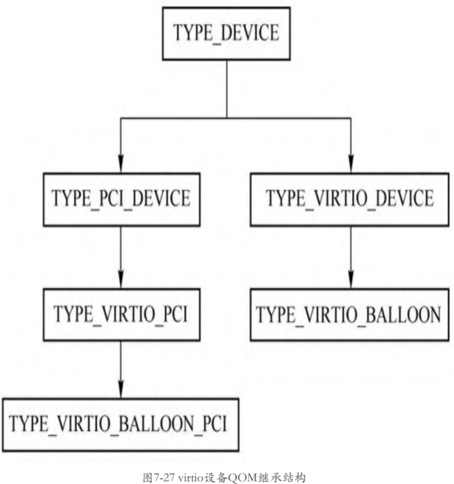
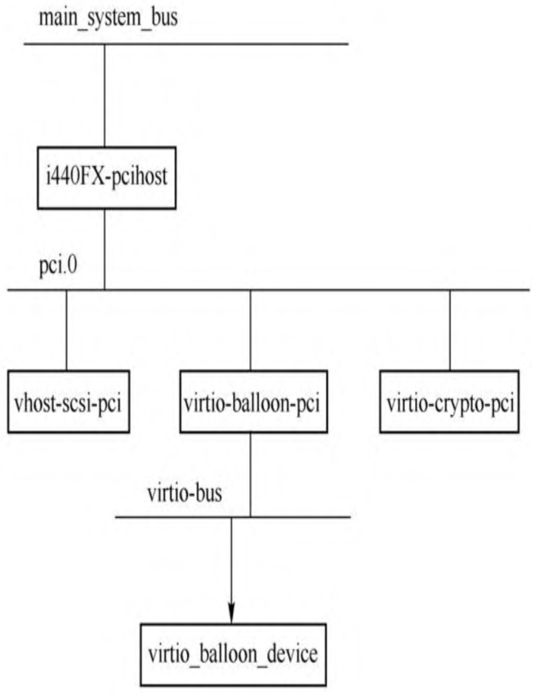
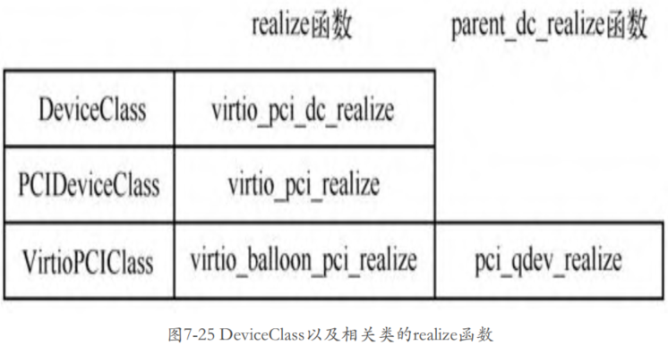
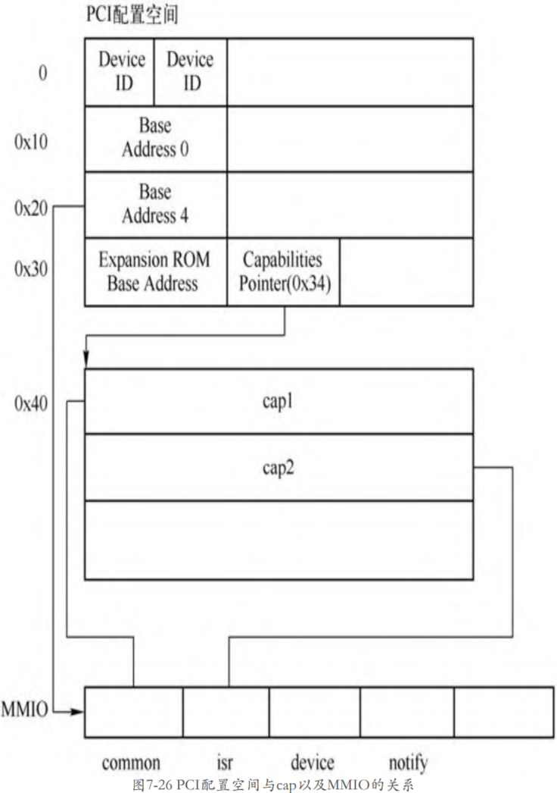
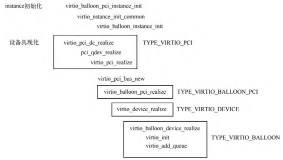

<!-- @import "[TOC]" {cmd="toc" depthFrom=1 depthTo=6 orderedList=false} -->

<!-- code_chunk_output -->

- [1. 初始化概述](#1-初始化概述)
- [2. 相关设备结构](#2-相关设备结构)
  - [2.1. 继承关系](#21-继承关系)
    - [2.1.1. PCI 总线](#211-pci-总线)
    - [2.1.2. Virtio 总线](#212-virtio-总线)
  - [2.2. virtio PCI 代理设备父类](#22-virtio-pci-代理设备父类)
  - [2.3. virtio PCI 代理设备子类](#23-virtio-pci-代理设备子类)
  - [2.4. virtio PCI 设备父类](#24-virtio-pci-设备父类)
  - [2.5. virtio PCI 设备子类](#25-virtio-pci-设备子类)
  - [2.6. 实现逻辑](#26-实现逻辑)
- [3. virtio 设备初始化](#3-virtio-设备初始化)
  - [3.1. virtio PCI 代理设备子类实例化](#31-virtio-pci-代理设备子类实例化)
  - [3.2. realize 函数设置](#32-realize-函数设置)
    - [3.2.1. realize 属性](#321-realize-属性)
    - [3.2.2. DeviceClass 类设置](#322-deviceclass-类设置)
    - [3.2.3. PCIDeviceClass 类重写](#323-pcideviceclass-类重写)
    - [3.2.4. VirtioPCIClass 类重写](#324-virtiopciclass-类重写)
    - [3.2.5. virtio PCI 代理设备子类重写](#325-virtio-pci-代理设备子类重写)
  - [3.3. 设备具现化](#33-设备具现化)
    - [3.3.1. 整体调用栈](#331-整体调用栈)
    - [3.3.2. DeviceClass->realize](#332-deviceclass-realize)
    - [3.3.3. VirtioPCIClass->parent_dc_realize](#333-virtiopciclass-parent_dc_realize)
    - [3.3.4. PCIDeviceClass->realize](#334-pcideviceclass-realize)
    - [3.3.5. VirtioPCIClass->realize](#335-virtiopciclass-realize)
    - [3.3.6. virtio_device_realize](#336-virtio_device_realize)
      - [3.3.6.1. virtio_balloon_device_realize](#3361-virtio_balloon_device_realize)
        - [3.3.6.1.1. virtio_init](#33611-virtio_init)
        - [3.3.6.1.2. virtio_add_queue](#33612-virtio_add_queue)
      - [3.3.6.2. virtio_bus_device_plugged](#3362-virtio_bus_device_plugged)
- [4. 小结](#4-小结)

<!-- /code_chunk_output -->

# 1. 初始化概述

virtio 设备**首先**需要创建一个 **PCI 设备**, 叫作 **virtio PCI 代理设备**(具体子类), 这个**代理设备**挂到 **PCI 总线**上, 接着 virtio 代理设备再**创建一条 virtio 总线**, 这样真正的 **virtio 设备**就可以挂到这条总线上了.

# 2. 相关设备结构

根据上面描述, 一层一层包括:

* PCI 总线 -> virtio PCI 代理设备 -> virtio 总线 -> 真正的 virtio PCI 设备

## 2.1. 继承关系

以 virtio_balloon 设备举例, 具体实现来讲, 涉及两个方面的类型继承关系, 如图.



### 2.1.1. PCI 总线

* `TYPE_DEVICE`(instance 是 `DeviceState`, class 是 `DeviceClass`, Device 类型) ->

* `TYPE_PCI_DEVICE`(instance 是 `PCIDevice`, class 是 `PCIDeviceClass`, PCI Device 类型) ->

* `TYPE_VIRTIO_PCI`(instance 是 `VirtIOPCIProxy`, class 是 `VirtioPCIClass`, virtio PCI 代理设备的抽象父类) ->

* `TYPE_VIRTIO_BALLOON_PCI`(instance 是 `VirtIOBalloonPCI`, class 还是 `VirtioPCIClass`, virtio balloon PCI 代理设备的具体子类) ->

### 2.1.2. Virtio 总线

* `TYPE_DEVICE`(instance 是 `DeviceState`, class 是 `DeviceClass`, Device 类型) ->

* `TYPE_VIRTIO_DEVICE`(instance 是 `VirtIODevice`, class 是 `VirtioDeviceClass`, Virtio Device 类型) ->

* `TYPE_VIRTIO_BALLOON`(instance 是 `VirtIOBalloon`, class 还是 `VirtioDeviceClass`, 真正的 virtio balloon 设备)

## 2.2. virtio PCI 代理设备父类

> **virtio PCI 代理设备**的**通用结构**, 没有实例对象

首先看 **virtio PCI 代理设备**类型的定义.

```cpp
// hw/virtio/virtio-pci.c
static const TypeInfo virtio_pci_info = {
    .name          = TYPE_VIRTIO_PCI,
    // 父类, PCI Device
    .parent        = TYPE_PCI_DEVICE,
    // 当前实例
    .instance_size = sizeof(VirtIOPCIProxy),
    .class_init    = virtio_pci_class_init,
    // 类型
    .class_size    = sizeof(VirtioPCIClass),
    .abstract      = true,
};
```

**virtio PCI 代理设备**的:

* **父设备**是**一个 PCI 设备**;

* 类型为 **VirtioPCIClass**;

* 实例为 **VirtIOPCIProxy**

注意这是一个**抽象设备**, 所以并**不能创建其实例**, 只能由**其子类去创建**. QEMU 中定义了**所有 virtio 设备的 PCI 代理设备**, 如 virtio balloon PCI 设备、virtio scsi PCI 设备、virito crypto PCI 设备, 其定义分别如下所示.

## 2.3. virtio PCI 代理设备子类

> 具体的 virtio 设备的 PCI 代理设备, 每个 virtio 设备对应一个

```cpp
// hw/virtio/virtio-pci.c
static const TypeInfo virtio_balloon_pci_info = {
    .name          = TYPE_VIRTIO_BALLOON_PCI,
    .parent        = TYPE_VIRTIO_PCI,
    // 当前实例
    .instance_size = sizeof(VirtIOBalloonPCI),
    .instance_init = virtio_balloon_pci_instance_init,
    .class_init    = virtio_balloon_pci_class_init,
};

static const TypeInfo virtio_scsi_pci_info = {
    .name          = TYPE_VIRTIO_SCSI_PCI,
    .parent        = TYPE_VIRTIO_PCI,
    // 当前实例
    .instance_size = sizeof(VirtIOSCSIPCI),
    .instance_init = virtio_scsi_pci_instance_init,
    .class_init    = virtio_scsi_pci_class_init,
};

static const TypeInfo virtio_blk_pci_info = {
    .name          = TYPE_VIRTIO_BLK_PCI,
    .parent        = TYPE_VIRTIO_PCI,
    // 当前实例
    .instance_size = sizeof(VirtIOBlkPCI),
    .instance_init = virtio_blk_pci_instance_init,
    .class_init    = virtio_blk_pci_class_init,
};

// hw/virtio/virtio-crypto-pci.c
static const TypeInfo virtio_crypto_pci_info = {
    .name          = TYPE_VIRTIO_CRYPTO_PCI,
    // 父类是 Virtio PCI
    .parent        = TYPE_VIRTIO_PCI,
    // 当前实例
    .instance_size = sizeof(VirtIOCryptoPCI),
    .instance_init = virtio_crypto_initfn,
    .class_init    = virtio_crypto_pci_class_init,
};
```

virtio 设备在系统的设备树中的位置如图:



通过 "`info qtree`" 也可以看到设备结构

```
(qemu) info qtree
info qtree
bus: main-system-bus                // 系统总线
  type System
  dev: i440FX-pcihost, id ""        // 北桥
    bus: pci.0                      // pci 总线
      type PCI
      dev: virtio-net-pci, id ""    // virtio-net-pci 代理设备
        bus: virtio-bus             // virtio 总线
          type virtio-peci-bus
          dev: virtio-net-device, id "" // virtio-net 设备
      dev: rtl8139, id "net0"
      dev: virtio-blk-pci, id "virtio-disk0" // virtio-blk-pci 代理设备
        bus: virtio-bus                 // virtio 总线
          type virtio-pci-bus
          dev: virtio-blk-device, id "" // virtio-blk 设备
```

## 2.4. virtio PCI 设备父类

> **virtio PCI 公共设备**的**实例对象**

**所有的 virtio 设备**都有一个**共同的父类** `TYPE_VIRTIO_DEVICE`.

```cpp
// hw/virtio/virtio.c
static const TypeInfo virtio_device_info = {
    .name = TYPE_VIRTIO_DEVICE,
    // 父类是 device
    .parent = TYPE_DEVICE,
    .instance_size = sizeof(VirtIODevice),
    .class_init = virtio_device_class_init,
    .instance_finalize = virtio_device_instance_finalize,
    .abstract = true,
    .class_size = sizeof(VirtioDeviceClass),
};
```

## 2.5. virtio PCI 设备子类

> 具体的 virtio pci 设备, 每个 virtio 设备对应一个

如 virtio balloon 设备的定义如下.

```cpp
// hw/virtio/virtio-balloon.c
static const TypeInfo virtio_balloon_info = {
    .name = TYPE_VIRTIO_BALLOON,
    // 父类, Virtio Device
    .parent = TYPE_VIRTIO_DEVICE,
    // 当前实例
    .instance_size = sizeof(VirtIOBalloon),
    .instance_init = virtio_balloon_instance_init,
    .class_init = virtio_balloon_class_init,
};
```

virtio balloon 设备的实例对象为 `VirtIOBalloon`.

## 2.6. 实现逻辑

具体的 **virtio PCI 设备**、**virtio PCI 代理设备**、**virtio PCI 公共设备**的关系如图所示.


> 看起来是以 virtio PCI 代理设备子类为核心

以 virtio balloon 设备为例:

* `VirtIOBalloonPCI` 是 **virtio balloon PCI 代理设备**的**实例对象**, 其**包括两个部分**:

  * 一个是 **VirtIOPCIProxy**(virtio PCI 代理设备父类), 这个是 **virtio PCI 代理设备**的**通用结构**, 里面存放了具体 virtio PCI 代理设备的相关成员;

  * 另一个是 **VirtIOBalloon**(virtio balloon PCI 设备), 这个结构里面存放的是 **virtio balloon 设备**的相关数据, 其:

    * 第一个成员是 **VirtIODevice**, 也就是 **virtio PCI 公共设备的实例对象**;

    * VirtIOBalloon 剩下的成员是**与 virtio balloon 设备相关的数据**.

# 3. virtio 设备初始化

这里以 virtio balloon 设备为例分析 virtio 设备的初始化过程.

## 3.1. virtio PCI 代理设备子类实例化

创建 virtio balloon 时**只需要**创建其 **virtio balloon PCI 代理设备**(即 `TYPE_VIRTIO_BALLOON_PCI`)即可, 在命令行指定 `-device virtio-balloon-pci,id=balloon0,bus=pci.0,addr=0x4`.

所以符合前面说的**以 virtio PCI 代理设备子类**为核心, 实例化函数是 `virtio_balloon_pci_instance_init()`

```cpp
// hw/virtio/virtio-pci.c
static void virtio_balloon_pci_instance_init(Object *obj)
{
    // virtio balloon PCI 代理设备
    VirtIOBalloonPCI *dev = VIRTIO_BALLOON_PCI(obj);
    // 这里传入的参数
    // obj: 还是 TYPE_VIRTIO_BALLOON_PCI
    // &dev->vdev: TYPE_VIRTIO_BALLOON, 也就是具体的 virtio 设备, 而不是 virtio pci 代理设备
    // #define TYPE_VIRTIO_BALLOON "virtio-balloon-device"
    virtio_instance_init_common(obj, &dev->vdev, sizeof(dev->vdev),
                                TYPE_VIRTIO_BALLOON);
    ......
}
```

```cpp
// hw/virtio/virtio.c
void virtio_instance_init_common(Object *proxy_obj, void *data,
                                 size_t vdev_size, const char *vdev_name)
{
    // VirtIOBalloonPCI->vdev, 对应具体的 Virtio Balloon 设备(即子类)
    DeviceState *vdev = data;
    // vdev: TYPE_VIRTIO_BALLOON 实例, virtio PCI 设备
    // vdev_name: "virtio-balloon-device"
    // 初始化具体的 virtio balloon 设备
    object_initialize(vdev, vdev_size, vdev_name);
    // proxy_obj 是 virtio balloon PCI 代理设备
    // OBJECT(vdev) 是 virtio 设备
    // 添加属性
    object_property_add_child(proxy_obj, "virtio-backend", OBJECT(vdev), NULL);
    object_unref(OBJECT(vdev));
    qdev_alias_all_properties(vdev, proxy_obj);
}

// data: TYPE_VIRTIO_BALLOON, 对应具体的 Virtio Balloon PCI 设备(不是 virtio balloon pci 代理设备)
// typename: "virtio-balloon-device"
void object_initialize(void *data, size_t size, const char *typename)
{
    // 获取到的对应 TypeInfo virtio_balloon_info
    TypeImpl *type = type_get_by_name(typename);
    ...
    object_initialize_with_type(data, size, type);
}

// obj: TYPE_VIRTIO_BALLOON, 对应具体的 Virtio Balloon PCI 设备(不是 virtio balloon pci 代理设备)
// type: TypeInfo virtio_balloon_info
static void object_initialize_with_type(Object *obj, size_t size, TypeImpl *type)
{
    //
    type_initialize(type);
    ......
    // TYPE_VIRTIO_BALLOON
    // 先调用父类的 instance_init, 再调用自己的
    object_init_with_type(obj, type);
    // 先调用自己的 instance_post_init, 再调用父类的
    object_post_init_with_type(obj, type);
}

static void object_init_with_type(Object *obj, TypeImpl *ti)
{
    if (type_has_parent(ti)) {
        object_init_with_type(obj, type_get_parent(ti));
    }
    // 先调用父类
    if (ti->instance_init) {
        ti->instance_init(obj);
    }
}

static void object_post_init_with_type(Object *obj, TypeImpl *ti)
{
    // 先调用子类
    if (ti->instance_post_init) {
        ti->instance_post_init(obj);
    }

    if (type_has_parent(ti)) {
        object_post_init_with_type(obj, type_get_parent(ti));
    }
}
```

通过 **virtio pci 代理设备**来执行**具体的 virtio 设备**(`TYPE_VIRTIO_BALLOON`) 的初始化, 先递归调用**父类型**的 `instance_init`, 最后调用**自己**的 `instance_init`.

这里是**具体的 virtio 设备**(`TYPE_VIRTIO_BALLOON`), 而不是 virtio pci 代理设备(`TYPE_VIRTIO_BALLOON_PCI`), 所以父类是 `TYPE_VIRTIO_DEVICE` 和 `TYPE_DEVICE`:

* 祖父类 `TYPE_DEVICE` 的 `instance_init` 是 `device_initfn`;

  * 仅仅变量初始化以及初始化链表, 没有其他具体初动作

* 父类 `TYPE_VIRTIO_DEVICE` 没有 `instance_init`

其实核心就是调用 `object_initialize` **初始化** `TYPE_VIRTIO_BALLOON`(**具体的 virtio balloon PCI 设备**, "`virtio-balloon-device`") 的实例对象 **VirtIOBalloon**, 然后添加一些属性.

由此可见, virtio PCI 代理设备子类在**实例创建过程**中并没有做很多事情, 大部分的工作是在**设备的具现化过程中**做的.

## 3.2. realize 函数设置

在介绍 virtio balloon 设备的**具现化之前**, 先来回顾一下设备具现化调用的函数.

### 3.2.1. realize 属性

**virtio 设备类**的**继承链关系**为 `DeviceClass -> PCIDeviceClass -> VirtioPCIClass`.

QEMU 在 **main** 函数中会对**所有** `-device` 的**参数**进行**具现化**.

**设备的具现化函数**都会调用 `device_set_realized` 函数设置 "realized" 属性, 在该函数中会先调用 DeviceClass(**设备类**)的 **realize** 函数, 然后层层调用相关的 realize 函数.

```cpp
main()
  qemu_opts_foreach(qemu_find_opts("device"),device_init_func, NULL, NULL)
    qdev_device_add()
      const char *driver, *path;
      DeviceState *dev;
      dev = DEVICE(object_new(driver));
      object_property_set_bool(OBJECT(dev), true, "realized", &err);
```

> `hw/core/qdev.c` 中定义了 device 类, 是**所有设备的父类**. 该 class 初始化(`device_class_init`)时候定义了 "realized" 的属性:
>
> * `device_get_realized`, 获取 realized 属性
>
> * `device_set_realized`, 用来设置 realized 属性

### 3.2.2. DeviceClass 类设置

上面 `object_initialize()` 会调用 **类型初始化函数** `type_initialize()`, 函数会先递归调用**父设备类型**的 `class_init()`, 最后调用**自身类型**的 `class_init()`.

```cpp
TypeImpl *ti; //
ti->class_init(ti->class, ti->class_data);
```

其中:

* class 属性是在 `type_initialize()` 中设置的

* `class_data` 对应 TypeInfo 的 `class_data`

> DeviceClass 类初始化(`device_class_init`)时候并没有设置 `DeviceClass->realize` 函数.

**最开始**调用的应该是 **DeviceClass** 的 **realize** 函数, 这个默认没有函数.

### 3.2.3. PCIDeviceClass 类重写

> **virtio 设备类**的**继承链关系**为 `DeviceClass -> PCIDeviceClass -> VirtioPCIClass`.

当然, 如果**继承**自 **DeviceClass** 的类可以**重写**这个函数, 如 **PCIDeviceClass** 类就在其类初始化函数 `pci_device_class_init` 中设置.

> 后面**继承** PCIDeviceClass 的类可以在**自己的类初始化函数**中设置 **realize** 函数.

```cpp
// hw/pci/pci.c
static const TypeInfo pci_device_type_info = {
    .name = TYPE_PCI_DEVICE,
    .parent = TYPE_DEVICE,
    .instance_size = sizeof(PCIDevice),
    .abstract = true,
    .class_size = sizeof(PCIDeviceClass),
    .class_init = pci_device_class_init,
    .class_base_init = pci_device_class_base_init,
};

static void pci_device_class_init(ObjectClass *klass, void *data)
{
    // DeviceClass
    DeviceClass *k = DEVICE_CLASS(klass);
    // 重写 DeviceClass 的 realize 设置
    k->realize = pci_qdev_realize;
    k->unrealize = pci_qdev_unrealize;
    k->bus_type = TYPE_PCI_BUS;
    device_class_set_props(k, pci_props);
}
```

* 将 `DeviceClass->realize` 重写为 `pci_qdev_realize`

* 现有代码其实并没有设置 **PCIDeviceClass** 的 realize 方法.

在 **VirtioPCIClass** 类还**没有初始化**时的 realize 函数, 如下图所示.


> 图中 `PCIDeviceClass->realize` 其实并没有

### 3.2.4. VirtioPCIClass 类重写

> virtio PCI 代理设备父类

VirtioPCIClass 的初始化函数, 该类相关的定义是在**所有 virtio PCI 代理设备**的**父设备** `TYPE_VIRTIO_PCI`(**virtio PCI 代理设备父类**) 中进行的, 其中的**类初始化函数**是 `virtio_pci_class_init`.

`virtio_pci_class_init` 的函数定义如下.

```cpp
// hw/virtio/virtio-pci.c
static void virtio_pci_class_init(ObjectClass *klass, void *data)
{
    // DeviceClass, 设备类
    DeviceClass *dc = DEVICE_CLASS(klass);
    // PCIDeviceClass, PCI 设备类
    PCIDeviceClass *k = PCI_DEVICE_CLASS(klass);
    // VirtioPCIClass, virtio PCI 代理设备父类
    VirtioPCIClass *vpciklass = VIRTIO_PCI_CLASS(klass);

    dc->props = virtio_pci_properties;
    // 第一, PCIDeviceClass
    k->realize = virtio_pci_realize;
    k->exit = virtio_pci_exit;
    k->vendor_id = PCI_VENDOR_ID_REDHAT_QUMRANET;
    k->revision = VIRTIO_PCI_ABI_VERSION;
    k->class_id = PCI_CLASS_OTHERS;
    // pci_qdev_realize
    // 第二, VirtioPCIClass
    vpciklass->parent_dc_realize = dc->realize;
    // 第三, DeviceClass
    dc->realize = virtio_pci_dc_realize;
    dc->ret = virtio_pci_reset;
}
```

第一. PCIDeviceClass(**PCI 设备类**). 把 `PCIDeviceClass->realize` 函数替换成了自己的 `virtio_pci_realize` 函数;

第二. VirtioPCIClass(**virtio PCI 代理设备父类**). 将 `vpciklass->parent_dc_realize` 设置成了 `dc->realize`, 这个值是 `pci_qdev_realize`;

第三. DeviceClass(**设备类**). 将 `dc->realize` 设置成了 `virtio_pci_dc_realize`.

通常来说**父类**的 **realize** 函数会调用**子类**的 **realize** 函数, 如 `DeviceClass->realize`(`pci_qdev_realize`)会调用 `PCIDeviceClass->realize` 回调, `PCIDeviceClass->realize` 回调可以调用**子类型**的 **realize** 函数. 但是这两条语句改变了这个顺序. 这里 `dc->realize` 成了 `virtio_pci_dc_realize`, 所以这个函数会**最先执行**, 然后将**原来**的 `dc->realize`(`pci_qdev_realize`) 保存到 `VirtioPCIClass->parent_dc_realize` 函数中. 通常在设备具现化过程中**子类型**的 realize 函数需要先做某些事情的时候会使用这种方法.

### 3.2.5. virtio PCI 代理设备子类重写

> virtio PCI 代理设备子类, VirtIOBalloonPCI

回到 virtio balloon PCI 代理设备子类类型的初始化函数 `virtio_balloon_pci_class_init`.

```cpp
//
static void virtio_balloon_pci_class_init(ObjectClass *klass, void *data)
{
    // DeviceClass
    DeviceClass *dc = DEVICE_CLASS(klass);
    // VirtioPCIClass
    VirtioPCIClass *k = VIRTIO_PCI_CLASS(klass);
    // PCIDeviceClass
    PCIDeviceClass *pcidev_k = PCI_DEVICE_CLASS(klass);
    // VirtioPCIClass 的
    k->realize = virtio_balloon_pci_realize;
    ......
}
```

其设置了 `VirtioPCIClass->realize` 函数为 `virtio_balloon_pci_realize`

综上所述, **virtio balloon** 相关类涉及的 realize 函数如图所示.



## 3.3. 设备具现化

### 3.3.1. 整体调用栈

**设置 virtio PCI 代理设备**的 `realized` 属性时, 会调用 **DeviceClass** 的 `device_set_realized` 函数:

* 首先调用 **DeviceClass**(**Device 类**) 的 `realize`, 也就是这里的 `virtio_pci_dc_realize`;

* `virtio_pci_dc_realize` 函数中会调用 `VirtioPCIClass->parent_dc_realize` 函数, 也就是这里的 `pci_qdev_realize`;

* 在 `pci_qdev_realize` 会调用 **PCIDeviceClass**(**PCI Device 类**) 的 realize 函数, 也就是这里的 `virtio_pci_realize`.

* 在这个函数的最后会调用 **VirtioPCIClass**(**Virtio PCI 类**) 的 realize 函数, 也就是这里的 `virtio_balloon_pci_realize`.

### 3.3.2. DeviceClass->realize

> Device 类型

所以当**具现化** `TYPE_VIRTIO_BALLOON` 的时候, 首先会调用 `virtio_pci_dc_realize`, 该函数代码如下.

```cpp
// hw/virtio/virtio-pci.c
static void virtio_pci_dc_realize(DeviceState *qdev, Error **errp)
{
    // 对应的 virtio pci 代理设备
    VirtioPCIClass *vpciklass = VIRTIO_PCI_GET_CLASS(qdev);
    // 对应 virtio pci 代理设备的抽象父类
    VirtIOPCIProxy *proxy = VIRTIO_PCI(qdev);
    // 对应的 PCIDevice
    PCIDevice *pci_dev = &proxy->pci_dev;
    // 第一, PCIe 接口
    if (!(proxy->flags & VIRTIO_PCI_FLAG_DISABLE_PCIE) &&
        virtio_pci_modern(proxy)) {
        pci_dev->cap_present |= QEMU_PCI_CAP_EXPRESS;
    }
    // 第二
    vpciklass->parent_dc_realize(qdev, errp);
}
```

第一. 判断了 **virtio PCI 代理设备**是否具有 `VIRTIO_PCI_FLAG_DISABLE_PCIE` 特性, 它使得 **virtioPCI 代理**展现出 **PCIe 的接口**.

第二. 特性之后将调用 `parent_dc_realize` 函数, 即 `pci_qdev_realize`.

### 3.3.3. VirtioPCIClass->parent_dc_realize

> VirtioPCIClass 是 真正的 virtio balloon 设备, parent 是 Virtio Device 类型

`pci_qdev_realize` 已经在之前 PCI 设备模拟中分析了, 该函数会将 **virtioPCI 代理设备**注册到 **PCI 总线**上, 并调用 `PCIDeviceClass->realize`, 也就是 `virtio_pci_realize` 函数.

### 3.3.4. PCIDeviceClass->realize

> PCI Device 类型

`virtio_pci_realize` 函数初始化 **virtio PCI 代理设备的通用结构**, 也就是**结构体 VirtIOPCIProxy**.

```cpp
//
static void virtio_pci_realize(PCIDevice *pci_dev, Error **errp)
{
    // virtio PCI 代理设备父类
    VirtIOPCIProxy *proxy = VIRTIO_PCI(pci_dev);
    //
    VirtioPCIClass *k = VIRTIO_PCI_GET_CLASS(pci_dev);
    bool pcie_port = pci_bus_is_express(pci_get_bus(pci_dev)) &&
                     !pci_bus_is_root(pci_get_bus(pci_dev));

    ......
    /*
     * virtio pci bar layout used by default.
     * subclasses can re-arrange things if needed.
     *
     *   region 0   --  virtio legacy io bar
     *   region 1   --  msi-x bar
     *   region 2   --  virtio modern io bar (off by default)
     *   region 4+5 --  virtio modern memory (64bit) bar
     *
     */
    // 第一, 多个 BAR
    proxy->legacy_io_bar_idx  = 0;
    proxy->msix_bar_idx       = 1;
    proxy->modern_io_bar_idx  = 2;
    proxy->modern_mem_bar_idx = 4;
    // 第二, 多个 capability
    // CommonCfg
    proxy->common.offset = 0x0;
    proxy->common.size = 0x1000;
    proxy->common.type = VIRTIO_PCI_CAP_COMMON_CFG;
    // ISR
    proxy->isr.offset = 0x1000;
    proxy->isr.size = 0x1000;
    proxy->isr.type = VIRTIO_PCI_CAP_ISR_CFG;
    // DeviceCfg
    proxy->device.offset = 0x2000;
    proxy->device.size = 0x1000;
    proxy->device.type = VIRTIO_PCI_CAP_DEVICE_CFG;
    // Notify
    proxy->notify.offset = 0x3000;
    proxy->notify.size = virtio_pci_queue_mem_mult(proxy) * VIRTIO_QUEUE_MAX;
    proxy->notify.type = VIRTIO_PCI_CAP_NOTIFY_CFG;

    proxy->notify_pio.offset = 0x0;
    proxy->notify_pio.size = 0x4;
    proxy->notify_pio.type = VIRTIO_PCI_CAP_NOTIFY_CFG;

    /* subclasses can enforce modern, so do this unconditionally */
    // 第三
    memory_region_init(&proxy->modern_bar, OBJECT(proxy), "virtio-pci",
                        /* PCI BAR regions must be powers of 2 */
                        pow2ceil(proxy->notify.offset + proxy->notify.size));
    // 第三
    memory_region_init_alias(&proxy->modern_cfg,
                            OBJECT(proxy),
                            "virtio-pci-cfg",
                            &proxy->modern_bar,
                            0,
                            memory_region_size(&proxy->modern_bar));

    address_space_init(&proxy->modern_as, &proxy->modern_cfg, "virtio-pci-cfg-as");

    if (proxy->disable_legacy == ON_OFF_AUTO_AUTO) {
        proxy->disable_legacy = pcie_port ? ON_OFF_AUTO_ON : ON_OFF_AUTO_OFF;
    }

    ......

    if (pcie_port && pci_is_express(pci_dev)) {
        ......
    } else {
        /*
         * make future invocations of pci_is_express() return false
         * and pci_config_size() return PCI_CONFIG_SPACE_SIZE.
         */
        pci_dev->cap_present &= ~QEMU_PCI_CAP_EXPRESS;
    }
    // 第四, 创建 virtio 总线
    virtio_pci_bus_new(&proxy->bus, sizeof(proxy->bus), proxy);
    // 第五
    if (k->realize) {
        k->realize(proxy, errp);
    }
}
```

第一. 初始化 VirtIOPCIProxy 设备的**多个 BAR 数据**, 设置了这些 BAR 的**索引号**, 其中 `legacy I/O` 地址为 0, `msi-x` 地址为 1, `modern IO` 地址为 2, `modern MMIO` 地址为 4.

这里的 legacy 和 modern 指的是**不同**的 virtio **版本**, 下面以 modern 为例说明.

第二. 初始化了**多个 VirtIOPCIRegion**(多个 capability), 如 VirtIOPCIProxy 的 common、isr、device、notify 等成员.

**VirtIOPCIRegion** 保存了 **VirtIOPCIProxy 设备 modern MMIO 的相关信息**, 如 VirtIOPCIProxy 的 modern MMIO 中, 最开始区域是 **common** 区域, 其大小为 0x1000, 接着是 isr 区域, 大小也是 0x1000, 依次类推到 notify 区域.

**VirtIOPCIRegion** 用来表示 virtio 设备的**配置空间信息**, 后面会单独介绍.

第三. VirtIOPCIProxy 的 modern MMIO 对应的 MemoryRegion 存放在 VirtIOPCIProxy 的 `modern_bar` 成员中, 它还有一个 MemoryRegion 存放在 `modern_cfg` 成员中.

> 将四个 capability 这部分

第四. 调用 `virtio_pci_bus_new` 创建 **virtio-bus**, 挂载到**当前的 virtio PCI 代理设备下面**.

第五. 最后调用了 `k->realize` 函数, 按照刚才的分析, 这个回调函数对应的是 `virtio_balloon_pci_realize`.

### 3.3.5. VirtioPCIClass->realize

> virtio balloon PCI 代理设备的具体子类

```cpp
// hw/virtio/virtio-pci.c
static void virtio_balloon_pci_realize(VirtIOPCIProxy *vpci_dev, Error **errp)
{
    // 第一, VirtIOBalloonPCI 代理设备(子类)
    VirtIOBalloonPCI *dev = VIRTIO_BALLOON_PCI(vpci_dev);
    // 第二, vdev 是实际的 virtio balloon 设备, TYPE_VIRTIO_BALLOON
    DeviceState *vdev = DEVICE(&dev->vdev);

    if (vpci_dev->class_code != PCI_CLASS_OTHERS &&
        vpci_dev->class_code != PCI_CLASS_MEMORY_RAM) { /* qemu < 1.1 */
        vpci_dev->class_code = PCI_CLASS_OTHERS;
    }
    // 第三, 设置 vdev 的总线为 BUS(&vpci_dev->bus), 这是上面创建的 virtio 总线
    qdev_set_parent_bus(vdev, BUS(&vpci_dev->bus));
    // 第四, 对应了实际的 virtio balloon 设备的 realized 属性
    object_property_set_bool(OBJECT(vdev), true, "realized", errp);
}
```

第一. 通过宏将 **VirtIOPCIProxy 类型的设备**转换为 **VirtIOBalloonPCI 设备**, 相当于从一个**父类**转换到一个**子类**.

第二. 接着得到设备 VirtIOBalloonPCI 的 VirtIOBalloon 部分, 这个就是实际的 virtio balloon 设备了.

第三. 设置 **virtio balloon 设备**的**总线**为 **VirtIOPCIProxy 设备**中的 **bus 成员**, 也就是把**这个 virtio balloon 设备**挂到了 **virtio 总线**上.

第四. 接下来调用 `object_property_set_bool` 将 **virtio balloon 设备具现化**, 这会导致 `virtio_device_realize` 的执行.

```cpp
static void virtio_device_class_init(ObjectClass *klass, void *data)
{
    /* Set the default value here. */
    VirtioDeviceClass *vdc = VIRTIO_DEVICE_CLASS(klass);
    DeviceClass *dc = DEVICE_CLASS(klass);
    // 定义
    dc->realize = virtio_device_realize;
    dc->unrealize = virtio_device_unrealize;
    dc->bus_type = TYPE_VIRTIO_BUS;
    dc->props = virtio_properties;
    vdc->start_ioeventfd = virtio_device_start_ioeventfd_impl;
    vdc->stop_ioeventfd = virtio_device_stop_ioeventfd_impl;

    vdc->legacy_features |= VIRTIO_LEGACY_FEATURES;
}
static const TypeInfo virtio_device_info = {
    // TYPE_VIRTIO_BALLOON 的父类, Virtio Device 类型
    .name = TYPE_VIRTIO_DEVICE,
    .parent = TYPE_DEVICE,
    .instance_size = sizeof(VirtIODevice),
    .class_init = virtio_device_class_init,
    .instance_finalize = virtio_device_instance_finalize,
    .abstract = true,
    .class_size = sizeof(VirtioDeviceClass),
};
```

### 3.3.6. virtio_device_realize

> TYPE_VIRTIO_DEVICE, Virtio Device 类型, 通用的

这其实是一个**通用函数**, 是类型为 `TYPE_VIRTIO_DEVICE` 抽象设备(**virtio PCI 设备父类**)的具现化函数, **所有的 virtio 设备**在**初始化**的时候都会调用这个函数.

```cpp
// hw/virtio/virtio.c
static void virtio_device_realize(DeviceState *dev, Error **errp)
{
    // 当前实例 instance
    VirtIODevice *vdev = VIRTIO_DEVICE(dev);
    // 第一, 真正的 virtio balloon 设备
    VirtioDeviceClass *vdc = VIRTIO_DEVICE_GET_CLASS(dev);
    ...
    // 第二, 真正的 virtio balloon 设备 的 realize 函数
    if (vdc->realize != NULL) {
        vdc->realize(dev, &err);
        ...
    }
    // 第三, 将 virtio 设备挂载 virtio 总线
    virtio_bus_device_plugged(vdev, &err);
    ...
}
```

第一. 首先**得到 virtio 设备所属的类**

第二. 调用**具体类**的 realize 函数, 对于 virtio balloon 设备来说是 `virtio_balloon_device_realize`, 这个函数稍后会做分析.

第三. 调用 `virtio_bus_device_plugged` 函数, 将 **virtio 设备**挂载 **virtio 总线**上.

#### 3.3.6.1. virtio_balloon_device_realize

> TYPE_VIRTIO_BALLOON, 真正的 virtio balloon 设备

接下来分析 virtio balloon 设备的具现化函数 `virtio_balloon_device_realize`, 它用于实现 `TYPE_VIRTIO_BALLOON` 的具现化.

```cpp
// hw/virtio/virtio-balloon.c
static void virtio_balloon_device_realize(DeviceState *dev, Error **errp)
{
    // virtio PCI 设备父类实例
    VirtIODevice *vdev = VIRTIO_DEVICE(dev);
    // virtio balloon 设备的实例
    VirtIOBalloon *s = VIRTIO_BALLOON(dev);
    int ret;
    // 第一, 初始化 virtio 设备的公共部分, 即 TYPE_VIRTIO_DEVICE
    virtio_init(vdev, "virtio-balloon", VIRTIO_ID_BALLOON,
                sizeof(struct virtio_balloon_config));

    ret = qemu_add_balloon_handler(virtio_balloon_to_target,
                                   virtio_balloon_stat, s);

    ......
    // 第二
    s->ivq = virtio_add_queue(vdev, 128, virtio_balloon_handle_output);
    s->dvq = virtio_add_queue(vdev, 128, virtio_balloon_handle_output);
    s->svq = virtio_add_queue(vdev, 128, virtio_balloon_receive_stats);

    reset_stats(s);
}
```

第一. 首先调用 `virtio_init` 初始化 **virtio 设备的公共部分**. 初始化**所有 virtio 设备的基类** `TYPE_VIRTIO_DEVICE`(**virtio PCI 设备父类**) 的**实例** VirtIODevice 结构体.

第二. 调用 `virtio_add_queue` 函数创建了 **3 个 virtqueue**, virtqueue 是 virtio 设备的重要组成部分, 用来与虚拟机中的操作系统进行数据传输.

##### 3.3.6.1.1. virtio_init

> virtio 设备的公共部分, TYPE_VIRTIO_DEVICE

`virtio_init` 的代码如下

```cpp
// hw/virtio/virtio.c
void virtio_init(VirtIODevice *vdev, const char *name,
                 uint16_t device_id, size_t config_size)
{
    BusState *qbus = qdev_get_parent_bus(DEVICE(vdev));
    VirtioBusClass *k = VIRTIO_BUS_GET_CLASS(qbus);
    int i;
    int nvectors = k->query_nvectors ? k->query_nvectors(qbus->parent) : 0;

    // MSI 中断相关
    if (nvectors) {
        vdev->vector_queues =
            g_malloc0(sizeof(*vdev->vector_queues) * nvectors);
    }
    // 设备 ID, 这里是 VIRTIO_ID_BALLOON, 5
    vdev->device_id = device_id;
    // 设备状态
    vdev->status = 0;
    // 中断请求
    atomic_set(&vdev->isr, 0);
    // 选择队列
    vdev->queue_sel = 0;
    // MSI 中断相关, #define VIRTIO_NO_VECTOR 0xffff
    vdev->config_vector = VIRTIO_NO_VECTOR;
    // 设备的 virtio queue
    // #define VIRTIO_QUEUE_MAX 1024
    // 为什么直接是 1024 个?
    vdev->vq = g_malloc0(sizeof(VirtQueue) * VIRTIO_QUEUE_MAX);
    vdev->vm_running = runstate_is_running();
    vdev->broken = false;
    // virtio queue 初始化
    for (i = 0; i < VIRTIO_QUEUE_MAX; i++) {
        vdev->vq[i].vector = VIRTIO_NO_VECTOR;
        vdev->vq[i].vdev = vdev;
        vdev->vq[i].queue_index = i;
    }

    vdev->name = name;
    // 配置空间长度
    vdev->config_len = config_size;
    if (vdev->config_len) {
        // 配置空间区域
        vdev->config = g_malloc0(config_size);
    } else {
        vdev->config = NULL;
    }
    vdev->vmstate = qemu_add_vm_change_state_handler(virtio_vmstate_change,
                                                     vdev);
    vdev->device_endian = virtio_default_endian();
    // 与 irqfd 相关
    vdev->use_guest_notifier_mask = true;
}
```

`virtio_init` 函数对 VirtIODevice 的成员进行初始化.

* `vector_queues` 成员和 `config_vector` 成员与 **MSI 中断**相关;

* device_id、status、name 成员表示设备的 id、状态和名字;

* isr 用来表示中断请求;

* `queue_sel` 用来在进行**配置队列**的时候**选择队列**;

* vq 成员表示的是该**设备的 virtio queue**, 这里分配了 `VIRTIO_QUEUE_MAX` 个 queue 并且进行了**初始化**;

* `config_len` 和 `config` 表示该 virtio 设备**配置空间的长度**和**数据存放区域**;

* `use_guest_notifier_mask` 成员与 irqfd 有关.

##### 3.3.6.1.2. virtio_add_queue

`virtio_add_queue` 是 virtio 框架中用来**添加 virtqueue 的接口**, 其 3 个参数分别表示要添加的 **virtio 设备**、virtqueue 的**大小**以及**处理函数**.

```cpp
// hw/virtio/virtio.c
VirtQueue *virtio_add_queue(VirtIODevice *vdev, int queue_size,
                            VirtIOHandleOutput handle_output)
{
    int i;
    // 第一
    for (i = 0; i < VIRTIO_QUEUE_MAX; i++) {
        if (vdev->vq[i].vring.num == 0)
            break;
    }

    if (i == VIRTIO_QUEUE_MAX || queue_size > VIRTQUEUE_MAX_SIZE)
        abort();
    // 第二
    vdev->vq[i].vring.num = queue_size;
    vdev->vq[i].vring.num_default = queue_size;
    vdev->vq[i].vring.align = VIRTIO_PCI_VRING_ALIGN;
    // 第三
    vdev->vq[i].handle_output = handle_output;
    vdev->vq[i].handle_aio_output = NULL;

    return &vdev->vq[i];
}
```

第一. 从 VirtIODevice 的 vq 数组成员中找到还未被使用的一个 queue, 一个 virtqueue 使用 VirtQueue 结构体表示

第二. 对 VirtQueue 的成员进行初始化, 包括这个 queue 的大小以及 align 信息等;

第三. 最重要的是设置 VirtQueue 的 `handle_output` 成员, 这是一个**函数指针**, 在收到**虚拟机发过来的 IO 请求时**会调用存放在 `handle_output` 中的回调函数.

#### 3.3.6.2. virtio_bus_device_plugged

通过上面对各个函数的分析, 可以看到从 virtio PCI 代理设备的具现化到 virtio 设备的具现化过程, 但是上面的分析还遗漏了一部分, 就是 **virtio 设备挂载到 virtio 总线**上的行为.

`virtio_device_realize` -> `virtio_bus_device_plugged` 函数, 这个函数的作用就是将 virtio 设备插入 virtio 总线上去.

主要是调用了 VirtioBusClass 类型的 `device_plugged` 回调函数, 而该回调函数在 `virtio_pci_bus_class_init` 被初始化成了 `virtio_pci_device_plugged`, 其代码如下.

```cpp
// hw/virtio/virtio-pci.c
static void virtio_pci_device_plugged(DeviceState *d, Error **errp)
{
    VirtIOPCIProxy *proxy = VIRTIO_PCI(d);
    VirtioBusState *bus = &proxy->bus;
    bool legacy = virtio_pci_legacy(proxy);
    bool modern;
    bool modern_pio = proxy->flags & VIRTIO_PCI_FLAG_MODERN_PIO_NOTIFY;
    uint8_t *config;
    uint32_t size;
    VirtIODevice *vdev = virtio_bus_get_device(&proxy->bus);
    ......
    // 第一
    modern = virtio_pci_modern(proxy);

    config = proxy->pci_dev.config;
    if (proxy->class_code) {
        pci_config_set_class(config, proxy->class_code);
    }

    if (legacy) {
        ......
    } else {
        /* pure virtio-1.0 */
        // 第二
        pci_set_word(config + PCI_VENDOR_ID,
                     PCI_VENDOR_ID_REDHAT_QUMRANET);
        pci_set_word(config + PCI_DEVICE_ID,
                     0x1040 + virtio_bus_get_vdev_id(bus));
        pci_config_set_revision(config, 1);
    }
    config[PCI_INTERRUPT_PIN] = 1;


    if (modern) {
        // 第三
        struct virtio_pci_cap cap = {
            .cap_len = sizeof cap,
        };
        struct virtio_pci_notify_cap notify = {
            .cap.cap_len = sizeof notify,
            .notify_off_multiplier =
                cpu_to_le32(virtio_pci_queue_mem_mult(proxy)),
        };
        struct virtio_pci_cfg_cap cfg = {
            .cap.cap_len = sizeof cfg,
            .cap.cfg_type = VIRTIO_PCI_CAP_PCI_CFG,
        };
        struct virtio_pci_notify_cap notify_pio = {
            .cap.cap_len = sizeof notify,
            .notify_off_multiplier = cpu_to_le32(0x0),
        };

        struct virtio_pci_cfg_cap *cfg_mask;
        // 第四
        virtio_pci_modern_regions_init(proxy);
        // 第五
        virtio_pci_modern_mem_region_map(proxy, &proxy->common, &cap);
        virtio_pci_modern_mem_region_map(proxy, &proxy->isr, &cap);
        virtio_pci_modern_mem_region_map(proxy, &proxy->device, &cap);
        virtio_pci_modern_mem_region_map(proxy, &proxy->notify, &notify.cap);

        if (modern_pio) {
            memory_region_init(&proxy->io_bar, OBJECT(proxy),
                               "virtio-pci-io", 0x4);
            // 第六
            pci_register_bar(&proxy->pci_dev, proxy->modern_io_bar_idx,
                             PCI_BASE_ADDRESS_SPACE_IO, &proxy->io_bar);

            virtio_pci_modern_io_region_map(proxy, &proxy->notify_pio,
                                            &notify_pio.cap);
        }
        // 第六
        pci_register_bar(&proxy->pci_dev, proxy->modern_mem_bar_idx,
                         PCI_BASE_ADDRESS_SPACE_MEMORY |
                         PCI_BASE_ADDRESS_MEM_PREFETCH |
                         PCI_BASE_ADDRESS_MEM_TYPE_64,
                         &proxy->modern_bar);

        proxy->config_cap = virtio_pci_add_mem_cap(proxy, &cfg.cap);
        cfg_mask = (void *)(proxy->pci_dev.wmask + proxy->config_cap);
        pci_set_byte(&cfg_mask->cap.bar, ~0x0);
        pci_set_long((uint8_t *)&cfg_mask->cap.offset, ~0x0);
        pci_set_long((uint8_t *)&cfg_mask->cap.length, ~0x0);
        pci_set_long(cfg_mask->pci_cfg_data, ~0x0);
    }

    if (proxy->nvectors) {
        // 第七
        int err = msix_init_exclusive_bar(&proxy->pci_dev, proxy->nvectors,
                                          proxy->msix_bar_idx, NULL);
        ......
    }
    // 第八
    proxy->pci_dev.config_write = virtio_write_config;
    proxy->pci_dev.config_read = virtio_read_config;

    if (legacy) {
        ......
    }
}
```

第一. 这里只讨论 virtio 是 modern 模式的情况,

第二. 设置 virtio PCI 代理设备的配置空间的 vendor id 和 device id. 将device id 设置成 **0x1040** 加上 virtio 设备类型的 id, 对于 virtio balloon 来说是 `VIRTIO_ID_BALLOON`(5).

第三. 接下来是将 virtio 设备的**寄存器配置信息**作为 PCI capability 写入到配置空间中.

这里简单介绍一下 pci capability.

pci capability 用来表明设备的功能, virtio 会把**多个 MemoryRegion** 作为 VirtIOPCIProxy 设备 MMIO 对应 MemoryRegion 的子 MemoryRegion, 这几个 MemoryRegion 的信息会作为 capbility 写入到 virtioPCI 代理这个 PCI 设备的配置空间. 这些 capability 的头结构用 `virtio_pci_cap` 表示.

```cpp
// include/standard-headers/linux/virtio_pci.h
struct virtio_pci_cap {
    uint8_t cap_vndr;		/* Generic PCI field: PCI_CAP_ID_VNDR */
    uint8_t cap_next;		/* Generic PCI field: next ptr. */
    uint8_t cap_len;		/* Generic PCI field: capability length */
    uint8_t cfg_type;		/* Identifies the structure. */
    uint8_t bar;		/* Where to find it. */
    uint8_t padding[3];	/* Pad to full dword. */
    uint32_t offset;		/* Offset within bar. */
    uint32_t length;		/* Length of the structure, in bytes. */
};
```

其中:

* `cap_vndr` 用来表示 capability 的 id, 除了一些标准的 capability 外, 如果是设备自定义的(如这里的 virtio 设备), 会设置为 `PCI_CAP_ID_VNDR`;

* `cap_next` 指向下一个 capability 在 PCI 配置空间的偏移;

* bar 表示这个 capability 使用哪个bar;

* offset 表示这个 capability 代表的 MemoryRegion 在 virtioPCI 代理设备的 bar 中从哪里开始;

* length 则表示长度.

整体上, virtio_pci_cap 用来描述在 virtioPCI 代理设备 modern MMIO 中的一段地址空间. virtio 驱动可以通过这些 capability 信息将对应的地址映射到内核虚拟地址空间中, 然后方便地访问. PCI配置空间与 cap 以及MMIO的关系可以用下图表示.



第四. `virtio_pci_modern_regions_init` 函数初始化 5 个 MemoryRegion, 分别是 `virtio-pci-common`、`virtio-pci-isr`、`virtio-pci-device`、`virtio-pci-notify` 和 `virtio-pci-notify-pio`, 这些 MemoryRegion 的相关信息存放在 VirtIOPCIProxy 结构中的几个 VirtIOPCIRegion 类型的成员中.

第五. 调用 `virtio_pci_modern_mem_region_map` 函数, 后者调用 `virtio_pci_modern_region_map`, 这个函数完成两个功能:

* 第一个是将 VirtIOPCIRegion 的 mr 成员 `virtio-pci-***` 作为子 MemoryRegion 加入到 VirtIOPCIProxy 的 `modern_bar` 成员中去, 所以当在虚拟机内部写 virtio PCI proxy 的 MMIO 时会落入这几个 virtio 设备的 MemoryRegion 的回调函数;

* 第二个是调用 `irtio_pci_add_mem_cap` 将这些寄存器信息加入到 virtio PCI代理设备的 pci capability 上去.

第六. 接着调用 `pci_register_bar` 将 VirtIOPCIProxy 的 `modern_bar` 这个 MemoryRegion 注册到系统中.

第七. `msix_init_exclusive_bar` 注册与 msi 中断有关的数据.

第八. 将 Virt IOPCIProxy 设备 PCI 配置空间的读写函数分别设置成 `virtio_write_config` 和 `virtio_read_config`.

# 4. 小结

> 其实通过 kvmtool 能更清晰了解到 virtio 实现的细节

经过这一列的函数调用, 就在 QEMU 侧准备好了 virtio balloon 设备, 其他 virtio 设备与此类似.

图 7-27 展示了 virtio PCI 代理设备和 virtio 设备的相关类型的继承关系.


图 7-28 展示了 virtio 设备初始化过程中涉及的相关函数及其所对应的类型.



和 virtio 真正有关的事情:

1) 将 virtioPCI 代理设备注册到 PCI 总线上

2) 创建了 virtio 总线

3) 将具体的 virtio 设备挂到了 virtio 总线上

5) 初始化了该 virtio 设备