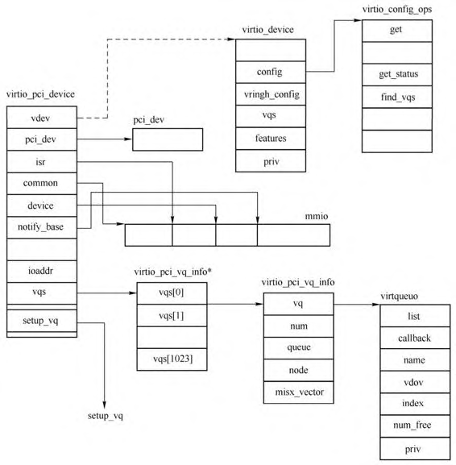

在上一节介绍了**每一个 virtio 设备**都有一个**对应的 virtio PCI 代理设备**, 本节来分析**虚拟机内部**操作系统是如何**加载 virtioPCI 代理设备**和 **virtio 设备驱动**以及如何**与 virtio 设备通信**的.

由于 **virtioPCI 代理设备**的存在, PCI 进行扫描的时候会扫描到这个设备, 并且会调用相应驱动的 probe函数, `virtio_pci_driver` 及其 probe 回调函数定义如下.

```cpp
// drivers/virtio/virtio_pci_common.c
static struct pci_driver virtio_pci_driver = {
    .name		= "virtio-pci",
    .id_table	= virtio_pci_id_table,
    .probe		= virtio_pci_probe,
    .remove		= virtio_pci_remove,
#ifdef CONFIG_PM_SLEEP
    .driver.pm	= &virtio_pci_pm_ops,
#endif
};

module_pci_driver(virtio_pci_driver);

static int virtio_pci_probe(struct pci_dev *pci_dev,
                const struct pci_device_id *id)
{
    // 代表一个 virtio PCI 代理设备
    struct virtio_pci_device *vp_dev, *reg_dev = NULL;
    int rc;

    // 第一
    vp_dev = kzalloc(sizeof(struct virtio_pci_device), GFP_KERNEL);
    ......
    pci_set_drvdata(pci_dev, vp_dev);
    vp_dev->vdev.dev.parent = &pci_dev->dev;
    vp_dev->vdev.dev.release = virtio_pci_release_dev;
    vp_dev->pci_dev = pci_dev;
    INIT_LIST_HEAD(&vp_dev->virtqueues);
    spin_lock_init(&vp_dev->lock);

    /* enable the device */
    // 第二
    rc = pci_enable_device(pci_dev);
    ......
    // 第三
    if (force_legacy) {
        rc = virtio_pci_legacy_probe(vp_dev);
        ......
    } else {
        rc = virtio_pci_modern_probe(vp_dev);
        ......
    }

    pci_set_master(pci_dev);
    ......
    rc = register_virtio_device(&vp_dev->vdev);
    ......
}
```

第一. 分配一个 `virtio_pci_device` 结构体赋值给 `vp_dev`, 用来表示**一个 virtio PCI 代理设备**, 并且将 `vp_dev` 设置为该 `pci_dev` 的**私有结构**, 初始化 `vp_dev` 中 `virtio_device` 类型的 vdev 成员相关结构.

第二. 调用 `pci_enable_device` **使能该 PCI 设备**. 在 driver 使用之前要调用.

```cpp
// drivers/pci/pci.c
int pci_enable_device(struct pci_dev *dev)
{
	return pci_enable_device_flags(dev, IORESOURCE_MEM | IORESOURCE_IO);
}
```

第三. 接下来调用 `virtio_pci_legacy_probe` 或者 `virtio_pci_modern_probe` 来**初始化**该 PCI 设备对应的 **virtio 设备**, 只考虑 modern 设备, `virtio_pci_modern_probe` 代码如下.

```cpp
// drivers/virtio/virtio_pci_modern.c
int virtio_pci_modern_probe(struct virtio_pci_device *vp_dev)
{
    struct pci_dev *pci_dev = vp_dev->pci_dev;
    int err, common, isr, notify, device;
    u32 notify_length;
    u32 notify_offset;
    ......
    if (pci_dev->device < 0x1040) {
        /* Transitional devices: use the PCI subsystem device id as
         * virtio device id, same as legacy driver always did.
         */
        vp_dev->vdev.id.device = pci_dev->subsystem_device;
    } else {
        /* Modern devices: simply use PCI device id, but start from 0x1040. */
        vp_dev->vdev.id.device = pci_dev->device - 0x1040;
    }
    vp_dev->vdev.id.vendor = pci_dev->subsystem_vendor;

    /* check for a common config: if not, use legacy mode (bar 0). */
    common = virtio_pci_find_capability(pci_dev, VIRTIO_PCI_CAP_COMMON_CFG,
                        IORESOURCE_IO | IORESOURCE_MEM,
                        &vp_dev->modern_bars);
    ......
    device = virtio_pci_find_capability(pci_dev, VIRTIO_PCI_CAP_DEVICE_CFG,
                        IORESOURCE_IO | IORESOURCE_MEM,
                        &vp_dev->modern_bars);

    err = pci_request_selected_regions(pci_dev, vp_dev->modern_bars,
                       "virtio-pci-modern");

    vp_dev->common = map_capability(pci_dev, common,
                    sizeof(struct virtio_pci_common_cfg), 4,
                    0, sizeof(struct virtio_pci_common_cfg),
                    NULL);
    ......
    if (device) {
        vp_dev->device = map_capability(pci_dev, device, 0, 4,
                        0, PAGE_SIZE,
                        &vp_dev->device_len);
        ......
        vp_dev->vdev.config = &virtio_pci_config_ops;
    } else {
        vp_dev->vdev.config = &virtio_pci_config_nodev_ops;
    }

    vp_dev->config_vector = vp_config_vector;
    vp_dev->setup_vq = setup_vq;
    vp_dev->del_vq = del_vq;

    return 0;
    ......
}
```

`virtio_pci_modern_probe` 函数首先设置了 virtio 设备的 vendor ID 和 device ID, 值得注意的是, virtio PCI代理设备的 device ID 就是上一节中在 `virtio_pci_device_plugged` 函数中设置的 `0x1040 + 5`, 所以这里virtio设备的 device ID 为 5. `virtio_pci_modern_probe` 函数接下来调用多次 `virtio_pci_find_capability` 来发现 virtio PCI 代理设备的 pci capability, 这也是在 `virtio_pci_device_plugged` 写入到 virtio PCI 代理设备的配置空间中的, `virtio_pci_find_capability` 找到所属的 PCI BAR, 写入到 `virtio_pci_device` 的 `modern_bars` 成员中, 从 QEMU 的 `virtio_pci_realize` 函数中可以知道这个 `modern_bars` 是 `1 << 4`. 接着 `pci_request_selected_regions` 就将 virtio PCI 代理设备的BAR地址空间保留起来了.

virtio_pci_modern_probe 函数调用 map_capability 将对应的 capability 在 PCI 代理设备中的 BAR 空间映射到内核地址空间, 如 `virtio_pci_device` 的common 成员就映射了 `virtio_pci_common_cfg` 的数据到内核中, 这样, 后续就可以直接通过这个内存地址空间来访问 common 这个 capability 了, 其他的 capability 类似. 这样实际上就将 virtio PCI 代理设备的 BAR 映射到虚拟机内核地址空间了, 后续直接访问这些地址即可实现对 virtio PCI 代理设备的配置和控制.

`virtio_pci_modern_probe` 函数接着设置 `virtio_pci_device` 中 `virtio_device` 的成员 vdev 的 config 成员. 如果有 device 这个 capability, 则设置为 `virtio_pci_config_ops`, 设置 virtio_pci_device 的几个回调函数, `config_vector` 与 MSI 中断有关, `setup_vq` 用来配置 virtio 设备 virt queue, `del_vq` 用来删除 virtqueue. `virtio_pci_modern_probe` 执行完成后, 相关数据结构如图所示.

`virtio_pci_device` 数据结构:



回到 `virtio_pci_probe`, `virtio_pci_modern_probe` 返回之后会调用 `register_virtio_device`, 这个函数将一个 virtio device 注册到系
统中.

```cpp
// drivers/virtio/virtio.c
int register_virtio_device(struct virtio_device *dev)
{
    ......
    dev->dev.bus = &virtio_bus;

    /* Assign a unique device index and hence name. */
    err = ida_simple_get(&virtio_index_ida, 0, 0, GFP_KERNEL);
    ......
    dev->index = err;
    dev_set_name(&dev->dev, "virtio%u", dev->index);

    spin_lock_init(&dev->config_lock);
    dev->config_enabled = false;
    dev->config_change_pending = false;

    /* We always start by resetting the device, in case a previous
     * driver messed it up.  This also tests that code path a little. */
    dev->config->reset(dev);

    /* Acknowledge that we've seen the device. */
    add_status(dev, VIRTIO_CONFIG_S_ACKNOWLEDGE);

    INIT_LIST_HEAD(&dev->vqs);

    /* device_register() causes the bus infrastructure to look for a
     * matching driver. */
    err = device_register(&dev->dev);
    ......
}
```

register_virtio_device 函数设置 virtio 设备的 Bus 为 virtio_bus, virtio_bus 在系统初始化的时候会注册到系统中. 设置 virtio 设备的名字为类似 virtio0、virtio1 的字符串, 然后调用 dev->config->reset 回调函数重置设备, 最后调用 device_register 将设备注册到到系统中. device_register 函数跟设备驱动相关比较大, 这里简单介绍一下其作用. 该函数会调用 device_add 将设备加到系统中, 并且会发送一个 uevent 消息到用户空间, 这个 uevent 消息中包含了 virtio 设备的vendor id、device id, udev 接收到这个消息之后会加载 virtio 设备的对应驱动. 然后 device_add 会调用 `bus_probe_device`, 最终调用到 Bus 的 probe 函数和设备的 probe 函数, 也就是 `virtio_dev_probe` 和 `virtballoon_probe` 函数.

一般来讲, virtio 驱动初始化一个设备的过程如下.

1) 重置设备, 这是在上述 register_virtio_device 函数中通过 dev->config->reset 调用完成的.

2) 设置 ACKNOWLEDGE 状态位, 表示virtio驱动已经知道了该设备, 这同样是在 register_virtio_device 函数中由 add_status(dev, VIRTIO_CONFIG_S_ACKNOWLEDGE 语句完成的.

3) 设置 DRIVER 状态位, 表示virtio驱动知道怎么样驱动该设备, 这是在virtio总线的probe函数 virtio_dev_probe 中通过 add_status(dev, VIRTIO_CONFIG_S_DRIVER) 完成的.

4) 读取virtio设备的feature位, 求出驱动设置的feature, 将两者计算子集, 然后向设备写入这个子集特性, 这是在 virtio_dev_probe 函数中完成的, 计算 driver_features 和 device_features, 然后调用 `virtio_finalize_features`.

5) 设置FEATURES_OK特性位, 这之后 virtio 驱动就不会再接收新的特性了, 这一步是在函数 virtio_finalize_features 中通过调用 add_status(dev, VIRTIO_CONFIG_S_FEATURES_OK) 完成的.

6) 重新读取设备的feature位, 确保设置了FEATURES_OK, 否则设备不支持virtio驱动设置的一些状态, 表示设备不可用, 这同样是在 `virtio_finalize_features` 函数中完成的.

7) 执行设备相关的初始化操作, 包括发现设备的virtqueue、读写virtio设备的配置空间等, 这是在 `virtio_dev_probe` 函数中通过调用驱动的 probe函数完成的, 即 `drv->probe(dev)`.

8) 设置 `DRIVER_OK` 状态位, 这通常是在具体设备驱动的 probe 函数中通过调用 `virtio_device_ready` 完成的, 对于 virtio balloon 来说是 `virtballoon_probe`, 如果设备驱动没有设置 `DRIVER_OK` 位, 则会由总线的 probe 函数 `virtio_dev_probe` 来设置.

下面通过例子来对 virtio 驱动的加载过程进行简单分析. 以如下命令启动虚拟机.

```cpp

```

在虚拟机中使用 auditd 对驱动访问进行监控, 如图所示.

```

```

在虚拟机中调用 udevadm monitor 对 uevent事件进行监控, 如图所示.