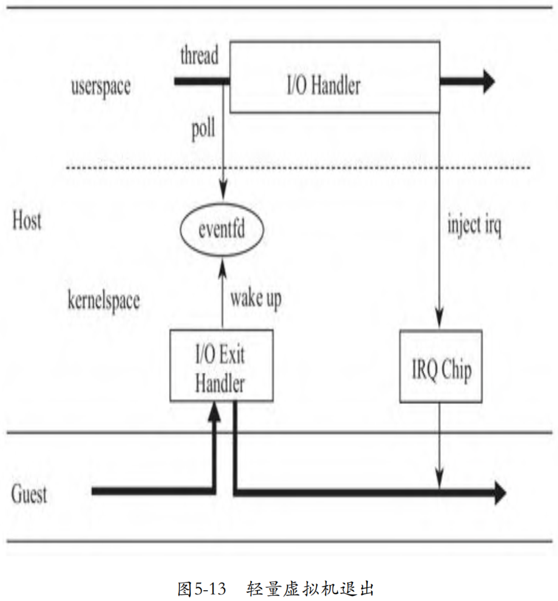

<!-- @import "[TOC]" {cmd="toc" depthFrom=1 depthTo=6 orderedList=false} -->

<!-- code_chunk_output -->

- [1. 概述](#1-概述)
- [2. 实现](#2-实现)
  - [2.1. kvmtool 创建 eventfd](#21-kvmtool-创建-eventfd)
    - [2.1.1. 向 KVM 注册 ioeventfd](#211-向-kvm-注册-ioeventfd)
  - [2.2. kvm 处理 guest 写](#22-kvm-处理-guest-写)
  - [2.3. kvmtool 监听 eventfd](#23-kvmtool-监听-eventfd)
  - [2.4. VM exit 处理函数唤醒 I/O 任务](#24-vm-exit-处理函数唤醒-io-任务)

<!-- /code_chunk_output -->

# 1. 概述

I/O 处理异步化后, 模拟设备中的 I/O 处理将不再阻塞 Guest 的运行. 现在我们再仔细审视一下这个过程, 寻找进一步优化的可能. 事实上, 无论 I/O 是同步处理, 还是异步处理, 每次 Guest 发起 I/O request 时, 都将触发 **CPU** 从 **Guest** 切换到 **Host** 的**内核空间**(ring 0), 然后从 **Host** 的**内核空间**切换到 **Host** 的**用户空间**(ring 3), 唤醒 kvmtool 中的 **I/O thread**, 然后再从 **Host** 的**用户空间**, 切换到 **Host** 的**内核空间**, 最后进入 **Guest**.

我们知道, 内核空间和用户空间的切换是有一定开销的, 而**切换到用户空间**后就是做了**一次简单的唤醒动作**, 那么这**两次**用户空间和内核空间的**上下文切换**, 是否可以避免呢? **KVM 模块**是否可以**直接在内核空间唤醒用户空间**的 I/O 处理任务呢? 于是 KVM 的开发者们基于 **eventfd** 设计了一个 **ioeventfd** 的概念. **eventfd** 是一个文件描述符, 目的是快速、轻量地**通知事件**, 可用于**内核空间**和**用户空间**, 或者**用户空间的任务之间**的轻量级的通知.

# 2. 实现

在具体实现上, **kvmtool** 中的**模拟设备**将创建一个 **eventfd** 文件, 并将这个**文件描述符**告知内核中的 **KVM** 模块, 然后将**监听**在 eventfd 上.

当 Guest 因为 I/O 导致 vm exit 时, vm exit处理函数将**不再返回到用户空间**, 而是直接**唤醒**阻塞监听在 eventfd 等待队列上的 kvmtool 中的**监听线程**, 然后马上**切回到 Guest**.

使用 eventfd 后, CPU 的状态流转过程简化为从 Guest 到 Host 的内核空间, 然后马上再次流转到 Guest, 如下图所示.



下面, 我们就具体探讨一下各过程的实现.

## 2.1. kvmtool 创建 eventfd

以 Virtio blk 为例, 其为**每个 Virtqueue** 创建了一个 **eventfd**, 并将 eventfd 和设备及设备中的具体 Virtqueue 关联起来:

```cpp
commit ec75b82fc0bb17700f09d705159a4ba3c30acdf8
kvm tools: Use ioeventfd in virtio-blk
kvmtool.git/virtio/blk.c

void virtio_blk__init(struct kvm *kvm, struct disk_image *disk)
{
    ...
    // 遍历每个 virtqueue
    for (i = 0; i < NUM_VIRT_QUEUES; i++) {
        ioevent = (struct ioevent) {
            // 关联的 IO 地址
            .io_addr		= blk_dev_base_addr + VIRTIO_PCI_QUEUE_NOTIFY,
            .io_len			= sizeof(u16),
            .fn			= ioevent_callback,
            .datamatch		= i,
            .fn_ptr			= &bdev->jobs[i],
            .fn_kvm			= kvm,
            // 申请一个 eventfd
            .fd			= eventfd(0, 0),
        };
        // 注册到 KVM
        ioeventfd__add_event(&ioevent);
    }
}
```

其中,

* fd 是 kvmtool 向内核申请创建的用于 KVM 内核模块和 kvmtool 进行通信的 eventfd 文件描述符,

* `io_addr` 是一个 I/O 地址, 用来告诉内核当 Guest 写的 I/O 地址为 `VIRTIO_PCI_QUEUE_NOTIFY` 时, 唤醒睡眠在这个 eventfd 等待队列上的任务,

* fn 是 **kvmtool** 中等待内核信号的**线程**, 被唤醒后, 调用这个**回调函数**处理 I/O.

### 2.1.1. 向 KVM 注册 ioeventfd

创建好 eventfd 后, kvmtool 调用函数 `ioeventfd__add_event` 将 eventfd 以及与其关联的 I/O 地址等告知 KVM 内核模块:

```cpp
commit ec75b82fc0bb17700f09d705159a4ba3c30acdf8
kvm tools: Use ioeventfd in virtio-blk
kvmtool.git/ioeventfd.c
void ioeventfd__add_event(struct ioevent *ioevent)
{
    ...
    if (ioctl(ioevent->fn_kvm->vm_fd, KVM_IOEVENTFD, &kvm_ioevent) != 0)
    ...
}
```

KVM 模块收到用户空间发来的 `KVM_IOEVENTFD` 命令后, 将**在内核空间**创建一个 **I/O 设备**, 并将其挂到 **I/O 总线**上. 这个 I/O 设备相当于 kvmtool 中的模拟设备在内核空间的**一个代理**, 其记录着 I/O 地址和 eventfd 实例的关联:

```cpp
commit d34e6b175e61821026893ec5298cc8e7558df43a
KVM: add ioeventfd support

linux.git/virt/kvm/kvm_main.c

static long kvm_vm_ioctl(struct file *filp,
               unsigned int ioctl, unsigned long arg)
{
    ...
    case KVM_IOEVENTFD: {
        struct kvm_ioeventfd data;
        ...
        r = kvm_ioeventfd(kvm, &data);
        break;
    }
    ...
}

linux.git/virt/kvm/eventfd.c

int
kvm_ioeventfd(struct kvm *kvm, struct kvm_ioeventfd *args)
{
    return kvm_assign_ioeventfd(kvm, args);
}

static int
kvm_assign_ioeventfd(struct kvm *kvm, struct kvm_ioeventfd *args)
{
    ...
    // 初始化一个io device
    kvm_iodevice_init(&p->dev, &ioeventfd_ops);
    // 注册这个io device到bus上
    ret = __kvm_io_bus_register_dev(bus, &p->dev);
    ...
}
```

## 2.2. kvm 处理 guest 写

当 Guest 发起地址为 `VIRTIO_PCI_QUEUE_NOTIFY` 的 I/O 操作时, KVM 模块中的 **VM exit 处理函数**将根据**地址** `VIRTIO_PCI_QUEUE_NOTIFY` 找到这个**代理 I/O 设备**, 调用**代理 I/O 设备**的**写函数**, 这个写函数将**唤醒**睡眠在代理设备中记录的与这个 **I/O 地址**对应的 **eventfd 等待队列**的 kvmtool 中的任务, 处理 I/O:

```cpp
commit d34e6b175e61821026893ec5298cc8e7558df43a
KVM: add ioeventfd support

linux.git/virt/kvm/eventfd.c

static const struct kvm_io_device_ops ioeventfd_ops = {
    .write      = ioeventfd_write,
    .destructor = ioeventfd_destructor,
};
static int ioeventfd_write(struct kvm_io_device *this, gpa_t addr, int len,
        const void *val)
{
    ...
    eventfd_signal(p->eventfd, 1);
    return 0;
}

linux.git/fs/eventfd.c
int eventfd_signal(struct eventfd_ctx *ctx, int n)
{
    ...
    if (waitqueue_active(&ctx->wqh))
        wake_up_locked_poll(&ctx->wqh, POLLIN);
    ...
}
```

## 2.3. kvmtool 监听 eventfd

在创建好 eventfd 后, kvmtool 创建了**一个线程**, 调用 `epoll_wait` **阻塞监听 eventfd**, 接受来自内核 KVM 模块的事件:

```cpp
commit ec75b82fc0bb17700f09d705159a4ba3c30acdf8
kvm tools: Use ioeventfd in virtio-blk
kvmtool.git/ioeventfd.c

void ioeventfd__add_event(struct ioevent *ioevent)
{
    ...
    if (epoll_ctl(epoll_fd, EPOLL_CTL_ADD, event, &epoll_event) != 0)
    ...
}

static void *ioeventfd__thread(void *param)
{
    for (;;) {
        int nfds, i;

        nfds = epoll_wait(epoll_fd, events, IOEVENTFD_MAX_EVENTS, -1);
        for (i = 0; i < nfds; i++) {
            ....
            ioevent->fn(ioevent->fn_kvm, ioevent->fn_ptr);
        }
    }
}
```

当有 POLLIN 事件时, 对应的 callback 将被执行(callback 函数是 `ioevent_callback`). `ioevent_callback` 就是用来通知线程池处理 I/O job:

```cpp
commit ec75b82fc0bb17700f09d705159a4ba3c30acdf8
kvm tools: Use ioeventfd in virtio-blk
kvmtool.git/virtio/blk.c
static void ioevent_callback(struct kvm *kvm, void *param)
{
    struct blk_dev_job *job = param;

    thread_pool__do_job(job->job_id);
}
```

## 2.4. VM exit 处理函数唤醒 I/O 任务

根据 KVM 内核模块的主体函数 `__vcpu_run` 中的 while 循环可见, 如果函数 `vcpu_enter_guest` 返回 0, 那么代码逻辑将跳出循环, 返回到用户空间发起运行虚拟机的指令. 如果 `vcpu_enter_guest` 返回 1, 那么将再次进入 while 循环执行 `vcpu_enter_guest`, 直接返回 Guest, 即所谓的轻量级虚拟机退出:

```cpp
commit d34e6b175e61821026893ec5298cc8e7558df43a
KVM: add ioeventfd support

linux.git/arch/x86/kvm/x86.c

static int __vcpu_run(struct kvm_vcpu *vcpu, struct kvm_run *kvm_run)
{
    ...
    r = 1;
    while (r > 0) {
        if (vcpu->arch.mp_state == KVM_MP_STATE_RUNNABLE)
            r = vcpu_enter_guest(vcpu, kvm_run);
        ...
    }
    ...
}

static int vcpu_enter_guest(struct kvm_vcpu *vcpu, struct kvm_run *kvm_run)
{
    ...
    kvm_x86_ops->run(vcpu, kvm_run);
    ...
    r = kvm_x86_ops->handle_exit(kvm_run, vcpu);
}
```

据函数 `vcpu_enter_guest` 的代码可见, `vcpu_enter_guest` 的返回值就是 vm exit handler 的返回值. vm exit handler 返回 0 或者 1, 完全依赖于 vm exit handler 是否可以在 Host 内核态处理 VM exit.

* 如果在**内核态**能处理, 那么 vm exit handler 就**返回 1**, 函数 `__vcpu_run` 中的 while 循环就再次进入**下一个循环**, **重新进入** Guest;
* 如果需要**返回用户空间**借助 kvmtool 处理, 那么 vm exit handler 就**返回 0**, 函数 `__vcpu_run` 中的 while 循环终止, CPU 返回到**用户空间**的 kvmtool.

当 Guest 准备好 Virtuqeue 中的可用描述符链后, 将通知设备处理I/O request, 通知的方式就是**写 I/O 地址** `VIRTIO_PCI_QUEUE_NOTIFY`. 对于因 I/O 触发的VM exit, 其 handler 是 `handle_io`. `handle_io` 将首先调用函数 `kernel_io` 看看这个 I/O 是否可以在内核空间处理完成:

```cpp
commit d34e6b175e61821026893ec5298cc8e7558df43a
KVM: add ioeventfd support

linux.git/arch/x86/kvm/vmx.c

static int handle_io(struct kvm_vcpu *vcpu, struct kvm_run *kvm_run)
{
    ...
    return kvm_emulate_pio(vcpu, kvm_run, in, size, port);
}

linux.git/arch/x86/kvm/x86.c

int kvm_emulate_pio(struct kvm_vcpu *vcpu, struct kvm_run *run, int in,
          int size, unsigned port)
{
    ...
    if (!kernel_pio(vcpu, vcpu->arch.pio_data)) {
        complete_pio(vcpu);
        return 1;
    }
    return 0;
}

static int kernel_pio(struct kvm_vcpu *vcpu, void *pd)
{
    int r;

    if (vcpu->arch.pio.in)
        r = kvm_io_bus_read(&vcpu->kvm->pio_bus, vcpu->arch.pio.port,
                    vcpu->arch.pio.size, pd);
    else
        r = kvm_io_bus_write(&vcpu->kvm->pio_bus, vcpu->arch.pio.port,
                     vcpu->arch.pio.size, pd);
    return r;
}

linux.git/virt/kvm/kvm_main.c

int kvm_io_bus_write(struct kvm_io_bus *bus, gpa_t addr,
             int len, const void *val)
{
    int i;
    for (i = 0; i < bus->dev_count; i++)
        if (!kvm_iodevice_write(bus->devs[i], addr, len, val))
            return 0;
    return -EOPNOTSUPP;
}

linux.git/virt/kvm/iodev.h

static inline int kvm_iodevice_write(struct kvm_io_device *dev,
                     gpa_t addr, int l, const void *v)
{
    return dev->ops->write ? dev->ops->write(dev, addr, l, v) : -EOPNOTSUPP;
}
```

前面, 为 kvmtool 中的 Virtio blk 设备在 KVM 模块中注册代理设备时, 其 **write** 函数为 `ioeventfd_write`, 当调用这个函数时, 在唤醒等待在 eventfd 的等待队列上的任务后, 其**返回了 0**, 所以 `kvm_iodevice_write` 返回0, 接着函数 `kvm_io_bus_write` 返回0, 进而函数 `kernel_pio` 返回 1, 函数 `kvm_emulate_pio` 返回1, 所以 `handle_io` 返回值也为 1. 所以函数 `vcpu_enter_guest` 也将返回 1, 那么函数 `__vcpu_run` 将再次进入下一次 while 循环, CPU 从 Host 的内核态直接切回Guest, 节省了 CPU 上下文切换的开销.
