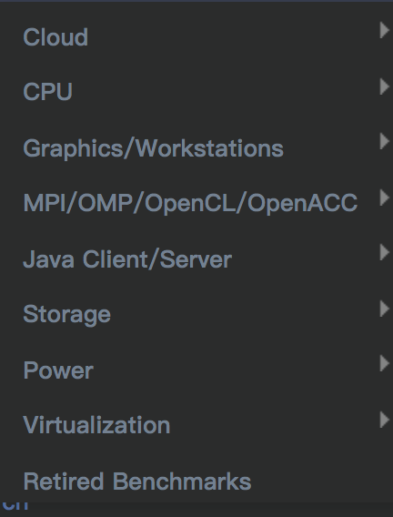
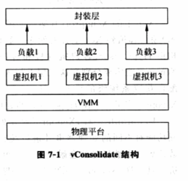

<!-- @import "[TOC]" {cmd="toc" depthFrom=1 depthTo=6 orderedList=false} -->

<!-- code_chunk_output -->

- [1. 概述](#1-概述)
- [2. 重用 OS 的性能评测工具](#2-重用-os-的性能评测工具)
- [3. 面向虚拟环境的性能评测工具](#3-面向虚拟环境的性能评测工具)

<!-- /code_chunk_output -->

# 1. 概述

针对不同**评测目的**, 人们积累一些专门的评测工具, 用于测试目标系统的性能. 例如, 来自 **交易处理性能委员会** (TPC, http://www.tpc.org) 的 **TPC\-C** 就是专门针对 **联机事务处理的基准测试项目**, 而来自 **标准性能评测公司** (SPEC, http://www.spec.org) 的**CPU2000/CPU2006**、 **Web2005**、 **JBB2005** 和 **HPC2002/MPI2006** 就分别是专门**处理器性能**、**web 服务器**、**Java 应用**和**高性能计算**的基准测试项目.

另外, 上节介绍的评测性能指标里, 所谓的"**一个任务**"也不是随意挑选的, 在**实际评测工具**中, 包括了**一系列的负载**(workload), 用于测试目标系统各方面的性能, 借以充分说明问题. 例如, TPC\-C 就针对订单录入和销售环境事务吞吐量和延迟, 包含了若干个负载, 专门测试系统在同时执行订货、支付、发货、订单查询和库存查询的性能情况.

针对**虚拟环境性能**的评测, 由于 VMM 属于新兴事物, 专门工具还处于初级阶段, 目前只有**少数工具**, 如**Intel**的**vConsolidate**和**VMware**的**VMmark**(http://www.VMware.com/products/VMmark/), 这些工具主要模拟 VMM 在服务器领域的应用, 即为模拟服务器整合应用环境而开发. 从**另外一个角度**, 人们可对**客户机 OS**的**性能**进行评测, 从而间接评测 VMM 的性能, 显然这**不是真正意义上的 VMM 评测方法**, 但有一定参考意义.

一般而言, SPEC 会针对不同场景或特点有相应的测试工具, 下面是当前的 benchmark, 不过多数都是收费的, 而且价格较高

# 2. 重用 OS 的性能评测工具

在虚拟机上运行传统 OS 的性能评测工具, 尽管不能完全反映 VMM 性能, 但通常情况下, 一定程度上反映了 VMM 的某方面性能.

对 VMM 进行性能评测和优化, 包含以下三个方面.

1) **处理器**性能指标, 常用的有**SPEC 公司**的 **CPU2000！！！** 或**CPU2006！！！** 以及**sysbench！！！** (http://sysbench.sourceforge.net) 中的 CPU 工具, 它们一般包含对处理器整型处理能力和浮点处理能力的评测.

除此, 在实际应用中, **cyclesoak！！！**(http://www.zip.com.au/\~akpm/linux/) 因为简单也被经常使用.

2) **内存虚拟化**的性能, 对 VMM 的内存虚拟化性能评测通常使用**内核编译(Kernel Build！！！**) 或 **sysbench！！！** 中的内存评测方法.

值得一提是, 内核编译是一个比较综合的性能评测工具, 它广为 Linux 开发者和开源的 VMM 开发者采用. 这种方法既对处理器敏感也对内存和硬盘读写敏感, 因此, 实践中, **内核编译**既被用来做内存虚拟化的性能评测工具, 也被用作**硬盘**虚拟化的性能评测工具.

3) **虚拟外设**的性能评测和优化, 例如针对**硬盘**虚拟化性能评测工具有**hdparm！！！**(http://www.sourceforge.net/projects/hdparm/), 对**网络设备**虚拟化性能评测工具有**netperf！！！** ( http://www.netperf.org/netperf/ ).

如上节所言, **吞吐量**是计算**单位时间**内完成的**任务数**来衡量, **延迟**是计算完成一个**指定任务**所用的**时间**来衡量, 而不管用哪种性能评测工具, 一般都 **直接利用客户机 OS 提供的时间！！！** 作为性能评测的衡量指标. 所以, 获取**准确的时间**就成为一个关键问题.

虚拟环境下的**时间虚拟化**, 尤其是对**完全虚拟化**下客户机的时间虚拟化本身存在种种挑战. 利用以上工具进行性能评测时, 必须注意到可能有**客户机时间虚拟化不准确**而导致的**误差**. 所以, **必要时**采用**物理时间**如**网络时间**或**秒表**进行**比对校验**, 这一点对于基于 SMP 的客户机性能评测尤其重要.

另外, 由于**虚拟环境**下**客户机处理器**事实上靠**分时共享物理处理器**资源实现, 所以对于**评测工具**中**很短**(例如几个或几十个毫秒)任务所花费时间的测量具有很大**颠簸性**. 如果一个评测工具主要依靠测量很短任务的吞吐量或延迟来做衡量, 这个工具对虚拟环境的性能评测具有很大的随机性, 因此也是不可靠的.

# 3. 面向虚拟环境的性能评测工具

目前这方面的工具不是很多, 但还是有 Intel 的 vConsolidate 和 VMware 的 VMmark 工具来模拟服务器整合环境下的应用, 将多种不同种类的负载连同运行这些负载的 OS, 加载在不同的客户机上, 通过对不同负载性能的测量来衡量不同虚拟化方案的性能差异.

vConsolidate 是一个面向虚拟化方案的服务器整合性能评测工具, 它的设计原理如图 7\-1, 不同的负载运行在不同的客户机上, 最上面由包装层归纳.

由 4 个同时运行的独立的性能评测工具组成, 它们分别模拟数据库服务器 Sysbench、Web 服务器 WebBench( http://www.pcmag.com/ )、Java 应用 JBB 2005 和邮件服务器 LoadSim( http://www.microsoft.com/ ). 另外, vConsolidate 还同时运行一个空闲客户机, 也就是不运行任何负载的客户机, 如果传统 OS 上的空闲进程一样.

VMmark 原理和 vConsolidate 类似, 不同在于还引入了文件服务器. 当然 VMmark 也有一个空闲客户机.