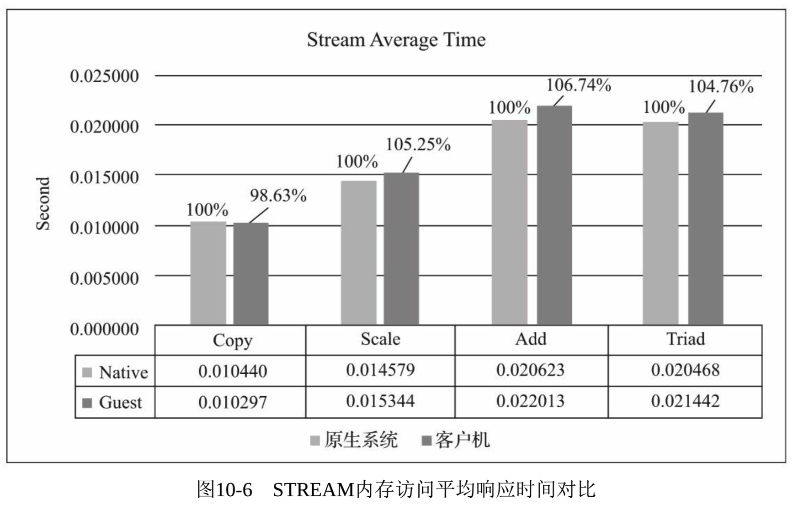

<!-- @import "[TOC]" {cmd="toc" depthFrom=1 depthTo=6 orderedList=false} -->

<!-- code_chunk_output -->

- [1. 内存性能测试工具](#1-内存性能测试工具)
- [2. 测试环境配置](#2-测试环境配置)
- [3. 性能测试方法](#3-性能测试方法)
- [4. 性能测试数据](#4-性能测试数据)

<!-- /code_chunk_output -->

# 1. 内存性能测试工具

**内存密集型**的应用程序分别在非虚拟化的原生系统和 KVM 客户机中运行, 然后**根据它们的运行效率**就可以**粗略评估 KVM 的内存虚拟化性能**.

对于**内存**的性能测试, 可以选择上节节中提到的**SPECjbb2015**、**SysBench**、**内核编译**等基准测试(因为它们**同时也是内存密集型的测试**), 还可以选择**LMbench**、**Memtest86**+、**STREAM** 等测试工具.

`Linux\Benchmark\04. 内存测试.md`

本节对 KVM 内存虚拟化性能的测试, 使用了 STREAM 这个基准测试工具.

# 2. 测试环境配置

对 KVM 的内存虚拟化性能测试的测试环境配置与上节的环境配置基本相同, 具体可以参考表 10\-1 和表 10\-2.

宿主机中启动客户机的命令也与 10.2.2 节相同.

```
qemu-system-x86_64 -enable-kvm -cpu host -smp cpus=4,cores=4,sockets=1 -m 16G -drive file=./rhel7.img,format=raw,if=virtio,media=disk -drive file=./raw_disk.img,format=raw,if=virtio,media=disk -device virtio-net-pci,netdev=nic0 -netdev bridge,id=nic0,br=virbr0 -daemonize -name perf_test -display vnc=:1
```

值得注意的是, 本次测试的 Intel 平台是支持 EPT 和 VPID 的, 对于内存测试, 只要硬件支持, KVM 也默认使用了 EPT、VPID. EPT 和 VPID(特别是 EPT)对 KVM 中内存虚拟化的加速效果是非常明显的, 所以要保证能使用它们(可参考 5.3.2 节).

# 3. 性能测试方法

本节选取 STREAM 工具来进行内存的性能测试, 分别在原生系统和 KVM 客户机系统中执行 STREAM 基准测试, 然后对比各项测试的得分即可评估 KVM 内存虚拟化的性能.

1. 下载 STREAM

从其官方网址 https://www.cs.virginia.edu/stream/FTP/Code/ 下载 STREAM 测试程序, 截至笔者写作时, 其最新为 5.10 版本.

2. 编译 STREAM

我们使用 C 语言版本的 stream.c(另有一个 stream.f, 是 Fortune 语言版本), 然后运行下面的 gcc 命令编译. 这里解释一下几个编译选项.

- \-DSTREAM\_ARRAY\_SIZE=30000000, 根据源代码中的注释, 其中: 'STREAM_ARRAY_SIZE'要根据实际的机器环境定义, 以确保测试准确性, 其确定的原则是: 它要使得数组大小至少 3.8 倍于你的机器缓存大小. 笔者环境的 L3 Cache 大约为 55M, 所以指定这个大小为 30000000. 具体换算方法, 读者可以参照源代码中注释的例子.
- \-O3, 编译最优化.
- \-fopenmp, 使用 OpenMP(并发多线程接口).
- \-mavx2\-march=core\-avx2, 笔者的机器是 Xeon Broadwell 平台, 它已经支持 AVX2, 所以编译以 AVX2 指令优化.

```
gcc -DSTREAM_ARRAY_SIZE=30000000 -O3 -fopenmp -mavx2 -march=core-avx2 stream.c -o stream
```

编译完以后, 就获得了名为 stream 的可执行程序, 直接运行它就可以获得 STREAM 基准测试的结果了. 示例如下:

```
[root@kvm-host ~]# ./stream
-------------------------------------------------------------
STREAM version $Revision: 5.10 $
-------------------------------------------------------------
This system uses 8 bytes per array element.
-------------------------------------------------------------
Array size = 30000000 (elements), Offset = 0 (elements)
Memory per array = 228.9 MiB (= 0.2 GiB).
Total memory required = 686.6 MiB (= 0.7 GiB).
Each kernel will be executed 10 times.
 The *best* time for each kernel (excluding the first iteration)will be used to compute the reported bandwidth.
-------------------------------------------------------------
Number of Threads requested = 4
Number of Threads counted = 4
-------------------------------------------------------------
Your clock granularity/precision appears to be 1 microseconds.
Each test below will take on the order of 10143 microseconds.
    (= 10143 clock ticks)
Increase the size of the arrays if this shows that you are not getting at least 20 clock ticks per test.
-------------------------------------------------------------
WARNING -- The above is only a rough guideline.
For best results, please be sure you know the precision of your system timer.
-------------------------------------------------------------
Function    Best Rate MB/s  Avg time     Min time     Max time
Copy:           46185.4     0.010459     0.010393     0.010690
Scale:          31227.9     0.015491     0.015371     0.015963
Add:            32065.5     0.022566     0.022454     0.022877
Triad:          33538.0     0.021568     0.021468     0.021666
-------------------------------------------------------------
Solution Validates: avg error less than 1.000000e-13 on all three arrays
-------------------------------------------------------------
```

可以看到, 测试结果中包含了**Copy**、**Scale**、**Add**、**Triad**这 4 种内存操作的**最优传输速率**、**平均时间**、**最大时间**和**最小时间**的值.

在本次测试中, 分别在原生系统和 KVM 客户机中执行**5 次基准测试**, 速率上取 Copy、Scale、Add、Triad 各自最大的一次, 响应时间上, 取平均值中各自最小的一次, 作为比较值.

# 4. 性能测试数据

这里实验的结果数据, 由于**限制了 CPU 和内存等资源**, 并**不表示机器环境的绝对性能**, 而是注重虚拟化环境与原生环境在**同等资源条件下的性能对比**.

从图 10\-5 可以看出, KVM 虚拟化中内存的访问带宽与原生系统相比都是比较接近的. **Copy**操作甚至客户机表现还略微(可以忽略不计)好于原生系统, Scale 操作为原生系统的 95.93%, Add 操作为 94.72%, Triad 操作为 96.52%. 这主要归功于**硬件 EPT 支持**.


而从图 10-6 访问时间上来看, 客户机平均响应时间比原生系统的差值在 5%左右; Copy case 甚至略好于原生系统(可以忽略不计).

