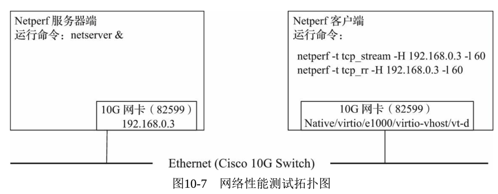
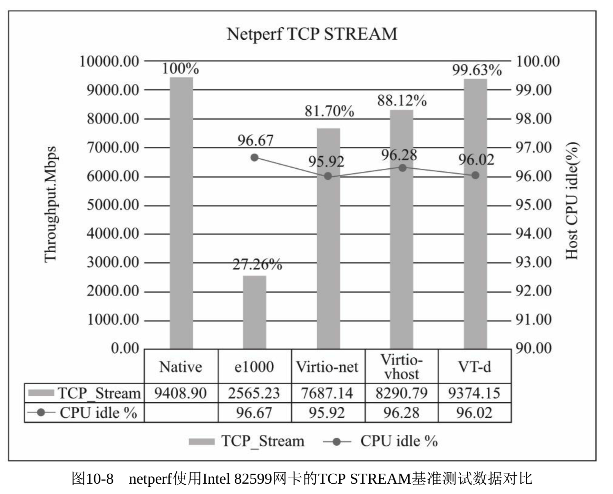
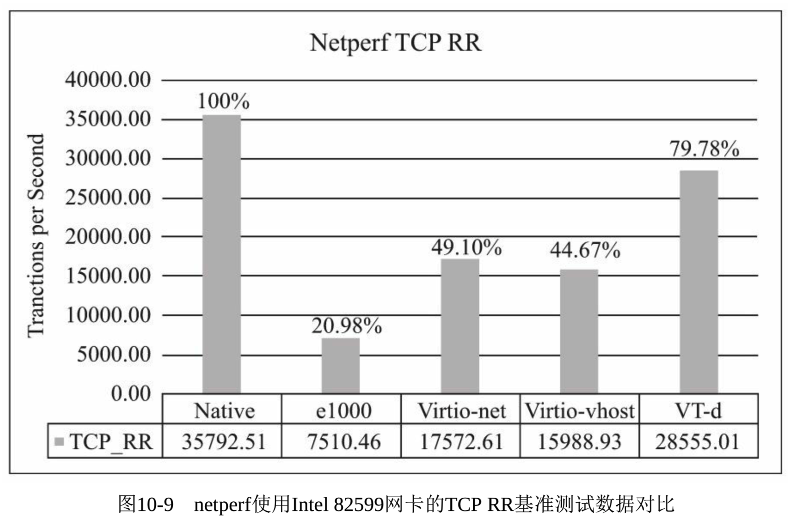

<!-- @import "[TOC]" {cmd="toc" depthFrom=1 depthTo=6 orderedList=false} -->

<!-- code_chunk_output -->

- [1 网络性能测试工具](#1-网络性能测试工具)
  - [1.1 Netperf](#11-netperf)
  - [1.2 Iperf](#12-iperf)
  - [1.3 NETIO](#13-netio)
  - [1.4 SCP](#14-scp)
- [2 测试环境配置](#2-测试环境配置)
- [3 性能测试方法](#3-性能测试方法)
- [4 性能测试数据](#4-性能测试数据)

<!-- /code_chunk_output -->

# 1 网络性能测试工具

只要是需要**快速**而且**大量**的**网络数据传输**的应用都可以作为**网络性能基准测试工具**, 可以是

- **专门用于测试网络带宽**的**Netperf**、**Iperf**、**NETIO**、**Ttcp**等,
- 也可以是常用的 Linux 上的**文件传输工具 SCP**.

下面简单介绍几种常用的网络性能测试工具.

## 1.1 Netperf

Netperf 是由**HP 公司**开发的一个**网络性能基准测试工具**, 它是非常流行**网络性能测试工具**, 其官方主页是 http://www.netperf.org/netperf .

Netperf 工具可以运行在 UNIX、Linux 和 Windows 操作系统中. Netperf 的源代码是开放的, 不过它和普通开源软件使用的许可证协议不完全一样, 如果想**使用完全的开源软件**, 则可以考虑采用 GNU GPLv2 许可证发布的**netperf4 工具**( http://www.netperf.org/svn/netperf4 ).

Netperf 可以测试**网络性能的多个方面**, 主要包括使用**TCP**、**UDP**等协议的**单向批量数据传输模式**和**请求-响应模式**的传输性能.

Netperf 主要测试的项目包括: 使用**BSD Sockets**的**TCP 和 UDP 连接**(IPv4 和 IPv6)、使用**DLPI 接口**的链路级别的数据传输、Unix Domain Socket、SCTP 协议的连接(IPv4 和 IPv6).

Netperf 采用**客户机/服务器(Client/Server)的工作模式**:

- **服务端**是**netserver**, 用来**侦听来自客户端的连接**,
- **客户端**是**netperf**, 用来**向服务端发起网络测试**.

测试流程:

1. 在**客户端与服务端之间**, 首先**建立一个控制连接**, 用于传递有关**测试配置的信息**和**测试完成后的结果**;
2. 在控制连接建立并传递了测试配置信息以后, 客户端与服务端之间会另外**再建立一个测试数据连接**, 用来传递指定测试模式的**所有数据**;
3. 当**测试完成**后数据连接就**断开**, 控制连接会收集好客户端和服务端的测试结果, 然后让客户端展示给用户.

为了尽可能地模拟更多真实的**网络传输场景**, Netperf 有非常多的**测试模式供选择**, 包括: TCP\_STREAM、TCP\_MAERTS、TCP\_SENDFILE、TCP\_RR、TCP\_CRR、TCP\_CC、UDP\_STREAM、UDP\_RR 等.

## 1.2 Iperf

Iperf 是一个常用的**网络性能测试工具**, 它是用 C++编写的跨平台的**开源软件**, 可以在 Linux、UNIX 和 Windows 系统上运行, 其项目主页是: http://sourceforge.net/projects/iperf .

Iperf 支持**TCP 和 UDP**的数据流模式的测试, 用于衡量其**吞吐量**.

与 Netperf 类似, **Iperf**也实现了**客户机/服务器模式**, Iperf 有一个客户端和一个服务端, 可以测量**两端的单向和双向数据吞吐量**.

- 当使用**TCP**功能时, Iperf 测量**有效载荷的吞吐带宽**;
- 当使用**UDP**功能时, Iperf 允许用户**自定义数据包大小**, 并最终提供一个数据包吞吐量值和丢包值.

另外, 有一个项目叫 Iperf3(项目主页为 http://code.google.com/p/iperf ), 它完全重新实现了 Iperf, 其目的是使用**更小、更简单的源代码**来实现**相同的功能**, 同时也开发了**可用于其他程序的一个函数库**.

## 1.3 NETIO

NETIO 也是个**跨平台**的、源代码公开的网络性能测试工具, 它支持 UNIX、Linux 和 Windows 平台, 其作者关于 NETIO 的主页是: http://www.ars.de/ars/ars.nsf/docs/netio .

NETIO 也是基于**客户机/服务器**的架构, 它可以使用**不同大小的数据报文**来测试**TCP 和 UDP 网络连接**的吞吐量.

## 1.4 SCP

SCP 是 Linux 系统上最常用的远程文件复制程序, 它可以作为实际的应用来测试网络传输的效率. 用 SCP 远程传输同等大小的一个文件, 根据其花费时间的长短可以粗略评估出网络性能的好坏.

在本次网络性能测试中, 采用 Netperf 基准测试工具来评估 KVM 虚拟化中客户机的网络性能.

# 2 测试环境配置

对 KVM 的网络虚拟化性能测试的测试环境配置与之前的环境配置基本相同, 具体可以参考表 10-1 和表 10-2.

略有不同的是, 本节中, **宿主机内存设置得比较大**, **40G**. 这是因为笔者发现, 在**以 VT-d 分配 VF**给**客户机**时, **客户机**会**预分配 16G 内存！！！**(笔者也不确定这是否是 bug), 如果**只分配 20G 内存**给**宿主机**, 就会因内存吃紧而**频繁交换内存页(Swap**), 从而造成系统性能急剧下降. 所以, 为了避免这种情况, 也为了公平比较, 所有的客户机类型测试中, **宿主机都设置 40G 内存**.

测试中用到的网卡为 Intel X520 SR2(其以太网控制器为 82599ES), 10G 的光纤网卡, 驱动为 ixgbe.

在测试 SR-IOV 类型的网络时, 要**打开 SR-IOV**的功能, 具体方法见其他文章. 通过 lspci 命令查看已经打开 SR-IOV 功能后的网卡具体信息, 示例如下:

```
[root@kvm-host ~]# lspci | grep -i eth
//省略其他网卡设备
05:00.0 Ethernet controller: Intel Corporation 82599ES 10-Gigabit SFI/SFP+ Network Connection (rev 01)
05:00.1 Ethernet controller: Intel Corporation 82599ES 10-Gigabit SFI/SFP+ Network Connection (rev 01)
05:10.1 Ethernet controller: Intel Corporation 82599 Ethernet Controller Virtual Function (rev 01)
05:10.3 Ethernet controller: Intel Corporation 82599 Ethernet Controller Virtual Function (rev 01)
```

在本次测试中, 分别对**KVM 客户机**中使用默认**e1000 网卡**的网桥网络、使用**virtio-net**模式(**QEMU 做后端驱动**)的网桥网络、使用**vhost-net**模式(**vhost-net 做后端驱动**)的网桥网络、VT-d 直接分配**SR-IOV VF**这 4 种模式进行测试. 为了实现这 4 种模式, 启动客户机的 qemu 命令示例如下:

```
# 1. 默认 e1000 网卡的网桥网络
qemu-system-x86_64 -enable-kvm -cpu host -smp cpus=4,cores=4,sockets=1 -m 16G -drive file=./rhel7.img,format=raw,if=virtio,media=disk -drive file=./raw_disk.img,format=raw,if=virtio,media=disk -net nic,netdev=nic0 -netdev bridge,id=nic0,br=virbr1 -daemonize -name perf_test -display vnc=:1

# 2. virtio-net 模式的网桥网络(vhost=off)
qemu-system-x86_64 -enable-kvm -cpu host -smp cpus=4,cores=4,sockets=1 -m 16G -drive file=./rhel7.img,format=raw,if=virtio,media=disk -drive file=./raw_disk.img,format=raw,if=virtio,media=disk -device virtio-net-pci,netdev=nic0,vhost=off -netdev bridge,id=nic0,br=virbr1 -daemonize -name perf_test -display vnc=:1

# 3. virtio-net 模式的网桥网络(vhost=on)
qemu-system-x86_64 -enable-kvm -cpu host -smp cpus=4,cores=4,sockets=1 -m 16G -drive file=./rhel7.img,format=raw,if=virtio,media=disk -drive file=./raw_disk.img,format=raw,if=virtio,media=disk -device virtio-net-pci,netdev=nic0,vhost=on -netdev bridge,id=nic0,br=virbr1 -daemonize -name perf_test -display vnc=:1

# 4. VT-d 直接分配 VF
qemu-system-x86_64 -enable-kvm -cpu host -smp cpus=4,cores=4,sockets=1 -m 16G -drive file=./rhel7.img,format=raw,if=virtio,media=disk -drive file=./raw_disk.img,format=raw,if=virtio,media=disk -net none -device vfio-pci,host=05:10.1 -daemonize -name perf_test -display vnc=:1
```

在本次测试中, 网桥网络在宿主机中绑定在 X520 的 PF 上. Netperf 的客户端在测试的客户机里, 服务器端在另一台物理主机上(配备的也是 X520 SR 网卡), 它们之间通过一台思科 10G 光纤交换机相连, 如图 10-7 所示.



KVM 客户机网络配置的具体方法可参考其他.

# 3 性能测试方法

在本次网络性能测试中, 将被测试的原生系统或者 KVM 客户机作为客户端, 用**netperf**工具分别测试客户端在各种配置方式下的网络性能.

首先下载 netperf 最新的 2.7.0 版本, 然后进行配置、编译、安装(configure、make、make install), 即可得到 Netperf 的客户端和服务端测试工具 netperf 和 netserver(注意, 宿主机、客户机和远端作为 netperf 服务器端的物理主机上都要编译安装 netperf).


在**远端的物理主机上服务器端**运行**netserver**程序即可. 命令行操作如下:

```
[root@kvm-host2 ~]# netserver
Starting netserver with host 'IN(6)ADDR_ANY' port '12865' and family AF_UNSPEC
```

然后, 在**客户端**运行**netperf**程序即可**对服务端进行网络性能测试**.

我们分别以原生系统、默认网桥模式的客户机、virtio-net 网桥模式的客户机、virtio-net-vhost 网桥模式的客户机以及 VT-d 直接分配 SR-IOV VF 模式的客户机作为 netperf 的客户端, 来测量不同模式下的网络吞吐(TCP Stream)以及 TCP 响应时间(TCP RR).

如图 10-7 所示拓扑, 笔者测试环境中 netperf 服务器端 IP 为 192.168.0.3, 在客户端发起的 Netperf 测试的命令示例如下:

```
#以原生环境为例
[root@kvm-host ~]# netperf -t tcp_stream -H 192.168.0.3 -l 60
MIGRATED TCP STREAM TEST from 0.0.0.0 (0.0.0.0) port 0 AF_INET to 192.168.0.3 () port 0 AF_INET
Recv   Send    Send
Socket Socket  Message  Elapsed
Size   Size    Size     Time     Throughput
bytes  bytes   bytes    secs.    10^6bits/sec

87380  16384  16384    60.00    9408.19

[root@kvm-host ~]# netperf -t tcp_rr -H 192.168.0.3 -l 60
MIGRATED TCP REQUEST/RESPONSE TEST from 0.0.0.0 (0.0.0.0) port 0 AF_INET to 192.168.0.3 () port 0 AF_INET : first burst 0
Local /Remote
Socket Size   Request  Resp.   Elapsed  Trans.
Send   Recv   Size     Size    Time     Rate
bytes  Bytes  bytes    bytes   secs.    per sec
16384  87380  1        1       60.00    35782.91
16384  87380
```

在 netperf 命令中,
- -H name|IP 表示连接到远程服务端的主机名或 IP 地址,
- -l testlen 表示测试持续的时间长度(单位是秒),
- -t testname 表示执行的测试类型(这里指定为 TCP\_STREAM 这个很典型的类型).

可以使用 netperf -h(或 man netperf)命令查看 netperf 程序的帮助文档, 更详细的解释可以参考 netperf 2.7.0 的官方在线文档.

在 Netperf TCP\_Stream 测试过程的 60 秒时间中, 同时使用 sar 命令记录 KVM 宿主机在 40 秒时间内的所有 CPU 的平均使用率. 命令行操作示例如下(该命令表示每 2 秒采样一次 CPU 使用率, 总共采样 20 次):

```
[root@kvm-host native]# sar -u 2 20 > native-sar3.log
```

得到的 CPU 利用率的采样日志 sar-1.log 的信息大致如下:

```
[root@kvm-host native]# cat native-sar3.log ......Average:        all      0.32      0.00      3.23      0.00      0.00     96.46
```

在本次实验中, 主要观测了 CPU 空闲(idle)的百分比的平均值(如上面信息的最后一行的最后一个数值), 而将其余部分都视为已经被占用的 CPU 资源. 在带宽能达到基本相同的情况下, CPU 空闲的百分比越高, 说明 netperf 服务端消耗的 CPU 资源越少, 这样的系统性能就越高.

# 4 性能测试数据

本次 KVM 虚拟化网络性能测试都是分别收集了**3 次测试数据**后计算的**平均值**.

使用 Intel 82599 网卡对 KVM 网络虚拟化的性能进行测试得到的数据, 与非虚拟化原生系统测试数据的对比, 分别如图 10-8 和图 10-9 所示.

图 10-8 中显示的吞吐量(throughput)越大越好, 在吞吐量相近时, CPU 空闲百分比也是越大越好.

图 10-9 中显示的是每秒完成的 TCP 请求(Request)、应答(Response)的对数(Transaction), 也是数值越大越好, 表示每秒内 TCP 请求、应答的频率越高, 也就是时延(latency)越小.





从吞吐量(图 10-8)的角度来看, QEMU 模拟的网卡性能最差, 仅为原生系统的 27.26%, 使用 virtio-net、virtio-vhost、VT-d 等方式的网卡虚拟化可以达到比较好的性能, 其中 VT-d 方式几乎接近原生系统(99.63%). 从 CPU 占用率来看, 几种方式给整个系统造成的负担都在 5%以内. virtio 方式的网络设备比纯软件模拟的网卡的性能要好得多, 不过 virtio 方式要求客户机有 virtio-net 驱动才能使用网络. 另外, 在达到非常大的网络带宽时, 使用 vhost-net 作为后端网络驱动的性能比使用 QEMU 作为后端驱动的 virtio 性能要好一些.

从网络延迟(图 10-9)方面来看, 也依然是 QEMU 模拟的 e1000 表现最差, 仅为原生系统的 20.98%. 吞吐量上表现较好的 virtio-net 和 virtio-vhost 也不到 50%, 而且让人惊奇的是 virtio-net 比 virtio-vhost 在响应时间上还略好一点. 即使表现最好的 VT-d 模式, 网络延迟方面的表现也不到原生系统的 80%. 我们可以想到, 在社区工作者们绞尽脑汁改进了网络吞吐性能之后的今天, 虚拟化环境下的网络的实时性将是目前以及将来的工作重点. Realtime KVM 就是目前 KVM 社区的热点.

从本节对 KVM 的网络性能测试数据中, 我们可以谨慎而粗略地得出如下推论:

1)软件模拟的网络方式性能最差, 不推荐使用, 尤其在 10G 以上的网络环境中.

2)virtio(包括 virtio-net 和 virtio-vhost)和 VT-d 的方式可以达到与原生系统网络差不多的性能.

3)使用 vhost-net 做后端驱动比使用 QEMU 做后端驱动的 virtio 网络吞吐性能略好.

4)无论是吞吐量还是网络延迟, VT-d 都是最优的方式. 但它也有一个缺点, 就是不好热迁移.

5)CPU 占用率方面, 几种方式不相上下.

当然, 这里的测试还不够完善, 与真正应用程序的网络使用情况并不完全相同. 另外, 由于 QEMU 纯软件模拟默认的 e1000 网卡的配置非常简单且兼容性很好, 在对网络带宽不敏感的情况下, 它依然是一个不错的选择.