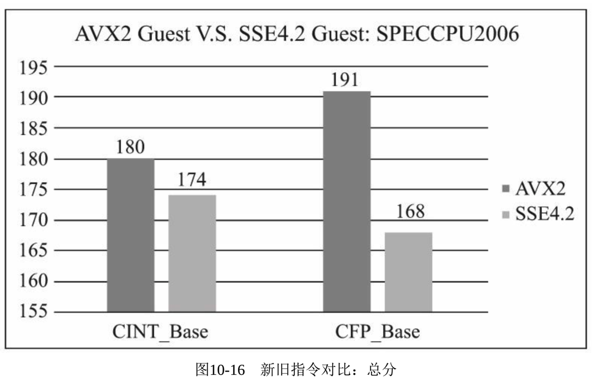
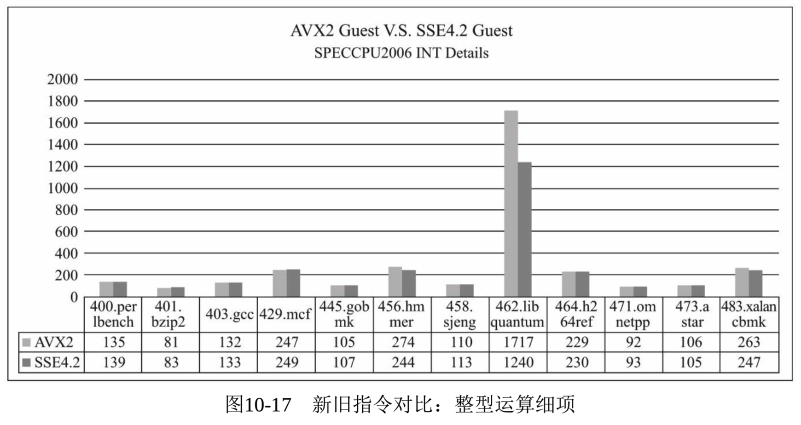
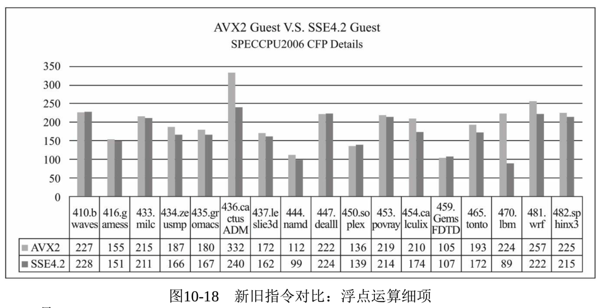

<!-- @import "[TOC]" {cmd="toc" depthFrom=1 depthTo=6 orderedList=false} -->

<!-- code_chunk_output -->


<!-- /code_chunk_output -->

以 Intel 的 Xeon 系列为例, **每一代新的 CPU**都会加入**新的指令集**, 比如 Sandybridge、Haswell、Skylake 开始分别引入 AVX、AVX2、AVX512 指令集、Westmere 开始陆续引入的 AES NI 指令集等. 它们都是为了显著提升运算性能而引入的. AES NI 对性能的提升, 我们在之前的非典型性实验中已经看到, 最多有 100% 的性能提升; 而在典型性的实验中, 甚至有 3 到 10 倍的**性能提升**.

关于 AVX2 相对于 SSE4 的性能提升, 我们也通过实验来说明. 有 AVX2 支持的客户机的 SPECCPU2006 的数据我们在 10.2.4 节已经获得.

这里我们再创建一个**没有 AVX2 支持**, 而**只有老的 SSE4.2 指令**的**客户机**(在同样的硬件平台上, 但给**客户机**用**老的 CPU 模型**"`-cpu Westmere`"), 再运行一次 SPECCPU2006, 对比一下. 宿主机环境同 10.2.2 节.

下面是启动客户机的命令.

```
qemu-system-x86_64 -cpu Westmere -enable-kvm -smp cpus=4,cores=4,sockets=1 -m 16G -drive file=./rhel7.img,format=raw,if=virtio,media=disk -drive file=./raw_disk.img,format=raw,if=virtio,media=disk -device virtio-net-pci,netdev=nic0 -netdev bridge,id=nic0,br=virbr0 -daemonize -name perf_test -display vnc=:1
```

在**宿主机**(**Broadwell CPU**)里是**支持 AVX2 指令集**的.

```
[root@kvm-host cpu2006]# cat /proc/cpuinfo | grep flags | uniq
flags : fpu vme de pse tsc msr pae mce cx8 apic sep mtrr pge mca cmov pat pse36 clflush dts acpi mmx fxsr sse sse2 ss ht tm pbe syscall nx pdpe1gb rdtscp lm constant_tsc arch_perfmon pebs bts rep_good nopl xtopology nonstop_tsc aperfmperf eagerfpu pni pclmulqdq dtes64 monitor ds_cpl vmx smx est tm2 ssse3 sdbg fma cx16 xtpr pdcm pcid dca sse4_1 sse4_2 x2apic movbe popcnt tsc_deadline_timer aes xsave avx f16c rdrand lahf_lm abm 3dnowprefetch epb intel_pt tpr_shadow vnmi flexpriority ept vpid fsgsbase tsc_adjust bmi1 hle avx2 smep bmi2 erms invpcid rtm cqm rdseed adx smap xsaveopt cqm_llc cqm_occup_llc cqm_mbm_total cqm_mbm_local dtherm ida arat pln pts
```

而在**客户机**里, 因为使用了"`-cpu Westmere`", 它只有 Westmere 那一代 CPU 支持的指令集, 有`sse4_2`, 但**没有更新的 AVX2 指令集**. 那么可以预期它的性能是要差些的, 如图`10-16`所示.

```
[root@kvm-guest ~]# cat /proc/cpuinfo | grep flags | uniq
flags : fpu vme de pse tsc msr pae mce cx8 apic sep mtrr pge mca cmov pat pse36 clflush mmx fxsr sse sse2 ht syscall nx lm constant_tsc rep_good nopl xtopology pni pclmulqdq ssse3 cx16 sse4_1 sse4_2 x2apic popcnt aes hypervisor lahf_lm arat
```



从`图 10-17`、`图 10-18`可以看到, AVX2 新指令对于老的 SSE4.2, SPECCPU2006 整型运算和浮点运算总分分别有 3.4%和 13.7%的提升.



