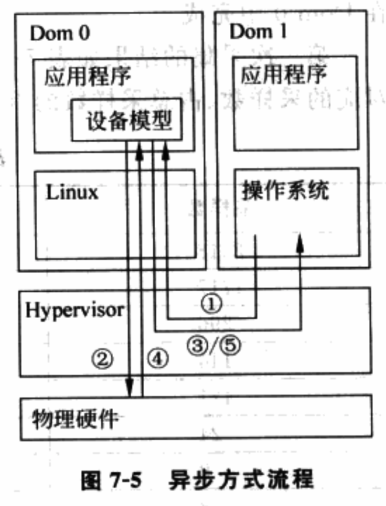

<!-- @import "[TOC]" {cmd="toc" depthFrom=1 depthTo=6 orderedList=false} -->

<!-- code_chunk_output -->

- [1. 概述](#1-概述)
- [2. 降低客户机退出事件发生频率](#2-降低客户机退出事件发生频率)
  - [2.1. 硬件加速](#21-硬件加速)
  - [2.2. 共享内存](#22-共享内存)
  - [2.3. 影子页表](#23-影子页表)
  - [2.4. 直接分配 I/O](#24-直接分配-io)
  - [2.5. 批 Hypercall](#25-批-hypercall)
- [3. 降低客户机退出事件处理时间](#3-降低客户机退出事件处理时间)
- [4. 降低处理器利用率](#4-降低处理器利用率)

<!-- /code_chunk_output -->

# 1. 概述

无论什么虚拟化技术, 相对于物理机而言, 处理器在 Hypervisor 上执行开销都将构成额外的虚拟化开销. 处理器在 **Hypervisor** 上执行的**时间越长**, 虚拟化**开销越高**, 虚拟环境的**吞吐量**和**性能**就越差, 反之则虚拟环境的性能越好.

因此, 优化的重点就应该考虑如何降低这种额外开销.

虚拟环境性能优化方法很多, 而且是具体问题具体分析. 下面归纳一些以往优化中常用方法, 供参考.

# 2. 降低客户机退出事件发生频率

下面给出常见降低客户机退出事件频率的优化方法.

## 2.1. 硬件加速

硬件虚拟化技术本身提供了对某些高频虚拟化事件的硬件加速支持, 充分利用这些硬件功能可降低客户机退出事件频率. 如打开影子 TPR/CR8 寄存器技术可减少甚至避免客户机 TPR/CR8 操作导致的客户机退出事件; 通过置位客户机异常位图可直接由硬件将客户机异常注入到客户机 IDT 中, 等等.

## 2.2. 共享内存

客户机对于虚拟化资源的访问一般需要 VMM 的介入, 以便 VMM 以合理的虚拟化策略共享物理资源. 客户机和 VMM 间的共享内存可使客户机在不采用 Hypercall 服务请求的同时, 直接得到由 Hypervisor 预先存放在共享内存中的客户机虚拟化内容. 这种方法尤其适合客户机 OS 对虚拟资源的读取, 如 VCPU 的状态等, 这可以直接降低客户机退出事件发生的频率.

## 2.3. 影子页表

对于采用影子页表的客户机, 如何有效构建影子页表以降低由影子页表引起的主机上页缺失是一个影响整体虚拟化性能很重要的因素, 也是一个研究热点.

当然, 采用硬件技术 EPT 可大大降低客户机退出事件发生的频率.

## 2.4. 直接分配 I/O

客户机 I/O 操作引起的客户机退出是实现 I/O 资源共享的基本方法, 但对于直接分配设备的客户机, 则可以直接访问该设备资源, 包括 I/O. 因此, 对于直接分配设备的客户机, 可通过修改该客户机 VCPU 的 VMCS 控制结构中的 IO_Bitmap, 使得这些设备的 I/O 操作引起的客户机退出被完全避免.

## 2.5. 批 Hypercall

Hypercall 是类虚拟化 OS 向 Hypervisor 申请服务的基本方法, 它本身不可完全避免.

# 3. 降低客户机退出事件处理时间

如何降低处理时间是一个挑战, 这同时也依赖开发者系统编程经验. 一些常用的技巧在这里也适用, 但同时也有一些和虚拟化相关的通用方法, 比如 I/O 的并行处理.

在采用设备模型仿真客户机设备情况下, 如 IDE, 一个触发客户机 IDE 进行磁盘读写的端口访问可能需要等待很长时间直到设备模型完成对物理设备的操作(读或写), 这导致该 VGPU 的端口响应时间非常慢, 有时甚至是几十毫秒. 这样的处理方式在虚拟化环境下很导致很严重的延迟.

如果将这种同步处理方式改为异步方式, 就可以避免 VCPU 的等待时间.

具体流程如下:

VCPU 发出的端口访问命令发送给设备模型后;

设备模型启动后台服务进程去响应对虚拟端口的操作;

前端设备模型则直接向 VCPU 返回操作完成的信号;

请求完成;

之后, 设备模型向 VCPU 发出中断请求表示数据准备完成.

如图 7-5.

除了 I/O 并行处理, 还有非主动 FP、非主动宿主机状态保存/恢复等, 可降低客户机退出事件处理时间.

# 4. 降低处理器利用率

除了降低系统延迟外, VMM 还必须尽可能降低对资源主要是处理器资源的利用. 否则, 当一定情况下, 特别是高负载情况下, 系统的资源如处理器就可能饱和从而限制吞吐量的提高.

一个典型例子就是高速网络设备.

在 Xen 的类虚拟化网络驱动中, 提供网络服务的后端程序需要将物理网卡收到的网络包复制到客户机接收缓冲区, 这要利用大量的处理器资源, 并且最终会使物理网卡饱和而限制 Xen 客户机的网络性能.

实验发现, Xen 类虚拟机的网络性能在 10G 网卡/网络上只能达到大约 2 ~ 3Gbps, 因为此时处理器使用率已经达到 100%.

对于 I/O 设备的处理器资源利用, 可通过直接分配避免处理器在数据传输中的介入, 从而降低对处理器资源的利用.

在 IOMMU 的帮助下, 一个直接分配的 10G 网卡可达到大约 6 ~8Gbps 的性能.