<!-- @import "[TOC]" {cmd="toc" depthFrom=1 depthTo=6 orderedList=false} -->

<!-- code_chunk_output -->

- [1. SMP技术](#1-smp技术)
- [2. NUMA技术](#2-numa技术)
- [3. numactl命令详解](#3-numactl命令详解)
- [4. CPU的numa情况](#4-cpu的numa情况)
  - [4.1. CPU信息](#41-cpu信息)
  - [4.2. NUMA的CPU调度情况](#42-numa的cpu调度情况)
  - [4.3. 查看进程在NUMA节点内存使用](#43-查看进程在numa节点内存使用)
  - [4.4. numa平衡开关](#44-numa平衡开关)
- [5. CPU的绑定操作](#5-cpu的绑定操作)
  - [5.1. 查看虚拟机列表](#51-查看虚拟机列表)
  - [5.2. 查看虚拟机VCPU对应的物理CPU情况](#52-查看虚拟机vcpu对应的物理cpu情况)
  - [5.3. 5.3 虚拟机的所有vCPU绑定到物理CPU](#53-53-虚拟机的所有vcpu绑定到物理cpu)
  - [5.4. 不同vCPU绑定到不同的物理CPU](#54-不同vcpu绑定到不同的物理cpu)
- [6. CPU热添加](#6-cpu热添加)
  - [6.1. 查看虚拟机的CPU数值](#61-查看虚拟机的cpu数值)
  - [6.2. 最大CPU分配数](#62-最大cpu分配数)
  - [6.3. 热添加CPU](#63-热添加cpu)
  - [6.4. 激活CPU](#64-激活cpu)
- [7. CPU热减少](#7-cpu热减少)
- [8. 参考](#8-参考)

<!-- /code_chunk_output -->

KVM的性能调优, 可以从四个方面入手: CPU、内存、磁盘IO、网络.

CPU这块我们是针对NUMA这块的调优. NUMA是英文 Non Uniform Memory Access Architecture 的缩写, 意思就是非统一内存访问, 它是一种解决**多CPU共同工作**的解决方案. 我们知道现在的服务器配置都比较高了, CPU很多都是多路多核的, 而且CPU是需要跟存储器进行数据交互的, 以往的年代, 那时候的CPU运算速率不高, 而且都是**单CPU模式**, 那么存储器里的数据要放到CPU里进行运算这是完完全全跟得上的. 但是现在的CPU运算速度大大增强了, 而且都是多CPU模式, 于是就出现了不平衡, 那就是存储器里的数据完全不够让CPU消化, 并且还会出现多个CPU抢食存储器的情况... 这种情况下CPU就表现得非常的饥渴... 数据不够享用, 而且存储器还不够分配. 

因此计算机科学家为了提升计算机的性能, 就认真的研究了下CPU和存储器之间的协调交互模式. 总体核心思想就是寻找一个多CPU模式下, 如何让CPU能最大化的"享用"更多来自多个存储器的数据. 

于是就设计出了以下几套解决方案: 

# 1. SMP技术

最开始是SMP技术, SMP(Symmetric Multi\-Processing )技术就是对称多处理结构, 这种结构的最大特点就是CPU共享所有资源, 比如总线, 内存, IO系统等等. 

既然是共享所有的资源, 所以, 各个CPU之间是平等的关系, 然后操作系统管理着这些CPU对资源的访问(通常是用队列的形式去管理). 每个CPU依次的去处理队列中的进程, 如果两个CPU同时访问, 那么一般是通过软件锁的机制去解决争夺的问题, 软件锁这概念跟开发里的线程安全锁机制道理是一样的, 当一个CPU处理着一进程, 一般会先锁住, 处理完再释放. 

所以说到这里, 这里的对称指的就是CPU之间是平等的无主从, 访问资源也是平等的. 我们可以看下面这张图: 

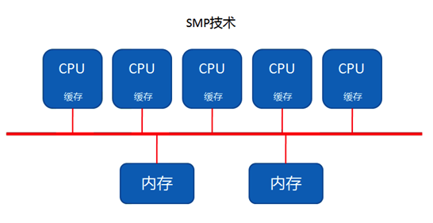

这个结构是最早出现的方案, 但是就是因为最早出现, 所以它的弊端很快就显现出来了, 那就是它的扩展能力不强. 我们看上面这张图就明显感觉到, 如果服务器要提升性能增加CPU, 那么内存(内存最大化的情况下)就明显不够了, 因为是共享模式, 多一个CPU就多一个吃内存数据的人...  因此多增加的CPU没法享受到内存的数据, 就会停歇, 这样就造成了CPU的浪费. 

有实验数据表明, SMP型的服务器CPU最好是2-4颗就OK了, 多余的就浪费了. 

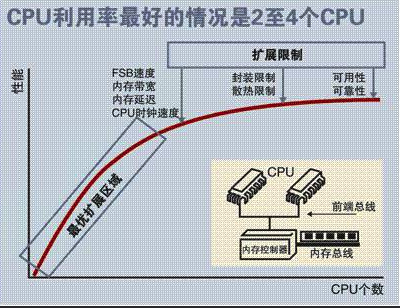

# 2. NUMA技术

NUMA刚才我们在前面说了是非统一内存访问的意思, 它的出现就很好的解决了SMP的扩展问题. 有了NUMA技术那么就可以把几十个甚至上百个CPU组合在一个服务器內. 

NUMA架构设计图: 

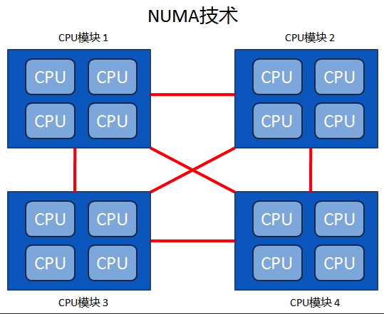

从图中我们发现, **每个CPU模块**之间都是通过**互联模块**进行连接和信息交互, CPU都是互通互联的, 同时, **每个CPU模块**平均划分为**若干个Chip(不多于4个**), **每个Chip**都有自己的**内存控制器**及**内存插槽**. 

在NUMA中还有三个节点的概念: 

- 本地节点:  对于某个节点中的所有CPU, 此节点称为本地节点. 

- 邻居节点: 与本地节点相邻的节点称为邻居节点. 

- 远端节点: 非本地节点或邻居节点的节点, 称为远端节点. 

**邻居节点**和**远端节点**, 都称作**非本地节点(Off Node**). 

这里要注意的是, CPU访问不同类型节点内存的速度是不相同的, 访问本地节点的速度最快, 访问远端节点的速度最慢, 即访问速度与节点的距离有关, **距离越远访问速度越慢**, 此距离称作**Node Distance**. 正是因为有这个特点, 所以我们的应用程序要**尽量的减少不同CPU模块之间的交互**, 也就是说, 如果你的**应用程序**能有方法**固定在一个CPU模块**里, 那么你的应用的性能将会有很大的提升. 

访问速度: 本地节点>邻居节点>远端节点

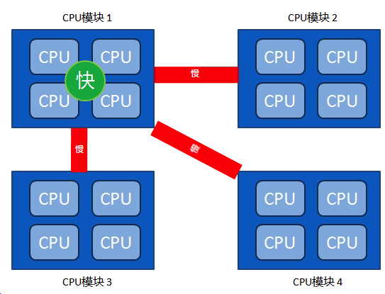

因此KVM也是一样, 我们在CPU优化这块就是要让KVM绑定在指定的CPU上, 这样减少跨CPU的交互使用, 让KVM的性能提升. 现在我们的服务器还有linux操作系统都是默认走NUMA模式, 所以我们接下来说说如何去做CPU的绑定. 

那如何操作呢?

# 3. numactl命令详解

首先我们用numactl命令查看NUMA的情况, 如果你系统没有这个命令, 用 yum install numactl 安装下即可. 

```
man numactl
```

主要参数如下

- \-\-interleave=nodes, \-i nodes: 这个选项用于设定内存的交织分配模式.  也就是说系统在为多个节点分配内存空间的时候, 将会以轮询分发的方式被分配给这多个节点. 如果在当前众多的交织分配内存节点中的目标节点无法正确的分配内存空间的话, 内存空间将会由其他的节点来分配. 多节点可以通过\-\-interleave, \-\-membind和\-\-cpunodebind命令来指定. 
- \-\-membind=nodes, \-m nodes: 选项'\-\-membind' 仅用来从节点中分配内存空间所用.  如果在这些节点中无法分配出所请求的空间大小的话该分配操作将会失败. 上述命令中指定需要分配空间的 nodes 的方式可以遵照上述"N,N,N", "N\-N", N这种方式来指定.
- \-\-cpunodebind=nodes, \-N nodes: 这命令仅用于施加在运行于cpu上的进程. 这个命令用于显示 cpu 的个数, cpu 数目信息同样记录在系统中的存放处理器领域信息的 /proc/cpuinfo 文件夹下, 或者是按照关联的中央处理器信息在当前的中央处理器集中所存放. 
- \-\-localalloc, \-l: 这个命令选项通常是为当前的节点分配内存的. 
- \-\-preferred=node: 该命令由于指定优先分配内存空间的节点, 如果无法将空间分配给该节点的话, 应该分配给该节点上的空间将会被分发到其他的节点上. 该命令选项后面仅接收一个单独的节点标号. 相关的表示方式也可以使用. 
- \-\-show, \-s: 该命令用于显示 NUMA 机制作用在当前运行的那些进程上. 
- \-\-hardware, \-H: 该命令用于显示当前系统中有多少个可用的节点. 
- \-\-huge: 当创建一个基于大内存页面的系统级的共享内存段的时候使用\-\-huge 这个选项, 注意这选项仅在 \-\-shmid 或是 \-\-shm 命令的后面使用才有效. 
- \-\-offset: 该参数选项用于指定共享内存段中的位移量的偏移.  默认的情况下偏移量是 0 .  有效的偏移量单位是 m (用于表示 MB)  g (用于表示 GB) , k (用于表示 KB ), 其他没有指定的被认为是以字节为单位. 
- \-\-strict: 这个参数选项 当施加了 NUMA 调度机制的共享内存段区域的页面被施加了另一个机制而导致错误的时候, 使用 --strict 选项将会把错误信息显示出来. 默认情况是不使用该选项的. 
- \-\-shmmode shmmode: 该选项仅在 \-\-shmid 或是 \-\-shm 之前使用才会生效.  当创建一个共享内存段的时候, 通过整型数值来指定共享内存的共享的模式类型. 
\-\-shmid id: 通过ID 号码来创建或使用一个共享内存段. (如果共享内存段已经存在, 那么通过 shmid 来指定下面要使用某个 ID 的共享内存段; 如果该 ID 对应的共享内存段并不存在的话, 那么就创建一个). 
- \-\-shm shmkeyfile: 通过存放在 shmkeyfile(共享内存-键文件)中的 ID 号码来创建或者是使用一个共享内存段. 访问 shmkeyfile 文件的进程是通过 fork(3 arguments) 方法来实现的. 
- \-\-file tmpfsfile: 将 numa 机制施加于文件上面, 这个文件属于tmpfs或者是 hugetlbfs 这种特殊的文件系统. 
- \-\-touch: 通过将 numa 机制施加于刚刚页面上来实现内存的早期 numa 化. 默认情况下是不使用该选项, 如果存在映射或是访问页面的应用的话, 将会使用该早期实行 NUMA 机制的这种方法. 
- \-\-dump: 该选项用于废除将已经 numa 化的特定区域上的 NUMA性质.
- \-\-dump\-nodes: nodes 所指定的节点以外的所有节点上的 NUMA 特性全都会被移除
- all  用于将所有的节点上的 NUMA 特性移除
- number  通过指定 node 后接的数值来废除该数字对应的 node 
- number1(number2)  node number1(node number2)上的 NUMA 特性将会被移除
- number1-number2    node number1 -- node number2 区间上的所有存在的 node 的 NUMA 特性将会被移除
- !nodes: 除了 nodes 所指定的节点以外的所有节点上的 NUMA 特性全都会被移除

# 4. CPU的numa情况

OK, 以上是numactl的详细命令, 那么接下来我们先看看当前服务器CPU的numa情况: 

## 4.1. CPU信息

我们执行lscpu命令可以查看到一些CPU信息: 

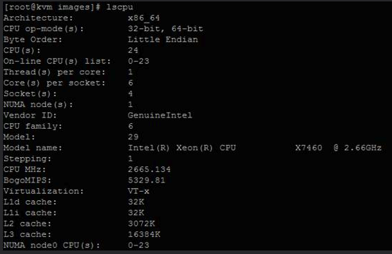

下面输出和上面属于同一台服务器, 这台服务器numa有2个node

这里我准备了两台IBM的服务器, 一个3650M4另外一个是3850M2. 

IBM 3650M4, 这个服务numa有两个node:

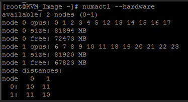

IBM 3850M2, 那么它就只有一个node:

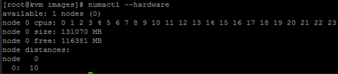

## 4.2. NUMA的CPU调度情况

接下来看下CPU numa的调度分配情况, 通过numastat命令

IBM 3650M4:

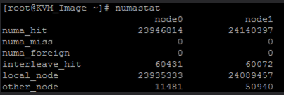

IBM 3850M2:

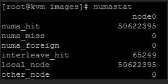

参数解释:

- numa\_hit: 使用本节点内存次数
- num\_miss: **计划使用本节点内存**而**被调度到其他节点次数**
- num\_foregin: **计划使用其他节点内存**而**使用本地内存次数**
- interleave\_hit: 交叉分配使用的内存中使用本节点的内存次数
- local\_node: 在本节点运行的程序使用本节点内存次数
- NB other\_node: 在**其他节点运行的程序**使用**本节点内存次数**

## 4.3. 查看进程在NUMA节点内存使用

接着我们看下这个命令: numastat \-c, 这个命令c 后面跟上进程名就能看到相关进程的NUMA内存使用情况. 比如: numastat -c qemu\-kvm, 这样我们就知道了qemu\-kvm这个进程, 它在node0 和node1上使用的内存大小, 单位是MB: 

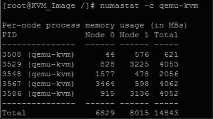

注意: qemu\-kvm会有多个进程使用

通过这几个命令我们可以查看一些numa的基本状态和使用情况. 

## 4.4. numa平衡开关

那么针对CPU Numa技术, linux操作系统本身也有自身对这块的设计. 

拿linux来说, 它默认使用的就是**NUMA自动平衡策略**, 也就是说, 系统会自动的调配numa的内存使用, 以求一个平衡. 

这个设置用户可自己控制

```
# 关闭
# echo 0 > /proc/sys/kernel/numa_balancing

# 开启
# echo 1 > /proc/sys/kernel/numa_balancing
```

# 5. CPU的绑定操作

既然我们的操作系统还有CPU特性都采用了NUMA架构, 那么我们完全可以通过**调整KVM对应的NUMA关系**来达到**KVM CPU这方面的优化**. 这里, 我们一般是通过**CPU绑定的方法**来做相关操作的. 

那么具体的操作是怎么样的呢?那么接下来我们通过一个例子来演示. 

## 5.1. 查看虚拟机列表

用 virsh list 命令可以查看到当前运行的虚拟机列表. 

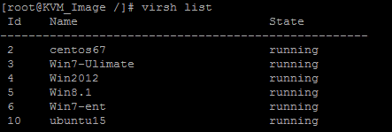

## 5.2. 查看虚拟机VCPU对应的物理CPU情况

看这个Win7-ent虚拟机里vCPU对应物理CPU的情况, 那么可以运行: 

```
# virsh vcpuinfo Win7-ent
```

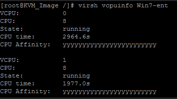

这个虚拟机是2个VCPU双核, 都是跑在物理机的CPU8上. 最后一个是CPU的亲和性, 这个yyyyy表示使用的物理CPU内核的逻辑核, 一个y代表其中一个CPU逻辑核. 全是y, 说明这台物理机的24个CPU核(这24个是所有numa的node的)都能调度使用

当然, 可以进入virsh, 然后运行

```
# emulatorpin Win7-ent
```

可以更详细得到这个虚拟机可以用哪几个核:

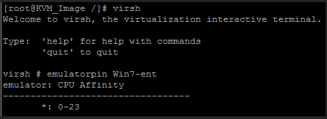

可见, 目前这个虚拟机可以在物理机的两个numa节点一共24个核上调度使用

## 5.3. 5.3 虚拟机的所有vCPU绑定到物理CPU

如果我们要把虚拟机绑定到固定的CPU上, 我们就要做以下操作:  

```
# virsh emulatorpin Win7-ent 18-23 --live   
```

通过这个命令, 我们把这个win7的虚拟机vCPU绑定在了18-23这6个CPU之间的核上. 

可以通过命令查看下 

```
# emulatorpin Win7-ent
```

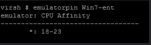

也可用下面命令确认查看

```
# virsh dumpxml Win7-ent
```

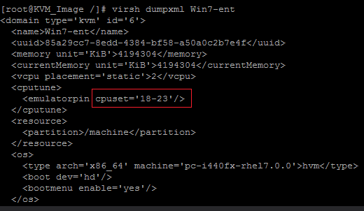

这是让虚拟机的所有vCPU绑定到一起的方法

## 5.4. 不同vCPU绑定到不同的物理CPU

一个虚拟机我有两个vCPU, 比如这个win7 , 它就是双核的, 我想让里面的vCPU1和vCPU2分别绑定在不同的物理CPU上可以吗?怎么操作呢?

```
# virsh vcpupin Win7-ent 0 22

# virsh vcpupin Win7-ent 1 23

# virsh dumpxml Win7-ent
```

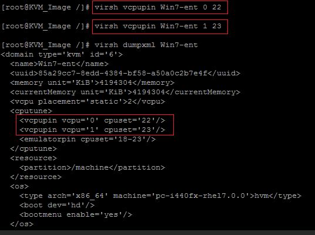

```
# virsh vcpuinfo Win7-ent
```

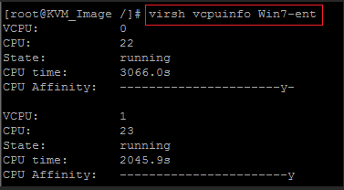

注: 把虚拟机用reboot重启, 这个绑定配置还是生效的, 但是你shutdown的话, CPU绑定的效果会失效. 

要让VM关机然后起来也生效, 就必须把参数写入到虚拟机的XML里, 然后保存, 这样关机了也不会失效, 这里要注意下

```
 # virsh edit vm1
   wq!
   添加: 
   <cputune>
      <vcpupin vcpu='0' cpuset='22'/>
      <vcpupin vcpu='1' cpuset='23'/>
   </cputune>
```

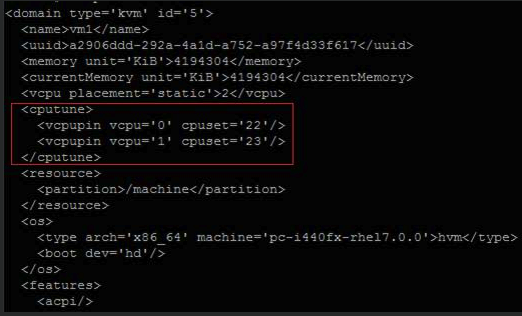

# 6. CPU热添加

热添加就是在虚拟机运行不关机的情况下, 做CPU的添加操作. 那么要注意的是, 这个热添加是在Redhat7.0以后才出现的, 之前是没有的. 所以要享用这功能那必须要求KVM宿主机和虚拟机都得在7.0版本以后. 

## 6.1. 查看虚拟机的CPU数值

查看当前虚拟机的CPU数值

```
cat /proc/cpuinfo| grep "processor"| uniq| wc -l
```

我们看到当前是2个CPU: 

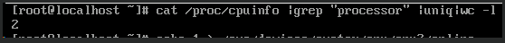

## 6.2. 最大CPU分配数

```
# virsh dumpxml id
<vcpu placement='static'>4</vcpu>
```

```
# virsh vcpucount 3
maximum      config         4
maximum      live           4
current      config         2
current      live           2
```

虚拟机内部CPU列表:

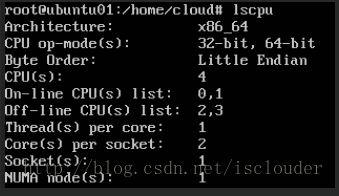

最大CPU分配数是给这个虚拟机最大预留的CPU个数, 这个设置很重要, 如果你想给虚拟机热添加, 那么这个设置必须写. 比如我们这里写的4, 那么我们可以给虚拟机最大热添加到4个CPU, 而且4是上限. 

## 6.3. 热添加CPU

那么接下来说下, 具体怎么热添加. 我们先在宿主机里先给这个虚拟机添加第三个CPU, 原来是2个, 现在再添加一个变成3个:  

```
virsh setvcpus VM3_CentOS7.1 3 --live
```

## 6.4. 激活CPU

然后我们到虚拟机里面把这个CPU激活 : 

```
echo 1 >/sys/devices/system/cpu/cpu2/online
```

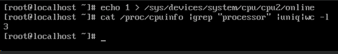

我们再运行查看, 发现已经变成3个了. 

# 7. CPU热减少

如果要减少, 那么只能在虚拟机里减少刚才的CPU

```
# echo 0 >/sys/devices/system/cpu/cpu2/online
```

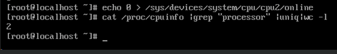

但是在宿主机层面看这个虚拟机的vCPU数还是3个, 也就是说不支持热减少, 我们运行vcpuinfo VM3_CentOS7.1命令发现还是3个: 

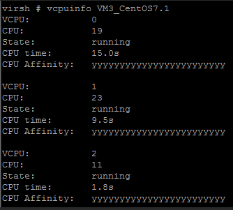

只是将VCPU离线了而已

# 8. 参考

<http://www.cnblogs.com/yubo/archive/2010/04/23/1718810.html>

<http://cenalulu.github.io/linux/numa/>