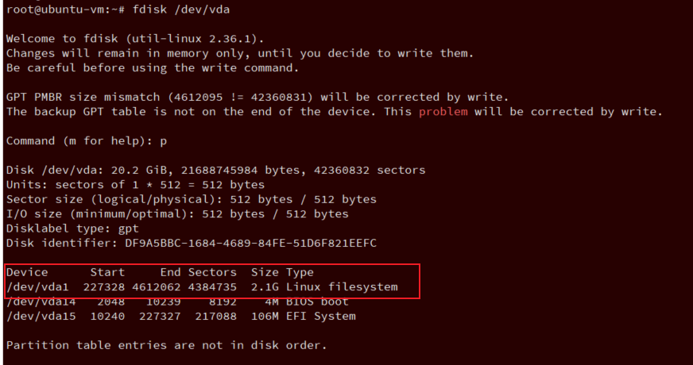

<!-- @import "[TOC]" {cmd="toc" depthFrom=1 depthTo=6 orderedList=false} -->

<!-- code_chunk_output -->

- [1. 下载 qcow2 镜像](#1-下载-qcow2-镜像)
- [2. 镜像密码修改](#2-镜像密码修改)
  - [2.1. guestfish 工具](#21-guestfish-工具)
  - [2.2. qemu-nbd 方式](#22-qemu-nbd-方式)
- [3. 开启 root 的 ssh 登录](#3-开启-root-的-ssh-登录)
- [4. 暂时启动 guest](#4-暂时启动-guest)
  - [ARM](#arm)
- [获取 ip](#获取-ip)
- [5. 修改 default.target](#5-修改-defaulttarget)
- [6. 基本设置](#6-基本设置)
- [7. 扩大根分区](#7-扩大根分区)
  - [7.1. 磁盘整体扩容](#71-磁盘整体扩容)
  - [7.2. 查看磁盘扩容后状态](#72-查看磁盘扩容后状态)
  - [7.3. 进行分区扩展磁盘](#73-进行分区扩展磁盘)
  - [7.4. 删除根分区](#74-删除根分区)
  - [7.5. 创建分区](#75-创建分区)
  - [7.6. 保存退出并刷新分区](#76-保存退出并刷新分区)
  - [7.7. 查看磁盘分区和文件系统状态](#77-查看磁盘分区和文件系统状态)
  - [7.8. 刷新根分区](#78-刷新根分区)
- [8. 创建数据盘并使用](#8-创建数据盘并使用)
- [9. 修改镜像内容](#9-修改镜像内容)
- [10. 键盘输入设置](#10-键盘输入设置)
- [11. 虚拟机最终启动命令](#11-虚拟机最终启动命令)
  - [ARM](#arm-1)
- [12. 修改 grub](#12-修改-grub)
- [13. 防火墙](#13-防火墙)
- [14. selinux](#14-selinux)
- [15. vncserver](#15-vncserver)

<!-- /code_chunk_output -->

# 1. 下载 qcow2 镜像

根据 ubuntu 发行版, 找最新的下载

链接:

https://cloud-images.ubuntu.com/

https://mirrors.tuna.tsinghua.edu.cn/ubuntu-cloud-images/

或者

https://cdimage.debian.org/images/cloud/

# 2. 镜像密码修改

使用 openssl 生成加密的密码, `-1` 表示使用 MD5 算法对密码进行加密

```
root@haiwei:~# openssl passwd -1 123456
$1$WcWo5KOD$o6Fsb.72vc9yH3Uv.0P1h0
```

然后可以选择通过 guestfish 工具修改或者 qemu_nbd 方式修改

## 2.1. guestfish 工具

```
apt install libguestfs-tools linux-image-generic
```

修改成为固定密码

```
sudo virt-customize -a CentOS-7-x86_64-GenericCloud-1703.qcow2 --root-password password:123
```


```
# guestfish --rw -a debian-amd64.qcow2

Welcome to guestfish, the guest filesystem shell for
editing virtual machine filesystems and disk images.

Type: 'help' for help on commands
      'man' to read the manual
      'quit' to quit the shell

><fs> run
><fs> list-filesystems
/dev/sda1: ext4
><fs> mount /dev/sda1 /
><fs>
```

然后修改 root 密码

```
><fs> vi /etc/shadow
```

```
root:*:18873:0:99999:7:::
daemon:*:18737:0:99999:7:::
bin:*:18737:0:99999:7:::
sys:*:18737:0:99999:7:::
sync:*:18737:0:99999:7:::
games:*:18737:0:99999:7:::
man:*:18737:0:99999:7:::
lp:*:18737:0:99999:7:::
mail:*:18737:0:99999:7:::
news:*:18737:0:99999:7:::
uucp:*:18737:0:99999:7:::
proxy:*:18737:0:99999:7:::
www-data:*:18737:0:99999:7:::
backup:*:18737:0:99999:7:::
list:*:18737:0:99999:7:::
irc:*:18737:0:99999:7:::
gnats:*:18737:0:99999:7:::
nobody:*:18737:0:99999:7:::
systemd-network:*:18737:0:99999:7:::
systemd-resolve:*:18737:0:99999:7:::
systemd-timesync:*:18737:0:99999:7:::
messagebus:*:18737:0:99999:7:::
syslog:*:18737:0:99999:7:::
```

将 `root:` 后面的第一个 `*` 替换为加密之后的密码

替换后第一行为/etc/shadow 第一行为

```
root:$1$WcWo5KOD$o6Fsb.72vc9yH3Uv.0P1h0:18873:0:99999:7:::
```

> 也可以直接删掉第一个 `*`, 从而 root 用户没有密码

## 2.2. qemu-nbd 方式

见 `Virtualization\Tools\qemu-nbd 方式挂载镜像.md`

# 3. 开启 root 的 ssh 登录

编辑 `/etc/ssh/sshd_config`, 修改下面两行内容

```
><fs> vi /etc/ssh/sshd_config
#PermitRootLogin prohibit-password
...
#PasswordAuthentication yes
```

去掉注释, 改成 yes

```
PermitRootLogin yes
...
PasswordAuthentication yes
```

`systemctl status sshd`

# 4. 暂时启动 guest

如果没有 enable virtio 的话, 可以使用下面命令:

> sudo /usr/local/bin/qemu-system-x86_64 -name ubuntu -accel kvm -cpu host -m 2G -smp 4 ./ubuntu-22.04.qcow2 -netdev user,id=hostnet0 -device rtl8139,netdev=hostnet0,id=net0,mac=52:54:00:36:32:aa,bus=pci.0,addr=0x5 -nographic -full-screen

> BOOT_IMAGE=/boot/vmlinuz-5.15.0-25-generic root=LABEL=cloudimg-rootfs ro console=tty1 console=ttyS0

> use custom kernel

sudo /usr/local/bin/qemu-system-x86_64 -name ubuntu -accel kvm -cpu host -m 32G -smp 48,sockets=1,cores=24,threads=2 -kernel /boot/vmlinuz-5.15.0 -initrd /boot/initrd.img-5.15.0 -append "root=/dev/sda1 ro console=tty1 console=ttyS0" ./ubuntu-22.04.qcow2 -netdev user,id=hostnet0 -device rtl8139,netdev=hostnet0,id=net0,mac=52:54:00:36:32:aa,bus=pci.0,addr=0x5 -nographic -full-screen

> use custom kernel with -drive

sudo /usr/local/bin/qemu-system-x86_64 -name ubuntu -accel kvm -cpu host -m 32G -smp 48,sockets=1,cores=24,threads=2 -kernel /boot/vmlinuz-5.15.0 -initrd /boot/initrd.img-5.15.0 -append "root=/dev/sda1 ro console=tty1 console=ttyS0" -drive file=/home/test/workspace/ubuntu-22.04.qcow2,if=ide -netdev user,id=hostnet0 -device rtl8139,netdev=hostnet0,id=net0,mac=52:54:00:36:32:aa,bus=pci.0,addr=0x5 -nographic -full-screen

> remove xsave

sudo /usr/local/bin/qemu-system-x86_64 -name ubuntu -accel kvm -cpu host,-xsave,-xsavec,-xsaveopt,-xsaves -m 32G -smp 48,sockets=1,cores=24,threads=2 ./ubuntu-22.04.qcow2 -netdev user,id=hostnet0 -device rtl8139,netdev=hostnet0,id=net0,mac=52:54:00:36:32:aa,bus=pci.0,addr=0x5 -nographic -full-screen

如果 host 上支持 virtio, 可以使用下面命令

> /usr/local/bin/qemu-system-x86_64 -name ubuntu-hirsute --enable-kvm -cpu host -smp 4,sockets=1,cores=2,threads=2 -m 3G -device piix3-usb-uhci,id=usb,bus=pci.0,addr=0x1.0x2 -drive file=./debian-10.12.2-20220419-openstack-amd64.qcow2,if=none,id=drive-virtio-disk1,format=qcow2,cache=none -device virtio-blk-pci,scsi=off,bus=pci.0,addr=0x3,drive=drive-virtio-disk1,id=virtio-disk1,bootindex=1 -netdev user,id=hostnet0 -device rtl8139,netdev=hostnet0,id=net0,mac=52:54:00:36:32:aa,bus=pci.0,addr=0x5 -nographic -full-screen


## ARM

如果 host 上支持 virtio, 可以使用下面命令

qemu-system-aarch64 -name ubuntu -M virt,gic-version=3,its=on,iommu=smmuv3,mte=on -nographic -cpu max,sve=on,sve256=on -m 2G -smp 4 -kernel ./arm64Image -append "noinintrd nokaslr loglevel=8 sched_debug root=/dev/vda1 rootfstype=ext4 rw crashkernel=256M device.dyndbg=+pflmt vfio.dyndbg=+pflmt irq_gic_v3_its.dyndbg=+pflmt iommu.dyndbg=+pflmt irqdomain.dyndbg=+pflmt" -drive if=none,file=./ubuntu22.04.qcow2,id=hd0 -device virtio-blk-device,drive=hd0 -netdev user,id=hostnet0 -device virtio-net-device,netdev=mynet -netdev user,id=mynet -nographic -full-screen


qemu-system-aarch64 -name ubuntu -M virt,gic-version=3,its=on,iommu=smmuv3,mte=on -nographic -cpu max,sve=on,sve256=on -m 4G -smp 8 \
    -bios /usr/share/qemu-efi-aarch64/QEMU_EFI.fd \
    -drive if=virtio,file=./ubuntu22.04.qcow2 \
    -nographic

# 获取 ip

新建或者修改 /etc/netplan/XXX.yaml

```
network:
  version: 2
  renderer: networkd
  ethernets:
    ens5:
      dhcp4: true
      dhcp6: true
```

然后执行

```
netplan apply
```

apt install net-tools isc-dhcp-client


# 5. 修改 default.target

systemctl set-default multi-user

Created symlink /etc/systemd/system/default.target  ->  /lib/systemd/system/multi-user.target

修改 default grub

```
// /etc/default/grub
GRUB_CMDLINE_LINUX_DEFAULT="quiet splash console=ttyAMA0 noinintrd nokaslr loglevel=8 sched_debug root=/dev/vda1 rootfstype=ext4 rw crashkernel=256M device.dyndbg=+pflmt vfio.dyndbg=+pflmt irq_gic_v3_its.dyndbg=+pflmt iommu.dyndbg=+pflmt irqdomain.dyndbg=+pflmt"
```

# 6. 基本设置

开启 ssh 语法高亮以及内置命令别名

```
vi /root/.bashrc
```

之前的内容是

```
# Note: PS1 and umask are already set in /etc/profile. You should not
# need this unless you want different defaults for root.
# PS1='${debian_chroot:+($debian_chroot)}\h:\w\$ '
# umask 022

# You may uncomment the following lines if you want `ls' to be colorized:
# export LS_OPTIONS='--color=auto'
# eval "`dircolors`"
# alias ls='ls $LS_OPTIONS'
# alias ll='ls $LS_OPTIONS -l'
# alias l='ls $LS_OPTIONS -lA'
#
# Some more alias to avoid making mistakes:
# alias rm='rm -i'
# alias cp='cp -i'
# alias mv='mv -i'
```

去掉注释

```
# Note: PS1 and umask are already set in /etc/profile. You should not
# need this unless you want different defaults for root.
PS1='${debian_chroot:+($debian_chroot)}\h:\w\$ '
umask 022

# You may uncomment the following lines if you want `ls' to be colorized:
export LS_OPTIONS='--color=auto'
eval "`dircolors`"
alias ls='ls $LS_OPTIONS'
alias ll='ls $LS_OPTIONS -l'
alias l='ls $LS_OPTIONS -lA'
#
# Some more alias to avoid making mistakes:
alias rm='rm -i'
alias cp='cp -i'
alias mv='mv -i'

function run() {
    number=$1
    shift
    for n in $(seq $number); do
      echo ""
      $@
    echo "------------ $n end ----------------"
    done
}
```

# 7. 扩大根分区

Linux 扩容 / 根分区(LVM+非 LVM)参照: https://zhuanlan.zhihu.com/p/83340525

磁盘空间扩容: https://blog.csdn.net/byn12345/article/details/88829984

## 7.1. 磁盘整体扩容

先将原有镜像备份

```
# qemu-img resize ubuntu_hirsute.qcow2 +18G

# qemu-img info ubuntu_hirsute.qcow2
image: ubuntu_hirsute.qcow2
file format: qcow2
virtual size: 20.2 GiB (21688745984 bytes)
disk size: 613 MiB
cluster_size: 65536
Format specific information:
    compat: 0.10
    compression type: zlib
    refcount bits: 16
```

建议直接扩大到 50G

## 7.2. 查看磁盘扩容后状态

进入虚拟机命令如下

>
>/usr/bin/qemu-system-x86_64 -name ubuntu-hirsute --enable-kvm -cpu host -smp 4,sockets=1,cores=2,threads=2 -m 3G -device piix3-usb-uhci,id=usb,bus=pci.0,addr=0x1.0x2 -drive file=/images/ubuntu_hirsute.qcow2,if=none,id=drive-virtio-disk0,format=qcow2,cache=none -device virtio-blk-pci,scsi=off,bus=pci.0,addr=0x3,drive=drive-virtio-disk0,id=virtio-disk0,bootindex=1 -netdev user,id=hostnet0 -device rtl8139,netdev=hostnet0,id=net0,mac=52:54:00:36:32:aa,bus=pci.0,addr=0x5 -nographic -full-screen
>
> sudo /home/haiwei/workspace/codes/qemu/build/x86_64-softmmu/qemu-system-x86_64 -name ubuntu -accel kvm -cpu host -m 16G -smp 4 ./ubuntu-22.04.raw -netdev user,id=hostnet0 -device rtl8139,netdev=hostnet0,id=net0,mac=52:54:00:36:32:aa,bus=pci.0,addr=0x5 -nographic -full-screen

```
lsblk
df -TH
```

```
# lsblk
NAME    MAJ:MIN RM  SIZE RO TYPE MOUNTPOINT
fd0       2:0    1    4K  0 disk
loop0     7:0    0 32.3M  1 loop /snap/snapd/12704
loop1     7:1    0 68.3M  1 loop /snap/lxd/21260
loop2     7:2    0 61.8M  1 loop /snap/core20/1081
sr0      11:0    1 1024M  0 rom
vda     252:0    0 20.2G  0 disk
├─vda1  252:1    0  2.1G  0 part /
├─vda14 252:14   0    4M  0 part
└─vda15 252:15   0  106M  0 part /boot/efi
```

```
# df -Th
Filesystem     Type   Size  Used Avail Use% Mounted on
tmpfs          tmpfs  299M  932K  298M   1% /run
/dev/vda1      ext4   2.0G  1.4G  614M  70% /
tmpfs          tmpfs  1.5G     0  1.5G   0% /dev/shm
tmpfs          tmpfs  5.0M     0  5.0M   0% /run/lock
tmpfs          tmpfs  4.0M     0  4.0M   0% /sys/fs/cgroup
/dev/vda15     vfat   105M  5.2M  100M   5% /boot/efi
tmpfs          tmpfs  299M  4.0K  299M   1% /run/user/0
```

docbook-xml dosfstools cheese-common cheese aisleriot shotwell shotwell-common sudo transmission-gtk transmission-common

## 7.3. 进行分区扩展磁盘

记住根分区起始位置和结束位置

```
fdisk /dev/vda
```



## 7.4. 删除根分区

切记一定不要保存！！！

```
Command (m for help): d
Partition number (1,14,15, default 15): 1

Partition 1 has been deleted.
```

## 7.5. 创建分区

创建分区, 分区号还是 1, 注意分区起始位置, 不要删除 ext4 的签名

```
Command (m for help): n
Partition number (1-13,16-128, default 1): 1
First sector (34-42360798, default 227328):
Last sector, +/-sectors or +/-size{K,M,G,T,P} (227328-42360798, default 42360798):

Created a new partition 1 of type 'Linux filesystem' and of size 20.1 GiB.
Partition #1 contains a ext4 signature.

Do you want to remove the signature? [Y]es/[N]o: N

Command (m for help): p

Disk /dev/vda: 50.2 GiB, 53901000704 bytes, 105275392 sectors
Units: sectors of 1 * 512 = 512 bytes
Sector size (logical/physical): 512 bytes / 512 bytes
I/O size (minimum/optimal): 512 bytes / 512 bytes
Disklabel type: gpt
Disk identifier: DF9A5BBC-1684-4689-84FE-51D6F821EEFC

Device      Start      End  Sectors  Size Type
/dev/vda1  227328 42360798 42133471 20.1G Linux filesystem
/dev/vda14   2048    10239     8192    4M BIOS boot
/dev/vda15  10240   227327   217088  106M EFI System
```

## 7.6. 保存退出并刷新分区

```
Command (m for help): w

The partition table has been altered.
Syncing disks.

root@ubuntu-vm:~# partprobe /dev/vda
```

## 7.7. 查看磁盘分区和文件系统状态

```
root@ubuntu-vm:~# lsblk
NAME    MAJ:MIN RM  SIZE RO TYPE MOUNTPOINT
fd0       2:0    1    4K  0 disk
loop0     7:0    0 32.3M  1 loop /snap/snapd/12704
loop1     7:1    0 68.3M  1 loop /snap/lxd/21260
loop2     7:2    0 61.8M  1 loop /snap/core20/1081
sr0      11:0    1 1024M  0 rom
vda     252:0    0 20.2G  0 disk
├─vda1  252:1    0 20.1G  0 part /
├─vda14 252:14   0    4M  0 part
└─vda15 252:15   0  106M  0 part /boot/efi

root@ubuntu-vm:~# df -Th
Filesystem     Type   Size  Used Avail Use% Mounted on
tmpfs          tmpfs  299M  932K  298M   1% /run
/dev/vda1      ext4   2.0G  1.4G  614M  70% /
tmpfs          tmpfs  1.5G     0  1.5G   0% /dev/shm
tmpfs          tmpfs  5.0M     0  5.0M   0% /run/lock
tmpfs          tmpfs  4.0M     0  4.0M   0% /sys/fs/cgroup
/dev/vda15     vfat   105M  5.2M  100M   5% /boot/efi
tmpfs          tmpfs  299M  4.0K  299M   1% /run/user/0
```

* lsblk 有变化, 这是磁盘的变化

* df 没变化, 文件系统还没有变化

## 7.8. 刷新根分区

使用 resize2fs 或 xfs_growfs 对挂载目录在线扩容

* resize2fs 针对文件系统 ext2 ext3 ext4
* xfs_growfs 针对文件系统 xfs

```
# resize2fs /dev/vda1
resize2fs 1.45.7 (28-Jan-2021)
Filesystem at /dev/vda1 is mounted on /; on-line resizing required
old_desc_blocks = 1, new_desc_blocks = 3
The filesystem on /dev/vda1 is now 5266683 (4k) blocks long.

root@ubuntu-vm:~# df -Th
Filesystem     Type   Size  Used Avail Use% Mounted on
tmpfs          tmpfs  299M  932K  298M   1% /run
/dev/vda1      ext4    20G  1.4G   19G   7% /
tmpfs          tmpfs  1.5G     0  1.5G   0% /dev/shm
tmpfs          tmpfs  5.0M     0  5.0M   0% /run/lock
tmpfs          tmpfs  4.0M     0  4.0M   0% /sys/fs/cgroup
/dev/vda15     vfat   105M  5.2M  100M   5% /boot/efi
tmpfs          tmpfs  299M  4.0K  299M   1% /run/user/0
```

# 8. 创建数据盘并使用

数据盘格式化并挂载: https://www.cnblogs.com/jyzhao/p/4778657.html

qemu-img create -f qcow2 data.qcow2 50G

```
#/etc/fstab

/dev/vdb1              /data                    ext4    defaults        0 0
```

# 9. 修改镜像内容

通过 `qmeu-nbd` 工具

# 10. 键盘输入设置

ubuntu 中启用 page up/down 进行补全功能: https://blog.csdn.net/jingtaohuang/article/details/109628105

`/etc/inputrc` 中这两行取消注释

```
# alternate mappings for "page up" and "page down" to search the history
"\e[5~": history-search-backward
"\e[6~": history-search-forward
```

# 11. 虚拟机最终启动命令

> ubuntu hirsute image -- quick start
>
> /usr/bin/qemu-system-x86_64 -name ubuntu-hirsute --enable-kvm -cpu host -smp 4,sockets=1,cores=2,threads=2 -m 3G -device piix3-usb-uhci,id=usb,bus=pci.0,addr=0x1.0x2 -drive file=/images/ubuntu_hirsute.qcow2,if=none,id=drive-virtio-disk0,format=qcow2,cache=none -device virtio-blk-pci,scsi=off,bus=pci.0,addr=0x3,drive=drive-virtio-disk0,id=virtio-disk0,bootindex=1 -drive file=/images/data.qcow2,format=qcow2,if=none,id=drive-virtio-disk1,cache=none,aio=native -object iothread,id=iothread1 -device virtio-blk-pci,iothread=iothread1,scsi=off,bus=pci.0,addr=0x4,drive=drive-virtio-disk1,id=virtio-disk1 -netdev user,id=hostnet0 -device rtl8139,netdev=hostnet0,id=net0,mac=52:54:00:36:32:aa,bus=pci.0,addr=0x5 -nographic -full-screen

> ubuntu hirsute image -- daemonize start
>
>/usr/bin/qemu-system-x86_64  -name ubuntu-hirsute -machine pc-i440fx-hirsute,accel=kvm,usb=off,dump-guest-core=off -cpu host -m 4G -smp 4,sockets=1,cores=2,threads=2 -uuid 982ab310-b608-49f9-8e0f-afdf7fa3fdda -smbios type=1,serial=982ab310-b608-49f9-8e0f-afdf7fa3fdda,uuid=982ab310-b608-49f9-8e0f-afdf7fa3fdda -no-user-config -nodefaults -chardev socket,id=montest,server=on,wait=off,path=/tmp/mon_test -mon chardev=montest,mode=readline -rtc base=utc,clock=vm -global kvm-pit.lost_tick_policy=discard -no-hpet -no-shutdown -boot strict=on -device piix3-usb-uhci,id=usb,bus=pci.0,addr=0x1.0x2 -drive file=/images/ubuntu_hirsute.qcow2,format=qcow2,if=none,id=drive-virtio-disk0,cache=none,aio=native -object iothread,id=iothread0 -device virtio-blk-pci,iothread=iothread0,scsi=off,bus=pci.0,addr=0x3,drive=drive-virtio-disk0,id=virtio-disk0,bootindex=1 -drive file=/images/data.qcow2,format=qcow2,if=none,id=drive-virtio-disk1,cache=none,aio=native -object iothread,id=iothread1 -device virtio-blk-pci,iothread=iothread1,scsi=off,bus=pci.0,addr=0x4,drive=drive-virtio-disk1,id=virtio-disk1 -netdev user,id=hostnet0 -device rtl8139,netdev=hostnet0,id=net0,mac=52:54:00:36:32:aa,bus=pci.0,addr=0x5 -chardev pty,id=charserial0 -device isa-serial,chardev=charserial0,id=serial0 -vnc 0.0.0.0:1 -k en-us -device cirrus-vga,id=video0,bus=pci.0,addr=0x6 -device virtio-balloon-pci,id=balloon0,bus=pci.0,addr=0x7 -msg timestamp=on -daemonize

## ARM

-chardev socket,id=montest,server=on,wait=off,path=/tmp/mon_test -mon chardev=montest,mode=readline

-kernel

qemu-system-aarch64 -m 1024 -cpu max,sve=on,sve256=on -M virt,gic-version=3,its=on,iommu=smmuv3,mte=on -nographic -smp 4 -kernel ./arm64Image -append "noinintrd nokaslr loglevel=8 sched_debug root=/dev/vda1 rootfstype=ext4 rw crashkernel=256M device.dyndbg=+pflmt vfio.dyndbg=+pflmt irq_gic_v3_its.dyndbg=+pflmt iommu.dyndbg=+pflmt irqdomain.dyndbg=+pflmt" -drive if=none,file=./jammy-server-cloudimg-arm64.img,id=hd0 -device virtio-blk-device,drive=hd0 -device virtio-net-device,netdev=mynet -netdev user,id=mynet -chardev socket,id=montest,server=on,wait=off,path=/tmp/mon_test -mon chardev=montest,mode=readline

没有 -kernel

qemu-system-aarch64 -m 1024 -cpu max,sve=on,sve256=on -M virt,gic-version=3,its=on,iommu=smmuv3,mte=on -nographic -smp 4 ./arm64Image -append "noinintrd nokaslr loglevel=8 sched_debug rw crashkernel=256M device.dyndbg=+pflmt vfio.dyndbg=+pflmt irq_gic_v3_its.dyndbg=+pflmt iommu.dyndbg=+pflmt irqdomain.dyndbg=+pflmt" -drive if=none,file=./jammy-server-cloudimg-arm64.img,id=hd0 -device virtio-blk-device,drive=hd0 -device virtio-net-device,netdev=mynet -netdev user,id=mynet -chardev socket,id=montest,server=on,wait=off,path=/tmp/mon_test -mon chardev=montest,mode=readline -serial mon:stdio


# 12. 修改 grub

```
# vim /etc/default/grub
// 选择的内核
GRUB_DEFAULT="Advanced options for Ubuntu>Ubuntu, with Linux 5.4.129-02962-ge8dff
9ce0bd6d"
// 打开菜单
GRUB_TIMEOUT_STYLE=menu
// 超时 10s
GRUB_TIMEOUT=10
GRUB_DISTRIBUTOR=`lsb_release -i -s 2> /dev/null || echo Debian`
GRUB_CMDLINE_LINUX_DEFAULT="quiet splash"
GRUB_CMDLINE_LINUX=""

# update-grub
```

ubuntu 修改默认启动内核: https://cdmana.com/2021/03/20210328153654881n.html

# 13. 防火墙

sudo apt-get install ufw

ufw disable

ufw status

# 14. selinux

apt install selinux-utils

getenforce

ll /etc/sysconfig/selinux

# 15. vncserver

https://www.linode.com/docs/guides/install-vnc-on-ubuntu-21-04/

vnc 锁屏设置: https://blog.csdn.net/qq_35229961/article/details/107029202

apt install tigervnc-standalone-server


窗口太小: https://blog.csdn.net/teng_wu/article/details/103260703


```
# vncpasswd
Password:
Verify:
Would you like to enter a view-only password (y/n)? n
A view-only password is not used
```

`vim ~/.vnc/xstartup`

```
#!/bin/sh
export XKL_XMODMAP_DISABLE=1
export XDG_CURRENT_DESKTOP="GNOME-Flashback:GNOME"
export XDG_MENU_PREFIX="gnome-flashback-"
gnome-session --session=gnome-flashback-metacity --disable-acceleration-check
```

chmod a+x ~/.vnc/xstartup

tigervncserver -geometry 1280x1024 -localhost no (可用)


vncserver -geometry 1920x1080 :1 -localhost no


