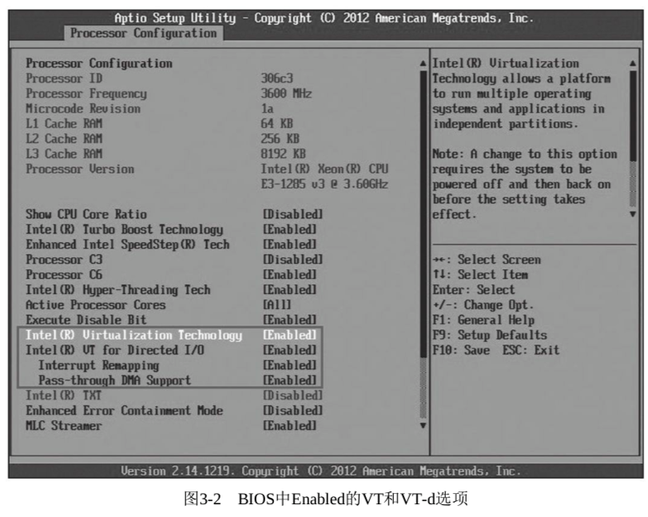

<!-- @import "[TOC]" {cmd="toc" depthFrom=1 depthTo=6 orderedList=false} -->

<!-- code_chunk_output -->

- [1. 初始化设置](#1-初始化设置)
  - [1.1. BIOS 设置](#11-bios-设置)
  - [1.2. 内核编译选项](#12-内核编译选项)
- [2. VT-x 技术](#2-vt-x-技术)
  - [2.1. 处理器检查](#21-处理器检查)
    - [2.1.1. 处理器虚拟化](#211-处理器虚拟化)
    - [2.1.2. 内存虚拟化](#212-内存虚拟化)
  - [2.2. 系统检查](#22-系统检查)
    - [2.2.1. 处理器虚拟化](#221-处理器虚拟化)
      - [2.2.1.1. 内核模块确认](#2211-内核模块确认)
      - [2.2.1.2. msr 寄存器确认](#2212-msr-寄存器确认)
      - [2.2.1.3. kvm-ok](#2213-kvm-ok)
    - [2.2.2. 内存虚拟化](#222-内存虚拟化)
- [3. VT-d 技术](#3-vt-d-技术)
- [4. VT-c 技术](#4-vt-c-技术)

<!-- /code_chunk_output -->

# 1. 初始化设置

## 1.1. BIOS 设置

下面以一台 Intel Haswell-UP 平台的服务器为例, 来说明在 BIOS 中的设置.

BIOS 中 Enabled 的 **VT** 和 **VT-d** 选项, 如图 3-2 所示.



对于不同平台或不同厂商的 BIOS, VT 和 VT\-d 等设置的位置可能是不一样的, 需要根据实际的硬件情况和 BIOS 中的选项来灵活设置.

设置好了 VT 和 VT\-d 的相关选项, 保存 BIOS 的设置并退出, 系统重启后生效.

## 1.2. 内核编译选项


查看 config 文件, 确保 kvm 和 kvm\_intel 作为模块存在

```
CONFIG_HAVE_KVM=y
CONFIG_HAVE_KVM_IRQCHIP=y
CONFIG_HAVE_KVM_EVENTFD=y
CONFIG_KVM_APIC_ARCHITECTURE=y
CONFIG_KVM_MMIO=y
CONFIG_KVM_ASYNC_PF=y
CONFIG_HAVE_KVM_MSI=y
CONFIG_VIRTUALIZATION=y
CONFIG_KVM=m
CONFIG_KVM_INTEL=m
# CONFIG_KVM_AMD is not set
CONFIG_KVM_MMU_AUDIT=y
```

Intel 硬件虚拟化技术大致分为如下 3 个类别(这个顺序也基本上是相应技术出现的时间先后顺序).

# 2. VT-x 技术

指 Intel 处理器中进行的一些虚拟化技术支持, 包括**CPU**中引入的最基础的**VMX 技术**, 使得 KVM 等硬件虚拟化基础的出现成为可能. 同时也包括**内存虚拟化**的硬件支持**EPT、VPID**等技术.

也就是处理器虚拟化和内存虚拟化

## 2.1. 处理器检查

在 Linux 系统中, 可以通过检查/proc/cpuinfo 文件中的 CPU 特性标志(flags)来查看 CPU 目前是否支持硬件虚拟化.

### 2.1.1. 处理器虚拟化

在 x86 和 x86\-64 平台中, **Intel**系列**CPU 支持虚拟化**的标志为"**vmx**", **AMD**系列 CPU 的标志为"**svm**".

所以可以用以下命令行查看"vmx"或者"svm"标志:

```
[root@kvm-host ~]# grep -E "svm|vmx" /proc/cpuinfo
```

### 2.1.2. 内存虚拟化

对于内存虚拟化**EPT**以及**vpid**的支持查询

```
[root@kvm-host ~]# grep -E "ept|vpid" /proc/cpuinfo
```

如果查找到了表示你当前的 CPU 是**支持虚拟化功能**的, 但是**不代表你现在的 VT 功能是开启**的.

## 2.2. 系统检查

### 2.2.1. 处理器虚拟化

#### 2.2.1.1. 内核模块确认

系统启动后确认内核模块

```
[root@kvm-host kvm]# modprobe kvm
[root@kvm-host kvm]# modprobe kvm_inte
[root@kvm-host kvm]# lsmod | grep kvm
kvm_intel             192512  0
kvm                   577536  1 kvm_intel
irqbypass              13503  1 kvm
```

确认 KVM 相关的**模块加载成功**后, 检查/**dev/kvm**这个文件, 它是 kvm 内核模块提供给用户空间的 qemu\-kvm 程序使用的一个控制接口, 它提供了客户机(Guest)操作系统运行所需要的模拟和实际的硬件设备环境.

如果你当前该模块没有挂载的话, 可以尝试 modprobe kvm\_intel 如果提示你挂载失败, 那么你当前的 VT 功能就是没有开启, 需要你进入 BIOS 然后在 CPU 相关的配置项中进行开启, 然后启动后再查看

#### 2.2.1.2. msr 寄存器确认

或者通过读取 msr 寄存器方式

flags 中有 vmx 只是说明 CPU 支持 VT\-x, 如果要使用它, 还需要打开 CPU 的 VT\-x 功能.

Intel 的**VT\-x**功能是通过**IA32\_FEATURE\_CONTROL 寄存器**控制的, 我们可以使用 rdmsr 命令读取寄存器 **IA32\_FEATURE\_CONTROL** (address **0x3a**)来判断是否开启了 VT\-x 功能. 若读出值为**３**和**５**表示打开了 VT\-x 功能.

使用 rdmsr 命令前, 先要加载 msr 驱动.

如果没有 rdmsr 命令, 那么需要安装 msr\-tools 包.

```
[root@gerrylee ~]# modprobe msr
[root@gerrylee ~]# rdmsr 0x3a
5
```

#### 2.2.1.3. kvm-ok

ubuntu 下安装 cpu\-checker 包, 调用"kvm\-ok"可查看

### 2.2.2. 内存虚拟化

sysfs 文件系统

在**宿主机**中, 可以根据**sysfs 文件系统**中**kvm\_intel 模块**的**当前参数值**来确定 KVM 是否打开**EPT 和 VPID**特性.

在默认情况下, 如果硬件支持了 EPT、VPID, 则**kvm\_intel 模块加载**时**默认开启 EPT 和 VPID**特性, 这样 KVM 会默认使用它们.

```
[root@kvm-host ~]# cat /sys/module/kvm_intel/parameters/ept
Y
[root@kvm-host ~]# cat /sys/module/kvm_intel/parameters/vpid
Y
```

在加载 kvm\_intel 模块时, 可以通过**设置 ept**和**vpid 参数**的值来**打开或关闭 EPT 和 VPID**.

当然, 如果 kvm\_intel 模块已经处于**加载状态**, 则需要**先卸载**这个模块, 在**重新加载**之时加入所需的参数设置.

当然, 一般不要手动关闭 EPT 和 VPID 功能, 否则会导致客户机中内存访问的性能下降.

```
[root@kvm-host ~]# modprobe kvm_intel ept=0,vpid=0
[root@kvm-host ~]# rmmod kvm_inte
[root@kvm-host ~]# modprobe kvm_intel ept=1,vpid=1
```

# 3. VT-d 技术

指 Intel 的**芯片组(南桥)的虚拟化**技术支持, 通过 Intel **IOMMU**可以实现对**设备直接分配**的支持.

VT-d 技术可下载<Intel Virtualization Technology for Directed I/O Architecture Specification> 文档

# 4. VT-c 技术

指 Intel 的**I/O 设备**相关的虚拟化技术支持, 主要包含**两个技术**:

- 一个是借助**虚拟机设备队列(VMDq**)最大限度提高 I/O 吞吐率, VMDq 由**Intel 网卡！！！** 中的**专用硬件**来完成;
- 另一个是借助**虚拟机直接互连(VMDc**)大幅提升虚拟化性能, VMDc 主要就是**基于 SR\-IOV 标准**将**单个 Intel 网卡**产生**多个 VF 设备**, 用来**直接分配**给客户机.