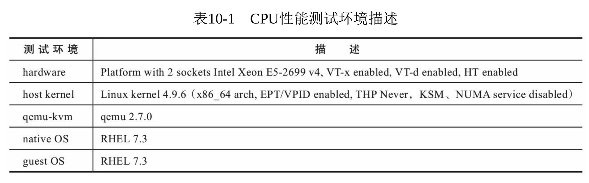
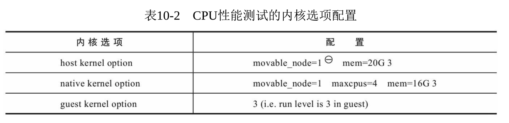
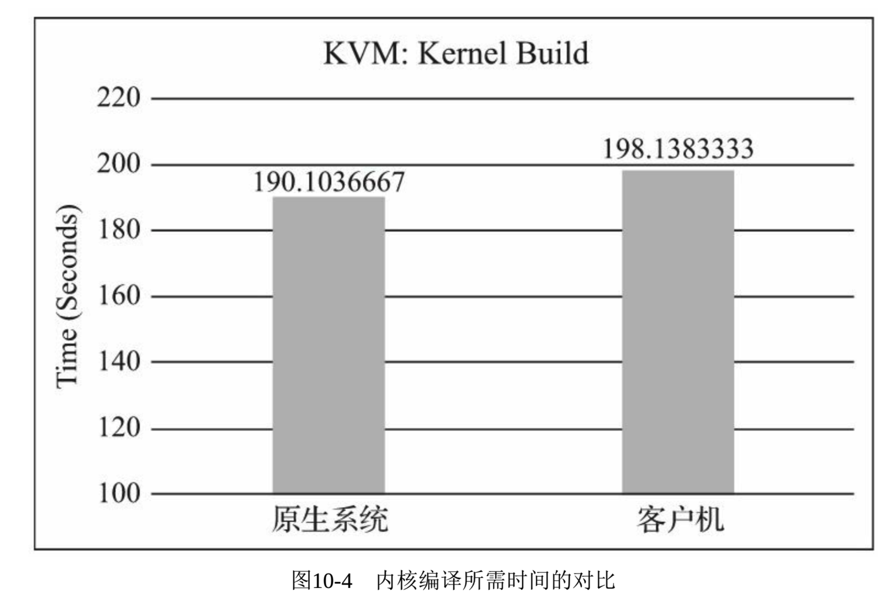

<!-- @import "[TOC]" {cmd="toc" depthFrom=1 depthTo=6 orderedList=false} -->

<!-- code_chunk_output -->

- [1. 整体概述](#1-整体概述)
- [2. CPU 性能测试工具](#2-cpu-性能测试工具)
- [3. 测试环境配置](#3-测试环境配置)
- [4. 性能测试方法](#4-性能测试方法)
  - [4.1. SPEC CPU2006](#41-spec-cpu2006)
  - [4.2. 内核编译](#42-内核编译)
- [5. 性能测试数据](#5-性能测试数据)
  - [5.1. SPEC CPU2006](#51-spec-cpu2006)
  - [5.2. 内核编译](#52-内核编译)

<!-- /code_chunk_output -->

# 1. 整体概述

2.x 这部分内容来自于\<KVM 实战: 原理、进阶与性能调优>

在这几部分中, 主要对 KVM 虚拟化中的几个最重要的子系统进行性能对比测试, 具体方法是:

* 在**非虚拟化的原生系统(native**)中执行**某个基准测试程序**,
* 然后将该测试程序放到**与原生系统配置相近的虚拟客户机**中执行,
* 对比在虚拟化和非虚拟化环境中该测试程序执行的性能.

# 2. CPU 性能测试工具

任何程序的执行都会消耗 CPU 资源, 所有任何程序几乎都可以作为衡量 CPU 性能的基准测试工具, 不过最好选择**CPU 密集型**的测试程序.

有很多测试程序可用于 CPU 性能的基准测试, 包括 SPEC 组织的**SPEC CPU**和**SPECjbb 系列**、UnixBench、SysBench、PCMark、PC 内核编译、Super PI 等.

`Linux\Benchmark\03. CPU测试.md`

# 3. 测试环境配置

对于本章的所有性能测试, 若没有特别注明, 都是用本节所示的配置.

"性能测试的硬件环境为一台使用 Intel(R)Xeon(R)CPU E5-2699 v4 处理器的服务器, 在**BIOS**中打开了**Intel VT**和**VT-d**技术的支持, 还默认开启了 Intel CPU 的**超线程(Hyper-threading)技术**.

测试中的**宿主机内核**是根据手动下载的 Linux 4.9.6 版本的内核源代码自己编译的, qemu 使用的是 2.7.0 版本.

用于对比测试的**原生系统**和**客户机系统**使用**完全相同的操作系统**, 都是使用默认配置的 RHEL 7.3 Linux 系统. 更直观的测试环境基本描述如表 10-1 所示.



**KVM 宿主机**中, **EPT**、**VPID**等虚拟化特性是**默认处于打开状态**, **透明大页(THP**)的特性也**默认处于打开状态(参考\<KVM 实战: 原理、进阶与性能调优>5.3.2**), 这几个对本次测试结果**影响是比较大**的.

注: 本章性能测试并没有完全使用处理器中的所有 CPU 资源(参考其他), 而是对服务器上的 CPU 和内存资源都进行了限制, **KVM 宿主机**限制使用了**4 个 CPU 线程**和**20GB 内存**, **每个 VCPU**绑定到**不同的物理 CPU**上(参考\<KVM 实战: 原理、进阶与性能调优>5.2.5), **原生系统**使用**4 个 CPU 线程**和**16GB 内存**, 为防止图形桌面对结果的影响, 原生系统、KVM 宿主机、KVM 客户机**运行级别都是 3**(带有网络的多用户模式, 不启动图形界面). 为避免 NUMA、KSM、透明大页等对系统性能的影响(不一定是正面的), 将**numad**、**ksm**、**ksmtuned 服务**关闭, 将**透明大页**功能设置为"**never**".

```
# systemctl stop numad.service ksm.service ksmtuned.service
# systemctl status numad.service ksm.service ksmtuned.service

# echo never > /sys/kernel/mm/transparent_hugepage/enabled
# cat /sys/kernel/mm/transparent_hugepage/enabled
always madvise [never]
```

同时, 将**NUMA node 1 节点**设置成可以移除(即表 10\-2 中"movable\_node=1", 内存热插拔功能), 然后在系统启动以后将 node 1 上的 CPU 都 offline. 这样就相当于将 NUMA 1 节点拔除, 使得客户机和宿主机在**体系架构上都是 SMP**, 从而公平地比较.

在本次测试中, 对各个 Linux 系统的内核选项添加的额外配置如表 10\-2 所示. 它们既可以设置在 GRUB 配置文件中, 也可以在系统启动到 GRUB 界面时进行编辑.



注: 指示将 NUMA node 1 设置为内存可热插拔的节点, 从而在系统启动时候默认将 node 1 上的内存都 offline.

在本次测试中, 为**客户机**分配了**4 个 vCPU**和**16GB**内存, 与**原生系统**保持一致, 以便进行性能对比(运行客户机(16G 内存)时, 宿主机总的内存为 20G, 留 4G 给宿主机使用, 以免其与客户机竞争内存资源而影响测试准确性). 由于 SPEC CPU2006 的部分基准测试会消耗较多的内存, 例如在 429.mcf 执行时每个执行进程就需要 2GB 左右的内存, 所以这里设置的内存数量是比较大的. 将**客户机的磁盘驱动**设置为使用**virtio\-blk**驱动, 启动客户机的 qemu 命令行如下:

```
qemu-system-x86_64 -enable-kvm -cpu host -smp cpus=4,cores=4,sockets=1 -m 16G -drive file=./rhel7.img,format=raw,if=virtio,media=disk -drive file=./raw_disk.img,format=raw,if=virtio,media=disk -device virtio-net-pci,netdev=nic0 -netdev bridge,id=nic0,br=virbr0 -daemonize -name perf_test -display vnc=:1
```

为了让客户机尽可能地利用宿主机 CPU 的特性, 我们使用了"\-cpu host"参数. 参考\<KVM 实战: 原理、进阶与性能调优>5.2.4 节

# 4. 性能测试方法

本节的 CPU 性能测试选取了 SPEC CPU2006 和内核编译这两个基准测试来对比 KVM 客户机与原生系统的性能. 下面分别介绍在本次性能测试中使用的具体测试方法.

## 4.1. SPEC CPU2006

在获得 SPEC CPU2006 的测试源代码后, 进入其主目录运行 install.sh 脚本, 即可安装 SPEC CPU2006; 然后通过 source 命令执行 shrc 脚本来配置运行环境; 最后执行 bin/runspec 这个 Perl 脚本, 即可正式开始运行基准测试. SPEC CPU2006 还提供了在 Windows 系统中可以执行的对应的.bat 脚本文件. 在 Linux 系统中, 将这些基本执行步骤整合到一个 Shell 脚本中, 如下:

```
#!/bin/bash
cd /root/cpu2006/
./install.sh
echo "starting SPECCPU2006 at $(date)"
source shrc
bin/runspec --action=validate -o all -r 4 -c my-example-linux64-amd64-icc17.cfg all
echo "SPECCPU2006 ends at $(date)"
```

"在本示例中, runspec 脚本用到的参数有: --action=validate 表示执行 validate 这个测试行为(包括编译、执行、结果检查、生成报告等步骤); -o all 表示输出测试报告的文件格式为尽可能多的格式(包括 html、pdf、text、csv、raw 等); -r 4(等价于--rate--copies 4)表示本次将会使用 4 个并发进程执行 rate 类型的测试(这样可以最大限度地消耗分配的 4 个 CPU 线程资源); --config xx.cfg 表示使用 xx.cfg 配置文件来运行本次测试; 最后的 all 表示执行整型(int)和浮点型(fp)两种测试类型. runspec 的参数比较多, 也比较复杂, 可以参考其官方网站的文档 [2] 了解各个参数的细节. "

注: "关于 SPEC CPU2006 的 runspec 的命令及其参数的细节, 可以参考其官方网页: http://www.spec.org/cpu-2006/Docs/runspec.html . "

## 4.2. 内核编译

本次内核编译的基准测试采用的方法是: 对 Linux 4.9.6 正式发布版本的内核进行编译, 并用 time 命令对编译过程进行计时.

关于内核编译测试中的内核配置, 可以随意进行选择, 只是需要注意: **不同的内核配置**, 它们的**编译时间**长度可能会相差较大.

执行 make 命令进行编译, 用 time 命令计时, 命令行操作如下:

```
# time make -j 4
real  1m0.259s
user  0m18.103s
sys   0m3.825s
```

# 5. 性能测试数据

由于使用的硬件平台、操作系统、内核、qemu 等对本次 CPU 性能测试都有较大影响, 而且本次仅仅使用了 Intel Xeon E5-2699 v4 处理器上的 4 个 CPU 线程, 所以本次 CPU 性能测试数据并不代表该处理器的实际处理能力, 测试数据中绝对值的参考意义不大, 读者主要参考其中的相对值(即 KVM 客户机中的测试结果占原生系统中测试结果的百分比).

## 5.1. SPEC CPU2006

"在非虚拟化的原生系统和 KVM 客户机中, 分别执行了 SPEC CPU2006 的 rate base 类型的整型和浮点型测试, 总体结果如图 10-1 所示. 测试的分数越高表明性能越好. 由图 10-1 中的数据可知, 通过 SPEC CPU2006 基准测试的度量, KVM 虚拟化客户机中 CPU 做整型计算的性能达到原生系统的 93.75%, 浮点型计算的性能达到原生系统的 96.95%.

在 SPEC CPU2006 的整型计算测试中, 各个细项基准测试的性能得分对比如图 10-2 所示. 各个基准测试的结果都比较稳定, 波动较小, 客户机的得分与宿主机都很接近.

在 SPEC CPU2006 的浮点型计算测试中, 各个基准测试的性能得分对比如图 10-3 所示. 各细项得分客户机和宿主机都非常接近, 其中有两项测试(433.milc 和 434.zeusmp)的对比还略大于 100%, 相对比分最小的一项(416.gamess)也有 91.77%.


## 5.2. 内核编译

分别在原生系统和 KVM 客户机中编译 Linux 内核("Kernel 4.9.6.Default config"), 并记录所花费的时间. 为保证测试时间的准确性, 取 3 次平均值, 如图 10\-4.



所用时间越短说明 CPU 性能越好. 在本次示例中, 总体来说, KVM 客户机中编译内核的性能为同等配置原生系统的 96%左右.