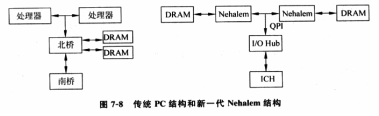

<!-- @import "[TOC]" {cmd="toc" depthFrom=1 depthTo=6 orderedList=false} -->

<!-- code_chunk_output -->

- [概述](#概述)
- [宿主机的可扩展性](#宿主机的可扩展性)
  - [硬件实现本身的可扩展性](#硬件实现本身的可扩展性)
  - [系统软件的可扩展性](#系统软件的可扩展性)
  - [存储系统的可扩展性](#存储系统的可扩展性)
  - [中断处理的开销](#中断处理的开销)
- [客户机的可扩展性](#客户机的可扩展性)
  - [硬件资源限制](#硬件资源限制)
  - [VMM 实现模型](#vmm-实现模型)
  - [时间中断](#时间中断)
  - [共享资源竞争](#共享资源竞争)

<!-- /code_chunk_output -->

# 概述

之前讨论前提都是在 VMM 上运行一个客户机, 以此为评测对象, 阐述 VMM 性能评测及其优化的方法.

接下来, 改变运行虚拟环境的硬件资源(包括增加处理器个数、升级处理器主频、增加内存和磁盘空间等), 在虚拟平台上改变运行客户机的总个数, 观察和分析由此带给 VMM 性能方面的影响.

一个可扩展性良好的 VMM 应该能提供更好地性能, 虚拟系统的总体能力应该随着硬件资源的增加按比例增长. 在总体硬件资源不变且每个客户机被分配的资源不变的情况下, 随着客户机运行个数的增加, 每个客户机不能有大的降低, 整个虚拟系统的总体能力应该按比例增长.

下面从客户机和宿主机两个方面衡量虚拟环境的可扩展性.

# 宿主机的可扩展性

宿主机的可扩展性会受到以下几个方面的影响.

## 硬件实现本身的可扩展性

如图 7\-8 所示的传统 PC 结构中, **访问内存**是通过在**北桥上的内存控制器(北桥里面！！！**)完成的, 而**处理器**和**内存控制器**之间由一条叫做**前端总线 FSB**的**系统总线**连接. 虽然前端总线的速度由最初的 66MHz 进化到 1333MHz, 但**基本的拓扑逻辑并没有改变**, 随着**处理器数目的不断增加**, 前端总线带宽会逐步成为**瓶颈**.

因此, 首先可以想象的是, **增加处理器的缓存**就可以在提高**处理器性能**的同时**增加系统的可扩展性**.

另外, 随着硬件技术的发展, 架构的变化也会带来性能的提高并增加系统的可扩展性, 例如基于**Nehalem 的平台**可进一步提高处理器的可扩展性.

**Nehalem 内部**集成了**内存控制器**, 通过**独立的内存通道**分别将**本地 DDR3 内存**与**远程处理器内存相连**, 这样对**每个处理器**就可以**主要访问本地内存**, 避免访问远程内存而导致的瓶颈. 使用新的内存技术 DDR3 和多条内存通道, 内存带宽比传统的双处理器 PC 结构提高了数倍. **处理器之间**由**快速路径互连(Quick Path Interconnect, QPI)总线**相连, 共同构成一个 NUMA(Non Uniform Memory Access)系统.

## 系统软件的可扩展性

虽然 NUMA 系统带来可扩张性的优势, 但由于其对本地和远程内存访问速度不一致性, 系统程序包括操作系统和 VMM 需要特殊处理以使处理器尽可能使用本地内存, 才能最大程度发挥性能. 例如, 分配空闲内存时, 系统程序应尽可能从处理器本地内存中获取, OS 或 VMM 调度算法尽可能不将应用程序或 VCPU 调度到非本节点的处理器上.

## 存储系统的可扩展性

另外, 将服务器和专门的存储系统独立开, 中间通过高速网络相连. 这样, 存储空间很容易扩展, 存储性能也可以通过负载平衡变的更好.

## 中断处理的开销

最后一个需要考虑的宿主机的可扩展性问题是 VMM 或 OS 中对于中断处理的开销. 当一个系统的设备增多时, 中断服务开销占处理器的处理时间比例也会上升. 多个频繁产生中断的高速设备(如 10G 网卡)的中断开销可能让处理器的处理能力饱和.

# 客户机的可扩展性

客户机的可扩展性受以下方面影响.

## 硬件资源限制

例如, 一个处理器的机器上运行很多客户机可能让每个客户机性能低的无法接受.

## VMM 实现模型

一般, 资源一定情况下,

- **Hypervisor 型**的实现是可扩展性最好的;

- **宿主机型**的实现可扩展性是最差的, 宿主机系统成为所有客户机请求汇聚的地方;

- 混杂型实现, 因为实现相对灵活, 所有可扩展性也可以更好

值得一提是, 混杂型实现中需要一个设备模型, 为客户机提供虚拟外设, 并提供服务. 不同客户机的设备模型可运行在一个 I/O 服务客户机中, 例如, 目前 Xen 在 dom 0 中为每个完全虚拟机运行一个设备模型. 但客户机越来越多, 集中的 I/O 服务客户机可能变成一个瓶颈. 现在, Xen 正试图对这个问题改进, 即让每个客户机的设备模型运行在这个客户机内部或给这个客户机生成一个专门的运行设备模型的轻量级客户机来提供服务.

## 时间中断

一般 OS 会编程一个或多个时间源, 周期性产生时间中断用于计时、调度等目的. 为让客户机 OS 准确计时, Hypervisor 需要为每个客户机编程物理的时钟源(如 LAPIC)产生同样多的中断, 并在中断处理函数中为客户机插入时间中断. 随着客户机数量增加, 频繁的时间中断会消耗很多处理器时间, 使性能降低.

这个问题的一个解决办法是当客户机的 VCPU 被调动出去时候, 停止它在物理中断时钟源上所设置的定时中断, 直到它下次被调度进来时再重新设置并计算中间可能丢失的客户机时钟中断并作出弥补.

还有一个更好地解决方法是, 不补充丢失的时钟中断, 让客户机自己通过读取虚拟平台时钟来修正客户机的正确系统时间, 或采取类虚拟化的时钟驱动程序.

对于 OS 来说, 一个趋势是避免周期性的时间中断而按需动态地产生.

## 共享资源竞争

除了上面几种影响客户机可扩展性因素之外, 多 VCPU 的客户机可扩展性很大程度上还受到来自实现过程中对整个虚拟机范围内共享资源的竞争.