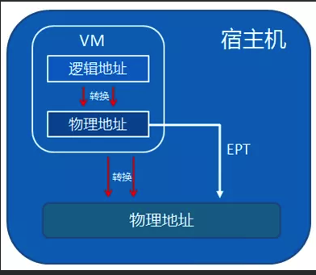
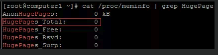
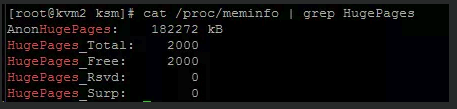

<!-- @import "[TOC]" {cmd="toc" depthFrom=1 depthTo=6 orderedList=false} -->

<!-- code_chunk_output -->

- [1. 概述](#1-概述)
- [2. EPT技术](#2-ept技术)
- [3. 大页和透明大页](#3-大页和透明大页)

<!-- /code_chunk_output -->

# 1. 概述

内存方面有以下四个方向去着手: 

1. EPT 技术

2. 大页和透明大页

3. KSM 技术

4. 内存限制

# 2. EPT技术

EPT也就是扩展页表, 这是intel开创的硬件辅助内存虚拟化技术. 我们知道内存的使用, 是一个逻辑地址跟物理地址转换的过程. 虚拟机内部有逻辑地址转成成物理地址的过程, 然后再跳出来, 虚拟机这块内存又跟宿主机存在逻辑到物理的转换. 有了EPT技术, 那么能够将虚拟机的物理地址直接翻译为宿主机的物理地址, 从而把后面那个转换过程去掉了, 增加了效率. 

那么这项技术, 现在的服务器都支持, 只要在BIOS打开了intel 的VT设置, 那么这个也一起打开了. 

所以这个基于硬件的优化, 目前不需要做额外的什么操作. 



# 3. 大页和透明大页

我们先解释什么叫大页. 

所谓的大页指的是内存的大页面. 当然, 有大页面必然有对应的小页面... 我们知道内存采用的是分页机制, 当初这个机制提出的时候, 计算机的内存大小也就几十M, 所以当时内存默认的页面大小都是4KB, 那么这个4KB 也就是所谓的小页面. 但是随着计算机的硬件发展, 现在的内存基本上都是几十G 甚至上百G了, 虽然, 如果还是4KB小页的方式, 那么必然会存在一些问题. 那么会有哪些问题呢?操作系统如果还是小页存在, 那么将会产生较多的TLB Miss和缺页中断, 从而大大影响性能. 

为什么小页就存在较多的Miss和缺页中断呢?比如说系统里的一个应用程序需要2MB的内容, 如果操作系统还是以**4KB小页**为单位, 那么内存里就要有**512个页面(512*4KB=2M**), 所以在**TLB**里就需要**512个表项**以及**512个页表项**, 因此操作系统就要经历512次的TLB miss和512次的缺页中断才能将2MB的应用程序空间全部映射到物理内存里. 想想, **2MB内存**的需要就要经历**512次的操作**, 如果内存需求大呢?必然操作数量会大大增加, 从而间接的影响性能. 

如果把这个4KB变成2MB呢?那就很轻松了, **一次TLB Miss**和缺页中断操作就完成了, 大大的增加了效率. 

所以, 虚拟机可以通过分配巨型页也就是刚才说的大页来提高运行性能. 

那么具体怎么操作呢?也就是说如何把这个4KB的小页变成2MB甚至1GB的大页, 然后把这个大页赋给虚拟机使用?

我们可以先通过命令 cat /proc/meminfo | grep HugePages查看当前系统有多少个大页: 



我们看到, 当前数量是0. 

那么如何设置大页的数量呢?也就是上面的HugePages_Total的数量. 

只要运行

```
echo 2000 > /proc/sys/vm/nr_hugepages 
```




