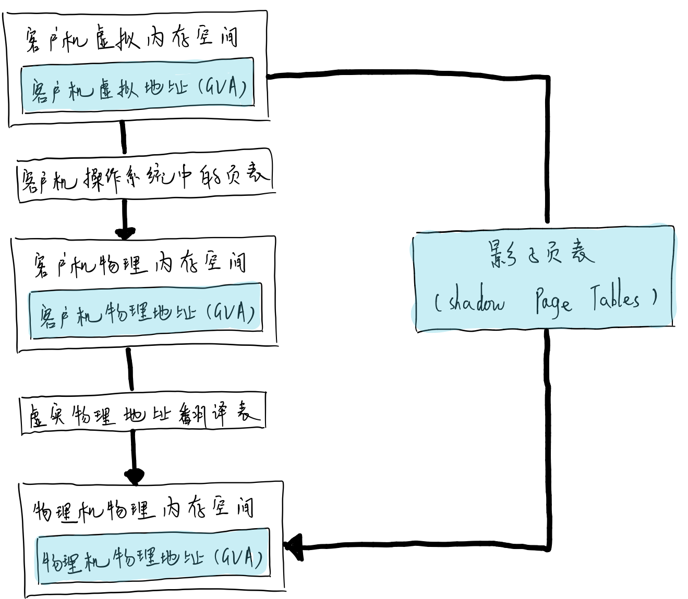
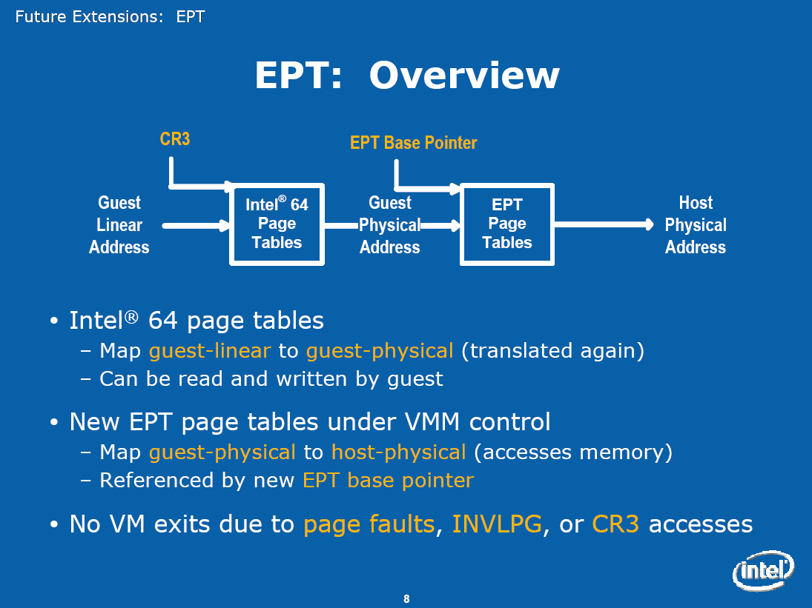

<!-- @import "[TOC]" {cmd="toc" depthFrom=1 depthTo=6 orderedList=false} -->

<!-- code_chunk_output -->

- [1 中断注入原理和做法](#1-中断注入原理和做法)
- [2 内存虚拟化](#2-内存虚拟化)
  - [2.1 影子页表](#21-影子页表)
  - [2.2 EPT](#22-ept)
  - [2.3 VPID](#23-vpid)
- [3 IO 虚拟化](#3-io-虚拟化)
- [4 passthrough 原理](#4-passthrough-原理)
- [5 virtio 和 vfio](#5-virtio-和-vfio)
- [6 内存虚拟化](#6-内存虚拟化)
- [7 设备中断请求](#7-设备中断请求)
- [8](#8)

<!-- /code_chunk_output -->

# 1 中断注入原理和做法

中断注入实际是向**客户机 CPU**注入**一个事件**, 这个事件包括**异常**和**外部中断**和**NMI**. **异常**我们一般看作为**同步**, **中断**被认为**异步**.

硬件具体实现就**中断注入**实际就是设置**VMCS**中**字段 VM-Entry interruption\-infomation 字段**. 中断注入实际在**VM 运行前完成**的, 具体代码如下:

```c
static int vcpu_enter_guest(struct kvm_vcpu *vcpu) {
    inject_pending_event(vcpu);
}
```

vcpu\_enter\_guest 函数运行虚拟机, 运行虚拟机代码已省掉. 中断注入实际在 VM 运行前, 接下来看看具体如何注入.

```c
static void inject_pending_event(struct kvm_vcpu *vcpu)
{
    if (vcpu->arch.nmi_injected) {
        kvm_x86_ops->set_nmi(vcpu);
        return;
    }

    if (vcpu->arch.interrupt.pending) {
        kvm_x86_ops->set_irq(vcpu);
        return;
    }
    /* try to inject new event if pending */
    if (vcpu->arch.nmi_pending) {
        if (kvm_x86_ops->nmi_allowed(vcpu)) {
            vcpu->arch.nmi_pending = false;
            vcpu->arch.nmi_injected = true;
            kvm_x86_ops->set_nmi(vcpu);
        }
    } else if (kvm_cpu_has_interrupt(vcpu)) {
        if (kvm_x86_ops->interrupt_allowed(vcpu)) {
            kvm_queue_interrupt(vcpu, kvm_cpu_get_interrupt(vcpu), false);
            kvm_x86_ops->set_irq(vcpu);
        }
    }
}
```

首先**用户态**实现**中断控制器**, **不可屏蔽中断**和**其他中断**注入过程. 用户态中断采集在 qemu 代码中实现判断是否有等待注入中断, 存在话立即注入接下来内核态模拟的中断控制器, 中断注入过程, 不可屏蔽中断和其他中断注入过程.

判断 KVM 内核态是否有不可屏蔽中断, 有并且客户机 cpu 允许中断话, 注入中断到客户机 cpu 中.

判断 KVM 内核态是否有中断, 有中断并且客户机 cpu 允许中断话, 获取优先级高中断进行排队, 注入中断到客户机 cpu 中.

另外一个情况, 如果有中断但是客户机不允许中断, 只能等待下一下中断注入. 如果下一次有更高级别中断发生, 该中断还是不能注入而选择更高级别中断注入.


# 2 内存虚拟化

内存用于暂存 CPU 将要执行的指令和数据, 所有程序的运行都必须先载入到内存中才可以, 内存的大小及其访问速度也直接影响整个系统性能.

和运行在真实物理硬件上的操作系统一样, 在 Guest 操作系统看来, Guest 可用的内存空间也是一个从零地址开始的连续的物理内存空间. 为了达到这个目的, Hypervisor(即 KVM)引入了一层新的地址空间, 即 Guest 物理地址空间, 这个地址空间不是真正的硬件上的地址空间, 它们之间还有一层映射.

所以, 在虚拟化环境下, 内存使用就需要两层的地址转换, 即 Guest 应用程序可见的 Guest 虚拟地址(Guest Virtual Address, GVA)到客户机物理地址(Guest Physical Address, GPA)的转换, 再从 Guest 物理地址(GPA)到宿主机物理地址(Host Physical Address, HPA)的转换. 其中, 前一个转换由 Guest 操作系统来完成, 而后一个转换由 Hypervisor 来负责. 为了解决这两次地址转换, Intel 先后使用了不同的技术手段.

## 2.1 影子页表

影子页表(Shadow Page Tables)是从软件上维护了从 GVA 到 HPA 之间的映射, 每一份 Guest 操作系统的页表也对应一份影子页表. 有了影子页表, 在普通的内存访问时都可实现从 GVA 到 HPA 的直接转换, 从而避免了上面前面提到的两次地址转换. Hypervisor 将影子页表载入到物理上的内存管理单元(Memory Management Unit, MMU)中进行地址翻译. GVA、GPA、HPA 之间的转换, 以及影子页表的作用如下图.



尽管影子页表提供了在物理 MMU 硬件中能使用的页表, 但是其缺点也是比较明显的.

**技术复杂**

影子页表实现非常复杂, 导致其开发、调试和维护都比较困难.

**物理内存开销大**

由于需要为**每个客户机进程**对应的**页表**的都**维护一个影子页表**, 因此影子页表的内存开销非常大.

## 2.2 EPT

EPT(Extended Page Tables, 扩展页表), 属于 Intel 的第二代硬件虚拟化技术, 它是针对内存管理单元(MMU)的虚拟化扩展. 相对于影子页表, EPT 降低了内存虚拟化的难度(, 也提升了内存虚拟化的性能. 从基于 Intel 的 Nehalem 架构的平台开始, EPT 就作为 CPU 的一个特性加入到 CPU 硬件中去了.

Intel 在 CPU 中使用 EPT 技术, AMD 也提供的类似技术叫做 NPT, 即 Nested Page Tables. 都是直接在硬件上支持 GVA-->GPA-->HPA 的两次地址转换, 从而降低内存虚拟化实现的复杂度, 也进一步提升了内存虚拟化的性能. Intel EPT 技术的基本原理如下图



**CR3(控制寄存器 3**)将客户机程序所见的**客户机虚拟地址(GVA**)转化为**客户机物理地址(GPA**), 然后在通过**EPT**将**客户机物理地址(GPA**)转化为宿主机物理地址(HPA). 这两次转换地址转换都是由 CPU 硬件来自动完成的, 其转换效率非常高.

在使用**EPT**的情况下, **客户机内部**的**Page Fault**、**INVLPG(使 TLB 项目失效**)指令、**CR3 寄存器的访问**等都**不会引起 VM\-Exit**, 因此大大**减少了 VM\-Exit 的数量**, 从而提高了性能.

**EPT**只需要维护**一张 EPT 页表**, 而不需要像"影子页表"那样为每个客户机进程的页表维护一张影子页表, 从而也减少了内存的开销.

## 2.3 VPID

TLB(Translation Lookaside Buffer)转换检测缓冲区是一个内存管理单元,用于改进虚拟地址到物理地址转换速度的缓存.

**VPID(Virtual Processor Identifiers, 虚拟处理器标识**), 是在硬件上对 TLB 资源管理的优化, 通过在硬件上为**每个 TLB 项**增加一个**标识**, 用于不同的虚拟处理器的地址空间, 从而能够区分开 Hypervisor 和不同处理器的 TLB.

硬件区分了不同的 TLB 项分别属于不同虚拟处理器, 因此可以避免每次进行 VM-Entry 和 VM-Exit 时都让 TLB 全部失效, 提高了 VM 切换的效率.

由于有了这些在 VM 切换后仍然继续存在的 TLB 项, 硬件减少了一些不必要的页表访问, 减少了内存访问次数, 从而提高了 Hypervisor 和客户机的运行速度.

VPID 也会对客户机的实时迁移(Live Migration)有很好的效率提升, 会节省实时迁移的开销, 会提升实时迁移的速度, 降低迁移的延迟(Latency).

**VPID**与**EPT**是**一起加入到 CPU 中的特性**, 也是 Intel 公司在 2009 年推出 Nehalem 系列处理器上新增的与虚拟化相关的重要功能.

```c
查看是否支持 EPT 和 VPID
[root@localhost ~]# grep "ept vpid" /proc/cpuinfo -o
ept vpid
ept vpid
ept vpid
ept vpid
ept vpid
ept vpid
ept vpid
ept vpid
```

在加载**kvm\_intel 模块**时, 可以通过设置**ept 和 vpid 参数**的值来**打开或关闭 EPT 和 VPID**.

当然, 如果 kvm\_intel 模块已经处于加载状态, 则需要先卸载这个模块, 在重新加载之时加入所需的参数设置.

```c
[root@localhost ~]# cat /sys/module/kvm_intel/parameters/ept
Y
[root@localhost ~]# cat /sys/module/kvm_intel/parameters/vpid
Y
```

# 3 IO 虚拟化


# 4 passthrough 原理

# 5 virtio 和 vfio

# 6 内存虚拟化

# 7 设备中断请求

# 8

IO 虚拟化总结

DMA/IOMMU 技术

内存虚拟化

处理器虚拟化技术/第 2 章/虚拟化概述