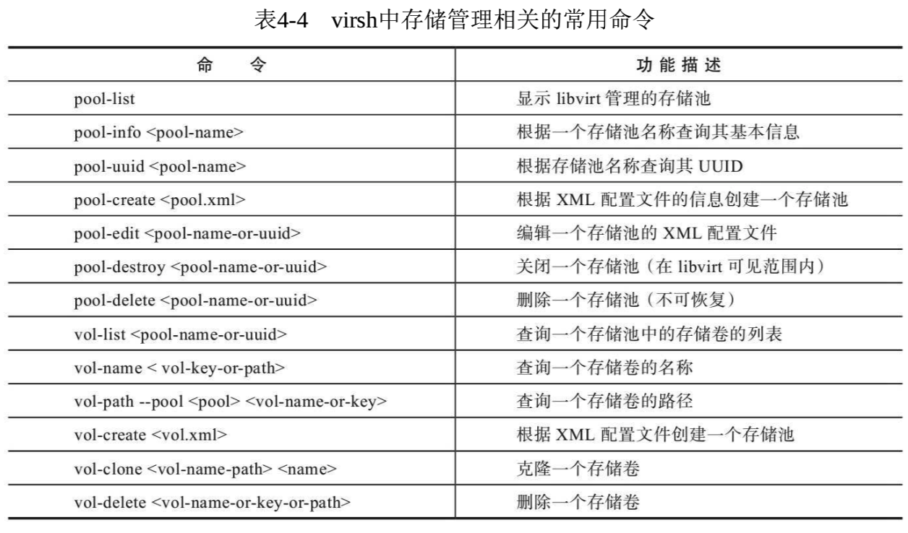

<!-- @import "[TOC]" {cmd="toc" depthFrom=1 depthTo=6 orderedList=false} -->

<!-- code_chunk_output -->

- [1. virsh 简介](#1-virsh-简介)
  - [1.1. 交互模式](#11-交互模式)
  - [1.2. 非交互模式](#12-非交互模式)
- [2. virsh 常用命令](#2-virsh-常用命令)
  - [2.1. 域管理的命令](#21-域管理的命令)
  - [2.2. 宿主机和 Hypervisor 的管理命令](#22-宿主机和-hypervisor-的管理命令)
  - [2.3. 网络的管理命令](#23-网络的管理命令)
  - [2.4. 存储池和存储卷的管理命令](#24-存储池和存储卷的管理命令)
  - [2.5. 其他常用命令](#25-其他常用命令)

<!-- /code_chunk_output -->

# 1. virsh 简介

**libvirt 项目的源代码！！！**中就包含了**virsh**这个虚拟化管理工具的代码. virsh 是用于管理虚拟化环境中的客户机和 Hypervisor 的命令行工具, 与 virt\-manager 等工具类似, 它也是通过**调用 libvirt API**来实现虚拟化的管理的. virsh 是完全在命令行文本模式下运行的用户态工具, 它是系统管理员通过脚本程序实现虚拟化自动部署和管理的理想工具之一.

```
[root@localhost ~]# rpm -qf /usr/bin/virsh
libvirt-client-4.5.0-10.el7_6.9.x86_64
```

virsh 是用 C 语言编写的一个使用 libvirt API 的虚拟化管理工具. **virsh 程序**的**源代码**在 libvirt 项目源代码的**tools 目录**下, 实现 virsh 工具最核心的一个源代码文件是**virsh.c**, 其路径如下:

```
[root@kvm-host ~]# cd libvirt-2.0.0
[root@kvm-host libvirt-2.0.0]# ls tools/virsh.c
tools/virsh.c
```

在使用**virsh 命令行**进行虚拟化管理操作时, 可以使用**两种工作模式**:

- 交互模式
- 非交互模式

## 1.1. 交互模式

**交互模式**, 是连接到相应的 Hypervisor 上, 然后输入一个命令得到一个返回结果, 直到用户使用"quit"命令退出连接.

使用 virsh 的**交互模式**, 命令行操作示例如下:

```
[root@kvm-host ~]# virsh -c qemu+ssh://root@192.168.158.31/system
root@192.168.158.31's password:
Welcome to virsh, the virtualization interactive terminal.

Type:  'help' for help with commands
       'quit' to quit

virsh # list
 Id    Name                           State
----------------------------------------------------
 3     rhel7u2-remote                 running

virsh # quit
```

## 1.2. 非交互模式

**非交互模式**, 是直接在命令行中在一个**建立连接的 URI 之后**添加需要执行的**一个或多个命令**, 执行完成后将命令的**输出结果返回到当前终端**上, 然后**自动断开连接**.

使用 virsh 的非交互模式, 命令行操作示例如下:

```
[root@kvm-host ~]# virsh -c qemu+ssh://root@192.168.158.31/system "list"
root@192.168.158.31's password:
 Id    Name                           State
----------------------------------------------------
 3     rhel7u2-remote                 running
```

另外, 在**某个节点**上**直接使用"virsh"命令**, 就**默认**连接到**本节点的 Hypervisor 之上**, 并且**进入 virsh 的命令交互模式**.

而直接使用"**virsh list**"命令, 就是在连接本节点的 Hypervisor 之后, 在使用 virsh 的**非交互模式**中执行了"list"命令操作.

# 2. virsh 常用命令

**virsh 这个命令行工具**使用**libvirt API**实现了很多命令来管理**Hypervisor**、**节点**和**域**, 实现了 qemu 命令行中的大多数参数和 QEMU monitor 中的多数命令.

这里只能说, virsh 实现了对 QEMU/KVM 中的大多数而**不是全部功能的调用**, 这是和开发模式及流程相关的, libvirt 中实现的功能和**最新的 QEMU/KVM 中的功能**相比有一定的**滞后性**.

一般来说, **一个功能**都是**先**在**QEMU/KVM 代码！！！** 中实现, 然后**再修改 libvirt 的代码！！！**来实现的, **最后**由**virsh**这样的**用户空间工具**添加相应的命令接口去**调用 libvirt！！！**来实现.

当然, 除了 QEMU/KVM 以外, libvirt 和 virsh 还实现了对 Xen、VMware 等其他 Hypervisor 的支持, 如果考虑到这个因素, virsh 等工具中有**部分功能**也可能是**QEMU/KVM 中本身就没有实现**的.

virsh 工具有很多命令和功能, 本节仅针对 virsh 的一些常见命令进行简单介绍.

一些更详细的参考文档可以在**Linux 系统中**通过"**man virsh**"命令查看帮助文档.

这里将 virsh 常用命令划分为**5 个类别**来分别进行介绍, 在介绍 virsh 命令时, 使用的是 RHEL 7.3 系统中的 libvirt 2.0.0 版本, 假设已经通过交互模式连接到本地或远程的一个 Hypervisor 的 system 实例上了(拥有该节点上最高的特权), 以在介绍交互模式中使用的命令作为本节的示例.

对于与域相关的管理, 一般都需要使用域的 ID、名称或 UUID 这样的唯一标识来指定是对某个特定的域进行的操作. 为了简单起见, 在本节中, 一般使用"<ID>"来表示一个域的唯一标识(而不专门指定为"\<ID or Name or UUID\>"这样冗长的形式).

另外, 介绍一个输入 virsh 命令的小技巧: 在交互模式中输入命令的交互方式与在终端中输入 Shell 命令进行的交互类似, 可以使用\<Tab\>键根据已经输入的部分字符(在 virsh 支持的范围内)进行联想, 从而找到匹配的命令.

## 2.1. 域管理的命令

virsh 的最重要的功能之一就是实现对域(客户机)的管理, 当然其相关的命令也是最多的, 而且后面的网络管理、存储管理也都有很多是对域的管理.

表 4-1　virsh 中域管理相关的常用命令


对上面表格中提及域管理的几个命令, 在 virsh 的交互模式中进行操作的示例如下:

```
virsh # list
 Id    Name                           State
----------------------------------------------------
 10    rhel7u2-1                      running
 11    rhel7u2-2                      running

virsh # domname 10
rhel7u2-1

virsh # vcpucount 10
maximum      config         2
maximum      live           2
current      config         2
current      live           2

virsh # setmem 10 1G

virsh # dommemstat 10
actual 1048576
rss 1183060

virsh # console 10
Connected to domain rhel7u2-1
Escape character is ^]
```

## 2.2. 宿主机和 Hypervisor 的管理命令

一旦建立有特权的连接, virsh 也可以对宿主机和 Hypervisor 进行管理, 主要是对宿主机和 Hypervisor 信息的查询.

表 4-2 列出了对宿主机和 Hypervisor 进行管理的部分常用的 virsh 命令.


对于宿主机和 Hypervisor 管理的命令, 选择其中的几个, 命令行操作示例如下:

```
virsh # version
Compiled against library: libvirt 2.0.0
Using library: libvirt 2.0.0
Using API: QEMU 2.0.0
Running hypervisor: QEMU 1.5.3

virsh # nodeinfo
CPU model:           x86_64
CPU(s):              8
CPU frequency:       2494 MHz
CPU socket(s):       1
Core(s) per socket:  4
Thread(s) per core:  2
NUMA cell(s):        1
Memory size:         3870556 kB

virsh # uri
qemu:///system

virsh # hostname
kvm-host

virsh # qemu-monitor-command 11 --hmp "info kvm"
kvm support: enabled
```

## 2.3. 网络的管理命令

virsh 可以对节点上的网络接口和分配给域的虚拟网络进行管理.

表 4-3 列出了网络管理中的一小部分常用的 virsh 命令.


在 virsh 命令中关于网络管理的几个命令的命令行操作如下:

```
virsh # iface-list
Name                 State      MAC Address
--------------------------------------------
br0                  active     88:88:88:88:87:88
eth0                 active     88:88:88:88:87:88
lo                   active     00:00:00:00:00:00

virsh # iface-mac eth0
88:88:88:88:87:88

virsh # net-list
Name                 State      Autostart
-----------------------------------------
default              active     yes

virsh # net-info default
Name            default
UUID            6ac4e5e9-c351-414f-a6a7-9a45d8304ccb
Active:         yes
Persistent:     yes
Autostart:      yes
Bridge:         virbr0

virsh # net-uuid default
6ac4e5e9-c351-414f-a6a7-9a45d8304ccb
```

## 2.4. 存储池和存储卷的管理命令

virsh 也可以对节点上的存储池和存储卷进行管理.

表 4-4 列出了对存储池和存储卷管理的部分常用的 virsh 命令.



在 virsh 中关于存储池和存储卷管理的几个常用命令的命令行操作如下:

```
virsh # vol-list
error: command 'vol-list' requires <pool> option
virsh # pool-list
Name                 State      Autostart
-----------------------------------------
default              active     yes

virsh # pool-info default
Name:           default
UUID:           4ec0d276-4601-8b33-fe40-31882b3c1837
State:          running
Persistent:     yes
Autostart:      yes
Capacity:       98.43 GB
Allocation:     21.83 GB
Available:      76.60 GB

virsh # vol-list default
Name                 Path
-----------------------------------------
RHEL7.2.iso          /var/lib/libvirt/images/RHEL7.2.iso
rhel7.2-new.img      /var/lib/libvirt/images/rhel7u2-new.img
rhel7u2.qcow2        /var/lib/libvirt/images/rhel7u2.qcow2

virsh # vol-info --pool default rhel7u2.qcow2
Name:           rhel7u2.qcow2
Type:           file
Capacity:       20.00 GB
Allocation:     1.96 GB

virsh # vol-path --pool default rhel7u2.qcow2
/var/lib/libvirt/images/rhel7u2.qcow2

virsh # vol-name /var/lib/libvirt/images/rhel7u2.qcow2
rhel7u2.qcow2
```

## 2.5. 其他常用命令

除了对节点、Hypervisor、域、虚拟网络、存储池等的管理之外, virsh 还有一些其他的命令. 表 4-5 列出了部分其他的常用命令.


上面表格中的部分命令的命令行操作如下:

```
virsh # pwd
/root

virsh # cd /root/kvm_demo/

virsh # pwd
/root/kvm_demo
virsh # help
Grouped commands:

Domain Management (help keyword 'domain'):
        attach-device                  attach device from an XML file
<!-- 省略百余行输出信息 -->

virsh # help list
    NAME
        list - list domains

    SYNOPSIS
<!-- 省略十余行输出信息 -->

virsh # echo "just for fun"
just for fun
virsh # quit

[root@kvm-host ~]#       #这里已经退出 virsh 的交互终端了
```

