<!-- @import "[TOC]" {cmd="toc" depthFrom=1 depthTo=6 orderedList=false} -->

<!-- code_chunk_output -->

- [1 x86 虚拟化概观](#1-x86-虚拟化概观)
- [2 CPU 虚拟化](#2-cpu-虚拟化)
  - [2.1 x86 硬件虚拟化的挑战](#21-x86-硬件虚拟化的挑战)
    - [2.1.1 使用二进制翻译的全虚拟化](#211-使用二进制翻译的全虚拟化)
    - [2.1.2 操作系统辅助虚拟化或半虚拟化](#212-操作系统辅助虚拟化或半虚拟化)
    - [2.1.3 硬件辅助虚拟化](#213-硬件辅助虚拟化)
- [3 内存虚拟化](#3-内存虚拟化)
- [4 设备和 IO 虚拟化](#4-设备和-io-虚拟化)
- [5 当前 x86 虚拟化技术的总结](#5-当前-x86-虚拟化技术的总结)
  - [5.1 二进制翻译的全虚拟化是当前最为成熟的技术](#51-二进制翻译的全虚拟化是当前最为成熟的技术)
  - [5.2 硬件辅助是虚拟化的未来, 它真正的优势还没发挥出来](#52-硬件辅助是虚拟化的未来-它真正的优势还没发挥出来)
  - [5.3 Xen 的 CPU 半虚拟化带来性能提升却有维护代价](#53-xen-的-cpu-半虚拟化带来性能提升却有维护代价)
  - [5.4 VMware 的透明半虚拟化平衡了性能好处和维护成本](#54-vmware-的透明半虚拟化平衡了性能好处和维护成本)
  - [5.5 VMware 正在促进虚拟化的开放标准](#55-vmware-正在促进虚拟化的开放标准)
  - [5.6 VMware 使用 Multi-Mode VMM 架构来提供性能和灵活性](#56-vmware-使用-multi-mode-vmm-架构来提供性能和灵活性)
- [6 结语](#6-结语)
- [7 参考](#7-参考)

<!-- /code_chunk_output -->

现在市场上最常见的**虚拟化软件**有**VMWare workstation(VMWare**)、**VirtualBox(Oracle**)、**Hyper\-V(Microsoft**)、**KVM(Redhat**)、**Xen**等, 这些软件统称之为**VMM(Virtual Machine Monitor**), 使用不同的虚拟化实现. 而这些虚拟化实现的方式可以分为全虚拟化、半虚拟化、硬件虚拟化等, 本篇主要是理解这些虚拟化实现的原理.

# 1 x86 虚拟化概观

"虚拟化"这个术语本身就极大地表明了服务请求和底层物理交付的分离. 对于 x86 虚拟化, 在**硬件**和**操作系统**之间, 添加了一个**虚拟化层**, 如图.

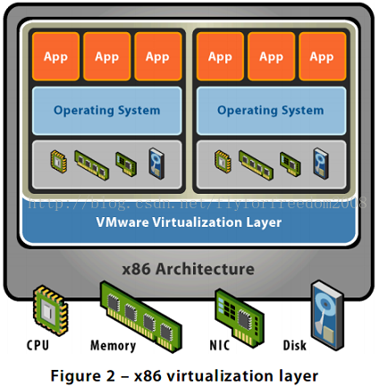

这个虚拟化层使得多个操作系统实例可以并行地运行在一台计算机上, 并动态地瓜分和共享诸如 CPU、存储、内存和 I/O 设备等物理资源.

对于业界**标准的 x86 系统**, **虚拟化**采取**hosted**或者**hypervisor 架构**.

- **hosted 架构**将**虚拟化层**以一个**应用程序的方式**安装运行于**操作系统之上**, 支持最为广泛的各种硬件配置.

- **hypervisor(裸金属**)架构将**虚拟化层**直接安装到干净的**x86 系统**上, 由于它**不需要通过操作系统而直接访问硬件**, hypervisor 架构相对于 hosted 架构**效率更高**, 且具有**更好的可扩展性、健壮性和性能**.

VMware Player, ACE, Workstation 和 Server 使用了 hosted 架构的便捷性, 而 ESX server 针对已认证的硬件采用 hypervisor 架构以达到数据中心级别的性能.

了解各个组件的大概背景, 有助于更好的理解**x86 虚拟化技术**. **虚拟化层**是负责**运行和管理所有虚拟机的软件**, 操作系统运行于**虚拟机监控器(VMM**s)上.

如图所示, **虚拟化层！！！**是**直接运行在硬件上的 hypervisor！！！**, 基于**不同架构**和**实现方法的 hypervisor**所具有的**功能有很大不同**.

运行于**hypervisor**上的**每个 VMM！！！**实现了**虚拟机的硬件抽象！！！**并负责**运行虚拟机系统！！！**, **每个 VMM！！！**需要通过分割和共享 CPU、内存和 I/O 设备来完成系统的虚拟化.

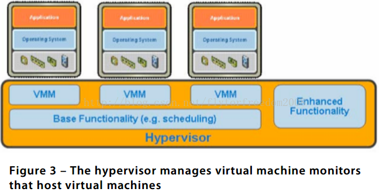

# 2 CPU 虚拟化

## 2.1 x86 硬件虚拟化的挑战

**x86 操作系统**被设计成**直接运行在硬件**上, 自然这些**系统会认为它们拥有硬件的全部控制权(！！！**). 如图所示, **x86 架构**为操作系统和应用程序提供了四个不同级别的权限来管理对硬件的访问, 分别为 ring 0, 1, 2 和 3. **用户程序**一般运行在**ring 3**, **操作系统**需要直**接访问内存和硬件！！！**, 因此需要在**ring 0**执行它的**特权指令**.

**x86 架构**的**虚拟化**需要在**操作系统(运行于最高权限的 ring 0)之下**放置一个提供**共享资源的虚拟化层**来创建和管理虚拟机. 比较糟的是, **有些敏感指令**在**非 ring 0**下执行时具有**不同的语义**, 因此不能很好地将其虚拟化. 在**运行时陷入并翻译这些敏感指令和特权指令**是一个艰难的挑战, 这使得 x86 架构的虚拟化起初看起来是不可完成的任务.

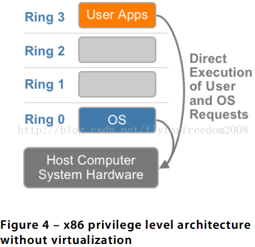

**VMware**在 1998 年就攻克了这个挑战, 开发了**二进制翻译技术！！！**使得**VMM 运行在 ring 0**以达到隔离和性能的要求, 而将**操作系统**转移到比**应用程序所在 ring 3 权限高**和比**虚拟机监控器所在 ring 0 权限低**的用户级. 基于 VMware 20000 多客户的安装使用情况以及所形成的广大合作伙伴生态系统, **VMware**使用**二进制翻译的全虚拟化方案**已经成为**事实上的标准**, 总的来说业界还没有一个开放的标准来定义和管理虚拟化. 每个开发虚拟化解决方案的公司可以用不同的方式应对这个技术上的挑战, 提供的解决方案良莠不齐.

正如以下阐述的, 目前有**三种技术**来实现**x86 架构 CPU 敏感指令**和**特权指令的虚拟化**, 分别为:

- 使用**二进制翻译**的**全虚拟化**;

- **操作系统辅助或半虚拟化**;

- **硬件辅助的虚拟化**(第一代);

### 2.1.1 使用二进制翻译的全虚拟化

使用**二进制翻译**和**直接指令执行相结合**的技术, VMware 可以**虚拟化任何基于 x86 的操作系统**. 这种方法如图所示, 将**内核代码翻译！！！**, 以便使用一系列**作用于虚拟化硬件**可达到所需效果的**新指令序列！！！**替换那些**不可虚拟化的指令！！！**. 同时, **用户级的代码直接运行在物理处理器！！！**上保证虚拟化的高性能. **虚拟机监控器(！！！VMM！！！**)为**每个虚拟机(！！！虚拟机和 VMM 一一对应！！！**)提供类似于**真实物理系统所具有的服务**, 如**一个虚拟的 BIOS**, **虚拟化设备**和**虚拟化的内存管理**.

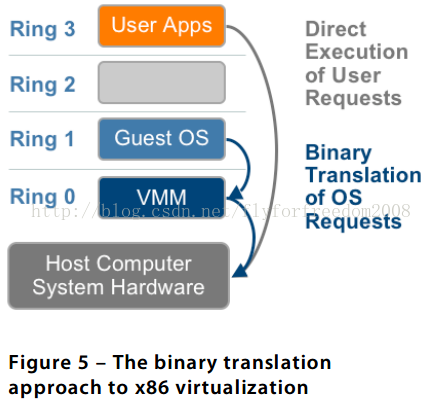

注: 图中很清晰, Guest OS 用户态命令直接在 host 的物理硬件上直接运行, Guest OS 由于也是在用户空间(Ring 1\-3)运行, 所以敏感指令和特权指令执行会有问题(相同指令在不通的级别有些语义不通, 有些可能会异常)会陷入到 VMM, 然后被二进制翻译成新的指令序列, 最后在物理硬件上运行.

**二进制翻译**和**直接指令执行**相结合的**全虚拟化！！！**使得**虚拟机系统**和**底下的物理硬件彻底解耦**. **虚拟机系统没有意识到它是被虚拟化**的, 因此**不需要虚拟机系统(客户操作系统！！！)做任何的修改**. **全虚拟化**是**不需要硬件辅助！！！**或**操作系统辅助！！！**来**虚拟化敏感指令和特权指令的唯一方案！！！**. **hypervisor**将**操作系统的指令翻译并将结果缓存供之后使用**, 而**用户级指令无需修改就运行**, 具有和物理机一样的执行速度.

全虚拟化为虚拟机提供最佳的隔离和安全性, 使移植变得简单, 因为同样的虚拟机系统可运行于虚拟化环境或真实物理硬件上. VMware 的虚拟化产品和微软的 Virtual Server 是全虚拟化的例子.

### 2.1.2 操作系统辅助虚拟化或半虚拟化

"Para"是源于希腊的英文词缀, 意为"beside"、"with"、"alongside". 就以"alongside virtualization"来说, **半虚拟化**指的是**虚拟机系统**和**hypervisor**通过**交互来改善性能和效率**. 如图所示, **半虚拟化**涉及到**修改操作系统内核(客户机操作系统！！！**)来将**不可虚拟化的指令**替换为**直接与虚拟化层交互！！！的超级调用(hypercalls**). hypervisor 同样为**其他关键的系统操作**如**内存管理**、**中断处理**、**计时**等提供了**超级调用接口**.

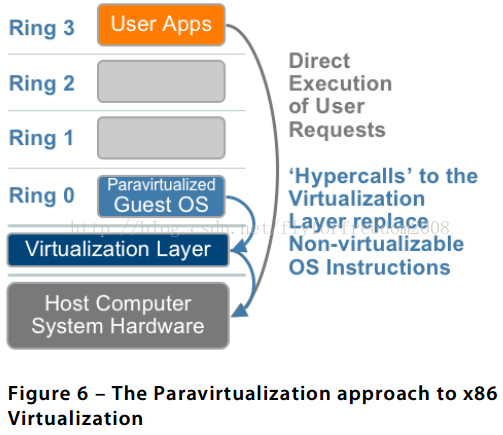

注: Guest OS 用户态指令直接在 host 的物理硬件上直接运行, 修改 Guest OS, 将不可虚拟化的指令替换成发给 hypervisor 的超级调用, 然后 VMM 和物理硬件交互.

**半虚拟化**和**全虚拟化不一样**, **全虚拟化**时**未经修改的虚拟机系统不知道自身被虚拟化**, **系统敏感的调用陷入**后再进行**二进制翻译**. **半虚拟化的价值**在于**更低的虚拟化代价**, 但是半虚拟化相对全虚拟化的**性能优势根据不同的工作负载有很大差别**. 半虚拟化不支持未经修改的操作系统(如 Windows 2000/XP), 因此它的兼容性和可移植性较差. 由于半虚拟化需要系统内核的深度修改, 在生产环境中, 半虚拟化在技术支持和维护上会有很大的问题. **开源的 Xen 项目**是**半虚拟化的一个例子**, 它使用一个**经过修改的 Linux 内核来虚拟化处理器！！！**, 而用**另外一个定制的虚拟机系统**的**设备驱动来虚拟化 I/O！！！**.

使用**二进制翻译**来实现虚拟化**更复杂更困难**, 相对来说**修改虚拟机系统较容易**. 这些年来, VMware 在自己的产品线中, 以**VMware tools**和**经优化的虚拟设备驱动**的方式使用了半虚拟化某些方面的技术. VMware tools 为 VMM hypervisor 进行时间同步、日志服务、和关闭虚拟机等服务提供了一个后门. Vmxnet 是一个半虚拟化的 I/O 设备驱动, 它和 hypervisor 共享一些数据结构. 它通过利用宿主机设备的能力来获得更好的吞吐量和更低的 CPU 的使用量. 需要澄清的是, VMware tools 服务和 vmxnet 设备驱动并不是 CPU 半虚拟化方案, 它们是小型的, 非入侵式地安装在虚拟机系统中, 不需要系统内核作修改. 从今往后, VMware 也在帮助开发半虚拟化的 Linux 版本, 以支持概念验证和产品开发. 更多的信息见之后的页 11.

### 2.1.3 硬件辅助虚拟化

**硬件厂商**迅速**拥抱虚拟化**并开发出新的**硬件特性来简化虚拟化技术**.

**第一代技术**包括**Intel 虚拟化技术(VT\-x**)和**AMD 的 AMD\-V**, 两者都针对**特权指令为 CPU 添加了一个执行模式**, **VMM**运行在**ring 0！！**, 同时运行**在新增的根模式下！！！**. 如图所示, **特权和敏感调用自动陷入 hypervisor！！！**, **不再需要二进制翻译或半虚拟化！！！**. **虚拟机的状态**保存在**虚拟机控制结构(VMCS, VT\-x**)或**虚拟机控制块(VMCB, AMD\-V**)中. 带有 VT 和 AMD\-V 的处理器在 2006 年投入使用, 因此**新的系统**才会带有这些硬件辅助特性.

由于**hypervisor 到虚拟机转换**的**高代价**和**僵化的编程模型**, 目前 VMware 的二进制翻译技术在很多情况下会比第一代硬性辅助的实现表现更好. **第一代硬件辅助虚拟化**的实现中, **僵化的编程模型**使软件在管理 hypervisor 到虚拟机转换的频率和代价方面失去灵活性. 出于此, VMware 仅使用了第一代硬件辅助的少数特性, 例如在 Intel 处理器上支持 64 位虚拟机.

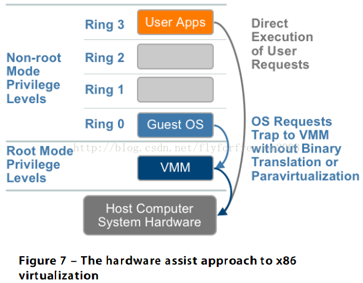

# 3 内存虚拟化

除了 CPU 虚拟化之外, 下一个关键的组件是**内存虚拟化**. 内存虚拟化涉及到**对系统物理内存的共享**和**动态地为虚拟机分配内存**. 内存虚拟化和当代操作系统对虚拟内存的支持类似. 应用程序看到的**连续地址空间**和**底下真正的物理内存不一定是一一对应**的. **操作系统**保存了**虚拟页号到物理页号的映射**. 当前所有的**x86 CPU**包含了一个**内存管理单元(MMU**)和一个**旁路缓冲(TBL)以优化虚拟内存的性能**.

为了在一个系统上运行多个虚拟机, 还需要另外一层的内存虚拟化. 也就是说, MMU 需要被虚拟化来支持虚拟机系统. 虚拟机系统还是控制着虚拟地址到虚拟机内存物理地址的映射, 但虚拟机系统不能直接访问真实的机器内存. VMM 负责将虚拟机物理内存映射到真实的机器内存, 并使用影子页表来加速映射过程. 如图 8 种标红线之处所示, VMM 使用硬件中的 TLB 来直接映射虚拟内存到机器内存以避免每次访问时需要两级转换. 当虚拟机改变了虚拟内存到物理内存的映射时, VMM 更新影子页表使得后续可以直接查找. 对于所有的虚拟化方案来说, MMU 虚拟化都会带来一定的代价, 这也是第二代硬件辅助虚拟化方案会改进的地方.

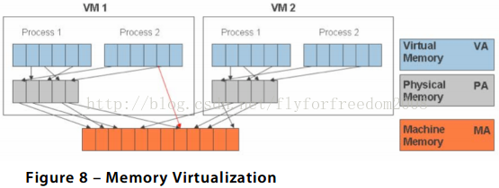

# 4 设备和 IO 虚拟化

除了 CPU 和内存虚拟化之外, 最后一个需要虚拟化的组件是设备和 I/O 虚拟化, 这涉及到对虚拟设备和共享的物理设备之间的 I/O 请求路径的管理.

相对于直接访问(direct pass-through)物理硬件的方法, 基于软件的 I/O 虚拟化及管理具有更丰富的特性和更简化的管理方式. 以网络方面为例, 虚拟网卡和虚拟交换机可以在虚拟机之间创建虚拟网络, 而不需要消耗物理网络的带宽, 网卡组合(NIC teaming)使得多个物理网卡变成逻辑上的一块网卡, 这对虚拟机来说, 物理网卡的故障转移是透明的. 这样一来, 虚拟机通过 VMotion 可以无缝地在不同系统之间迁移, 并且保留已有的 MAC 地址. 高效 I/O 虚拟化关键的一点就是要保留虚拟化的这些好处同时对 CPU 增加的消耗减到最少.

hypervisor 虚拟化了物理硬件, 为虚拟机呈现一系列标准的虚拟设备, 如图 9 所示. 这些虚拟设备有效的模拟了所熟知的硬件并将虚拟机的请求翻译成对系统物理硬件的请求. 设备驱动的标准化也帮助了虚拟机的标准化并增加在不同平台间的可移植性, 因为所有的虚拟机都配置成运行在虚拟硬件上, 跟底下真实的系统物理硬件无关.

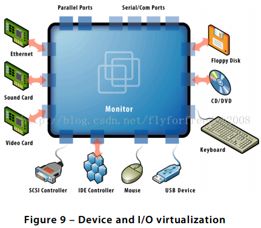

# 5 当前 x86 虚拟化技术的总结

VMware 目前无论在生产环境还是开发实验室都使用了所有这些 x86 虚拟化技术, 并在性能和功能特性之间做到最佳的平衡. 和虚拟化技术概观一节所描述的一起, 图 10 中的对比总结有助于从更高层次去理解各种不同技术的优缺点.

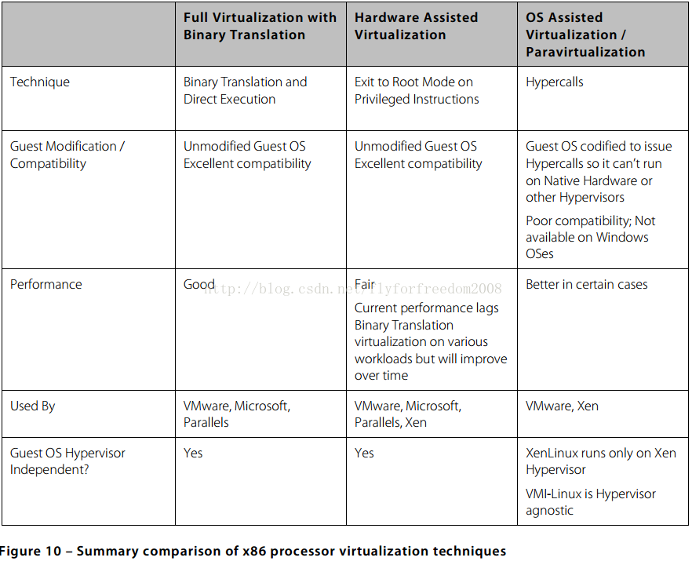

## 5.1 二进制翻译的全虚拟化是当前最为成熟的技术

二进制翻译的全虚拟化是当前最为成熟和可靠的技术. VMware 在常见的 Windows 和 Linux 操作系统中的实现都具有最高的虚拟化性能、最健壮的特性集和最简易的管理方式. 除了 64 位的虚拟机以二进制翻译的方式运行于 Intel CPU 上, VMware 在生产环境中都支持全虚拟化和硬件辅助的虚拟化方案, 可根据对性能的相对需求进行选择.

二进制翻译的全虚拟化在之后几年仍然是一项有用的技术, 更新更快的硬件在性能上会继续比通过二进制翻译执行的未经修改的虚拟机系统具有更高的性能. 硬件辅助的虚拟化是虚拟化的未来, 半虚拟化在性能上的优势将会减少.

## 5.2 硬件辅助是虚拟化的未来, 它真正的优势还没发挥出来

Intel 和 AMD 的第一代硬件辅助特性在 2006 年发布, 是 hypervisor 可以不依赖于二进制翻译和 OS\-assisted 的处理器半虚拟化的第一步. 正如 Xen 项目所展示的, 早期的这些硬件辅助特性使得创建一个不依赖于二进制翻译和半虚拟化技术的 hypervisor 容易得多. Xen 使用硬件辅助特性来虚拟化 Windows, 但相较于 VMware 的二进制翻译和 Xen 半虚拟化的 Linux, 效率上打了不少折扣. 挑战在于, 这些第一代硬件辅助的实现提供了一个僵化的编程模型, 同时 hypervisor 到虚拟机的转换要付出高昂的代价, 导致了硬件辅助的虚拟化比 VMware 的二进制翻译性能更低. VMware 跟合作伙伴 Intel 和 AMD 一起, 为改善未来硬件的设计使得能更充分利用软件固有的灵活性来应对虚拟化挑战而努力.

**第二代硬件辅助技术**正在开发之中, 它将对虚拟化系能有更大影响, 同时降低内存的消耗代价. AMD 和 Intel 都公布了他们的开发路线图, 包括**硬件支持的内存虚拟化**(AMD Nested Page Tables[NPT]和 Intel Extended Page Tables[EPT]), 以及**硬件支持的设备和 I/O 虚拟化**(Intel VT-d, AMD IOMMU).

CPU 密集型的工作负载在二进制翻译和直接指令执行的方式下已经可以运行得很好, 但是 NPT/EPT 通过摒弃影子页表来减少对系统内存的消耗, 将会获得明显的性能提升. 未来 CPU 的性能提升和虚拟化代价减少的期待是广泛使用硬件辅助特性的动力, 但不要期待有什么革命性的改变. 随着处理器每年变得更快, 每年处理器性能的提升似乎比未来硬件辅助优化对虚拟化容量和性能带来的影响更大.

随着时间的推移, 可见到硬件辅助的虚拟化性能会超越处理器和内存半虚拟化的性能. 随着对 CPU、内存和 I/O 设备进行硬件辅助开发, 半虚拟化相对于硬件辅助虚拟化的性能优势将逐渐缩小. 随着硬件辅助特性的开发和成熟, hypervisors will commoditize as they increasingly leverage a common set of hardware assist features,但它们还会在性能、可管理性、功能特性上继续竞争.

## 5.3 Xen 的 CPU 半虚拟化带来性能提升却有维护代价

Xen 好像是把半虚拟化当作第二代虚拟化技术, 而把 VMware 的全虚拟化技术当作第一代. 现实情况是, 半虚拟化是一项老而有用的技术, 对于某些工作负载确实提供了性能上的好处, 但往往需要付出维护代价. 毫无疑问, 要获得性能提升, 需要在虚拟机系统安装虚拟化管理程序和设备驱动, 但数据中心必须权衡减少虚拟化代价的优势和运行一个经过修改的虚拟机系统内核来使能半虚拟化所需要的支持维护成本. 性能优势还依赖于工作负载的特质. 大部分的工作负载获得很少的提升, 不是所有的负载都能获得接近物理机的性能.

Xen 最大的挑战是处理器半虚拟化无法作用于未经修改的虚拟机系统, 因此不适用于无法修改的虚拟机系统(如 Windows)和不需要修改的虚拟机系统(when supported versions of Linux are required). 大部分的数据中心不愿意将业务应用运行在半虚拟化的第三方 Linux 内核而这些内核又运行在开源的 hypervisor 上. 此外, 入侵式的内核修改使得虚拟机系统和 hypervisor 在一些数据结构上紧耦合, 阻止了修改后的虚拟机系统无法运行在其它的 hypervisor 或裸机上.

即使主流的 Linux 发行版开始将半虚拟化功能捆绑到操作系统内核, 部署半虚拟化的系统会增加维护成本和减少可移植性. 不少公司发现 Xen 的 Linux 半虚拟化方案不适合企业应用, 一些新的 Xen 系的虚拟化厂商则完全抛弃了 Linux 半虚拟化. 例如, Virtual Iron 宣称半虚拟化是个"穷途末路的方法(dead-end approach2)", 而集中精力在基于硬件辅助的使用未经修改虚拟机系统的全虚拟化技术.

这给 Xen 带来了第二个竞争挑战. Xen 3.x 只引入了硬件辅助使用未经修改虚拟机系统的全虚拟化支持. VMware 的二进制翻译比使用第一代硬件辅助的 Xen 复杂很多, 性能更高, Xen 厂商在整体的性能、可靠性、易于管理方面还无法跟 VMware 竞争. 那些没有完全放弃处理器半虚拟化的厂商经常迷惑试听, 暗示他们的 Linux 半虚拟化性能比基于硬件辅助虚拟化使用未经修改的虚拟机系统性能好.

需要明确的是, VMware 发现处理器半虚拟化对现今的某些工作负载来说确实能很大地提升性能, 但当第二代硬件辅助特性发布时, 这种性能好处是否会保持则难以预测. 性能的差异或许会减少、消除甚至扩大, 因为半虚拟化的接口也许会有新的改进. 这是个开放的问题.

在 VMware 看来, 处理器半虚拟化最大的问题在于它需要修改虚拟机操作系统, 这使得虚拟机系统的运行依赖于特定的 hypervisor. 例如, Xen 接口实现的深度半虚拟化对 hypervisor 有很强的依赖性. 虚拟机操作系统和 hypervisor 实现的数据结构有强耦合. Xen 的 Linux 内核不能运行在裸机或其它的 hypervisor 上, 这带来了不兼容性, 使 kernel 的发布和需要维护的版本数增加了 2 倍. 另外, 对新的开源操纵系统来说有限制, 因为对虚拟机操作系统的修改需要操作系统厂商的支持. 最后, 对 hypervisor 的强依赖性阻碍了内核的独立进化.

## 5.4 VMware 的透明半虚拟化平衡了性能好处和维护成本

Xen 的半虚拟化实现对 Linux 内核进行入侵式修改, VMware 围绕标准接口来获得 OS 辅助的半虚拟化性能上的好处同时减轻维护成本. VMware 于 2005 年提出透明半虚拟化接口 VMI(Virtual Machine Interface), 作为虚拟机操作系统和 hypervisor 之间标准的通信机制.

如图 11 所示, VMI 是位于 hypervisor 和半虚拟化虚拟机系统之间的一层. 透明半虚拟化实现中, 同样的虚拟机操作系统可以运行在裸机上、在虚拟化环境中或其它任何兼容的 hypervisor 中. 所有的 VMI 调用有两种实现, 一种是为裸机准备的内联原生指令, 另一种是在虚拟机中间接调用到虚拟机 OS 和 hypervisor 之间的 VMI 层. 两种实现都做到了高性能. VMI 的版本控制使得 hypervisor 和虚拟机系统的发展相互独立, 这就获得了可维护性和可扩展性. VMI 层支持 hypervisor 的多样性, 因为 VMI-Linux 运行时可使用 Xen hypervisor 中一个合适的间接层. 对可移植性, 后续的一个 Linux 版本已经被移植到 VMI 接口.

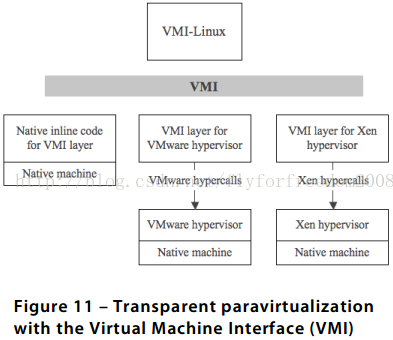

VMware 继续和 Linux 社区合作开发半虚拟化接口来支持不同的 hypervisor. VMware 在 2006 年发布了 VMI 规范, 在 Ottawa Linux Symposium 的 VMI 提议促成了 paravirt-ops 接口在 Linux 社区的开发. paravirt-ops 接口合并了 VMI 的多个概念, 包括对透明半虚拟化的支持, 是由一个联合小组开发, 成员来自包括 IBM、VMware、Ret Hat 和 XenSource. 使用这个接口, 半虚拟化的 Linux 操作系统可以运行在任何支持该接口的 hypervisor 上. VMware 发力在虚拟机系统的 paravirt-ops 接口开发, 这些接口使用 VMI 接口调用 hypervisor, paravirt-ops 从 Linux 内核 2.6.20 版本开始成为内核的一部分. 在 Linux 2.6.22 版本中, 包含了用来补充 paravirt-ops 接口的 VMI backend. 有了这个规范, Linux 系统发行方和 ISV 可支持单个含有半虚拟化的内核镜像, 同时获得性能好处和可管理性. 这使得处理器半虚拟化的兼容性有机会得到改善.

为获得反馈和评估, VMware 在 Workstation 6 中包含了支持试验的 VMI 功能, 即在宿主环境中支持操作系统的半虚拟化. 这个 Workstation 发布版提供了 2005 年就和 Linux 社区讨论的透明半虚拟化接口. 你可以下载一个功能齐全的支持半虚拟化接口的 VMware Player 虚拟机监控器, 和一个流行的支持半虚拟化的 Linux 内核. VMware Player 和 Workstation 中的这个试验支持目标受众是那些希望评估 VMware 半虚拟化技术的开发者.

由于这个试验是在宿主架构模式中, 因此不宜用来评估半虚拟化的 I/O 性能改善, 不过它可以用来评估 CPU 密集型工作负载的性能改善. 后续的实现将是在裸机 hypervisor 架构下, 如 VMware ESX Server, 会展示半虚拟化带来的 CPU 和 I/O 系能改善. VMware 计划对半虚拟化操作系统添加支持, 因为这些系统在商用的虚拟化平台设施中被采用了.

## 5.5 VMware 正在促进虚拟化的开放标准

在过去的几年中, VMware 和一些领头的技术厂商合作来定义虚拟化的开放标准. 作为最初的一步, VMware 贡献了自己现有的框架和 API, 以中立的方式帮助开发这些业界标准. VMware 之所以提出这些开放接口和格式, 是因为技术界最为成功的接口和格式是基于客户实际的部署标准. 7 年多来, VMware 的技术被广泛部署从而获得了很多现实世界的经验.

任何一个行业, 开放接口和格式被证明是产品被广泛采用的一个保证, 虚拟化也不例外. 虽然今天虚拟化的势头很猛, 但它还处于早期阶段. VMware 采取这一步来带动虚拟化的增长, 加速客户解决方案的交付最终形成虚拟化技术的广泛采用.

VMware 采取这一步骤还因为合作伙伴和客户的需求. 使用不同虚拟化方案的产品在不断地增加, 只要虚拟化解决方案兼容, 客户就可以进行更大范围的访问从而受益. 开放接口和格式对业界的好处是, 它促进虚拟化生态系统中厂商的合作和创新并为大家扩大了市场机会.

VMware 提供了以下开放接口和格式:

- 虚拟机接口 --- hypervisor 和虚拟机之间的 APIs

- 管理接口 --- 针对单个虚拟机环境和高度动态的、数据中心规模的虚拟化系统的标准运维管理的框架

- 虚拟机镜像磁盘格式 --- 虚拟机磁盘镜像, 使得虚拟机提供、迁移和维护可跨平台.

VMware 倾向于这些东西都是开放的, 厂商中立的, 任何拥抱这种虚拟化开放标准的厂商可以参与.

## 5.6 VMware 使用 Multi-Mode VMM 架构来提供性能和灵活性

大部分初创的虚拟化厂商只具有在产品中使用一种虚拟化方案的资源. 他们自然愿意集中精力在他们的虚拟化方案中并使该方案的弱点最小化同时填补功能上的差距. 这就容易出现市场的混乱局面, 因为他们片面的宣称扭曲了现实.

每发布一个产品, VMware 都经过挖掘现有的和未来的虚拟化技术, 以获得在性能、稳定性、功能特性、可管理性之间的最佳平衡. VMware 同时积极地和合作伙伴一起为企业虚拟化开发一个可互操作的生态系统.

VMware 提供了一个灵活的"multi-mode" VMM 架构, 如图 12 所示, 每个 VMM 管理一个虚拟机. VMware 让你自己选择模式来达到在 CPU 支持的情况下获得最佳的性能. 同样的 VMM 架构已经在用于 ESX Server, Player, Server, Workstation 和 ACE.

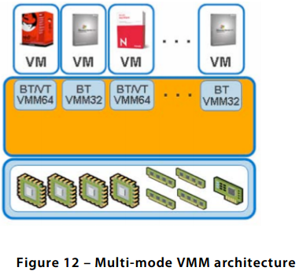

现今的工作负载可使用一个 32 位 BT VMM 或一个伴有 BT/VT-x 的 64 位 VMM, 以后的工作负载将运行在支持 32/64 位 AMD-V+NPT 和 VT-X+EPT 的 VMM 上.

VMware 提供一个灵活的架构来支持不断涌现的虚拟化技术. Multi-mode VMM 使用二进制翻译, 硬件辅助虚拟化和半虚拟化来为每种工作负载选择最佳的操作模式和处理器组合. 硬件辅助技术将不断成熟, 同时拓宽了可被虚拟化的工作负载种类.

# 6 结语

长期以来, 在虚拟化性能改善方面, VMware 寻求了很多的策略. 二进制翻译、硬件辅助虚拟化、操作系统辅助(半虚拟化)都是有效的 x86 虚拟化技术, 但它们的重要性和价值不断消长, 因为企业虚拟化市场仍然在不断的进化和成熟过程中. 差不多 10 年前, VMware 就开始了这场革命, 直到现在还在引领业界建立一个开放标准、操作系统无关的虚拟化生态系统, 来帮助企业实现 IT 环境的转型.

未来的虚拟化估计会有厂商支持的半虚拟化操作系统安装在业界标准的磁盘文件格式中, 并且可运行在裸机上或者在一系列兼容的可互操作的 hypervisor 上, 同时利用了硬件辅助管理 CPU、内存、I/O 设备的优势.

今天, VMware 虚拟化技术作为领先的方案部署在世界前 100 强中 100%的企业和前 1000 强中的 84%的企业中. 没有另一个选择能在性能、稳定性、方便管理、安全性、技术支持、功能性和广大的合作伙伴系统方面能和 VMware 相比.

# 7 参考

https://blog.csdn.net/x_i_y_u_e/article/details/50854603

https://blog.csdn.net/jmilk/article/details/51031118

